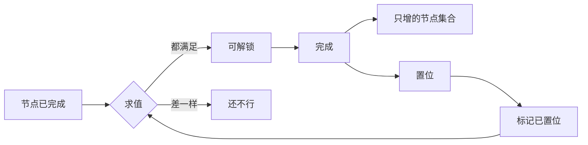

# 推进挂在「曾经发生过的事」上，不挂在日期上：节点是一张图，标记只置位，结局判定读的就是那些位

> **正典层级**：第 5 级（系统细化）。与[主线故事](../canon/narrative/主线故事.md)冲突时以正典为准；**节点数、结局条件与判定时点都是正典的，本页一句不复述；全部阈值归[数值模型](./数值模型.md)／`GP-7`，本页一个都不定。**
>
> 返回 [总索引](../README.md)｜[系统文档与提案索引](./README.md)｜相关：[主线故事](../canon/narrative/主线故事.md) · [玩法定位 · 推进与胜负](../canon/gameplay/玩法定位.md) · [ADR-0016](../decisions/ADR-0016-推进挂在曾经发生过的事上.md) · [任务系统](./任务系统.md) · [活跃失衡系统](./活跃失衡系统.md) · [事件系统](./事件系统.md)｜台账：[`NR-11`](../spec/issues/README.md)

## 摘要

**这一页回答一个问题：主线走到哪了，下一步能做什么。** 读完你能判断两件事 —— 一个新节点的解锁条件该怎么写（只有两类可选），以及「为什么不会出现来不及了」这件事靠什么保证。

**解锁条件里没有天数。** 推进挂在「曾经发生过的事」上，所以那道门不会自己走到。

下面这张图回答一个问题：**一个节点凭什么变成「现在可以做」。** 左边只有两类输入 —— 那就是「解锁条件里没有第三类，更没有天数」。求值只有「可解锁」与「还不行」两个结果。



**重画条件**：解锁条件多一类、求值改成一份存储，或者标记开始回落时重画。

**这张图不新增任何事实，权威是下面「结构」那几节。** 新开一位标记要过哪条判据、结局判定那一刻读什么、关闭条件为什么只许引用节点，图都放不下。

推进状态是**一个只增的节点集合、一组只置位的标记、一份参与者名单**。本页定它怎么被持有、一个节点凭什么解锁、结局判定在那一刻读什么。

**它持有**：推进状态那几样东西、一个节点要声明什么、解锁与关闭的求值、**要不要新开一位标记的判据**、那几位「曾经达成」各由谁持有、结局判定读什么、公共建设做成了哪几项那几位、参与者名单、它自己那个存档分片的声明。

**它不持有**这些，各有自己的家：

- 节点里发生什么（内容，归处见[主线故事 · 对下层需求的委托](../canon/narrative/主线故事.md)）与任何台词（`NR-5` 一处）。
- **判定时点与结局呈现的差异**（家在[主线故事 · 结局结构](../canon/narrative/主线故事.md)）。
- 一条任务的结构（[`任务系统`](./任务系统.md)），以及任何效果的实现。
- 公共建设的造价、工期与它改哪几组失衡。
- 二周目与真实形态（明确后置）、告别之后的玩法形态。
- 界面排版与任何数值。

最要紧的那条承诺：**解锁条件里没有天数。** 推进挂在「曾经发生过的事」上（[ADR-0016](../decisions/ADR-0016-推进挂在曾经发生过的事上.md)），所以本页**不新建时间单位、不给每日结算加步、不给别人加任何字段**，而且**它对别人的世界状态一个写入动作都没有** —— 本页只往自己那三样里加东西。

**第二条承诺：本页不实现任何完成判定。** 一个节点完成由它派出去的那条任务或那段演出报回来；改钱、改失衡、改关系、播演出、加委托各走已有入口。

## 术语

只列**只有本页在用**的词。跨页共用的在[术语表](../reference/术语表.md)，本节不重复（`节点`、`置位`、`只增`、`档位`、`读口`、`分片`、`求值`、`标记` 都在那边）。

| 词 | 它在本页指什么 |
| --- | --- |
| **关闭条件** | 一个节点什么时候不再可做。它**只许引用「另一个节点已完成」** —— 所以那道门不会因为天数流逝自己走到 |
| **可达性** | 在节点图上从当前状态还能不能走到某个节点。「必经／可选」是图上算出来的，**不存** |
| **参与者名单** | 某个节点发生时在场的人。它是本页持有的第三样东西 |

## 上游约束

- [主线故事 · 二十个主线节点](../canon/narrative/主线故事.md)：**「第一年／第二年……」是主题分组不是日程**、节点的实际落点由它自己的解锁条件决定、**两个节点占编号但不阻塞主链**、其中一个必须在另一个之前完成、有一个节点没有战斗任务、有一个节点编队锁定为主角单人、最后那个节点紧接前一个自动呈现。**这是节点图的全部结构输入，本页不复述节点内容。**
- [主线故事 · 结局结构](../canon/narrative/主线故事.md)：两种结局都可以继续游玩、**判定发生在哪个节点触发的那一刻**、判定**只读「曾经达成」不读当时的当前值**；**每个主线节点接不接都由玩家定**，而告别的特殊之处是前置满足之后可在任意时间触发、且永远不触发也没有任何后果。**这是判定时点、判定语义与「自主触发」那个读法的唯一出处 —— 本页写链接不复述。**
- [主线故事 · 完美结局条件](../canon/narrative/主线故事.md)：那几条在过程中**不以清单形式显示**、只在结局触发时判定；失衡那一条降它只有两条路而出征清理不算。**约束本页不提供「达成了几条」的读口。**
- [主线故事 · 三条重要支线](../canon/narrative/主线故事.md)：三条各占一个尺度；穹盾**先修好才能动改造**、窗口在两个节点之间、**链在后一个节点结算**、三项等权、做成一两项是加权而三项全成是完美完成；救回那一条**失败必须是可能的结局之一**、**完成就是救回成功**、**它不占主线节点编号**、对象不进名册。**这是那几位标记的来源与它们各自的置位时刻。**
- [主线故事 · 四条贯穿线索](../canon/narrative/主线故事.md)：共同体选择那条**每完成一条支线就在下一个节点多出一批参与者**。**这是参与者名单的形状来源 —— 它是名单不是计数器。**
- [反派与要角 · 对战定性：他是最终战的第一段](../canon/narrative/反派与要角.md)：最终战分两段，**只有第二段的强度读活跃失衡的总量**。**约束本页那条接缝指向已有的总量读口，不新开读口、不为「打到第几段」加状态。**
- [主线故事 · 对下层需求的委托](../canon/narrative/主线故事.md)：玩法实现负责判定机制与判定时点的落地、告别任务的触发流程、共同体选择链的完成状态追踪。**这是本页的范围上限。**
- [玩法定位 · 推进与胜负](../canon/gameplay/玩法定位.md)：**主线由玩家自主触发、不推主线也能一直经营下去**、主线任务标推荐等级且失败可重试、**没有全局失败**、结局读三条长期线、**还债是离场的前置而不是可选的加分项**。**这是「只许有下限、不许有截止」的全部依据，也是经营线那一位有读者的依据。**
- [人物 · 基地、债务与传承](../canon/characters/人物.md)：离开时基地交给学生，**债务必须在那之前还清**，否则交出去的是一笔负债。**这是同一条的第 2 级来源 —— 权威更高的那一侧。**
- [玩法定位 · 系统清单](../canon/gameplay/玩法定位.md)：叙事与推进那一节点名了主线任务、教学关、结局条件、公共建设（**不是一个独立的量**）、支线链追踪（**一份参与者名单，不是计数器**）、真实形态、周目与星火积分。**这是本页要接住哪几项、明确后置哪几项的清单，本页不复述它。**
- [玩法定位 · 随机事件：事件可以晚做，扩展点现在就留](../canon/gameplay/玩法定位.md)：袭击是事件而不是基地防卫战，**穹盾装上退敌灵场之后这类事件不再发生**。**这是那一位标记的正典来源。**
- [玩法定位 · 核心循环](../canon/gameplay/玩法定位.md)：债务、主线与活跃失衡是三条独立的长期目标。**约束三条长期线各收束成什么。**
- [玩法定位 · 二周目与元进度](../canon/gameplay/玩法定位.md)：通关获得星火积分、真实形态第二周目可主动开启。**约束本页只交出判定结果，不定周目字段。**
- [玩法定位 · 存档](../canon/gameplay/玩法定位.md)：睡眠是唯一正式存档时机、退出另写临时续玩点、二周目开新位。**约束推进状态进哪一侧。**
- [玩法定位 · mod 的扩展边界](../canon/gameplay/玩法定位.md)：内容一律数据外置、**规则不外置**。**约束节点与标记的声明是外置内容，而求值规则不是。**
- [时间与经营 · 时间](../canon/gameplay/时间与经营.md)：**无全局日期上限**、时间单位只有天季年三级不引入「月」、需要周期的东西挂到已有的边界上。**这是「推进不挂日期」的另一半依据，也约束本页不新建时间单位。**
- [时间与经营 · 结算顺序（固定，不得改动）](../canon/gameplay/时间与经营.md)：那张顺序表是承重项，每一步之间有依赖。**本页一个字不复述、一步不增减，引用某一步按步名引。**
- [时间与经营 · 每日结算](../canon/gameplay/时间与经营.md)：结算在睡后展示、简版弹窗只列有变化的重要项。**约束解锁的呈现不挤进那份摘要。**
- [时间与经营 · 通知](../canon/gameplay/时间与经营.md)：**手环是唯一的事件通知渠道**。**约束解锁提示走已有渠道，本页不新开一条。**
- [时间与经营 · 货币、钱包与债务](../canon/gameplay/时间与经营.md)：**债务无硬还款期限**、按季计息且第一季免息。**这是「债务清零」那一位的置位来源，也说明为什么它只置位一次，以及为什么它当解锁条件时不带期限。**
- [世界观 · 穹盾](../canon/world/世界观.md)：三项改造**都要穹盾先修好才能动**、**三项之间没有先后、建成即完全体**、退敌灵场装成之后避难所内的袭击从此不再发生。**这是那几位标记为什么只置位、不回落。**
- [世界观 · 公共建设](../canon/world/世界观.md)：需求由居民与学院两头提出、**出资方决定做哪一个**、后果直接写在活跃失衡上。**约束本页只收「它做成了」这一位。**
- [`活跃失衡系统` · 它在每日结算里不占一步](./活跃失衡系统.md)：那个只置位标记**归推进侧持有**，而那一份只保证总量读得到。**这是本页收下的那一格。**
- [`活跃失衡系统` · 对外只有档位，没有精确值](./活跃失衡系统.md)：读口只有档位与总量，**结局判定是那张接口表里登记的总量读者之一**。**这是本页比阈值时读的那个口。**
- [`活跃失衡系统` · 三个新读口带来一个正反馈，刹车必须先在](./活跃失衡系统.md)：那条刹车约束与结局阈值一起登记在[`数值模型`](./数值模型.md)。**约束本页不为结局阈值新开一行登记。**
- [`人际系统` · 结局判定读当前档位，不需要额外记一笔「曾经到过」](./人际系统.md)：关系只升不降，所以「曾经到过最高档」与「现在在最高档」永远相等，那一份**刻意不设标记**。**本页照它读当前档位，理由不复述、也不给关系加标记。**
- [`任务系统` · 三类任务只在几格上不同](./任务系统.md)：主线任务**不占额度、没有截止、可重试**，三类共用同一套实例与目标条目。**约束本页不碰一条任务的结构。**
- [`任务系统` · 任务与事件的分界](./任务系统.md)：有目标与进度的是任务，只有「触发 → 后果」的是事件。**约束节点派出去的是一条任务，而置位一位标记是一条后果。**
- [`事件系统` · 袭击是一条事件，不是基地防卫战](./事件系统.md)：那类事件的终止条件读推进侧的标记。**这是本页那一位标记的读者。**
- [`事件系统` · 后果一律是对已有入口的调用](./事件系统.md)：后果表是唯一出口，加一种后果时填那张表。**「置位一位推进标记」就是那张表上的一格，所以本页不为事件另开通道。**
- [`每日结算系统` · 本页不为自己加一步](./每日结算系统.md)：**每一处「不加步」都要写自己的理由，不许互抄**，而那份名单刻意不在任何一页展开。**本页照这条写自己的理由。**
- [`存档系统` · 进哪一侧：判据一句话](./存档系统.md)：跨过一次睡眠还成立的进正式存档；**那一份不持有任何字段清单**，所以分片由持有它的系统自己声明。**本页在「下游同步」里声明自己那一片。**
- [`存档系统` · 派生量不单独存](./存档系统.md)：派生量由别的已存字段算得出来，承重反证是改基底之后派生量跟着变。**这是「已解锁集合不存」那条的既有判据，本页只是它的一次应用。**
- [`存档系统` · 存档位摘要与体积实测](./存档系统.md)：存档位摘要放在最外层、要读得出「这一位是哪条世界线」；体积按分片分摊量。**约束本页那一格摘要给什么，也是本页那笔体积账的对账处。**
- [`剧情演出系统`](./剧情演出系统.md)：一段演出被点播，「播过没有」读[`事件系统`](./事件系统.md)那份记账。**约束节点里只有呈现的那几处走已有入口，本页不实现。**
- [`数值模型` · 尚未给值的量，各自写明校准办法](./数值模型.md)：值的唯一来源是参数表，本页只写量纲与约束形式。**约束本页新增的量一律进那张表 —— 而本页是零个，理由在「下游同步」。**
- [`生产系统` · 什么时候拆出去单独成篇](./生产系统.md)：拆篇判据是**它有没有自己的状态机**。**这是本页为什么把结局判定收在自己里面，判断过程在 [`NR-11`](../spec/issues/README.md) 的条目文件里。**
- [ADR-0016](../decisions/ADR-0016-推进挂在曾经发生过的事上.md)：解锁只有两类条件、天数一律不进、关闭只许引用另一个节点已完成。**这是本页「结构」那一节最硬的一条，理由在那一份、本页不重写。**
- [ADR-0015](../decisions/ADR-0015-存档的版本与缺字段口径.md)：旧版本缺字段补默认值、同版本缺字段报错。**约束本页分片声明里那份存档默认值。**
- [ADR-0009](../decisions/ADR-0009-编辑器主导的开发模式.md)：参数唯一来源是场景与资源、代码不留能用的默认值。**约束节点声明缺字段当场报错。**

## 结构

### 推进状态是三样东西

```
推进状态 = 已完成节点的集合 + 已置位标记的集合 + 参与者名单
```

| 样 | 装什么 | 怎么变 |
| --- | --- | --- |
| **已完成节点** | 节点标识的集合 | 只增。由那个节点派出去的东西报回来「它完成了」 |
| **已置位标记** | 标记标识的集合 | 只增。由那件事的持有者在它真的发生的那一刻置位 |
| **参与者名单** | 一组组织与社区标识 | 只增。走完一条可选支线就往里追加一个 |

**三样都只增，所以推进状态没有「回退」这个动作。** 这不是省事：正典写明没有全局失败，而一个会退的推进状态等于一条能让玩家丢掉已经做成的事的路径。

**不用「当前节点索引」。** 索引隐含「节点是一条线」，而有两个节点占编号却不阻塞主链、最后那两个是玩家自主触发的终态 —— 用索引表达这些就要在索引旁边再挂一堆例外标记，**而那些标记才是真状态**。

**参与者名单是名单，不是计数器**（正典）。名单能直接驱动演出（那一幕该出现谁），计数器还要再映射一次，而内容追加一条支线时那张映射表得跟着改 —— 那正好违反内容外置。

### 一个节点要声明什么

| 声明项 | 说明 | 缺了怎么办 |
| --- | --- | --- |
| 节点标识 | 跨存档稳定的那个名字，集合按它记 | **载入报错** |
| 前置节点 | 一组节点标识，**可以为空**（开局那个节点就是空） | 缺声明**载入报错**（空是显式的空，不是没写） |
| 需要哪些标记 | 一组标记标识，可以为空 | 同上 |
| 关闭条件 | 可选，形式见下面那一节 | ——（没有就是永不关闭） |
| 要不要玩家主动触发 | 是的话它只在玩家自己接下时开始 | **载入报错** |
| 它派出什么 | 一条主线任务的模板引用，或一段演出脚本的引用 | **载入报错** |
| 它完成时置位哪些标记 | 一组标记标识，可以为空 | 缺声明**载入报错** |

**缺字段当场报错、不留能用的默认值**（[ADR-0009](../decisions/ADR-0009-编辑器主导的开发模式.md)）。**「为空」要显式写成空**，否则「没写」与「不需要」长得一样。

**节点定义是外置内容**（`ENG-5` 点名的那条边界），所以上面这些是内容作者要填的表；**结构不可增删，字段可扩**。节点里发生什么、谁说什么不在这张表里 —— 那是它派出去的那条任务或那段脚本的内容。

**没有「必经」或「可选」这一格**，理由见下面「占编号但不阻塞是算出来的」。

### 解锁条件只有两类，天数一律不进

> **一个节点可解锁 ⟺ 前置节点全部已完成，且需要的标记全部已置位。** 两类之外没有第三类；求值器遇到未知的条件类型**当场报错**，不当成成立。

**天数、日期与季节序号一律不进解锁条件**（[ADR-0016](../decisions/ADR-0016-推进挂在曾经发生过的事上.md)），理由在那一份、本页不重写。本页只写它的两条落地形状：

- **带天数的节点声明载入被拒**（承重项的反证）。
- **只推进天数、不置位任何标记，已解锁集合一个都不变**（同上）。

**「玩家该经历过某件事」一律写成一位标记。** 举一个正典自己提出的前提：有一个节点的叙事前提是「魔化生物活动比季节规律更频繁」，而玩家得先见过季节规律 —— 那就声明一位「季节更替发生过」，由[结算顺序（固定，不得改动）](../canon/gameplay/时间与经营.md)里**季节更替判定**那一步在它真的发生时置位。**写成天数只是它的一个近似值，而那个近似值会随每季天数改一次就全部漂掉。**

**同一条形状有两个实例，它们的「需要哪些标记」里都有「债务清零」那一位：**

- **告别那个节点。** 正典把还债写成离场的前置 —— 见[主线故事 · 二十个主线节点](../canon/narrative/主线故事.md)里告别那一条，依据在[人物 · 基地、债务与传承](../canon/characters/人物.md)与[玩法定位 · 推进与胜负](../canon/gameplay/玩法定位.md)。
- **遗物赎回那个节点。** 正典那个节点的正文与[主线故事 · 三条重要支线](../canon/narrative/主线故事.md)里支线一那一节都写着债务还清之后才赎回；而在这一格填上之前那只是正文里的一句话 —— 声明上没有它，玩家带着债照样推得开那个节点。

跟着这两格定下来的还有：

- **不新开条件类型。** 两格都落在本节那两类里的「标记已置位」那一类，求值器一个字不改。
- **不引入任何期限。** 债务没有硬还款期限（[时间与经营 · 货币、钱包与债务](../canon/gameplay/时间与经营.md)），所以这两道门都只等一个事件、不等一个日期 —— 它与[ADR-0016](../decisions/ADR-0016-推进挂在曾经发生过的事上.md)那条「关闭条件不引用天数」是同一条纪律的两面。
- **不进结局判定。** 判定读的那几位在「结局判定：在正典那个时点读那几位」那张表里，债务清零**不在其中**，那张表一行不加；理由是判定与告别是两个时点（正典），判定早于告别。
- **「追加资金」不是解锁条件。** 正典写赎回那个节点时除了债务还清还写了「积累了追加资金」，而那是一个会回落的当前值 —— 按 [ADR-0016](../decisions/ADR-0016-推进挂在曾经发生过的事上.md) 它进不了解锁条件。赎回那笔钱在节点里花，走[`经济系统`](./经济系统.md)那条唯一的支出管道（**只拒不赊**）：钱不够因此表现成「这一步现在做不了」，**不是**「这个节点还没出现」。

**它们同时还掉了一笔欠账**：那一位标记在此之前**没有任何读者** —— 由[`经济系统`](./经济系统.md)置位、然后谁也不读。现在它有**两个**读者（上面那两个节点的解锁条件各一个），而**置位入口仍然只有还款路径那一条** —— 多一个读者不等于多一个写者。

**支线一那两个节点的解锁条件由此齐了。** 那条支线在时间上怎么走在[主线故事 · 三条重要支线](../canon/narrative/主线故事.md)，落成哪几格在本页：

| 那条支线的节点 | 前置节点 | 需要哪些标记 | 关闭条件 |
| --- | --- | --- | --- |
| 遗物赎回 | 魔潮异变那个节点 | 债务清零 | 没有 |
| 遗物支线终章 | 遗物赎回那个节点 | 空 | 凝聚前夜那个节点已完成 |

**表里只有前两格是本页定的**（遗物赎回那一行的前置与标记），其余各格都是[主线故事](../canon/narrative/主线故事.md)已经写着的事实换成声明的说法 —— **那几处改了，这张表要跟着改**，它不是那些事实的第二个家。

- **前置那一格取魔潮异变那个节点**，理由在正典：那件抵押物被学院借去研究，而魔潮异变把学院的注意力拉走之后它才退回商会（[主线故事 · 三条重要支线](../canon/narrative/主线故事.md)）。所以这一格挡的是**「东西还不在商会手上」**，是因果而不是排期 —— 债还得再快也换不来一件在别人手上的东西。
- **不为「东西回到商会」新开一位标记。** 按「标记：只置位，而且不是想加就加」那条铸造判据，它就是「那个节点已完成」。**那条线索的起点（商会的账单那个节点）也不必再列一遍** —— 它在主链上排在前面。
- **终章那段「独自完成的任务」不新开一位标记。** 正典把它写在遗物赎回那个节点的正文里，所以它被「那个节点已完成」盖住 —— 按「标记：只置位，而且不是想加就加」那条铸造判据就不该新开。
- **终章那一格关闭条件是正典要求的**（它必须在凝聚前夜那个节点之前完成），形式与理由在「关闭条件只许引用「另一个节点已完成」」那一节。
- **这几格是内容作者填的**（节点声明是外置内容），本页定的是「填什么」而不是「怎么求值」—— 求值器一个字不改。

### 关闭条件只许引用「另一个节点已完成」

正典对一个节点明写了「必须在另一个节点之前完成」，所以关闭是正典要求的。它的形式受一条硬约束：

> **关闭条件只许引用「另一个节点已完成」。** 引用天数的关闭条件**载入被拒**。

- **它不是第三类条件** —— 它与解锁走同一个求值器，只是结果反过来用。
- **它为什么安全**：那个节点什么时候推由玩家自己决定，所以**这道门不会自己走到**。引用天数的话它就是一道玩家什么都不做也会关上的门，而那正是「没有全局失败」要挡的东西。
- **关闭之后不可再开。** 一个已关闭的节点永远不能再解锁 —— 能再开的话「必须在它之前完成」这句话就不成立了。
- **关闭之前要有一次预警**，但**不点名是哪一条**（只说「有一条还没走完的支线会在这之后关掉」）：不预警等于让玩家静默错过一条完美结局条件，而本作不施加隐形惩罚；点名则把一次判断变成一条指令。措辞与位置归界面侧。

### 「已解锁」是一次求值，不是一份存储

- **本页不存「哪些节点已解锁」。** 它由上面那条定义算得出来，所以它是派生量 —— 这一格是[`存档系统` · 派生量不单独存](./存档系统.md)那条通用判据的一次应用，**不是本页新立的规则**。
- **反证（承重项）**：改一位标记再问一次，已解锁集合跟着变；全库找不到第二份解锁缓存。不钉的后果是实现里会长出一份缓存，然后「标记置位了但节点没出现」—— **而它不报错**。
- **求值发生在两处**：玩家打开主线那一页时，以及一位标记刚被置位时（用来决定要不要发一条通知）。**没有第三处，也没有轮询。**

### 节点之间是一张图，占编号但不阻塞是算出来的

- **前置是集合，所以节点之间是一张有向无环图**，不是一条链。单一前驱装不下正典那个「这一节的前置是那一节、而主链的下一节的前置是另一节」的分叉。
- **「占编号但不阻塞主链」是图上的可达性**：一个节点不在通往结局那个节点的任何路径上，它就是可选的。**所以本页不存这一格** —— 存了就会出现「标着必经但没人依赖它」这种自相矛盾的数据，而**它不报错**。
- **编号顺序不是依赖顺序。** 把编号读成依赖会让普通结局被那两个可选节点卡住，而正典明写只走叙事线也能拿到普通结局。

### 标记：只置位，而且不是想加就加

**一位标记就是一个布尔：那件事发生过没有。** 没有值、没有阈值、没有时长。

- **只置位，不回落**：任何清除标记的输入被拒（结构约束）。
- **置位时刻 ＝ 那件事发生的时刻。** 这条是本页对调用方唯一的要求，理由见下面「本页不为自己加一步」。
- **谁置位**：那件事的持有者。本页**不挑调用方**，只提供一个置位入口。

**要不要新开一位标记，判据一句话：**

> **能用「某个节点已完成」表达的，就不新开一位标记。**

按这条判下来的例子：**「主角已离开」不新开一位** —— 它就是「告别那个节点已完成」。而支线二那一条**要新开**：链在某个节点结算，而「那个节点完成了」与「那条链完美完成了」是两件事（做成一两项也会完成那个节点）；支线三同理 —— 「救回结束了」与「救回成功了」是两件事，而正典要求失败必须可能。

**这条判据挡的是什么**：标记集合会随内容长，而每多一位就多一处「它什么时候置位」要回答。判据让这个增长有理由，而白名单会让它变成每加一条内容就补一格的债。

### 一个节点怎么完成：本页只收那一句「它完成了」

- **本页不实现任何完成判定。** 一个节点派出去的是一条主线任务（[`任务系统`](./任务系统.md)）或一段演出脚本（[`剧情演出系统`](./剧情演出系统.md)），它完成由那一侧报回来。
- **主线任务那几格已经定了**（不占额度、没有截止、可重试），本页不复述、也不碰一条任务的结构。
- **玩家主动触发那一格只管「什么时候开始」**，不管「凭什么能开始」—— 后者仍然是上面那两类解锁条件。所以「由玩家自主触发」与「它有解锁条件」不冲突：条件不成立时它根本不在列表里。
- **告别那一步要一道二次确认并说清「之后会怎么样」**：它改变整个游玩形态且不可逆。**这不是给它加门槛** —— 确认里不加任何条件。它的解锁前置是另一回事，走上面那两类条件（见「解锁条件只有两类，天数一律不进」）。
- **节点完成时记进已完成集合，并置位它声明的那几位标记** —— 两样都只动本页自己持有的东西，对别人一个写入动作都没有。

### 长期时间轴：天、季、年只驱动到期，不驱动推进

- **时间三级照旧管按天到期的东西**（结算、计息、考试、按天状态），**一处都不管推进**。所以每季天数、计息节奏与考试边界怎么调都不会连带动主线。
- **「年」只是主题分组**（正典），本页因此不持有任何「第几年」的概念。
- **无全局日期上限**（正典），而这对本页有一个具体后果：**推进状态不随游玩时长增长。** 已完成节点集合与标记集合的上限是接口常量（节点数在正典、标记数由内容枚举），参与者名单的上限是内容量 —— 三样都有限。所以[`存档系统` · 存档位摘要与体积实测](./存档系统.md)那笔「玩得越久存档越大」的账**在本页这一片上不成立**，这是本页对那次体积实测的交代。
- **那串步序一个字不复述、一步不增减**；引用某一步时按**步名**引，不写「第 N 步」。

### 本页不为自己加一步

[结算顺序（固定，不得改动）](../canon/gameplay/时间与经营.md)**不为推进加步**。理由自己写，不抄别处：

> **置位时刻由因果可见性定，而那个时刻不在一天的末尾。**

- 推进的每一位都在玩家做完某件事的那一刻成立（还清最后一笔、装成一项改造、走完一条支线、跨过一次季节更替）。把置位挪到当晚，「我做了什么」与「于是解锁了什么」之间就隔了一次睡眠 —— **而那条因果正是解锁条件唯一要对玩家说清的事。**
- **代价写明**：置位发生在一天里的任意时刻，所以新解锁的节点不出现在当晚那份结算摘要里。这不影响玩家知道 —— 它有手环通知这条自己的渠道，而且那条通知**紧挨着他刚做完的那件事**，比第二天早上说更清楚。
- **那串里有几步会置位标记**（换季那一步、计息那一步），但那**不是加步**：它们本来就在，只是多调一次本页那个置位入口。
- **每一处「不加步」都要写自己的理由，不许互抄。** 本页这条是「置位时刻由因果可见性定」，与别处那几条各不相同。**本页刻意不列那份名单** —— 名单会随系统长，而它长的时候没有人会回来改这一段；要查有哪些就按词搜「不占一步」。

### 结局判定：在正典那个时点读那几位

**判定时点在[主线故事 · 结局结构](../canon/narrative/主线故事.md)，本页写链接不复述。** 本页只定它读什么：

| 完美结局那几条 | 本页读什么 | 持有者 |
| --- | --- | --- |
| 失衡那一条 | 一位**只置位**标记：总量曾降到阈值以下 | **本页** |
| 三条重要支线 | 支线一读**已完成节点集合**（那两个节点都在里面）；另两条各读一位标记 | 本页 |
| 关系那一条 | **当前档位** —— 关系只升不降，所以「曾经到过」与「现在在」永远相等 | [`人际系统`](./人际系统.md)，理由在那一份、**本页不复述、也不给关系加标记** |

- **判定只读「曾经达成」**（正典）。**反证（承重项）**：判定之前把失衡拉回阈值之上，结果不变。不钉的后果是实现里顺手读了当前值，而表现是玩家在最后一段被迫维持几个数字 —— 正典明确反对的那种隐形惩罚。
- **失衡那一位怎么置位**：失衡总量改变之后比一次阈值，成立就置位。本页是[`活跃失衡系统` · 对外只有档位，没有精确值](./活跃失衡系统.md)那张接口表里登记的**总量读者**之一；**阈值不在本页、也不新开一行登记** —— 它连同那条刹车约束在[`数值模型`](./数值模型.md)活跃失衡那一行。
- **最终战第二段读的是同一个总量读口，本页因此一行不加。** 最终战分两段，第二段的对手是魔源本体，它的强度读[活跃失衡](../canon/world/世界观.md)的总量（[反派与要角 · 对战定性：他是最终战的第一段](../canon/narrative/反派与要角.md)）。那条读口是[`活跃失衡系统` · 对外只有档位，没有精确值](./活跃失衡系统.md)那张接口表里**已经登记过的那一个** —— 它登记的读者本来就写着「魔源实体强度 ＋ 本页的结局判定」。**所以不新开读口、不新加标记、也不在那张接口表上加一行**：两段是叙事结构，不是第二个量。
- **本页也不持有「最终战打到第几段」。** 段是那场战斗内部的事，走[`关卡系统`](./关卡系统.md)与[`剧情演出系统`](./剧情演出系统.md)；本页只收「那个节点完成了」这一句（见「一个节点怎么完成：本页只收那一句「它完成了」」）。不这样划，「第二段读总量」就会变成一位要本页维护的状态 —— 而按上面那条铸造判据，它连标记都不该有。
- **判定结果只影响呈现**：两种结局之后世界状态的可操作性完全一致（正典：两种结局都可以继续游玩）。
- **不提供「达成了几条」的读口**（结构约束）：正典写明那几条在过程中不以清单形式显示。**结局之后另说** —— 那一刻已经过去了，说清楚是给下一个周目的信息，不是给这一幕的评分；那份说明读的是同一批位，不是第二份账。

### 三条长期线各收束成什么

| 线 | 终点 | 收束成 |
| --- | --- | --- |
| 经营线（还清债务） | 本金与利息都冲到零 | 一位标记，由[`经济系统`](./经济系统.md)那条还款路径置位；**读者是告别与遗物赎回那两个节点的解锁条件**，见「解锁条件只有两类，天数一律不进」 |
| 叙事线（走完主线） | 结局那个节点完成 | **已完成节点集合本身**，不另设标记 |
| 世界线（压低失衡） | 总量曾降到阈值以下 | 上面那一位，本页持有 |

**成长线刻意不做标记。** 它是能力曲线，不是推进门 —— 让它当门会把「打不过」变成「没解锁」，而正典要的是操作与构筑能解释一半胜负。

### 公共建设：本页只收那一位

- **本页持有「某个公共建设项做成了」这一位**，穹盾那三项改造各一位。
- **本页不持有它的造价、工期与它改哪几组失衡**：出资走[`经济系统`](./经济系统.md)那条唯一的支出管道，后果走[`活跃失衡系统`](./活跃失衡系统.md)那条境况事件（含它那条双向判据）。
- **本页不给它工期** —— 正典没写，发明一个工期等于替那一侧定它的形状。
- **改造那几位只置位、不回落**：正典写明改造**建成即完全体**，而维修是另一件事（它不在这几位里）。
- **袭击那一类事件的终止条件读「退敌灵场已装成」那一位**（[`事件系统` · 袭击是一条事件，不是基地防卫战](./事件系统.md)）。那一位没置位时读作未满足 —— 不报错、也不当成已满足。
- **穹盾三项改造要查得到「还差哪一项」**：它是玩家出资的公共建设项，而正典对花钱的东西一贯要求查得到当前值与原因。**这与「完美结局条件不以清单显示」不冲突** —— 那几条是判定用的，改造是玩家自己在推的项目。

### 支线三：失败有一次收束，但没有第二次机会

- **那一位标记只在救回成功时置位**；失败就是它永不置位，而**那不让任何节点卡住**（它不是任何必经节点的前置）。
- **那个人有三种状态，而本页只认其中一种。** 判据在正典，定在那个人身上：他活下来是完成、他死了是失败、其余一律进行中（[主线故事 · 三条重要支线](../canon/narrative/主线故事.md)）。本页只在「活下来」那一刻置位，所以**失败与进行中在本页都长成「那一位没置位」** —— 布尔位装不下第三种状态，也不需要装：那条任务开着没开着归[`任务系统`](./任务系统.md)，本页不复制一份。
- **结局判定不结算它。** 判定那一刻读一次那一位，未置位就是未达成；**但判定不关那条任务，也不触发下面那次失败收束** —— 收束只由「他死了」触发。判定之后他才活下来的话那一位照样置位（标记只置位，与时间无关），只是**改不了已经判过的结局**。
- **失败之后有一次收束**：点播一段演出、往参与者各自的[日记](./日记系统.md)里各写一条。两样都走已有入口，本页不实现。
- **不提供换一个对象重来的路径** —— 那会把正典那句「**有可能**被救回」变成「迟早会成功」，而那三个字正是那条正典的重量所在。

## 接口

### 谁报进来、它读谁、它出给谁

| 方向 | 对方 | 形状 |
| --- | --- | --- |
| 入 | [`任务系统`](./任务系统.md) | 一条主线任务达成时报一次「那个节点完成了」 |
| 入 | [`剧情演出系统`](./剧情演出系统.md) | 一段节点脚本播完时报一次，同上 |
| 入 | 玩家在手环上接下一条主线任务 | 那个节点开始；**告别那一步先过一道二次确认** |
| 入 | [`经济系统`](./经济系统.md) | 本金与利息都冲到零时置位一位 |
| 入 | 换季那一步、计息那一步（[结算顺序（固定，不得改动）](../canon/gameplay/时间与经营.md)里已有的步，**本页不加步**） | 各置位一位 |
| 入 | [`事件系统`](./事件系统.md) | 后果表里「置位一位推进标记」那一格（剧情性事件与公共建设做成都走它） |
| 入 | 支线完成 | 置位一位，并往参与者名单里追加一个标识 |
| 读 | [`活跃失衡系统`](./活跃失衡系统.md) | 总量改变之后读一次**总量**、与阈值比一次；**本页不改它，也不读精确的个体值** |
| 读 | [`人际系统`](./人际系统.md) | 结局判定读全体学生对主角那几对的**当前档位** |
| 出 | 手环通知 | 新解锁一个节点时一条；**不重复提醒、不挂角标** |
| 出 | [`统计事件总线系统`](./统计事件总线系统.md) | 节点完成一条、标记置位一条、结局判定一条 |
| 出 | [`存档系统`](./存档系统.md) | 一个分片，声明见「下游同步」 |
| 读口 | 已解锁节点 | **一次求值的结果**，不是存储 |
| 读口 | 已完成节点 | 集合本身 |
| 读口 | 某位标记置位没有 | 布尔 |
| 读口 | 参与者名单 | 那一组标识；[`剧情演出系统`](./剧情演出系统.md)按它决定那一幕出现谁 |
| 读口 | 结局判定结果 | 只在判定发生之后有值；**它不是「达成了几条」的计数器** |
| 读口 | 存档位摘要那一格 | 「哪一年 ＋ 主线有没有完结」，**两样都算得出来，不加字段** |
| 写入口 | 置位一位标记 | **本页对外只有这一个写入口**；调用方不限，但**置位时刻必须是那件事发生的时刻** |
| 作者填 | 节点与标记的声明 | 上面那张字段表，**缺了载入报错** |

**挂载点到此为止。** 将来加一样与推进有关的东西时，先问「它挂在上面哪一格」，而不是顺手插一个新钩子。

### 它不碰的那几条接缝

- **一条任务的结构**：[`任务系统`](./任务系统.md)。本页只把「它完成了」这一句收下来。
- **节点里发生什么**：内容，走内容外置；归处见[主线故事 · 对下层需求的委托](../canon/narrative/主线故事.md)。
- **判定时点与结局呈现的差异**：[主线故事 · 结局结构](../canon/narrative/主线故事.md)。本页只定读什么。
- **公共建设怎么被建成**：出资走[`经济系统`](./经济系统.md)、后果走[`活跃失衡系统`](./活跃失衡系统.md)；本页只收那一位。
- **二周目、星火积分与真实形态**：明确后置（进度见[待办台账](../spec/issues/README.md)）。本页只交出判定结果，不为它们预留字段。
- **告别之后的玩法形态**：正典写明归后续需求；本页连一位新标记都不加。
- **教学关**：它是开局那个节点的内容；它教过的东西进哪份可回查清单在[`事件系统`](./事件系统.md)。

## 边界与非目标

- **不定任何数值**：本页给参数表加**零个量**，理由在「下游同步」。**接口常量不是数值** —— 节点数家在[主线故事](../canon/narrative/主线故事.md)，标记标识是内容，关系档数家在[角色与成长](../canon/gameplay/角色与成长.md)。
- **不定内容**：有哪些节点、哪些标记、哪些可选支线、参与者名单里有谁，属内容（`ENG-5`）。
- **不复述节点内容、判定时点与结局呈现**：家在正典那一页。
- **解锁条件里不放天数**，关闭条件里也不放（[ADR-0016](../decisions/ADR-0016-推进挂在曾经发生过的事上.md)）。
- **不存「已解锁」**：它是派生量。
- **不存「必经／可选」**：它是图上的可达性。
- **不新建时间单位**，也不引入「第几年」这个概念。
- **不给每日结算加步**，理由在上面那一节。
- **不实现任何效果**：本页对别人的世界状态一个写入动作都没有 —— 改钱、改失衡、改关系、播演出、加委托各走已有入口。
- **不实现任何完成判定**：由派出去的那一侧报回来。
- **不新造一个「这座城过得好不好」的量**：[公共建设](../canon/world/世界观.md)**不是一个独立的量**（正典），而第三条长期线的位置由[活跃失衡](../canon/world/世界观.md)占着 —— 再造一个就是给同一件事开第二个量。
- **不给关系加标记**：[`人际系统` · 结局判定读当前档位，不需要额外记一笔「曾经到过」](./人际系统.md)有它自己的理由，本页不推翻、也不把失衡那一位的理由抄过去。
- **不提供「完美结局条件达成了几条」的读口**。
- **不做任何形式的「来不及了」**：没有截止、没有会自己走到的关闭、没有会回落的标记。
- **不设计存档序列化格式**：只声明自己那一片 —— 格式与版本口径在 [ADR-0015](../decisions/ADR-0015-存档的版本与缺字段口径.md)，机制在[`存档系统`](./存档系统.md)。
- **不做界面**：主线那一页长什么样、解锁提示放哪里、结局之后那份说明怎么排，归[`界面系统`](./界面系统.md)与作者实机定（进度见[待办台账](../spec/issues/README.md)）。
- **同名不同物，两处都要写全名**：
  - **「推进」在本作有几处**：本页这个**主线推进**、[结算顺序（固定，不得改动）](../canon/gameplay/时间与经营.md)里那几步的**日期推进**与**进度推进**、[`任务系统`](./任务系统.md)那条任务的**进度**。本页出现这个词时一律指主线推进。
  - **「标记」有几处**：本页这位**只置位标记**（一件事发生过没有）、[`日记系统`](./日记系统.md)那个**需求标记**（条目上的一个标记），以及[结算顺序（固定，不得改动）](../canon/gameplay/时间与经营.md)里换季那一步当动词用的「标记」（标记哪些作物枯死）。本页出现这个词时**一律是名词**，指那一位。
  - **「解锁」在本作有好几处**：本页这个**节点解锁**、[`日记系统`](./日记系统.md)那本**翻不翻得开**、[`技能系统`](./技能系统.md)与[`成长系统`](./成长系统.md)那些**按档位开**的孔与专长、[`事件系统`](./事件系统.md)里小事件**按关系档位开**。它们没有任何共用的机制，只是同一个动词。
  - **「名单」与「名册」不是一回事**：本页这份**参与者名单**装的是组织与社区标识；**名册**装的是学生（[时间与经营 · 学生与派工](../canon/gameplay/时间与经营.md)），而正典写明救回的那个对象**不进名册**。
  - **「节点」有三处**：本页这个**主线节点**、[角色与成长](../canon/gameplay/角色与成长.md)天赋树上的**天赋节点**，以及几份系统文档里当来源标签用的**剧情节点**。那个标签多数时候指的就是主线节点，但**不总是** —— [`活跃失衡系统`](./活跃失衡系统.md)把支线三那次救回算作一个剧情节点，而正典写明它**不占主线节点编号**（[主线故事 · 三条重要支线](../canon/narrative/主线故事.md)）。所以读到「剧情节点」要按上下文判它是不是本页这个。
  - **「关闭」有两处**：本页这个**节点关闭**（不可再解锁），与界面的「关掉一个面板」。
  - **「支线」有两处**：正典点名的那**三条重要支线**（完美结局条件之一），与共同体选择链上那些**可选支线**（每条完成往名单里追加一个）。后者不是前者的一部分，前者中的一条由后者的完成度结算。

## 理由与取舍

- **没选用「当前节点索引」。** 索引最省存储，代价是它隐含「节点是一条线」；而有两个节点占编号却不阻塞、最后两个是自主终态 —— 表达这些要在索引旁边挂一堆例外标记，**而那些标记才是真状态**。
- **没选把「必经／可选」存成字段。** 存了最好查，代价是会出现「标着必经但没人依赖它」这种自相矛盾的数据，而**它不报错**；可达性算得出来，所以这一格按[`存档系统` · 派生量不单独存](./存档系统.md)那条通用判据就不该存。
- **没选把「已解锁」存下来。** 缓存一份最快，代价是「标记置位了但节点没出现」这种错**不报错**；而求值本身很便宜（两个集合的包含关系）。
- **没选让标记带值或带阈值。** 带值就要回答「它什么时候算够」，而那是一个会被内容作者各填一遍的数；布尔位把这个问题推回给那件事的持有者，那里本来就有判据。
- **没选让解锁读当前值**（名册人数、已完成委托数这类）。当前值可能回落，于是「解锁过又没了」要另写规则挡；而且它逼着本页持有一堆阈值 —— 那与「只许有下限」直接相冲。
- **没选让遗物赎回那个节点不等「债务清零」。** 不等的话经营线的快慢不影响那条支线，代价是要改正典写着的两处「债务还清后」（那个节点的正文与支线一那一节）—— 那是改叙事意图，不是补一格声明。**选等的代价也明摆着**：经营线落后的玩家会晚很久才看到支线一，而支线一是「一段过去」那个尺度的全部内容 —— 债还得慢，这一整个尺度就跟着推迟。它仍然不是「来不及了」：卡住它的是玩家自己的经营节奏，不是一个会自己走到的期限。
- **没选把「积累了追加资金」也写进解锁条件。** 照正典那句字面读最省事，代价是解锁要读一个会回落的当前值 —— 那与「只许有下限」直接相冲，而且「攒够了又花掉」会让一个已经出现过的节点消失。放到支出那一步之后，同一句正典照样成立，而且拒绝的时候玩家看得出是钱不够而不是没解锁。
- **没选给关闭条件留天数这一格。** 那才是真正的期限：玩家什么都不做它也会关上。而只引用「另一个节点已完成」之后，这道门什么时候关完全由玩家自己决定。
- **没选不给关闭预警。** 静默错过一条完美结局条件是一次查不到原因的损失，而正典写明不施加隐形惩罚。**也没选在预警里点名是哪一条** —— 那把一次判断变成一条指令。
- **没选在每日结算里给推进加一步。** 一天一次地统一置位最整齐，代价是「我做了什么 → 于是解锁了什么」之间隔一次睡眠，而那条因果正是解锁条件唯一要说清的事。
- **没选照抄别处那几条「不加步」的理由。** 它们各有各的依据；抄了之后改动其中一侧时另一侧会静默失去依据。**也没选在本页列那份名单** —— 名单会随系统长，而它长的时候没有人会回来改这一段。
- **没选在判定时读当前值。** 读当前值省掉一位标记，代价是玩家在最后一段被迫维持几个数字 —— 正典明确反对的那种隐形惩罚。
- **没选给关系也加一位标记。** 关系只升不降，所以那一位永远等于当前档位，留着是一个永远为真的重复事实；而[`人际系统`](./人际系统.md)已经把这条理由写在它自己那里了，**本页抄一遍就是给同一条判据加第二个家**。
- **没选把失衡那一位交给[`活跃失衡系统`](./活跃失衡系统.md)持有。** 那一份刻意没有任何按时间变的东西，也刻意不持有「曾经」这种语义；而「曾经达成」只有结局判定一个读者 —— 让读者持有它，那一份就不必为一个它不用的概念开一格。**这条是那一份自己定的分工，本页接住它。**
- **没选给「完美结局条件达成了几条」开一个读口。** 有它最省事（界面直接读），代价是正典那句「不以清单形式显示」就只剩一句纪律 —— 读口一在，迟早有人把它画出来。
- **没选让本页实现节点的完成判定。** 目标、进度与结算已经在[`任务系统`](./任务系统.md)，本页再实现一份就有两个来源，其中一个查不到出处（与[`教育系统`](./教育系统.md)那条「自己不实现任何效果」同一形状）。
- **没选为告别之后的学生视角新开一位标记。** 「主角已离开」就是「那个节点已完成」，按上面那条铸造判据它不该新开；而那之后的玩法形态还没立项，为它预留一位等于替一个还没立项的东西做决定。
- **没选给公共建设定工期。** 正典没写；发明一个工期等于替那一侧定它的形状，而本页只需要那一位。
- **没选让支线三可以换个对象重来。** 重试让玩家一定拿得到那一位，代价是正典那句「**有可能**被救回」变成「迟早会成功」—— 而那三个字正是那条正典的重量所在。**也没选失败之后什么都不留**：照护了若干季却没有任何收束，读起来像 bug 而不像失败。
- **没选把结局判定单独成篇。** 它没有自己的状态机，而它读的那几位就在本页 —— 分出去会让「判定只读『曾经达成』」这条判据有两个家：一处持有那几位，一处读它们。判断过程在 [`NR-11`](../spec/issues/README.md) 的条目文件里。
- **没选重写那份旧提案。** 它当时选的是四类条件（其中一类是天数下限）与一个没有载体的「这座城过得好不好」的量，而两者现在都不成立；把仍然有用的那一半迁进 [ADR-0016](../decisions/ADR-0016-推进挂在曾经发生过的事上.md)的候选表之后，它一个问题都不回答 —— 所以处理办法是删，不是翻新（判断过程在 [`DOC-55`](../spec/issues/README.md)）。

## 验收

**可自动验证项**（纯规则层，与引擎无关）：

- 节点字段表：每个必填项各缺一次，都**载入被拒**；**「前置为空」与「没写」分得开**（前者合法、后者被拒）。
- 解锁：两类条件各一条正例与一条反例；**求值器遇到未知条件类型抛错**，不当成成立。
- **天数不进解锁**（承重项的反证）：带天数、日期或季节序号的节点声明**载入被拒**。
- **只推进天数不置位标记，已解锁集合一个都不变**（承重项的反证）。
- 经营线那一位：**「债务清零」未置位时告别那个节点不可解锁、置位后可解锁**；**遗物赎回那个节点同形再来一条**；它走的是「标记已置位」那一类，**没有为它新开条件类型**（结构约束）；**读它的地方只有那两处、置位它的入口只有还款路径那一条**（结构约束）。
- 支线一那两格：**遗物赎回的解锁条件里一个天数都没有**；**遗物支线终章在凝聚前夜那个节点完成之后不可再解锁**；**「追加资金」不在任何一条解锁条件里**（结构约束 —— 钱不够时那个节点仍然解锁得开，拒绝发生在支出那一步）。
- 关闭：**引用天数的关闭条件载入被拒**；关闭条件与解锁走同一个求值器（一条结构约束）；**已关闭的节点不能再解锁**。
- 求值不存储（**承重项的反证**）：改一位标记再问一次，已解锁集合跟着变；**没有第二份解锁缓存**（结构约束）。
- 图：前置是集合（一个节点有多个前置的用例过）；**没有「必经／可选」字段**（结构约束）；**那两个可选节点都不完成时，主链仍然推得到结局那个节点**。
- 标记：**只置位** —— 任何清除标记的输入被拒；置位过之后再置位一次结果不变。
- 铸造判据：**「主角已离开」没有对应的标记**（结构约束 —— 它读的是那个节点在不在已完成集合里）。
- 完成：节点完成只能由它派出去的那一条任务或那一段演出报回来；**本页没有别的完成入口**（结构约束）。
- 不加步：那张顺序表的步数在本页落地前后**完全一致**（一条结构约束）。
- 判定：在正典那个时点发生一次；**判定只读「曾经达成」**（承重项的反证 —— 判定之前把失衡拉回阈值之上，结果不变）。
- 判定读口：**关系那一侧一位标记都没加**（结构约束）；**没有「达成了几条」的读口**（结构约束）。
- 失衡那一位：只置位不回落；它由「总量改变之后比一次阈值」置位；**本页没有读精确个体值的入口**（结构约束）。
- 结果只影响呈现：两种结局之后世界状态的可操作性完全一致。
- 支线三：存在一条「那一位永不置位」的路径，且**它不让任何节点卡住**；**没有换对象重来的入口**（结构约束）。
- 支线三的进行中（**承重项的反证**）：**判定发生时那条任务还开着是合法状态** —— 判定读到未置位，而那条任务没被关掉、失败收束也没被触发；判定之后再置位那一位仍然成功，且**已经判过的结局结果不变**。
- 公共建设：改造那几位只置位；**本页不持有造价与工期**（结构约束）；「退敌灵场已装成」那一位**没置位时读作未满足**（不报错、也不当成已满足）。
- 通知：新解锁一个节点时发一条；**同一个节点不重复发**。
- 统计事件：节点完成、标记置位、结局判定各发一条。
- 存档往返：推进状态那三样存进去再读出来完全一致；**已解锁集合不在分片里**（结构约束），且**改掉存档里的一位标记、重新载入，已解锁集合跟着变**。
- 缺字段：旧版本缺这一片时补的那份**与新游戏的初始值完全相同**（[ADR-0015](../decisions/ADR-0015-存档的版本与缺字段口径.md)）。
- 摘要：存档位摘要那一格**由已有的东西算出来**，不新增字段（结构约束）。

**必须实机确认项**：解锁那条通知在像素下读不读得清、「暂时没有新的消息」这类说法会不会让玩家以为卡住了、告别那道确认说不说得清「之后会怎么样」、关闭预警醒不醒目又不至于像催促、穹盾改造那张进度读不读得出还差哪一项、结局之后那份说明摆在哪一步不破坏那一幕的情绪、存档位摘要那一格两个周目看不看得出差别。按 [ADR-0009](../decisions/ADR-0009-编辑器主导的开发模式.md) 的分工由作者实机看，本页不判。

**完成边界**：推进状态是三个只增的东西且都有存储与读口、解锁只有两类条件而天数进不来（有反证）、关闭只由玩家自己的动作触发、已解锁是求值而不是存储（有反证）。还要满足：标记只置位且新开一位有判据、节点完成由别人报回来、每日结算步数一个不变、判定在正典那个时点只读「曾经达成」（有反证）、那几位各有明确的持有者而关系那一侧一位都没加、**三条长期线各指得出一个读者**。做到这些，「第 1 天 → 一位位标记攒起来 → 节点一个个解锁 → 结局判定」这条链在文档层面就走得通了；而「为什么这个节点没出现」有唯一答案。

## 下游同步

- **代码**：落 `rules/Progression`（与[`任务系统`](./任务系统.md)、[`人际系统`](./人际系统.md)、[`活跃失衡系统`](./活跃失衡系统.md)同域，它们读写同一批世界状态）。**相邻的既有件只有名册与角色定义** —— 那一域现在没有节点、没有标记、没有结局判定，所以本页对代码是纯新增；**实现前按名再搜一遍确认**（上一批搜过一次，本页这句是复核要求而不是结论）。节点与标记的声明走已有那条内容加载路径。
- **存档分片声明**（[`存档系统` · 一个分片要声明什么](./存档系统.md)要求由持有者自己声明，**所以这一格在本页、那一份一个字不用改**）：

| 声明项 | 值 |
| --- | --- |
| 分片标识 | 推进状态 |
| 持有它的系统 | 本页 |
| 进哪一侧 | **正式存档** —— 按那条判据：这三样跨过一次睡眠全都还成立 |
| 缺字段时补什么 | **三样都空**（没有节点完成、没有标记置位、名单为空）。它与「这个分片从来没存过」时的初始值**是同一处** —— 也就是新游戏的初始状态 |

  外加一条：**「已解锁」不在这一片里**（派生量），反证是改掉存档里的一位标记、重新载入之后它跟着变。

- **数值**：**零个量进参数表。** 这不是漏登记，逐样判过：**节点数**是接口常量、家在[主线故事](../canon/narrative/主线故事.md)；**标记标识**与**参与者名单**是内容（`ENG-5`）；**结局阈值**连同那条刹车约束已经登记在[`数值模型`](./数值模型.md)活跃失衡那一行，**本页不新开行**；**关系最高档**是接口常量、家在[角色与成长](../canon/gameplay/角色与成长.md)。本页持有的全是「有没有发生过」这一位，**而位没有量纲**。
- **台账**：立项在 [`NR-11`](../spec/issues/README.md)（它同时收下「系统深化顺序」档 0 与档 1 那两项）。**落地顺序**前半按「推进状态三样的存储与读口 → 节点声明与缺字段报错 → 解锁求值（含带天数被拒与只推天数不变两条反证）→ 关闭条件与它的那条限制 → 已解锁是求值不是存储（反证）」。后半按「标记只置位与铸造判据 → 节点完成由别人报回来 → 那几位的置位入口逐个接上（含失衡那一位比阈值）→ 结局判定（含只读曾经达成那条反证）→ 参与者名单接演出 → 存档分片」。取舍在 [ADR-0016](../decisions/ADR-0016-推进挂在曾经发生过的事上.md)，界面归 [`UI-21`](../spec/issues/README.md)。
- **该上升进正典的**：只有一条 —— **「能用『某个节点已完成』表达的就不新开一位标记」那条铸造判据**。它现在是本页的结构选择；等节点内容真的写到第二批、证明这条判据挡得住标记膨胀之后，上升进[玩法定位 · 推进与胜负](../canon/gameplay/玩法定位.md)。**另有一条已经在正典之上了**：解锁挂在「曾经发生过的事」上那条在 [ADR-0016](../decisions/ADR-0016-推进挂在曾经发生过的事上.md)，本页只是接住它。其余字段与接口按定义不进正典。
