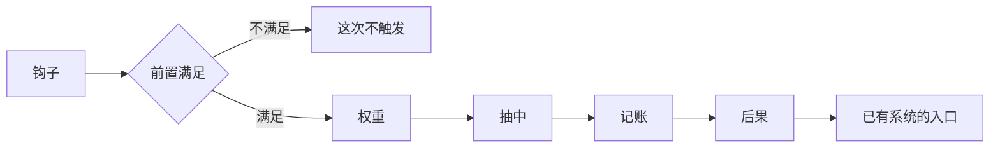

# 一条事件是「钩子 ＋ 前置 ＋ 一组后果调用」：它一行效果都不实现，所以它能收下引导与小事件

> **正典层级**：第 5 级（系统细化）。与[玩法定位](../canon/gameplay/玩法定位.md)冲突时以正典为准；**权重、偏移幅度、冷却时长、每个钩子的触发条数上限与提示停留时长全归 `GP-7`，本页一个都不定。**
>
> 返回 [总索引](../README.md)｜[系统文档与提案索引](./README.md)｜相关：[玩法定位 · 随机事件：事件可以晚做，扩展点现在就留](../canon/gameplay/玩法定位.md) · [任务系统 · 任务与事件的分界](./任务系统.md) · [剧情演出系统](./剧情演出系统.md) · [活跃失衡系统](./活跃失衡系统.md) · [经济系统](./经济系统.md)｜台账：[`GP-52`](../spec/issues/README.md)

## 摘要

**这一页回答一个问题：一件「忽然发生的事」是怎么被触发的，发生之后谁来干活。** 读完你能判断两件事 —— 一样新东西是事件还是任务（有目标与进度的是任务），以及一条新后果该接到哪个已有入口上（永远是接，不是自己算）。

**本页不实现任何效果。** 后果表里不许出现「本页自己算」这一格。

下面这张图回答一个问题：**一条事件从被问到、到有人干活，中间过哪几道。** 钩子问一次，前置满足才继续，按权重抽中之后记一笔，最后接到已有系统的入口上；前置不满足就这次不触发。图上最右边全是别人的入口 —— 那就是「本页不实现任何效果」。

**重画条件**：触发链多一道、记账挪到别处，或者后果表里出现「自己算」那一格时重画。

**这张图不新增任何事实，权威是下面「结构」那几节。** 钩子有哪几处、每日结算那个钩子为什么在步序之外、后果表每一格接谁，图都放不下。

一条事件是**一个触发声明加一组对已有系统入口的调用**。本页定它怎么被声明、什么时候被询问、后果各调谁、「已触发过」记在哪。

**它持有**：一条事件的字段表、钩子在哪几处被询问、一次性与可重复的判据、**那份「已触发过与冷却剩余」的记账**、后果调用表、三类事件各挂哪些钩子、关卡事件与拼装种子的关系、**关系小事件**与**持续引导**这两个共用同一条管道的来源。

**它不持有**这些，各有自己的家：

- 任何效果的实现 —— 每一条后果都落在别人已有的入口上。
- 具体有哪些事件、小事件与引导条目（内容，`ENG-5`），以及权重与冷却的值（`GP-7`）。
- **气泡** —— 它用冷却池、会循环回来，与本页那份一次性记账装不进同一处（[`气泡对话系统`](./气泡对话系统.md)）。
- 日记本体（[`日记系统`](./日记系统.md)）与界面排版。
- 主线节点之间怎么解锁（[`主线推进系统`](./主线推进系统.md)）。

最要紧的那条承诺：**本页不实现任何效果，也不新增每日结算的步骤。** 后果一律是对已有入口的调用（形状与[`教育系统` · 授课：每一项产出都接进别人的系统](./教育系统.md)同源），而那张调用表里**不许出现「本页自己算」这一格**。

## 术语

只列**只有本页在用**的词。跨页共用的在[术语表](../reference/术语表.md)，本节不重复（`后果`、`权重`、`一次性`、`关系小事件`、`持续引导`、`钩子`、`记账`、`气泡`、`步序`、`种子` 都在那边）。

| 词 | 它在本页指什么 |
| --- | --- |
| **可重复** | 与一次性相对：触发过还能再来，靠冷却隔开。判据是**后果可不可逆** |

## 上游约束

- [玩法定位 · 随机事件：事件可以晚做，扩展点现在就留](../canon/gameplay/玩法定位.md)：三类事件、事件是数据不是代码、**触发钩子的位置现在就定死**、事件不实现效果只调已有系统的接口、权重读失衡档位、必须有前置条件与冷却、**必须走手环通知并可在日记里回看**、袭击是事件而不是基地防卫战且穹盾装上退敌灵场之后不再发生。**这是本页全部结构的来源。**
- [玩法定位 · 跨系统基础设施](../canon/gameplay/玩法定位.md)：持续引导是「首次遇到某系统时的提示；教学关只覆盖第一天」；手环是全部管理界面的世界内载体，关卡内只许查看。**这是持续引导那一节的唯一正典来源，也是它那份可回查清单的载体来源。**
- [玩法定位 · 查询与图鉴](../canon/gameplay/玩法定位.md)与[`图鉴系统`](./图鉴系统.md)：**没有地方查，构筑深度就变成记忆负担**；图鉴挂手环、已见过的才收录、载体已经在了不用做新界面。**引导那份清单按「已给过的才收录」走同一条形状，但两者的条目一条都不互通。**
- [玩法定位 · 跨系统约定](../canon/gameplay/玩法定位.md)：全部临时与持续效果走同一套状态系统；手环的管理功能在关卡内不可用，关卡内只许查看。**约束事件给的增益落已有载体，也约束引导那份清单在关卡内只读。**
- [玩法定位 · 弹界面接管输入就暂停世界，世界里的动作不暂停](../canon/gameplay/玩法定位.md)：判据落在「界面接管输入」上；自发冒出的气泡不暂停，它不接管输入。**约束引导的当场提示不接管输入、所以世界不暂停。**
- [玩法定位 · 成就要靠统计事件总线，不能事后补埋点](../canon/gameplay/玩法定位.md)：值得记录的行为都向总线发事件。**约束事件触发要留一个挂点。**
- [玩法定位 · 存档](../canon/gameplay/玩法定位.md)：睡眠是唯一正式存档时机、退出另写临时续玩点。**约束那份记账进正式存档，而不是续玩点。**
- [玩法定位 · mod 的扩展边界](../canon/gameplay/玩法定位.md)：内容一律数据外置、规则不外置。**约束事件与引导条目都是外置数据，字段可扩、结构不可增删。**
- [玩法定位 · 内容规模基准](../canon/gameplay/玩法定位.md)：那张表是全部平衡判据的算账基准。**约束本页新增的内容类型要在那里有一行起步量。**
- [时间与经营 · 结算顺序（固定，不得改动）](../canon/gameplay/时间与经营.md)：那张顺序表是承重项，每一步之间有依赖；委托超期作废在委托板补满之前，而补满要补到固定条数并保底一条无门槛委托。**这是「事件不占一步」那条的全部依据，也是它不能插在中间的具体理由。**
- [时间与经营 · 每日结算](../canon/gameplay/时间与经营.md)：结算在睡后展示、简版弹窗只列有变化的重要项。**约束事件的呈现不挤进那份摘要。**
- [时间与经营 · 通知](../canon/gameplay/时间与经营.md)：**手环是唯一的事件通知渠道**。**约束事件通知走已有渠道；同一条也划出引导的边界 —— 那条「唯一渠道」说的是事件。**
- [时间与经营 · 时间](../canon/gameplay/时间与经营.md)：时间单位只有天、季、年三级，不引入「月」；季节影响剧情节点。**约束冷却的量纲只能挂在已有的时间单位上。**
- [时间与经营 · 定价：三层模型](../canon/gameplay/时间与经营.md)：价格必须可预测、可解释，每个因子都要查到当前值与原因。**约束事件调价必须带一条原因引用。**
- [角色与成长 · 日记](../canon/gameplay/角色与成长.md)：每个角色一本日记、条目按类别分、读日记能发现需求进而解锁小事件、非解锁不可翻、**记与读是两件事**。**这是事件回看的落点，结构在[`日记系统`](./日记系统.md)。**
- [角色与成长 · 涨法、作用范围与恋爱](../canon/gameplay/角色与成长.md)：关系的作用范围含「解锁小事件与对话」；恋爱没有机制收益、只解锁角色之间的小事件。**这是关系小事件收在本页的来源。**
- [角色与成长 · 刻度是十颗爱心，接口是五个档](../canon/gameplay/角色与成长.md)：机制一律读档位，没有任何机制读爱心或填充量。**约束小事件的解锁条件读档位。**
- [世界观 · 穹盾](../canon/world/世界观.md)：护盾挡不住被吸引过来的东西，改造之一是退敌灵场。**这是袭击事件的世界内来源与它的终止条件。**
- [世界观 · 活跃失衡的规模](../canon/world/世界观.md)：它是全作唯一的全局量、可被观察到。**约束事件权重读它，但不反过来改它。**
- [`任务系统` · 任务与事件的分界](./任务系统.md)：有目标与进度、有完成与失败结算的是任务；只有「触发 → 后果」的是事件；判据按「有没有目标」判而不按「谁触发的」判。**这是本页的分类判据，本页接住它、不重定 —— 关系小事件按它就是事件。**
- [`任务系统` · 谁改它、谁读它](./任务系统.md)：事件往委托板加一条走同一个构造路径、事后分不出差别。**这是后果表里「加委托」那一格的形状，已定死。**
- [`经济系统` · 事件调价从哪进来](./经济系统.md)：事件调的是需求系数那个输入、要带一条原因引用、**不给事件开「直接改成交价」的口子**。**这是后果表里「改价格」那一格的形状。**
- [`活跃失衡系统` · 境况事件声明它动哪几组，可正可负](./活跃失衡系统.md)：境况事件声明一组带符号的增减、代价付在别人身上的必须双向。**这是后果表里「改失衡」那一格的形状。**
- [`活跃失衡系统` · 对外只有档位，没有精确值](./活跃失衡系统.md)：读口只有档位与总量、就近读、随机事件的权重是登记在册的读者之一。**这是权重读口的唯一出处。**
- [`活跃失衡系统` · 它在每日结算里不占一步](./活跃失衡系统.md)：它不加步是因为它没有按天到期的项，也没有自然漂移。**本页也不加步，但理由不同源** —— 见下面「钩子在结算序列之外」。
- [`活跃失衡系统` · 三个新读口带来一个正反馈，刹车必须先在](./活跃失衡系统.md)：事件权重与库存偏移带来的推力必须小于递减系数造成的阻力。**这是本页那个权重量要接上的判据，不是本页新加的约束。**
- [`状态效果系统` · 载体的字段](./状态效果系统.md)：载体字段含来源、三种时长单位各有推进点。**约束事件给的增益落已有载体，本页不新建修饰表。**
- [`背包系统` · 满了怎么办：不自动丢弃，四个入口各有一条明确的拒绝路径](./背包系统.md)：满了只拒不丢、拒绝时物品留在世界里。**这是后果表里「给物品」那一格的形状。**
- [`人际系统` · 谁改它、谁读它](./人际系统.md)：增量管道只收正值且必须带来源标签。**这是后果表里「改关系」那一格的形状；那一份明确不做小事件，所以它无家可归。**
- [`主线推进系统` · 标记：只置位，而且不是想加就加](./主线推进系统.md)：一位标记就是一个布尔、只置位不回落，而**置位时刻必须是那件事发生的时刻**；袭击的终止条件读的就是它的一位。**这是后果表里「置位一位推进标记」那一格的形状，也是前置条件那一格读的那个口。**
- [`关卡系统` · 一个种子，加一份关卡进度](./关卡系统.md)：同一个种子必须拼出同一张图、**拼装规则不许读任何会变的外部状态**。**这是关卡事件必须由种子定下来的唯一理由。**
- [`感知与视野系统` · 什么显形，什么不显形](./感知与视野系统.md)：没被感知到的东西不显形，且不给「还剩几个」的计数器。**约束关卡事件放下的东西同受视野约束。**
- [`剧情演出系统`](./剧情演出系统.md)：一段演出是一串指令、它被点播、「播过没有」读本页这份记账。**这是后果表里「播一段演出」那一格，也是关系小事件的后果面。**
- [`战斗AI系统` · 队友：两条轴，两个档号，不合成](./战斗AI系统.md)：操作档读实战值汇总量、配合档读关系档位，机制一律读档位。**这是引导提示读队友行为档时读的那个口。**
- [`教育系统` · 授课：每一项产出都接进别人的系统](./教育系统.md)：一个系统自己不实现效果、每项产出各接一个已有系统。**这是「后果一律调已有入口」这条的既有先例，形状照它走。**
- [`数值模型` · 尚未给值的量，各自写明校准办法](./数值模型.md)：值的唯一来源是参数表，本页只写量纲与约束形式。**约束本页新增的量一律进那张表。**
- [ADR-0009](../decisions/ADR-0009-编辑器主导的开发模式.md)：参数唯一来源是场景与资源、代码不留能用的默认值。**约束事件定义缺字段当场报错。**
- [ADR-0013](../decisions/ADR-0013-战斗片段就是一屏.md)：战斗片段就是一屏、这一屏清干净才能往前。**约束「关卡内到达某进度」这个钩子的粒度是片段，不是一个坐标。**

## 结构

### 一条事件要声明什么

| 声明项 | 说明 | 缺了怎么办 |
| --- | --- | --- |
| 标识 | 跨存档稳定的那个名字，记账按它记 | **载入报错** |
| 挂哪个钩子 | 正典点名的那几处之一；**本页不在那几处之外新开一处** | **载入报错** |
| 前置条件 | 一组「必须成立」的判断，可以为空 | 缺声明**载入报错**（空是显式的空，不是没写） |
| 权重 | 被抽中的相对可能性，按[活跃失衡](../canon/world/世界观.md)档位偏移 | **载入报错** |
| 冷却 | 触发过之后多久才可能再来，量纲挂已有的时间单位 | **载入报错** |
| 是不是一次性 | 见下面那条判据 | **载入报错** |
| 一组后果调用 | 每一条都指到一个已有入口，见下面那张表 | 空的或含「本页自己算」的**载入报错** |

**缺字段当场报错、不留能用的默认值**（[ADR-0009](../decisions/ADR-0009-编辑器主导的开发模式.md)）。**「前置条件为空」要显式写成空**，否则「没写」与「不需要」长得一样。

**事件定义是外置内容**（`ENG-5` 点名的那条边界），所以上面这些字段是内容作者要填的表；**结构不可增删，字段可扩**。

### 钩子在正典点名的那几处，只被询问、不轮询

**钩子的位置在[玩法定位 · 随机事件：事件可以晚做，扩展点现在就留](../canon/gameplay/玩法定位.md)，本页不复述那几处，也不在那之外新开一处。** 本页只定它怎么被用：

- **事件只在钩子被触到的那一刻被询问。** 本页**不自己跑计时器、不轮询** —— 加一个自己的时钟等于多一个按时间变的量，而那正是[`活跃失衡系统`](./活跃失衡系统.md)刻意避开的形状。
- **一次询问的结果是「抽出零到若干条」**：先按前置条件筛，再按权重抽，抽到的逐条执行后果。
- **一个钩子一次最多触发几条有上限**，量纲是条数，值归 `GP-7`。没有上限的话「进入场景」那一下可能一次弹出好几件事，玩家分不清哪件是哪件。

### 每日结算那个钩子落在固定步序之外

**正典写的是「每日结算**之后**」，所以它不占[结算顺序（固定，不得改动）](../canon/gameplay/时间与经营.md)里的任何一步。** 这不是省事，理由很具体：

- **事件要读结算的结果。** 作物枯死了、书读毕了、精力上限变了 —— 这些是结算算出来的，所以询问只能排在整串之后。
- **事件的后果会去调那串里已经跑过的东西。** 往委托板加一条正是其中一个 —— 插在中间的话，**委托板补满那一步会因为事件已经加了一条而少补**，于是「补满至固定条数」与那条无门槛委托的保底静默失效。
- **它与[`活跃失衡系统` · 它在每日结算里不占一步](./活跃失衡系统.md)不同源。** 那一条不加步是因为**它没有按天变的量**；本页不加步是因为**它要读结算的结果**。两条结论一样、理由不一样，**不许互抄** —— 抄了之后改动其中一侧时另一侧会静默失去依据。
- **代价写明**：事件的后果落在新的一天，所以它不出现在当晚那份结算摘要里。这不影响玩家知道 —— 事件本来就有手环通知这条自己的渠道。

### 一次性与可重复：判据是后果可不可逆

| | 什么时候用 | 触发过之后 |
| --- | --- | --- |
| **一次性** | 后果不可逆：剧情性事件、支线起点、给一件唯一物品 | **永不再来** |
| **可重复** | 后果可逆或纯数值：调一次价、加一条委托、一次小摩擦 | 受冷却与前置条件管 |

**判据是「它的后果可不可逆」，不是按事件类型列白名单。** 白名单会随内容长，判据不会。

**默认是可重复** —— 随机性是抗疲劳的主要来源（正典），一律一次性的话事件池会在若干天后空掉。

### 那份记账只有一处，进正式存档

**本页持有一份记账**，装两样东西：**哪些标识已经触发过**、**哪些的冷却还剩多久**。

- **进正式存档**（[玩法定位 · 存档](../canon/gameplay/玩法定位.md)），不进临时续玩点 —— 「这件事发生过」要跨关跨日成立。
- **不记在被调用的那些系统里。** 记在那边的后果是同一件事的状态散在好几处，而「已触发过」这件事没有哪一处是它的自然归属。
- **持续引导与它共用这一份**，理由见下面「持续引导」那一节。

### 后果一律是对已有入口的调用

| 后果 | 调到哪 |
| --- | --- |
| 改价格 | [`经济系统` · 事件调价从哪进来](./经济系统.md)那个需求系数输入，**必须带一条原因引用** |
| 加委托 | [`任务系统` · 谁改它、谁读它](./任务系统.md)那个入口，走与日常生成同一个构造路径 |
| 改失衡 | [`活跃失衡系统` · 境况事件声明它动哪几组，可正可负](./活跃失衡系统.md)，双向判据在那边 |
| 给增益 | [`状态效果系统` · 载体的字段](./状态效果系统.md)的对应时长项 |
| 给物品 | [`背包系统`](./背包系统.md)，满了只拒不丢、物品留在世界里 |
| 改关系 | [`人际系统` · 谁改它、谁读它](./人际系统.md)那条只收正值的增量管道，带来源标签 |
| 播一段演出 | [`剧情演出系统`](./剧情演出系统.md) |
| 置位一位推进标记 | [`主线推进系统`](./主线推进系统.md)那个置位入口，**置位时刻就是这条事件触发的时刻** |
| 推一条提示 | 本页的引导那一节，见下 |

**表里不许出现「本页自己算」这一格。** 这条是本页的防重构点：一旦有一格自己算，每加一类事件就会多一个效果实现，而那些实现与被调用那一侧迟早分叉。

**加一种后果时填的是这张表**，判据是**「这件事已经有人做了吗」** —— 填不出对应入口的说明那件事还没有系统，该先立项而不是在本页实现。形状与[`教育系统` · 授课：每一项产出都接进别人的系统](./教育系统.md)同源。

### 三类事件与它们各挂哪些钩子

**三类在[玩法定位 · 随机事件：事件可以晚做，扩展点现在就留](../canon/gameplay/玩法定位.md)，本页不复述清单**，只定它们各能挂哪些钩子：

| 类 | 能挂的钩子 |
| --- | --- |
| 基地事件 | 每日结算之后、进入场景时、季节更替、特定条件满足 |
| 城区事件 | 进入场景时、季节更替、特定条件满足 |
| 关卡事件 | **只有关卡内到达某进度那一处**，而且它在拼装那一刻就定下来，见下 |

**一条事件属哪一类，由它挂的钩子与它调的入口共同决定，不另设一个「类型」字段。** 加一个字段就会出现「类型写基地、钩子挂关卡内」这种自相矛盾的数据，而它不报错。

### 关卡事件在拼装那一刻定下来，不在关卡内抽

**[`关卡系统` · 一个种子，加一份关卡进度](./关卡系统.md)写明拼装规则不许读任何会变的外部状态，而「同一个种子拼出同一张图」是它的承重承诺。** 关卡里临时抽事件正好是会变的那种，所以：

- **关卡事件是拼装输入的一部分**，由种子决定；**关卡内不再抽取**。
- **这条要有反证钉住**：同一个种子两次拼出的关卡事件完全一致。不钉的后果是它被实现成关卡内抽取，而表现是「退出再进，那只稀有敌人不见了」—— **它不报错**。
- **代价写明**：「这一关会不会突然塌一段」在同一个种子下是确定的，重进同一关没有惊喜。换来的是那条承诺不用开例外。
- **放进关卡的东西同受视野约束**（[`感知与视野系统` · 什么显形，什么不显形](./感知与视野系统.md)），本页不开例外；**也不给「这关有几个事件」的计数器** —— 那等于把视野约束绕掉。

### 袭击是一条事件，不是基地防卫战

- **后果一律走已有入口**：设施损坏走建造那一侧的状态、居民受伤走状态载体、失衡上升走境况事件。
- **需要打就往委托板派生一条**，走与日常生成同一个构造路径（[`任务系统`](./任务系统.md)），**事后分不出差别**；它由此是一条委托、占接取额度、有截止 —— **不为它开第四类任务**。
- **不做基地防卫战**（正典），所以俯视场景不长出战斗表现。
- **终止条件读推进侧的一位标记**：[穹盾](../canon/world/世界观.md)装上退敌灵场之后这类事件不再发生。那一位由[`主线推进系统`](./主线推进系统.md)持有、只置位不回落；**它没置位时读作未满足** —— 不报错、也不当成已满足。

### 呈现与回看走已有渠道

- **通知走手环**（[时间与经营 · 通知](../canon/gameplay/时间与经营.md)那条唯一渠道）。
- **回看往参与者各自的[日记](./日记系统.md)里各写一条纪事**，而**主角那本一律有一条** —— 主角那本不设解锁门，所以回看不会因为关系不够而查不到（[`日记系统` · 事件回看永远查得到](./日记系统.md)）。
- **关卡内只许查看不许操作**（[玩法定位 · 跨系统约定](../canon/gameplay/玩法定位.md)）。
- **通知里要说得出「它改了什么」** —— [时间与经营 · 定价：三层模型](../canon/gameplay/时间与经营.md)要求每个价格因子都查得到原因，而事件正是那个原因的来源；只写「发生了一件事」等于把那条要求断在最后一步。
- **日记本体不在本页**：本页只定「往它写一条回看记录」这个接口，它自己是什么在[`日记系统`](./日记系统.md)。**方向是单向的** —— 事件往日记写，日记不回头调事件。

### 关系小事件也是一条事件

**按[`任务系统` · 任务与事件的分界](./任务系统.md)那条判据它就是事件** —— 它只有「触发 → 后果」，没有目标与进度、没有完成与失败结算。而[`人际系统`](./人际系统.md)明写不做它，所以它收在本页。

| 格 | 关系小事件填什么 |
| --- | --- |
| 挂哪个钩子 | 特定条件满足（那一对的关系到了某档） |
| 前置条件 | 读那一对的**关系档位**（[角色与成长 · 刻度是十颗爱心，接口是五个档](../canon/gameplay/角色与成长.md)：**读档位不读爱心**），可加「某个**需求标识**已被发现」（[`日记系统` · 需求是条目上的一个标记，小事件读的是那个标识](./日记系统.md)）。**读的是标识而不是「读过某人的日记」** —— 后者是整本粒度，翻开一次就解锁全部 |
| 后果 | 播一段演出（[`剧情演出系统`](./剧情演出系统.md)） |

**它与随机事件的分别只在这两格（触发源与后果面），其余字段共用。** 一次性那一格通常填一次性 —— 一段小事件演过就演过了。

**恋爱那一侧不加结构**：[角色与成长 · 涨法、作用范围与恋爱](../canon/gameplay/角色与成长.md)写明恋爱没有任何机制收益、只解锁角色之间的小事件，所以它是「前置条件多读一个字段」，不是第二套机制。

### 持续引导：同一条管道，两条出口

**持续引导收在本页，判据是记账**：它与事件共用同一份「已触发过」的存储，而那两个问题本来就是同一个问题。**气泡不共用** —— 气泡是「说过了进冷却池、还会回来」，引导是「首次之后不再主动出现」，**同一份存储装不下两种语义**。

**一条引导提示要声明什么：**

| 声明项 | 说明 |
| --- | --- |
| 首次钩子 | 第一次打开某个界面、第一次做某个动作、第一次进某类场景 |
| 文本键 | 说什么。**提示文本是内容**，走[内容外置](../canon/gameplay/玩法定位.md) |
| 要不要读别的系统的当前值 | 可选。读什么由这条自己声明，见下面那条 |

**它有两条出口，而它们读的是同一份记账：**

- **当场一条提示**：**不接管输入**，所以世界不暂停（[玩法定位 · 弹界面接管输入就暂停世界，世界里的动作不暂停](../canon/gameplay/玩法定位.md)）。
- **一份挂在手环上的可回查清单**：**它不是第二份存储** —— 它是「已给过的那些条目」这个集合的**读口**。所以不存在「提示给过了但清单里查不到」这种分叉，也**不用为它加任何存档字段**。
- **清单在关卡内只许查看**，与图鉴、任务目标同一侧。
- **清单与[`图鉴系统`](./图鉴系统.md)只共用「已给过／已见过的才收录」这条形状，条目一条都不互通** —— 图鉴收的是内容定义，这份清单收的是「怎么玩」。它挂手环哪一页归界面侧。

**引导提示不参与任何丢弃。** 它是必要信息，而正典写明**气泡不承载必要信息**；两者因此不共用一条呈现队列。停留时长与同时显示上限归 `GP-7`。

**教学关教过的东西也各有一条引导条目**，只是它们的首次钩子挂在教学关的某个步骤上、在那里被一次性标记为已给过。不这么做的话，**第一天教的那些（也就是最基础的操作）恰好是唯一查不到的部分**。**这不改「教学关只覆盖第一天」那条正典边界** —— 教学关仍然只教一次，变的只是它教过的东西也进那份清单。

**引导可以读队友的行为档**：只读档位、不读阈值，而且**只在那条提示自己声明了读它时才读**。

- **为什么要读**：正典要求升档必须解锁一个玩家看得出来的行为，而玩家看不出「他为什么不闪避」—— 一条「你的队友还是最低档，所以他还不会闪避有预警的攻击」正是那套分档能被玩家感知的少数稳定渠道之一。
- **为什么只读档位**：阈值是数值、会变，写进提示等于在内容里复制一份会过期的数；而正典对失衡与关系都刻意只给档位不给精确值。**档名与档数是接口常量，家在[战斗与关卡 · 队友 AI 分档：学生「变强」必须看得见](../canon/gameplay/战斗与关卡.md)，本页不复述。**
- **代价**：多一个读者。而那个读口已经存在（界面侧也要读它，见[`战斗AI系统` · 队友：两条轴，两个档号，不合成](./战斗AI系统.md)），所以是加一个读者而不是加一条接口。

**教学关与持续引导的分界**：**同一件事不两处都教，但两处教过的都进同一份可回查清单。**

## 接口

### 谁触到它、它调谁

| 方向 | 对方 | 形状 |
| --- | --- | --- |
| 入 | [每日结算](../canon/gameplay/时间与经营.md) | 整串跑完之后询问一次；**不占那张顺序表里的任何一步** |
| 入 | 场景加载 | 进入场景时询问一次 |
| 入 | [`关卡系统`](./关卡系统.md) | 关卡内到达某进度时询问一次；**关卡事件本身在拼装那一刻已由种子定下** |
| 入 | 季节更替 | 换季那天询问一次 |
| 入 | 特定条件满足 | 别的系统报一次「某件事成立了」，本页据此询问 |
| 入 | 界面与世界里的首次动作 | 引导那一侧的首次钩子 |
| 读 | [`活跃失衡系统`](./活跃失衡系统.md) | 就近读档位，用来偏移权重；**本页不改它** |
| 读 | [`主线推进系统`](./主线推进系统.md) | 前置条件可以读它的一位标记（袭击的终止条件）；**没置位时读作未满足** |
| 出 | [`主线推进系统`](./主线推进系统.md) | 置位一位推进标记，见后果表那一行 |
| 读 | [`人际系统`](./人际系统.md) | 小事件的前置条件读那一对的关系档位 |
| 读 | [`战斗AI系统`](./战斗AI系统.md) | 引导提示按自己的声明读队友的行为档位 |
| 出 | [`经济系统`](./经济系统.md) | 给某个货物分组加一条带原因引用的需求偏移 |
| 出 | [`任务系统`](./任务系统.md) | 往委托板加一条 |
| 出 | [`活跃失衡系统`](./活跃失衡系统.md) | 提交一组带符号的境况增减 |
| 出 | [`状态效果系统`](./状态效果系统.md) | 加减一项，按它的时长单位 |
| 出 | [`背包系统`](./背包系统.md) | 给物品；满了只拒不丢 |
| 出 | [`剧情演出系统`](./剧情演出系统.md) | 点播一段脚本 |
| 出 | 手环通知 | 事件发生一条 |
| 出 | [`日记系统`](./日记系统.md) | 往参与者各自那本写一条纪事，主角那本一律有一条 |
| 读 | [`日记系统`](./日记系统.md) | 小事件的前置条件读「已发现的需求」集合 |
| 出 | 引导的当场提示 | 不接管输入，所以世界不暂停 |
| 出 | 统计事件总线 | 事件触发一条 |
| 读口 | 引导清单 | **「已给过的那些条目」这个集合的读口**；关卡内只读 |
| 读口 | [`剧情演出系统`](./剧情演出系统.md) | 「这段演出播过没有」读本页这份记账 |
| 存档 | [`存档系统`](./存档系统.md) | 那份记账（已触发过 ＋ 冷却剩余）进正式存档 |
| 作者填 | 事件与引导条目 | 上面那两张字段表，**缺了载入报错** |

**挂载点到此为止。** 将来加一样与事件有关的东西时，先问「它挂在上面哪一格」，而不是顺手插一个新钩子。

### 它不碰的四条接缝

- **任何效果的实现**：后果那张表里每一格都指到别人，本页一行都不实现。
- **气泡**：记账语义不同（冷却池会循环回来），而且正典明写不要把它与正式对话合成一个系统；它的约束在[玩法定位 · 对话：气泡与正式对话是两套东西](../canon/gameplay/玩法定位.md)，结构在[`气泡对话系统`](./气泡对话系统.md)。
- **日记本体**：本页只定「往它写一条回看记录」这个接口，结构在[`日记系统`](./日记系统.md)。
- **关卡怎么拼**：本页只提供「这一关有哪些关卡事件」这份由种子决定的输入，拼装在[`关卡系统`](./关卡系统.md)。

## 边界与非目标

- **不定任何数值**：权重基线与按档位的偏移幅度、冷却时长、每个钩子一次触发的条数上限、引导提示的停留时长与同时显示上限全归 `GP-7`。**接口常量不是数值** —— 三类事件、钩子有哪几处、一次性与可重复两类，归属各写在正典或本页。
- **不定内容**：有哪些事件、哪些小事件、哪些引导条目、说什么，属内容，走[内容外置](../canon/gameplay/玩法定位.md)（`ENG-5`）。
- **不实现任何效果**：后果那张表是唯一的出口。
- **不在正典那几处钩子之外新开一处**：位置正典已经定死，本页写链接不复述。
- **不新增每日结算的步骤**：理由在上面「每日结算那个钩子落在固定步序之外」。
- **不自己跑计时器、不轮询**：只在钩子被触到时被询问。
- **不改[活跃失衡](../canon/world/世界观.md)的总量**：改它只能作为一条后果调用，走境况事件那个入口；权重那一侧是**只读**。
- **不做气泡**：[`气泡对话系统`](./气泡对话系统.md)。
- **不做日记本体**：[`日记系统`](./日记系统.md)。
- **不做基地防卫战**：正典明确不做。
- **不为袭击开第四类任务**：它派生出的那条是委托，走同一个构造路径。
- **不给「这关有几个事件」的计数器**：它会把视野约束绕掉。
- **不在关卡内抽事件**：那会绕掉「同一个种子拼出同一张图」。
- **不做界面**：引导清单挂手环哪一页、怎么分组、提示放屏上哪里、事件通知与日记回看的入口，归[`界面系统`](./界面系统.md)与作者实机定（进度见[待办台账](../spec/issues/README.md)）。
- **不做主线节点之间怎么解锁**：本页只做「一条事件」的结构，那一侧在[`主线推进系统`](./主线推进系统.md)。**置位一位推进标记是后果表上的一格**，不是本页自己算的东西。
- **不设计存档序列化格式**：只定「那份记账进正式存档，而引导清单是它的读口、不单独存」——格式与版本口径在 [ADR-0015](../decisions/ADR-0015-存档的版本与缺字段口径.md)，分片怎么声明在[`存档系统`](./存档系统.md)。
- **同名不同物，两处都要写全名**：
  - **「事件」在本作有四处**：本页的**随机事件**、[`活跃失衡系统`](./活跃失衡系统.md)的**境况事件**、本页收下的**关系小事件**，以及**统计事件总线**上那条「事件」（那是一条埋点，不是一件发生在世界里的事）。每处写全名。
  - **「钩子」**：本页那几处询问时点，与代码里别处的钩子不是一回事。
  - **「一次性」**：本页那个声明项（触发过就永不再来），与[`物品系统`](./物品系统.md)里书那种「读完即消耗」不是一回事。
  - **「提示」**：本页的**引导提示**（必要信息、不许被丢弃）与**气泡**（氛围、可以被丢弃）。
  - **「清单」**：本页的**引导清单**（收「怎么玩」）与[`图鉴系统`](./图鉴系统.md)（收内容定义）。两者只共用那条收录形状。

## 理由与取舍

- **没选让事件自己实现效果。** 每加一类事件就多一个效果实现，而它与被调用那一侧迟早分叉；正典把这条列为防重构的核心，本页只是把它落成一张不许有「自己算」那一格的表。
- **没选给事件在每日结算里加一步。** 委托板补满那一步会因为事件已经加了一条而少补，于是「补满至固定条数」与那条无门槛保底静默失效 —— 而那种失效不报错。代价是事件的后果落在新的一天，不进当晚那份摘要。
- **没选照抄[`活跃失衡系统`](./活跃失衡系统.md)那条不加步的理由。** 两条结论一样、理由不一样（一条是「没有按天变的量」，一条是「要读结算的结果」）；抄了之后改动其中一侧时另一侧会静默失去依据。
- **没选让事件自己跑计时器。** 那等于多一个按时间变的量，而它会引出「离线时间要不要补算」这类问题；只在钩子被触到时被询问就没有这个问题。
- **没选一律一次性。** 内容量会直接决定可玩时长，而正典说随机性是抗疲劳的主要来源；若干天之后事件池会空。
- **没选一律可重复、不记账。** 剧情性事件会再来一次（「那个访客又第一次来了」），支线起点也会被重复触发，而这种错不报错。
- **没选按事件类型列一张「哪些是一次性」的白名单。** 白名单会随内容长；判据（后果可不可逆）不会。
- **没选把「已触发过」记在被调用的那些系统里。** 同一件事的状态会散在好几处，而「已触发过」没有哪一处是它的自然归属。
- **没选给事件加一个「类型」字段。** 类由它挂的钩子与它调的入口共同决定；加字段会长出「类型写基地、钩子挂关卡内」这种自相矛盾的数据，而它不报错。
- **没选在关卡内实时抽事件。** 它会绕掉「同一个种子拼出同一张图」，而绕掉之后的表现是「退出再进，那只稀有敌人不见了」且不报错。代价是重进同一关没有惊喜。
- **没选给袭击开一类新任务。** 它派生的那条走委托同一个构造路径，事后分不出差别；开例外就是第四类任务，而那三类只在几格上不同正是[`任务系统`](./任务系统.md)省下来的东西。
- **没选把关系小事件留在[`人际系统`](./人际系统.md)。** 按判据它只有「触发 → 后果」，而那一份持有的是「一个关系值怎么涨」；留在那边它会长出自己的触发与自己的一次性判定，然后同一套东西有两处。
- **没选把气泡也收进本页。** 记账语义不同：引导是「首次之后不再主动出现」，气泡是「说过了进冷却池、还会回来」，同一份存储装不下两种；而正典还明写不要把气泡与正式对话合成一个系统。
- **没选把持续引导单独成篇。** 它没有自己的状态机，也没有别的读者；而它与事件共用的那份记账若跨两份文档，就是「一个事实两个家」。
- **没选让引导提示只给一次就没了。** 它是玩家教学的延续，而「忘了怎么做」正是玩家回来查的原因。**而且这条没有变贵**：那份可回查清单是记账的读口而不是第二份存储，所以存档字段一个都没加。
- **没选让引导提示走手环通知。** 手环通知是「跨日的账」，引导是「此刻的操作」；混在一起会让通知列表变成两种东西，玩家学会忽略它。正典那条「手环是唯一的事件通知渠道」说的是**事件**。
- **没选让引导清单与[`图鉴系统`](./图鉴系统.md)共用条目。** 图鉴收的是内容定义、按「已见过」收录；引导收的是「怎么玩」、按「已给过」收录。共用会让「我见过这件宝物」和「系统教过我怎么镶宝石」变成同一件事。
- **没选让引导读到阈值。** 阈值是数值、会变，写进提示等于在内容里复制一份会过期的数；正典对失衡与关系都刻意只给档位。
- **没选让教学关自己记「我教过什么」。** 那是第二份存储；把教学关教过的东西也做成引导条目（首次钩子挂在教学关的步骤上）之后，记账仍然只有一份。

## 验收

**可自动验证项**（纯规则层，与引擎无关）：

- 字段表：标识、钩子、前置条件、权重、冷却、一次性、后果各缺一次，都**载入被拒**；**前置条件「空」与「没写」分得开**（前者合法、后者被拒）。
- 后果表：**含「本页自己算」那一格的定义被拒**（承重项的反证）；每一条后果都能指到一个已有入口。
- 钩子：**本页不轮询**（只推进时间、不触任何钩子时，一条事件都不触发）；每个钩子被触到时各询问一次。
- 结算：**事件的询问排在结算整串之后** —— 一条测试钉住：构造一条「往委托板加一条」的事件，**委托板补满之后的条数仍然是满的**，且板上那条无门槛委托仍在。
- 结算不加步：那张顺序表的步数在本页落地前后完全一致（**一条结构约束**）。
- 一次性：触发过之后再询问**不会再出**；可重复的在冷却未过时**不会被选中**、冷却过了会被选中，各一条。
- 记账：**只有一份**（读口只有一个）；存进去再读出来完全一致；**它不在被调用的那些系统里**（那几处没有「已触发过」这个字段）。
- 权重：按[活跃失衡](../canon/world/世界观.md)档位偏移；**本页没有改失衡的直接入口**（改它只能作为一条后果调用）。
- 条数上限：一个钩子一次触发的条数不超过声明的上限。
- 关卡事件：**同一个种子两次拼出的关卡事件完全一致**（承重项）；**关卡内没有抽取入口**（反证）；它们受视野约束；**读口里没有「这关还剩几个事件」这一项**。
- 袭击：派生出的那条与日常生成的委托**走同一个构造路径，事后分不出差别**；前置条件读[`主线推进系统`](./主线推进系统.md)那一位标记，且**它没置位时读作未满足**（不报错、也不当成已满足）。
- 呈现：事件触发时发一条手环通知、写一条日记回看记录、发一条统计事件，各一条；**关卡内改动入口被拒**。
- 关系小事件：前置条件读的是**关系档位**；**读爱心或填充量的定义被拒**；后果是点播一段演出。
- 引导：给过的提示**不再主动出现**；**清单读出来的集合与记账里「已给过」的那一组完全相同**（承重项的反证 —— 它挡的是「清单另存一份」那种实现）；**清单不引入任何新的存档字段**。
- 引导与气泡分家：引导提示**不参与丢弃**（一条测试：把呈现队列压满，引导仍然到场）；**引导提示不接管输入**（世界不暂停）。
- 引导的读法：**只读档位**（读阈值的定义被拒）；**只在声明了读某个系统时才读它**。
- 教学关：教学关教过的每一件事**各有一条引导条目**，且它们在教学关结束时**已被标记为已给过**。

**必须实机确认项**：事件通知说不说得出「它改了什么」、引导提示在像素下读不读得清、引导提示与气泡分不分得出来、那份清单越积越长之后找不找得到东西、关卡里冒出一个事件的那一下醒不醒目、袭击派生的那条委托玩家看不看得出它是急事。按 [ADR-0009](../decisions/ADR-0009-编辑器主导的开发模式.md) 的分工由作者实机看，本页不判。

**完成边界**：一条事件的字段表缺一格就报错、钩子只被询问且每日结算那一处在固定步序之外、后果表里每一格都指到别人（有反证）、记账只有一份且进存档、关卡事件由种子定下来（有反证）、关系小事件与持续引导都走同一条管道、引导清单是记账的读口（有反证）。做到这些，「条件成立 → 抽出一条 → 调几个已有入口 → 玩家从手环知道、从日记回看」与「第一次遇到某个系统 → 当场一条提示 → 以后还查得到」两条链在文档层面就走得通了。

## 下游同步

- **代码**：落 `rules/Progression`（与[`任务系统`](./任务系统.md)、[`人际系统`](./人际系统.md)、[`活跃失衡系统`](./活跃失衡系统.md)同域，它们读写同一批世界状态）。对代码基本是纯增量。**实现前先搜一遍代码仓确认事件与引导侧真的是空的** —— 本页写这句是因为那还是推断。
- **数值**：权重基线与按档位的偏移幅度、冷却时长、每个钩子的触发条数上限、引导提示的停留时长与同时显示上限进 `GP-7` 的参数表；权重那一项要接上[`活跃失衡系统` · 三个新读口带来一个正反馈，刹车必须先在](./活跃失衡系统.md)那条既有判据。
- **台账**：立项在 [`GP-52`](../spec/issues/README.md)。落地顺序前半按「字段表与缺字段报错 → 钩子只被询问（含不轮询的反证）→ 结算之后那一处（含委托板补满仍然满的反证）→ 后果表逐个接上已有入口」。后半按「记账与存档 → 一次性与冷却 → 关卡事件由种子定（含反证）→ 关系小事件 → 持续引导两条出口（含清单是读口的反证）→ 教学关那批预置条目」。界面归界面侧那一条。
- **该上升进正典的**：只有一条 —— **「后果一律调已有入口，本页不许有『自己算』那一格」这条防重构纪律**，等事件真的加到第二批、证明这条表够用之后，上升进[玩法定位 · 跨系统约定](../canon/gameplay/玩法定位.md)。另有一条已经在上面：[`任务系统`](./任务系统.md)那条任务与事件的分界，本页只是接住它。其余字段与接口按定义不进正典。
