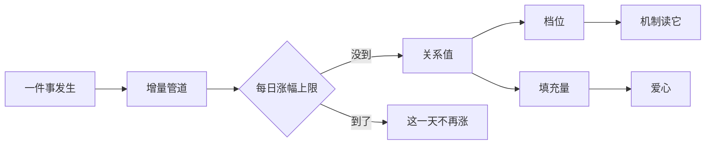

# 关系只升不降，所以压力全在涨的那一侧：一个量、一条五档阶梯、任意两个角色共用

> **正典层级**：第 5 级（系统细化）。与[角色与成长](../canon/gameplay/角色与成长.md)冲突时以正典为准；**全部阈值与增量归[数值模型](./数值模型.md)，本页一个都不定。**
>
> 返回 [总索引](../README.md)｜[系统文档与提案索引](./README.md)｜相关：[角色与成长 · 人际与日记](../canon/gameplay/角色与成长.md) · [人物 · 教师权力、同意与关系红线](../canon/characters/人物.md) · [战斗与关卡 · 队友 AI 分档：学生「变强」必须看得见](../canon/gameplay/战斗与关卡.md) · [教育系统](./教育系统.md) · [活跃失衡系统](./活跃失衡系统.md)｜台账：[`GP-38`](../spec/issues/README.md)

## 摘要

**这一页回答一个问题：两个角色之间那份交情是怎么涨的。** 读完你能判断两件事 —— 一件新的互动要不要给关系加值（加值只有一条管道），以及「为什么这个数不会掉」背后的代价是什么。

**一条降法都没有。** 这不是宽容，是为了让它不能被拿来当奖惩 —— 一个会掉的关系值迟早会变成惩罚工具。

关系是**任意两个角色之间的一个进度值**。本页定它怎么被持有、怎么涨、为什么不会掉、谁读它。

**它持有**：按无序角色对记的关系值、档位与填充量的映射、增量管道与每日上限、恋爱状态与恋爱资格的判定。

**它不持有**这些，各有自己的家：

- 任何数值 —— 档位边界、各条涨法的增量、每日上限全归[数值模型](./数值模型.md)。
- 日记（[`日记系统`](./日记系统.md)）与小事件的内容与触发。
- 气泡语料（[`气泡对话系统`](./气泡对话系统.md)）。
- 队友 AI 的档位结构 —— 档名在[战斗与关卡](../canon/gameplay/战斗与关卡.md)，两个档号与各档行为在[`战斗AI系统`](./战斗AI系统.md)。
- 实战值（按「角色 × 技能」记，家在[成长系统](./成长系统.md)）。

下面这张图回答一个问题：**一件事发生之后，关系值是怎么变的，以及哪几处只读不写。** 图上只有一条进去的箭头 —— 那就是「只有一条增量管道」。涨到每日涨幅上限，这一天不再涨。

**重画条件**：多一条写入路径、上限挪到别处，或者机制开始读填充量时重画。

**这张图不新增任何事实，权威是下面「结构」那几节。** 增量管道为什么只收正值、档位与爱心怎么对应、恋爱怎么叠上去，图都放不下。

最要紧的那条承诺：**关系只升不降，一条降法都没有。** 由此省掉一个存储项 —— 结局判定不需要另外记一笔「曾经到过最高档」，因为它与当前档位永远相等。代价是**单调性变成了承重的不变式**，它必须有反证测试钉住。

**本页不新建载体、不新建时间单位、不新建结算通道。** 关系是进度值不是状态效果，所以不进[状态载体](./状态效果系统.md)；它只在事件发生时改变，不按天推进，所以[每日结算](../canon/gameplay/时间与经营.md)不为它加步。

## 术语

只列**只有本页在用**的词。跨页共用的在[术语表](../reference/术语表.md)，本节不重复（`爱心`、`填充量`、`恋爱资格`、`档位`、`读口`、`承重项`、`反证` 都在那边）。

| 词 | 它在本页指什么 |
| --- | --- |
| **无序对** | 记关系时不分先后：甲对乙与乙对甲是**同一份**，不是两份。按需创建，没创建过的读作最低档 |
| **每日涨幅上限** | 同一对角色一天最多能涨多少。压力全放在这一侧 —— 顾不上所有人，但不会罚到具体某个人头上 |

## 上游约束

- [角色与成长 · 人际与日记](../canon/gameplay/角色与成长.md)：量就叫**关系**、一套机制一条阶梯、五档（陌生 → 了解 → 熟悉 → 认可 → 信赖）、十颗爱心每档两颗且连续填充、爱心是刻度而档位是接口、恋爱成立时最高档显示「托付」、增长途径、作用范围与那条明确不做。**这是本页全部结构的来源，本页只决定它们各自落在哪。**
- [角色与成长 · 战利品归属](../canon/gameplay/角色与成长.md)：索取结果由关系档位决定、索取被拒不降低关系、付酬不改变关系。**约束读口的粒度（档位）与「不降」的实例。**
- [角色与成长 · 物品所属权](../canon/gameplay/角色与成长.md)：所属权限制转移与处置，赠与与请求属私人范畴。**约束送礼那条涨法走赠与，不走配装。**
- [人物 · 教师权力、同意与关系红线](../canon/characters/人物.md)：拒绝不造成永久资源、成长、毕业或结局惩罚；不撮合、不奖惩、不介入配对；永久禁止师生暧昧；私人信息不得变成战术奖惩资源。**约束「不降」这条总规则，也约束恋爱怎么成立、玩家能不能插手。**
- [人物 · 教学：他与这个世界的主要接口](../canon/characters/人物.md)：教学产出含涨师生关系、一天只教一次、连着教收益逐次递减。**约束主要涨法，也给出它天然的节流阀。**
- [时间与经营 · 学生与派工](../canon/gameplay/时间与经营.md)：付酬不改变关系、高风险派工必须请求同意且拒绝不损失关系、产出受该学生的属性与特质影响。**约束「不降」的实例，也约束「派到擅长的工位」那条涨法怎么判「擅长」。**
- [时间与经营 · 教学与考试](../canon/gameplay/时间与经营.md)：考好给增益与更近的关系、考差零惩罚、不来上课与拒绝指导都不掉关系、考试挂季末与年末。**同上，并约束考试那条涨法的时点。**
- [主线故事 · 完美结局条件](../canon/narrative/主线故事.md)：条件三是全体学生对主角的关系达到最高档，判定在节点 17 触发时只读「曾经达成」。**约束本页必须提供结局判定读得到的读口** —— 单调性让「读当前档位」就够，理由见下面「结构」。
- [常驻NPC](../canon/narrative/常驻NPC.md)：多名 NPC 的弧线按关系推进（肯说更老的事、推荐儿子来基地帮忙、让玩家察觉他知道的比说的多）。**约束 NPC 那一侧不另起一套机制。**
- [学生群像 · S-9 灯火（人类·女·养女）](../canon/narrative/学生群像.md)：灯火与主角是**养父女而不是师生**。**约束恋爱资格必须是角色定义上的字段** —— 她既不能按「学生」一概而论，也不该在代码里被一个 `if` 特例掉。
- [战斗与关卡 · 队友 AI 分档：学生「变强」必须看得见](../canon/gameplay/战斗与关卡.md)：团队配合那一轴读关系档位，而**两条轴不合成一个档号** —— 配合档单独成一个档号，结构在[`战斗AI系统`](./战斗AI系统.md)。**约束本页只提供关系那一轴的档位读口，不碰 AI 的档位结构。**
- [`教育系统`](./教育系统.md)：授课与考试的产出表写明师生关系上涨接人际，且教育系统自己不实现任何效果。**约束本页必须接得住那两条调用，且不要求教育侧改形状。**
- [`成长系统`](./成长系统.md)：实战值按「角色 × 技能」记，汇总量是派生的、没有直接写入口；熟练度不衰减。**约束本页不碰实战值，也为「关系不衰减」提供同源理由。**
- [`活跃失衡系统`](./活跃失衡系统.md)：档数是接口而不是显示细节、就近读、结局判定那一侧需要一个只置位的标记。**约束本页照抄「档数是接口」那条纪律，同时说明为什么本页不需要那个标记。**
- [`状态效果系统`](./状态效果系统.md)：载体装的是能并存的修饰。**约束关系不进载体** —— 它是进度值，与书籍掌握度同类。
- [`数值模型`](./数值模型.md)：值的唯一来源是参数表，本页只写量纲与约束形式。**约束本页新增的量一律进参数表或尚未给值表。**
- [ADR-0009](../decisions/ADR-0009-编辑器主导的开发模式.md)：参数唯一来源是场景与资源，代码不留能用的默认值。**约束恋爱资格那个字段缺了必须当场报错。**

## 结构

### 一个无序对一个数，按需创建

关系的键是**无序的角色对**：`{A, B}` 与 `{B, A}` 是同一个键，一对只有一个数。

| 对的类型 | 开不开 | 谁读它 |
| --- | --- | --- |
| 主角 ↔ 学生 | 开 | 队友 AI 配合轴、战利品索取、小事件与对话、结局条件三 |
| 主角 ↔ 常驻 NPC | 开 | 小事件与对话、NPC 弧线推进 |
| 学生 ↔ 学生 | 开 | 角色之间的小事件、恋爱、气泡语料 |
| 学生 ↔ 常驻 NPC | 开 | 角色之间的小事件 |
| 常驻 NPC ↔ 常驻 NPC | **不开** | 一个读者都没有 |

**对是按需创建的**：没交互过的对不占存储，也不需要一个「初始值」。名册容量从配置读（`rules/Foundation/Config/GameConfig.cs`），mod 可以加进几十个角色，而对数随角色数平方增长 —— 预先铺满在 mod 场景下会失控。**不存在的对一律读作最低档**，所以调用方不必分「没这个对」和「关系是零」两种情况。

**没开的那一类要开时是加法，不是重构**：键的形状不变，只是多了一类会被创建的对。

### 档位是接口，爱心是刻度

- **五档**，档名与阶梯在正典，本页不复述。
- **档位边界与爱心边界一一对应**：每档两颗，第二颗填满即升档。**不许存在第二套阈值** —— 玩家看着爱心满了却没升档，那就是查不到原因的变化。这条是可判定的，要有测试钉住。
- **对外只有三个读口**：`档位(对)`、`填充量(对)`、`是否恋爱(对)`。**没有读精确值的口。**
- **填充量只给界面**。任何机制分叉一律读档位 —— 按填充量分叉等于要为每个零点几各配一份内容。
- **恋爱成立时，最高档的显示标签换成「托付」**。那是显示层的事，档位本身不变，所以调用方读到的仍是同一个最高档。

### 涨是一条管道，降没有

**改动的唯一入口是一次带符号的增量提交**，而符号只许是正。每次提交必须带**来源标签**（教学、同队出征、考试、对话、送礼、个人请求、擅长的工位、剧情节点）—— 界面要能回答「它为什么涨了」，这与[时间与经营 · 精力](../canon/gameplay/时间与经营.md)那条「上限变化必须有可见的原因」是同一条纪律。

**涨法不是各自一套逻辑，是同一条管道的不同来源。** 做成几套的话，将来改「关系怎么涨」要改好几处。

**降：没有。** 不是白名单很短，是没有白名单 —— **任何降低关系的调用必须被拒**。正典点名不降的那些（索取被拒、付酬、拒绝高风险派工、不来上课、拒绝单独指导、考差、断粮）现在都是这条总规则的实例，不是各自一条例外。

**也不做时间驱动的涨与降**：没有自然衰减，也没有自然上涨。所以关系在[每日结算](../canon/gameplay/时间与经营.md)的固定步序里不占一步。

### 压力全在每日上限，因为它是唯一的

既然没有降法，**每日涨幅上限是唯一的压力来源**：

- **每个对各有一个每日上限**，到量即止。形状要能让「顾不上所有人」成立 —— 名册与常驻 NPC 加起来的人数见[时间与经营 · 学生与派工](../canon/gameplay/时间与经营.md)与[常驻NPC](../canon/narrative/常驻NPC.md)，本页不复述数字。那个处境是这个系统的全部张力。
- **每条涨法另有自己的节流阀**。教学那条正典已经给出（一天一次 ＋ 连教收益递减）；其余各自写明，例如送礼按件、个人请求按次。
- **剧情节点不受每日上限约束**。它不是玩家可以重复做的动作，卡它只会让一幕剧情的效果被一个日常上限吃掉。

### 结局判定读当前档位，不需要额外记一笔「曾经到过」

正典要求条件三判定时读「曾经达成」。**因为关系单调不降，「曾经到过最高档」与「现在在最高档」永远相等**，所以本页不另设只置位的标记。

**这与[`活跃失衡系统`](./活跃失衡系统.md)那边故意不同**：那个量可正可负，所以那边真需要一个标记。两处不同的理由写在这里，免得被当成本页漏做。

**代价要写明**：单调性因此是承重件。哪天有人加一条降法，结局条件会**静默**从「达成过」变成「要维持」—— 而那正是正典明确反对的形状。**替代守卫就是单调性的反证测试**，不是一句纪律。

### 恋爱是叠在关系之上的状态

| 字段 | 内容 |
| --- | --- |
| 恋爱资格 | **角色定义上的一个字段**，按角色各填一个。缺了**载入时报错**，不许默认成「可参与」 |
| 恋爱状态 | 挂在对上：这一对是不是情侣。一个角色**同时最多处于一段**，成对互斥 |

- **成立条件**：双方都声明可参与、这一对到了最高档、且由角色之间的事件触发。**玩家不参与配对。**
- **到最高档不等于恋爱。** 一对角色可以停在「信赖」上一直不恋爱 —— 这不是缺内容，是必须成立的一种结局：自动成对等于系统替角色决定。
- **已定的两个取值**：主角不参与（师生红线）；[灯火](../canon/narrative/学生群像.md)不参与（与主角是养父女而非师生，本身也是一条不往恋爱走的弧线）。其余角色的取值属内容，走内容外置（`ENG-5`）。
- **恋爱不提供任何机制收益**，只解锁角色之间的小事件。
- **师生之间不存在恋爱**，这条由主角那一项取值兜住，不另设判断 —— 加第二道判断就会出现两处定义。

## 接口

### 谁改它、谁读它

| 方向 | 对方 | 形状 |
| --- | --- | --- |
| 改 | [`教育系统`](./教育系统.md)的授课产出 | 一次性正增量，来源标「教学」，受一天一次与连教递减约束 |
| 改 | [`教育系统`](./教育系统.md)的考试结算 | 一次性正增量，来源标「考试」，挂季末与年末 |
| 改 | 出征结算 | 同队出征给正增量，按参战名单逐对提交 |
| 改 | 对话、送礼、个人请求 | 各自一次性正增量，来源标各不相同 |
| 改 | 派工结算 | 派到擅长的工位给正增量；**付酬不给** |
| 改 | 剧情节点 | 正增量，**不受每日上限约束** |
| 改（恋爱） | 角色之间的事件 | 置位这一对的恋爱状态，双方资格与最高档都要成立 |
| 读（档位） | [队友 AI 的配合轴](../canon/gameplay/战斗与关卡.md) | 只读档位。个人操作那一轴读实战值，不经本页 |
| 读（档位） | 战利品索取的结果 | 只读档位 |
| 读（档位） | 小事件与对话的解锁，以及[`日记系统`](./日记系统.md)那道「别人那本翻不翻得开」的门 | 只读档位 |
| 读（档位） | [`气泡对话系统`](./气泡对话系统.md)的选句 | 档位是一个上下文键 |
| 读（档位） | [完美结局条件三](../canon/narrative/主线故事.md) | 读全体学生对主角那些对的当前档位 |
| 读（填充量） | 角色面板与手环 | 只给界面，没有机制读它 |
| 读（是否恋爱） | 角色之间的小事件、最高档的显示标签 | 布尔 |
| 存档 | [`存档系统`](./存档系统.md) | **已创建的对、各自的值与恋爱状态**都进档；未创建的对不写 |

**挂载点到此为止。** 将来加一样与关系有关的东西时，先问「它挂在上面哪一个」，而不是顺手插一个新钩子。

### 它不碰的三条接缝

- **实战值**：队友 AI 那两轴里个人操作那一轴读的是它，来源在[`成长系统`](./成长系统.md)。本页一个字都不改它。
- **活跃失衡**：教学既涨关系又降失衡，但那是[`教育系统`](./教育系统.md)分别调两个系统，不是本页去动失衡。
- **状态载体**：关系不是状态效果，不进[`状态效果系统`](./状态效果系统.md)。恋爱也不进 —— 它是挂在对上的一个布尔，不是挂在角色身上的修饰。

## 边界与非目标

- **不定任何数值**：档位边界、各条涨法的增量、每日上限全归[数值模型](./数值模型.md)；要等对应系统存在才定得出来的归 `GP-7`。**五档与十颗爱心不是数值** —— 它们是接口常量，家在正典。
- **不定内容**：有哪些小事件、哪些个人请求、送什么礼物讨谁喜欢，以及各角色的恋爱资格取值，全属内容，走[内容外置](../canon/gameplay/玩法定位.md)（`ENG-5`）。
- **不做日记**：日记的条目、生成方式、可读边界与「读日记发现需求」那条链不在本页 —— 结构在[`日记系统`](./日记系统.md)，玩法规则在[角色与成长 · 日记](../canon/gameplay/角色与成长.md)。本页只提供两个档位读口：小事件的解锁条件，与那道「别人那本翻不翻得开」的门。
- **不做小事件与随机事件的触发机制**：本页只当它们的一个前置条件。**小事件的结构在[`事件系统`](./事件系统.md)** —— 按[`任务系统` · 任务与事件的分界](./任务系统.md)那条判据它只有「触发 → 后果」，所以它是一条事件；本页持有的只是它读的那个档位。
- **不做气泡语料与对话的数据格式**：本页只提供「档位是一个上下文键」，结构在[`气泡对话系统`](./气泡对话系统.md)。
- **不做队友 AI 的档位结构**：档名与「基础 AI 不分档」在[战斗与关卡](../canon/gameplay/战斗与关卡.md)，两条轴各成一个档号与每档解锁什么在[`战斗AI系统`](./战斗AI系统.md)。本页只提供关系那一轴的档位读口。
- **不做关系换同意**：正典明确不做「关系提高学生接受高风险派工的意愿」，本页连接口都不留。
- **不做钱换关系**：付酬与赠钱都不给增量，红线在[人物 · 教师权力、同意与关系红线](../canon/characters/人物.md)。
- **不做关系带来的战斗数值加成**：关系影响的是**行为**（AI 配合、索取结果、解锁什么），不是伤害与防御。恋爱无收益那条是同一形状。
- **不给玩家「还差多少」的数字**：只给档位与填充量。
- **不做多向恋爱与三角关系。**
- **不设计存档序列化格式**，只定「已创建的对、值与恋爱状态都要进档」——格式与版本口径在 [ADR-0015](../decisions/ADR-0015-存档的版本与缺字段口径.md)，分片怎么声明在[`存档系统`](./存档系统.md)。
- **同名不同物，两处都要写全名**：
  - **关系**（本页这个量）与 **对灵的掌握程度**（[`活跃失衡系统`](./活跃失衡系统.md)决定增益形状的那个量）无关，只是两处都会说「掌握」「亲近」这类词。
  - **档位**在本作有好几套刻度，且还在增加：本页的关系档、[战斗与关卡](../canon/gameplay/战斗与关卡.md)队友 AI 的技艺档、[`活跃失衡系统`](./活跃失衡系统.md)的境况档，以及生活技能的熟练度档（[角色与成长 · 档位与专长：练上去是在做选择，不只是数字变大](../canon/gameplay/角色与成长.md)）。**档名跨套互不重合是硬要求**，加一个档名时先问它量的是什么。

## 理由与取舍

- **没选按对象各记一个量、各分一套档。** 那会让「关系」有两处定义，而它们的阈值、涨法与读口本来就是同一套 —— 迟早分叉。「师生」与「同学」的差别不在刻度上，在规则上（师生有红线，同学才有恋爱），那些差别各有自己的家。
- **没选有向存储**（`A → B` 与 `B → A` 各一个数）。好感的机制作用（角色之间的小事件、恋爱）天然是双方的事；单向的故事用剧情文本讲比用两个数讲更准，而[学生群像](../canon/narrative/学生群像.md)本来就走文本。代价是表达不了「单方面暗恋」这一类设定，那条用文本补。
- **没选预先铺满所有对。** 名册容量可扩展（mod），对数随角色数平方增长。按需创建加上「不存在读作最低档」之后，调用方也少一种分支。
- **没选给关系加任何降法。** 会「不管就掉」的东西是在罚出门在外的玩家，而出征是本作的核心动作（与[`成长系统`](./成长系统.md)那条「熟练度不衰减」同源）。更要紧的一条：关系是[人物 · 教师权力、同意与关系红线](../canon/characters/人物.md)那条红线的载体 —— **一个会掉的关系值迟早会被拿来当奖惩**，而那条红线正是要挡住这个。
- **没选用闲置衰减制造压力。** 压力放在每日上限那一侧，效果一样（顾不上所有人），但不会罚到具体某个人头上。
- **没选另记一笔「曾经到过最高档」。** 单调不降让它与当前档位永远相等，留着是一个永远为真的重复事实。代价（单调性成为承重件）与替代守卫写在上面「结构」里。
- **没选只给档位、不给填充量**（[`活跃失衡系统`](./活跃失衡系统.md)那边就是那么做的）。关系只升不降，**填充是这套系统唯一的正反馈出口** —— 没有它，玩家做完一件事看不出有没有用。两处纪律不同的理由：那个是全城统计量，露出细粒度会把「帮谁」变成算术；关系是一对一个人的进展，那份反馈本身就是目的。
- **没选让机制读填充量。** 按填充量分叉要为每个零点几配一份内容，配不出来；而且玩家分不出「填了六成」与「填了七成」的行为差别，只会觉得不稳定。
- **没选把恋爱做成第六档。** 它不是关系更深一层，而是**关系之外的一件事** —— 一对到了最高档可以一直不恋爱。做成档位就等于「关系够深就必然在一起」，那正是正典不介入配对要避免的。
- **没选按身份推断恋爱资格。** 按「是不是学生」推断的话[灯火](../canon/narrative/学生群像.md)只能在代码里被一个 `if` 特例掉，而 mod 加进来的角色没人替它回答。字段缺了当场报错而不是默认「可参与」，因为默认会让一个忘填的角色被系统推进恋爱。
- **没选给恋爱任何机制收益。** 情侣同队有加成的话，玩家会为收益去配对，机制上等于系统在奖励撮合。
- **没选把关系放进状态载体。** 它是进度值，与书籍掌握度同类：有上限、只增、不参与叠加与过期。塞进载体会长出第二套叠加与移除规则。

## 验收

**可自动验证项**（纯规则层，与引擎无关）：

- 键是无序对：`{A, B}` 与 `{B, A}` 读到同一个值。
- 按需创建：没交互过的对不占存储，读它得到最低档而不是报错。
- 常驻 NPC 之间的对**创建被拒**。
- 档位与爱心边界一一对应：填充量走完第二颗即升档，**不存在第二套阈值**。
- 读口不暴露精确值：`档位`／`填充量`／`是否恋爱` 之外没有别的读法。
- **单调性（承重项）**：任何降低关系的调用被拒 —— 一条反证测试钉住它，因为结局判定省掉那一笔记录全靠这一条。
- 正典点名不降的那些各一条反证：索取被拒、付酬、拒绝高风险派工、不来上课、拒绝单独指导、考差、断粮。
- 时间无关：只推进天数、不发生任何事件，全部对的值一个都不变。
- 每日上限：同一天把全部涨法各点一遍，那一对当天的总增量不超过上限；**剧情节点不受它约束**，另一条测试。
- 来源标签：每一次改动都带来源，缺来源的提交被拒。
- 恋爱资格：缺少那项声明的角色定义**载入时被拒**；双方之一声明不参与时恋爱不成立；主角与灯火那两条取值在数据里查得到。
- 恋爱互斥：一个角色同时只处于一段；已在一段中的角色再次成立被拒。
- 到最高档不自动恋爱：一对角色到顶后恋爱状态仍为假。
- 结局条件三：全体学生对主角的对都到最高档时读作成立，其中一对没到就不成立。
- 存档往返：已创建的对、值与恋爱状态存进去再读出来完全一致；未创建的对不出现在存档里。

**必须实机确认项**：十颗爱心在像素下读不读得清、**半颗爱心画不画得出来**（图标尺寸档位在 `rules/Ui/UiMetrics.cs`，在那个尺寸里连续填充大概只分得出空、半、满几态 —— 这是推断，**未实测**，验法就是作者画一颗看看）、「托付」那两颗怎么与「信赖」区分开、学生之间那些对怎么在一屏里看完。按 [ADR-0009](../decisions/ADR-0009-编辑器主导的开发模式.md) 的分工由作者实机看，本页不判。

**完成边界**：对有存储与三个读口、增量管道只收正值且带来源、单调性有反证钉住、每日上限生效、恋爱资格字段缺了报错、档位读口接上队友 AI 与索取与结局判定。做到这些，「相处 → 关系上涨 → 解锁与配合」这条链在文档层面就走得通了。

## 下游同步

- **代码**：落 `rules/Progression`（与[`活跃失衡系统`](./活跃失衡系统.md)同域，它们读写同一批世界状态）。对代码是纯增量 —— 全库搜过，关系这个量在代码仓一处都没有。
- **数值**：档位边界、各条涨法的增量、每日上限进[数值模型](./数值模型.md)的参数表；校准方向是**偏慢**（没有降法，上限是唯一的压力来源），按「一个周目顾不上所有人」校，不按「多久能满」。要实测出行为差异才定得出来的那些跟 `GP-7` 走。
- **台账**：立项在 [`GP-38`](../spec/issues/README.md)；落地顺序按「对的存储与档位读口 → 涨法接同一条增量管道 → 单调性反证 → 每日涨幅上限 → 恋爱资格字段 → 接队友 AI、索取、小事件与结局判定」。
- **该上升进正典的**：暂无 —— 原来那一条（**各套档位刻度的档名互不重合**）**已经在正典了**。它落的不是本页当初预告的那一节，而是[角色与成长 · 档位与专长：练上去是在做选择，不只是数字变大](../canon/gameplay/角色与成长.md)，而且适用范围比「三套」更宽（境况档与稀有度、品质的取值也在内）。其余字段与接口按定义不进正典。
