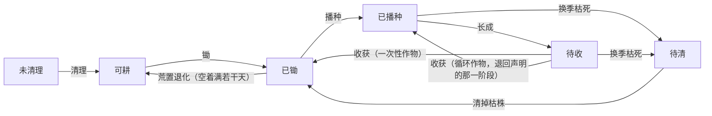

# 一格地会经历什么：一台状态机管开荒、种植与荒置

> **正典层级**：第 5 级（系统细化）。与[玩法正典](../canon/gameplay/玩法定位.md)冲突时以正典为准；**全部天数、产量与系数归[数值模型](./数值模型.md)，本页一个都不定。**
>
> 返回 [总索引](../README.md)｜[系统文档与提案索引](./README.md)｜相关：[时间与经营 · 生产](../canon/gameplay/时间与经营.md) · [`生产系统`](./生产系统.md) · [`建造系统`](./建造系统.md) · [`物品系统`](./物品系统.md) · [场景绘制约定](../production/场景绘制约定.md)｜台账：[`GP-87`](../spec/issues/README.md)

## 摘要

**这一页回答一个问题：基地上一格地从长着杂草到收上来一筐菜，中间经过哪些状态、每一步由谁触发。** 读完你能判断两件事 —— 这一格现在能不能种、能不能盖房，以及加一种新作物要填哪几个字段。

它是[`生产系统`](./生产系统.md)那张渠道表里**唯一一条带自己状态机的渠道**拆出来的那一半：开荒与种植共用同一台机器，所以它们合在一页，而不是各写一份。

**本页持有**：地块那台状态机、浇水那两个按天的量、作物定义那张字段表、一格要存什么。

**本页不持有**：收成怎么进仓库与谁去干（[`生产系统`](./生产系统.md)那条管道与那张指派表）、摆位怎么判（[`建造系统`](./建造系统.md)）、地面与作物怎么画（[场景绘制约定](../production/场景绘制约定.md)）、玩家怎么选中一格（[`界面系统`](./界面系统.md)）、全部数值（[数值模型](./数值模型.md)）。

最要紧的那条承诺：**不新建结算步骤、不新建网格、不新建容器。** 地块用的就是建造那套地面网格，产出一律走已有那条管道的入库环节。

## 术语

只列**只有本页在用**的词。跨页共用的在[术语表](../reference/术语表.md)，本节不重复（`地块`、`渠道`、`网格`、`品质`、`生活技能`、`读条` 都在那边）。

| 词 | 它在本页指什么 |
| --- | --- |
| **一茬** | 从播种或上一次收获算起、到下一次收获为止的那一段。浇水累计按一茬清零，循环收获的作物因此一季里有好几茬 |
| **荒置退化** | 已锄的空格连着若干天没有作物之后退回可耕。**有作物的那几格不计时** |

## 上游约束

- [时间与经营 · 生产](../canon/gameplay/时间与经营.md)：可耕地要先开荒、完整种植按季节与生长周期与浇水与收获、能锄哪几种天然地形、换季非本季作物枯死而另有跨季的、**跨季的不是粮食**、浇水只改产量不改品质。**这是本页全部内容的来源，本页只决定它们落成什么状态与什么字段。**
- [时间与经营 · 结算顺序（固定，不得改动）](../canon/gameplay/时间与经营.md)：季节更替判定排在作物生长与枯死结算之前，而那串步序**一步不增**。**约束本页把按天推进全部并进已有那一步，不许新开一步。**
- [玩法定位 · 开局](../canon/gameplay/玩法定位.md)：开局基地上已有一小块已开垦的种植区。**约束开局那几格的初始状态不是「未清理」。**
- [`建造系统` · 摆位判定：四条，不满足就当场拒绝](./建造系统.md)：未清理的格盖不了房，可耕地占地面格但不算建筑。**约束本页与建造共用同一套网格与同一份冲突判定，本页不另设耕地网格。**
- [`生产系统`](./生产系统.md)：六条渠道共用「产出 → 归属 → 付酬 → 入库」那条管道，开荒与种植各占渠道表一行。**本页只算到「收上来几件」，之后一律交给那一页。**
- [ADR-0018](../decisions/ADR-0018-内容定义按声明扩展.md)：内容定义按声明扩展，一张表、缺字段报错。**约束作物定义那张表的形状。**
- [ADR-0009](../decisions/ADR-0009-编辑器主导的开发模式.md)：参数唯一来源是场景与资源，代码不留能用的默认值。**约束缺字段时当场报错而不是悄悄兜底。**

## 结构

### 一格地的状态机

这张图回答一个问题：**一格地从哪个状态能走到哪个状态，靠什么动作。**

**重画条件**：增删一个状态、改一条流转的去向，或者某条流转开始带条件时重画。

**下面这张表是权威**，图放不下各状态自己的条件：

| 状态 | 它是什么 | 能盖房吗 | 能播种吗 |
| --- | --- | --- | --- |
| **未清理** | 上面有石头、树木或杂草 | 不能 | 不能 |
| **可耕** | 清干净了，还没锄 | 能 | **不能** |
| **已锄** | 锄过的地 | 能 | 能 |
| **已播种** | 作物在长，还没到成熟那一阶段 | 不能 | 已经种了 |
| **待收** | 到了成熟那一阶段 | 不能 | 已经种了 |
| **待清** | 枯株还在地里 | 不能 | 不能 |

各状态额外要写明的：

- **未清理**：清理产**初级材料**，是前期的一条材料来源；主角或被派工的学生都能清。**清理物的品质各有来源**（木头与石头读对应那项生活技能，杂草按来源给分布，见[`生产系统` · 六条渠道，只在四格上不同](./生产系统.md)）。摆位判定会把这一格一起拒掉（[`建造系统`](./建造系统.md)），所以**清理是这块地变得可用的唯一入口**，两页对它给同一个答案。
- **可耕**：它就是普通的可建造格。**播种要再锄一下**，理由见下面「锄是独立的一步」。
- **已锄**：空着满若干天**退回可耕**（天数归[数值模型](./数值模型.md)）。退化**不需要记「这格原来是什么」**：已耕地是叠在天然地形上的独立一层（[场景绘制约定 · 地面分几层，判据是「谁决定它在哪」](../production/场景绘制约定.md)），清掉这一层，底下那层自己就露出来了 —— 草地锄的退回草，裸土锄的退回裸土。
- **待清**：**清掉枯株才回到已锄**，而且**清理枯株不消耗精力**。它是一个状态而不是「立刻消失」，理由见下面「理由与取舍」。
- **清理物只在未开垦区域重生**，已经开垦过的格子不会再长东西出来。理由与「家畜不死只停产」是同一条：会「不照看就损失」的东西是在罚离家出征的玩家。重生速率归[数值模型](./数值模型.md)。
- **开局那一小块是已锄的**（[玩法定位 · 开局](../canon/gameplay/玩法定位.md)那句「一小块已开垦的种植区」），所以第一天既不必先开荒、也不必先锄。

### 锄是独立的一步，因为「能盖房」与「能种」不是同一件事

清理之后那一格是**可耕**，它就是普通的可建造格；再锄一下才是**已锄**，才能播种。

**不合成一步的理由是显示。** 已耕地是玩家单独操作的对象，它有自己那套贴图（[场景绘制约定 · 四边拼接：也是 16 张，但边界落在格边线](../production/场景绘制约定.md)）。合成一步的话，玩家清出一片地就得到一片犁开的土，然后把房子盖在犁沟上 —— 而他那时还没决定要不要种地。

**能锄哪几种天然地形在正典**（[时间与经营 · 生产](../canon/gameplay/时间与经营.md)），本页不复述那份清单。

### 浇水按天记，只改产量不改品质

**每格两个量**：今天浇过没有，以及这一茬累计浇过几天。**浇水当场就把累计加 1**，所以每日结算只需清掉当天那个标记 —— 它排在那一步的哪个位置都不影响结果。

- **产量系数按「这一茬浇过的天数 ÷ 这一茬实际经过的天数」算。** 第一茬从播种算起，之后每茬从上次收获算起。**下限必须大于零** —— 一次没浇也不能颗粒无收，理由与「家畜不死只停产」同一条。系数的形式与上下限归[数值模型](./数值模型.md)。
- **收成是整数件**：系数算完取整，且**至少 1 件**。与伤害那条「任何攻击都造成至少 1 点」同形 —— 玩家看到的不能是「收了 5.4 颗」，也不能是「收了 0 颗」。
- **只改产量，不改品质。** 品质读种植这项生活技能（[`生产系统`](./生产系统.md)那张渠道表那一格），再让浇水管品质，同一件事就有两个来源了。
- **湿的表现每天早上回到干。** 那是干湿两套贴图的切换时机；两套怎么画见[场景绘制约定 · 耕地要干与湿两套](../production/场景绘制约定.md)，本页不碰画法。
- **降雨类那天，这一格按浇过算。** 本页读[`天气系统`](./天气系统.md)那一位「今天算不算降雨类」，在按天推进与浇水动作两处各读一次：那一天累计照常加一天，而玩家再浇一次**被拒**且不重复计数。**取「算满」而不是算一半**：下着雨还要拎桶浇一遍，玩家会当成缺陷而不是设计；而算一半要多一个系数，却换不到任何决策。**淹不淹得死作物是另一件事**，本页不做 —— 那要走事件那条既有路。

### 作物定义：一张表，缺字段报错

| 字段 | 是什么 | 缺了或填错会怎样 |
| --- | --- | --- |
| 前四个阶段各几天 | 种子 → 出苗 → 幼株 → 成株，**各至少 1 天**。**成熟不带天数** —— 它是终态，到了就一直待收 | 缺了报错；项数不对或任一项小于 1 天被拒 |
| 收获后回到哪个阶段 | 空＝一次性，收完回已锄；填阶段号＝**循环收获**，退回那一阶段再长 | 缺了报错 —— 空也要显式写出来；**填成熟那一阶段被拒**（退回去立刻又待收，等于无限收获） |
| 属于哪几个季节 | 一个或多个 | 缺了报错；空列表被拒 |
| 产出什么物品 | 指一个物品定义（[`物品系统`](./物品系统.md)） | 缺了报错 |
| 六张素材 | 五个阶段各一张，加一张枯死。**这一行落在引擎层** —— 作者在 Godot 里配，与角色逐帧素材同一个分工（[ADR-0009](../decisions/ADR-0009-编辑器主导的开发模式.md)） | 缺哪张报错说清缺哪张 |

**「阶段有五个、天数只有四项」不是漏了一项。** 给成熟也留一个天数会多出一个**没有任何东西读它**的字段，而那种字段填错了不报错。

- **可收＝到了成熟那一阶段**，代码只有这一个判断。怎么让玩家看出来在[`界面系统`](./界面系统.md)与[场景绘制约定 · 作物按阶段交付，一种六张](../production/场景绘制约定.md)，本页不管表现。
- **再生间隔不另给一个数。** 退回某一阶段之后照那一阶段原本声明的天数往前走，而那一格的定义本来就是「从这一阶段到下一阶段要几天」。第二茬要与第一茬不同速时才加字段，现在不加。
- **枯死判定只有一句**：换季那天，**新季节不在这个作物的季节列表里就枯死**。一条规则覆盖单季、跨季与全年，所以本页**没有「是不是跨季」那种开关** —— 跨季就是列表里有多个。正典那句「另有少数标记为跨季的作物」由它兑现。
- **跨季的不能是粮食**（[时间与经营 · 生产](../canon/gameplay/时间与经营.md)）。**这条将来判得到**：等物品类别里有粮食那一类，「声明了多个季节 ＋ 产出粮食」就在载入时被拒。现在只能当纪律，因为那一类还不存在。
- **最短生长周期因此是四天**（要计时的四个阶段各至少一天）。这是阶段数换来的代价，写明免得被当成漏了：想做更快的速生作物就要砍一个阶段，那要连着改素材交付那一条。

### 一格要存什么

状态、作物标识、当前在第几阶段、这一阶段已过几天、今天浇过没有、这一茬累计浇过几天、空置了几天。

**地块状态进正式存档**，与背包、失衡值同档（跨日、非帧级）。

**存「当前阶段 ＋ 这一阶段已过几天」而不是「从播种起过了几天」**：后者在循环收获退回中间某一阶段时要反算一次，而那次反算算错了没有任何东西查得出来。

### 按天推进全部并进已有那一步

生长推进、枯死判定、荒置计时与当天那个浇水标记的清除，**都在[结算顺序（固定，不得改动）](../canon/gameplay/时间与经营.md)里「作物生长与枯死结算」那一步之内**。

**不新增步骤**：那串步序一步不增是正典的硬约束，而这几件事都是「地块上的东西按天推进」，属同一步的内部工作。**季节更替判定仍然排在它之前**（原句在正典那一节），所以换季那天的作物不会先白长一天再枯死。

## 接口

**产出与效果分别落在哪个已有系统：**

| 本页算出来的东西 | 交给谁 | 到那边变成什么 |
| --- | --- | --- |
| 收成的件数 | [`生产系统`](./生产系统.md)那条管道的「产出」环节 | 归属 → 付酬 → 入库，本页不碰这三手 |
| 收成的品质 | 读[`成长系统`](./成长系统.md)的种植生活技能 | 本页不自己算品质 |
| 清理物 | 同上那条管道 | 木头石头读各自技能，杂草按来源给分布 |
| 一格现在能做什么 | [`界面系统`](./界面系统.md)当前操作格那一侧 | 框的颜色与能不能按下去 |
| 一格现在的状态 | 显示层（地形渲染，见[台账](../spec/issues/README.md) `GP-86`） | 选哪一张贴图、干的还是湿的 |
| 「缺水」标记 | 将来的灌溉设备（[`生产系统`](./生产系统.md)的设备那一节） | 设备读它决定浇哪几格 |

**挂载点到此为止。** 下次要加东西时先问「它挂在这几个里的哪一个」，不许顺手插一个新钩子 —— 尤其是**不许新增每日结算步骤**，按天的事一律并进上面那一步。

## 边界与非目标

- **不做画法。** 地面 16 张怎么拼、干湿两套怎么换色、作物六张怎么画全在[场景绘制约定](../production/场景绘制约定.md)，本页一笔不定。
- **不做数值。** 荒置天数、浇水系数的上下限、各作物的阶段天数与产量都归[数值模型](./数值模型.md)。
- **不做自动化灌溉本身。** 本页只留「缺水」这一个标记当接点，设备怎么工作在[`生产系统`](./生产系统.md)。
- **「下雨算不算自动浇水」已经答了**：算，而且算满，规则在上面「浇水按天记，只改产量不改品质」那一节。**本页只读[`天气系统`](./天气系统.md)那一位「今天算不算降雨类」，不反过来写它。**
- **不做玩家怎么选中一格。** 当前操作格是输入与界面的事（[`界面系统`](./界面系统.md)）。
- **不碰所属权。** 产出归谁在正典与[`生产系统`](./生产系统.md)，本页只交件数。
- **不做畜牧、钓鱼、加工、烹饪。** 那四条没有自己的状态机，留在[`生产系统`](./生产系统.md)当一节。

**同名不同物，本页点出来一对**：「清理」有两处 —— **未清理**格那次清理**产初级材料**、算开荒渠道的产出；**待清**格那次清掉枯株**不产任何材料、也不耗精力**。两者都叫清理是因为玩家做的动作一样，但它们在管道里的位置不同，混成一件事会让枯株变成一条免费材料来源。

## 理由与取舍

- **没选把锄合进清理。** 合了之后可耕格就得显示成犁开的土，而那一格同时是普通可建造格 —— 玩家会把房子盖在犁沟上。
- **没选让枯株自动消失。** 换季结算在睡后跑完，自动清掉的话那张枯死素材玩家一次也看不到，而且他说不出自己损失了什么。代价是多一个状态，换到的是「看得见的损失」。
- **没选让清理枯株收精力。** 枯死本身已经是惩罚，再收一笔就是罚两次，而清一整片地的操作量已经是代价了。
- **没选让浇水影响品质。** 品质的来源已经定在种植那项生活技能上，再开一条就有两个来源，而两个来源迟早会不一致。
- **没选给再生间隔单独一个数。** 退回的那一阶段自己就带着天数，而那个数的含义正是「长到下一阶段要几天」。多一个字段就多一处要对账的地方。
- **没选「是不是跨季」这个布尔。** 改成季节列表之后，单季、跨季与全年是同一条规则的三种填法，枯死判定只剩一句；留布尔就要为「四季都能种」再开一个分支。
- **没选记「这格原来是什么」。** 已耕地是独立叠加层，天然地形那一层从来没被删掉，所以退化就是清掉上面那层。多存一个字段等于给同一个事实开第二个家。
- **没选按「从播种起过了几天」存。** 循环收获退回中间阶段时它要反算，而反算错了不报错、只表现为「这一茬长得不对」。

## 验收

**可自动验证项：**

- 状态机每条流转各一条用例；**「可耕格不能播种」与「未清理格既不能种也不能盖」各一条拒绝路径**。
- 作物定义缺任一字段、任一阶段小于 1 天、季节列表为空，都在载入时被拒且说清缺哪一项。
- **收获后退回成熟那一阶段的作物定义被拒** —— 退回去立刻又是待收，一次收获就能无限收下去。
- 六张素材缺任一张时报错说清缺哪张（[ADR-0021](../decisions/ADR-0021-每个朝向各画一套不做水平翻转.md) 那条「缺一向报错」的同形做法，作物没有朝向、按阶段判）。**这一条判在引擎层**，规则层看不见素材路径 —— 所以它不在规则层那批用例里，写在这里是为了让它有个家。
- **收成件数是整数且至少 1 件** —— 把浇水天数设成 0 也要收得到东西。这条是承重项：它挡的是「出征十天回来颗粒无收」。
- **循环收获退回声明的那一阶段，且浇水累计清零** —— 第二茬不继承第一茬的浇水记录。
- **荒置计时只对空格走** —— 有作物的格连着放多少天都不退化。
- 换季那天，季节列表里有新季节的不枯死、没有的枯死。
- **不新增结算步骤**：那串步序的长度与顺序有测试盯着，本页的按天推进全在已有那一步之内。

**必须实机确认项**（按 [ADR-0009](../decisions/ADR-0009-编辑器主导的开发模式.md) 由作者实机看，本页不判）：

- 一格锄过没锄过、浇过没浇过，站在田边扫一眼分不分得出来。
- 成熟那一阶段与前一阶段在实际尺寸下分不分得出来（关掉颜色也要成立）。
- 荒置天数那个值合不合适 —— 太短会罚出征，太长则荒置这条规则形同虚设。

**完成边界**：状态机每条流转都有用例、作物定义的拒绝路径全在、按天推进并进已有那一步且步序未变。做到这三样，这一页就可以拿去支撑实现 —— 表现那一半永远归作者实机看。

## 下游同步

- **代码落点**：状态机与作物定义已落在代码仓 `rules/Economy/`（规则层，不引用 Godot），**那条「行为字段归规则层、素材归引擎层」的分线记在代码仓 `ARCHITECTURE.md`**，本页不复述。按天推进要接进每日结算那一步；作物内容本身走外置数据，与其余内容类型同一模式（[台账](../spec/issues/README.md) `ENG-5`）。**当前操作格与显示层在引擎层**，各归自己的编号。
- **数值归属**：荒置退化天数、浇水产量系数的上下限、各作物的阶段天数与产量都登记在[数值模型](./数值模型.md)的尚未给值表。
- **台账编号**：[`GP-87`](../spec/issues/README.md)。落地卡在俯视场景本体（`ENG-21`）的只有当前操作格与显示层那两侧，**状态机与作物定义是纯规则层、不依赖场景，可以先做**。
- **该上升进正典的**：暂时一条都没有。字段与状态按定义不进正典，而这一轮新定的玩法事实（能锄哪几种地形、浇水只改产量、荒置会退化、有循环收获的作物）已经直接写进[时间与经营 · 生产](../canon/gameplay/时间与经营.md)，不从本页上升。
