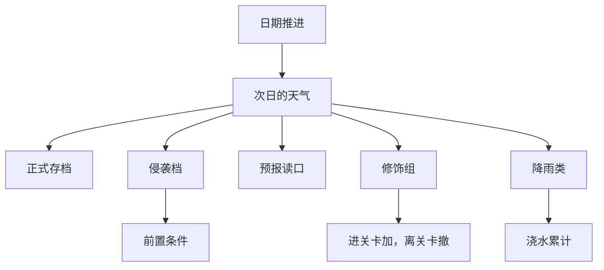

# 一天一种天气：它改的是划算不划算，不是能不能做

> **正典层级**：第 5 级（系统细化）。与[时间与经营](../canon/gameplay/时间与经营.md)冲突时以正典为准；**各天气的出现权重、各修饰的幅度、侵袭档的削减率全归[数值模型](./数值模型.md)，本页一个都不定。**
>
> 返回 [总索引](../README.md)｜[系统文档与提案索引](./README.md)｜相关：[时间与经营 · 作息与熬夜](../canon/gameplay/时间与经营.md) · [世界观 · 穹盾](../canon/world/世界观.md) · [`地块系统`](./地块系统.md) · [`事件系统`](./事件系统.md) · [`成长系统`](./成长系统.md) · [`状态效果系统`](./状态效果系统.md)｜台账：[`GP-93`](../spec/issues/README.md)

## 摘要

**天气是每一天头上的一个标签。** 它不改变玩家今天能做什么 —— 出征、派工、下地都照常 —— 只改变做完之后拿到多少、以及打起来顺不顺。读完这一页你该能判断两件事：加一种天气要填哪几格，以及一个新的读者该从哪里读它。

本页持有：一天只有一种天气这件事的形状、次日那一种在哪一步定下来、它存在哪、每种天气声明的那一组修饰、当天的侵袭档、预报那一个读口的两档，以及天气与事件、地块、关卡三处的接缝。

**它不持有**这些，各有自己的家：

- 恶劣天气有哪几种、各叫什么 —— 起步那几个在正典（[时间与经营 · 作息与熬夜](../canon/gameplay/时间与经营.md)），运行期在册的由外置数据给出，**本页不复述那几个名字**。「加一种」不经过本页：它是填一条声明，不是改本页的判定（[ADR-0025](../decisions/ADR-0025-取值集的家由加一个的代价决定.md)）。
- 任何数值 —— [数值模型](./数值模型.md)。
- 修饰怎么作用在角色身上 —— [`状态效果系统`](./状态效果系统.md)那份载体。
- 一格地的浇水怎么记 —— [`地块系统`](./地块系统.md)。
- 天气事件写什么、抽中的可能性多大 —— [`事件系统`](./事件系统.md)与内容。
- 雨怎么画、风怎么响 —— 作者在编辑器里做。

**最要紧的那几条承诺**：不新建状态载体、不新开事件钩子、不新增每日结算的步骤，而且**不新增任何战斗量** —— 天气的修饰只许引用[`成长系统`](./成长系统.md)派生表里已经有的量。

## 术语

只列**只有本页在用**的词。跨页共用的在[术语表](../reference/术语表.md)，本节不重复。

| 词 | 它在本页指什么 |
| --- | --- |
| **侵袭档** | 当天这种天气有多凶的那一档。穹盾的天气保护改造降的就是它 |
| **修饰组** | 一种天气声明的那一组修饰，进关卡时整批施加、离关卡时整批撤掉 |
| **降雨类** | 会把地浇上水的那几种天气的统称。哪几种算，由每种天气自己声明 |
| **预报读口** | 回答「明天是什么天气」的那一个读口，它有粗细两档 |

## 上游约束

- [时间与经营 · 作息与熬夜](../canon/gameplay/时间与经营.md)：恶劣天气有哪几种；学生的完整日程按季节、日期与天气三维排布，缺天气就少一维；恶劣天气不拒绝任何玩家动作，而它给的修饰敌我一视同仁。**这是本页存在的理由，也是起步那几个名字的出处 —— 本页不复述它们。** 那一格按 [ADR-0025](../decisions/ADR-0025-取值集的家由加一个的代价决定.md) 归内容，所以加一种是填一条声明、不是改本页的判定；本页约束的只是它必须填得出哪几格。
- [时间与经营 · 时间](../canon/gameplay/时间与经营.md)：时间单位只有天、季、年三级，不引入「月」；季节只影响种植与采集产出、野外敌人构成、剧情节点与节日。**前半句约束天气的粒度是一天一种；后半句约束天气与季节是两个量，不合并成一个字段。**
- [时间与经营 · 结算顺序（固定，不得改动）](../canon/gameplay/时间与经营.md)：那串步序一步不许增减。**约束「次日是什么天气」只能并进已有的某一步，本页不为自己开一步。**
- [世界观 · 穹盾](../canon/world/世界观.md)：天气保护改造大幅改良护罩本体，恶劣天气的侵袭被显著削减。**约束本页必须持有一个「被削减的东西」，那就是侵袭档 —— 没有它，那项改造说不出效果。**
- [玩法定位 · 随机事件：事件可以晚做，扩展点现在就留](../canon/gameplay/玩法定位.md)：触发钩子的位置已经定死那几处，事件只在那些点上被询问。**约束天气不新开钩子，它只进事件的前置条件。**
- [战斗与关卡 · 异常状态](../canon/gameplay/战斗与关卡.md)：抗性按状态各一份、不按元素也不按伤害类型，所以没有「火抗」这一层。**约束「雨天不容易被点着」写成那条状态的抗性，而不是一层元素抗性。**
- [`成长系统` · 派生表：基底与来源分两栏](./成长系统.md)：那张表是战斗侧读角色数据的唯一入口。**约束修饰组只许引用表里已有的量，而且它落在「来源」那一栏、不碰基底。**
- [`状态效果系统`](./状态效果系统.md)：载体的字段含来源，修饰一律落已有载体。**约束本页不新建载体，也不新造一种时长单位。**
- [`装备系统`](./装备系统.md)：装上时加项并打来源标签，卸下时按来源整批撤。**约束进关卡加、离关卡撤走的是同一条既有路径 —— 按效果种类撤会撤错别人的，而那种错不报错。**
- [`战斗AI系统`](./战斗AI系统.md)：不给敌人开专用通道，面板与管道都是同一套。**约束修饰组敌我一视同仁。**
- [`活跃失衡系统` · 三个新读口带来一个正反馈，刹车必须先在](./活跃失衡系统.md)：它没有按天到期的项、也没有自然漂移，所以每日结算里不占一步。**约束天气不直接改失衡 —— 一个每天变的量去推一条不按天推进的长期线，是结构冲突。**
- [`存档系统` · 进哪一侧：判据一句话](./存档系统.md)：跨过一次睡眠还成立的进正式存档。**约束天气进正式存档。**
- [`事件系统` · 钩子在正典点名的那几处，只被询问、不轮询](./事件系统.md)：一条事件是「钩子 ＋ 前置 ＋ 权重 ＋ 冷却 ＋ 一组后果调用」，权重按活跃失衡档位偏移。**约束侵袭档进的是前置条件那一格，不是权重那一格 —— 权重机制一个字不改。**
- [`数值模型` · 尚未给值的量，各自写明校准办法](./数值模型.md)：值的唯一来源是参数表。**约束本页只写量纲与约束形式。**
- [ADR-0009](../decisions/ADR-0009-编辑器主导的开发模式.md)：参数唯一来源是场景与资源，代码不留能用的默认值。**约束某种天气缺修饰组声明时载入当场报错，不许按无修饰兜底。**

## 结构

下面这张图回答一个问题：**一天的天气从定下来到被读走，中间经过哪几处。** 图上每一条箭头都是「谁读它」，**没有一条是「它写别人的账」** —— 那正是本页能不新增结算步骤、不新开钩子的结构前提。

**重画条件**：天气多出一个读者、定它的时点从日期推进那一步挪走，或者侵袭档不再由穹盾那项改造决定时重画。

**这张图不新增任何事实**，权威是下面各节。每一格具体声明什么、修饰组为什么只许引用派生表里的量，图都放不下。

### 一天只有一种天气，而且必须有一个默认态

- **一天一种，一天之内不变。** 时间单位只有天、季、年三级，学生日程那一维也是按天排的；一天之内还会变的话，就要为它引入比天更细的单位，而正典排掉了那件事。
- **取值是默认态加恶劣天气那几种。** 起步那几个在正典，本页不复述；**那一格归内容**（[ADR-0025](../decisions/ADR-0025-取值集的家由加一个的代价决定.md)），所以运行期在册的由外置数据给出，而**一种不在册的天气进不了任何读口** —— 载入时被拒并说清它不在册。
- **默认态是一个取值，不是「没有天气」。** 没有它就写不出「今天没事」—— 而「没事」是绝大多数日子的状态，它必须有名字才进得了预报、进得了事件前置、也才画得出来。本页叫它**晴**；**它的显示名走文本键**（文本外置那条既有路径），所以改叫别的不用动结构。
- **全世界同一天只有一种。** 基地、城区、出征地共享那一种，**不按场景各存一份**。理由是穹盾：它罩着整片避难所，「改造之后天气好了」只有在天气是一个全局量时才说得清；出征地要有自己的环境差异，那是片段自己声明的事，不是再开一份天气。

### 次日那一种并进「日期推进」那一步，不新开步骤

- **它并进[结算顺序（固定，不得改动）](../canon/gameplay/时间与经营.md)里「日期推进，可能翻季或翻年」那一步**，按步名引用、不按序号。
- **理由是天气是那一天的一个属性**，与日期同时成立。放到后面任何一步，都会出现「这一天已经开始了，但还不知道它的天气」那个空窗 —— 而那一步之后就有东西要读它了。
- **怎么抽由内容与参数决定**：每种天气声明它在各季节的出现权重，值归[数值模型](./数值模型.md)。本页只要求「抽出来的结果恰好一种」。

### 节日那天不抽，取默认态

- **那一天不抽，直接取默认态。** 它是抽之前的一道判断，**抽法本身一个字不改** —— 权重、各季节的声明与「抽出来恰好一种」都照旧。
- **方向是本页读[`节日系统`](./节日系统.md)** 那个「今天是哪个节日」的读口；节日那一侧不写本页的账。
- **理由**：节日一年一次，被一场雨整个盖掉玩家会记很久。而这条**一律成立、不按节日各给一位** —— 否则玩家要记「哪个节日会下雨」，而那条记忆不带来任何决策。
- **连带后果两处**：节日那天永远不算降雨类，所以那天的地要自己浇；默认态的侵袭档是最低那一档，所以那天不会冒出天气那一类坏事。
- **它不是例外，是输入。** 判据写清：本页仍然只回答「今天是哪一种」，而「今天要不要抽」由别人那一格给。

### 一种天气要声明这些

| 声明项 | 说明 | 缺了怎么办 |
| --- | --- | --- |
| 标识 | 跨存档稳定的那个名字 | **载入报错** |
| 显示名的文本键 | 玩家看到的那几个字走文本表 | **载入报错** |
| 各季节的出现权重 | 它在每个季节被抽中的相对可能性，可以为零（表示那一季不出现） | **载入报错** |
| 算不算恶劣 | 一位。默认态不算，其余算 | **载入报错** |
| 侵袭档 | 它凶到哪一档；默认态填最低那一档。**三档：无扰 → 侵扰 → 肆虐**，家就是这一行 | **载入报错**；填一个不在这三档里的同样被拒 |
| 算不算降雨类 | 一位。地块读的就是它 | **载入报错** |
| 修饰组 | 一组「改派生表里哪个量、往哪个方向」的声明，可以是空组 | **载入报错**（空是显式的空，不是没写） |

**这张表是开口的**：加一种天气是填这几格，不是改判定。**但修饰组那一格不许扩** —— 它引用的量必须已经在派生表里。

**为什么缺一格就报错而不是兜底**：参数唯一来源是场景与资源，代码不留能用的默认值（`ADR-0009`）。一种天气悄悄按「无修饰」跑起来，表现是「这天气好像没效果」，而玩家和作者都分不清那是设计还是漏配。

### 修饰组只许引用派生表里已有的量

- **每种天气声明一组修饰，敌我一视同仁。** 场内全部角色吃同一份，包括敌人 —— 与「不给敌人开专用通道」同源。
- **只许引用[`成长系统` · 派生表：基底与来源分两栏](./成长系统.md)里已经有的量**（两份攻、两份防、各条状态的抗性、暴击、韧性上限、移速这一批）。**这是本页最要紧的一条边界**：允许天气声明一个新量，天气就成了往战斗里塞新轴的后门 —— 而那种后门每加一种天气就可能再开一次，最后没人说得清一个角色的输出由多少个来源决定。
- **落在「来源」那一栏，不碰基底。** 基底由属性给，而天气不是属性。
- **「雨天不容易被点着」写成那条状态的抗性**，不是一层元素抗性 —— 全作没有火抗这一层（[战斗与关卡 · 异常状态](../canon/gameplay/战斗与关卡.md)）。同理，「风沙里走不动」写成**移动速度**那个量，不是一个新的「阻力」。
- **视野不在那张表里，所以天气改不了它。** 它是视野组件上按角色填的声明字段（[`感知与视野系统` · 视野组件要声明什么](./感知与视野系统.md)），不是派生量。要让天气动它，得先把它做成一个派生量 —— 而那正是上面那条边界要挡的「给战斗加一条新的可修饰轴」。**这一条显式写出来**，否则「风沙那天看得更近」会被当成本页漏做。
- **它可以是空组。** 默认态通常就是空组，而空组要显式写出来。

### 进关卡加，离关卡撤

- **进入关卡时按来源整批施加，离开时按来源整批撤掉**，走[`装备系统`](./装备系统.md)那条既有路径，**不新建载体**。
- **来源标签是天气**，所以撤的时候不会撤错宝物或状态给的那些项 —— 按效果种类撤会撤错别人的，而那种错不报错。
- **本页不实现任何修饰**：它只声明「这一组是哪几项」，加与撤都是载体那一侧的既有入口。
- **俯视那一侧同样吃**：基地与城区里的角色也在同一天的天气下，所以那一组修饰不是关卡专属。关卡只是它最看得出来的地方。

### 侵袭档：穹盾改造降的就是它

- **三档：无扰 → 侵扰 → 肆虐，而它们的家是本页**（上面那张声明表那一行）。**档数是接口常量**，不是数值 —— 事件的前置条件按它分，所以改档数要连带改那几条事件。
- **为什么是三档**：穹盾那项改造压一档要看得出差别 —— 两档的话压完就直接到底，那项改造变成一个开关；更多档玩家分辨不出来，**而他本来也看不见档名**（他看见的是手环预报那两档，加「今天出没出坏事」）。
- **为什么档名不进正典**：境况档进正典的理由是商店、事件与气泡三套内容都按它分，玩家感知得到；**侵袭档玩家一辈子看不到名字**，给它占正典一行换不来任何东西。**但那条「档名不与别的档位阶梯重合」照旧管着它** —— 这三个词与现有那几套（境况、关系、技艺、生活技能、品质、委托、心情）一个都不撞，防撞靠词义分层：这一套量的是「外头闹得多厉害」。
- **当天的侵袭档由当天那种天气声明的那一档给**，穹盾的天气保护改造建成之后把它往下压。削减幅度归[数值模型](./数值模型.md)。
- **它进的是事件的前置条件，不是权重。** 天气事件在自己的前置条件里写「侵袭档至少到某一档」，档压下来之后那几条就不满足，于是它们实质上不再发生 —— 而[`事件系统`](./事件系统.md)那条「权重按活跃失衡档位偏移」**一个字不改**。
- **为什么不走权重**：权重那一格已经有一个来源（失衡档位），再挂一个就要回答「两个偏移怎么合」，而那个问题没有必要存在。前置条件本来就是一组「必须成立」的判断，多一条不改变它的形状。
- **它不是伤害，也不是失衡。** 侵袭档只影响「今天会不会出坏事」与那些事有多重，**不直接扣任何人的血、也不动活跃失衡总量**。

### 天气不拒绝任何玩家动作

- **出征、派工、下地、建造都照常。** 恶劣天气改的是产出与风险，不是许可。
- **理由**：被阻塞是很讨人厌的一种拒绝，正典在出征那一条上立过同形的立场（不做「时间不够就不让接」）。而且「今天不能出门」在一个以天为单位的游戏里等于「今天没得玩」。
- **代价写明**：天气的存在感因此全靠修饰与产出差异撑，**所以那些幅度不能给得太小** —— 小到感觉不出来，这套东西就只是一个天上的贴图。那是给值那一轮要盯的事，约束形式登记在[数值模型](./数值模型.md)。

### 降雨类那天，地算浇过

- **降雨类那天，那一格的浇水按浇过算**；玩家在那一天再浇一次被拒，且不重复计数。
- **落点在[`地块系统`](./地块系统.md)那一页**：它读本页那一位「今天算不算降雨类」，在按天推进与浇水动作两处各读一次。**本页不写地块的账。**
- **为什么算满而不是算一半**：下着雨还要拎桶浇一遍，玩家会当成缺陷而不是设计；而「算一半」要多一个系数，却换不到任何决策。
- **它顺带给恶劣天气一个混合面**：那几种天气不全是罚，玩家会为「这几天有雨」调整安排。**淹不淹得死作物是另一件事**，本页不定 —— 要做的话它是修饰组之外的一条后果，走事件那条既有路。

### 预报是一个读口两档，不是两个读口

- **一个读口，粗细两档**：
  - **粗档**：回答「明天是好天还是坏天」。**这一位永远是准的。**
  - **细档**：额外回答「明天具体是哪一种」。
- **细档由基地里那台灵分析设备开**：装了就有，**没有级别这回事**（设备的声明项里没有级数，见[`生产系统` · 设备：它买的是自动化，不是便宜](./生产系统.md)）。
- **那台设备不进生产那张渠道表**：表里的设备是产出执行体，而它不产出任何物品 —— 它占室内格子、不占派工位，但不走那条产出管道。
- **为什么粗档必须准**：粗档的用处就是「明天别排户外活」。做成「可能变差」这类模糊话，它与不知道没有区别，而那一档就只是噪音；准的一位加上「看不出是哪一种」，两档才各有各的决策。
- **为什么不做两个读口**：两个读口就要回答「装了设备之后粗的那个还在不在」，而调用方会挑一个用 —— 于是界面上出现两种说法。一个读口按能力返回粗或细，调用方只有一处要改。

### 天气进正式存档，存的是结果

- **当天与次日那两种都进正式存档**（跨过一次睡眠还成立，判据在[`存档系统` · 进哪一侧：判据一句话](./存档系统.md)）。
- **存结果，不存随机种子。** 抽法将来若改，旧存档里那个「明天下雨」仍然成立；存种子的话同一个档在新版本里会抽出另一种天气，而玩家昨晚已经按预报安排好了今天。
- **侵袭档不单独存**：它由天气与穹盾的状态算得出来，两者都已经在存档里。**算得出来的不存**，否则就有两份可能对不上的事实。

## 接口

### 它从哪来、谁读它

| 方向 | 接谁 | 接什么 |
| --- | --- | --- |
| 入 | [结算顺序（固定，不得改动）](../canon/gameplay/时间与经营.md)的「日期推进，可能翻季或翻年」那一步 | 在那一步里定下次日的天气，**不新增步骤** |
| 入 | [`主线推进系统`](./主线推进系统.md) | 穹盾那项改造建成没有，本页据此压侵袭档；**没建成时读作未建成** |
| 出 | [`状态效果系统`](./状态效果系统.md)那份载体 | 进关卡加、离关卡按来源整批撤那一组修饰 |
| 入 | [`节日系统`](./节日系统.md) | 本页读「今天是哪个节日」；是节日就不抽、取默认态 |
| 读 | [`地块系统`](./地块系统.md) | 它读「今天算不算降雨类」这一位 |
| 读 | [`事件系统`](./事件系统.md) | 天气事件的前置条件读当天的天气与侵袭档；**本页不改它的权重** |
| 读 | [`界面系统`](./界面系统.md) | 预报那一个读口，粗细两档 |
| 读 | 将来的学生日程 | 正典点名的那第三维；**本页只保证这一格现在就在**，那一侧仍然后置 |
| 存档 | [`存档系统`](./存档系统.md) | 当天与次日那两种天气 |
| 作者填 | 内容数据 | 上面那张声明表，**缺了载入报错** |
| 作者做 | 编辑器 | 雨雪风沙的画面与音效 |

**挂载点到此为止。** 下次加一样与天气有关的东西时，先问「它挂在上面哪一格」，而不是顺手插一个新钩子或新开一步。**这条已经用过一次**：侵袭档要影响坏事发生的频率，按这条它挂进事件的前置条件，而不是给事件的权重再开一个来源。

### 它不碰的那几条接缝

- **不碰活跃失衡的总量**：改它只能作为境况事件的一条后果，走[`活跃失衡系统`](./活跃失衡系统.md)那个既有入口。
- **不碰季节**：季节影响哪几处是正典定的，天气不在其内，两者各是一个字段。
- **不碰关卡片段的环境声明**：出征地的地形与遮挡是片段自己的事（[`关卡系统`](./关卡系统.md)），天气只往场内加一组修饰。
- **不碰手环那一页的排版**：预报怎么摆归[`界面系统`](./界面系统.md)与作者。

## 边界与非目标

- **不做节日。** 它与天气只有「都挂在时间上」这一个共同点，形状不一样：节日挂日期，天气挂概率。它的结构在[`节日系统`](./节日系统.md)，两者逐项的差别在那一页那张对照表、本页不复述。
- **不做一天之内的天气变化。** 粒度是一天一种，理由在结构那一节。
- **不做按地点分的天气。** 全世界共享那一种。
- **不定任何数值**：出现权重、修饰幅度、侵袭档的削减率全归[数值模型](./数值模型.md)。**接口常量不是数值** —— 预报的档数是接口常量，家在本页。**而「恶劣天气有哪几种」不是接口常量，它是内容**（[ADR-0025](../decisions/ADR-0025-取值集的家由加一个的代价决定.md)）：起步那几个在正典，运行期在册的由外置数据给出。
- **不定内容**：有哪些天气条目、各自配哪一组修饰，属内容，走[内容外置](../canon/gameplay/玩法定位.md)。
- **不新增战斗量**：修饰组只许引用派生表里已有的量。
- **不新开事件钩子**：侵袭档进前置条件，位置由正典定死。
- **不新增每日结算的步骤**：并进「日期推进，可能翻季或翻年」那一步。
- **不直接改活跃失衡**：只允许境况事件间接推。
- **不实现任何修饰**：本页只声明那一组是哪几项。
- **不做天气造成的直接伤害**：恶劣天气不掉血。掉血要走伤害那条既有线，而「天上掉下来的伤害」玩家躲不掉、也读不出原因。
- **不做学生日程 AI**：天气这一维就位之后它才有输入，但那一侧仍然后置。
- **同名不同物，两处都要写全名**：**「侵袭」在本作有两处** —— 本页的侵袭档说的是天气有多凶，而[世界观 · 穹盾](../canon/world/世界观.md)里「挡的是风沙、魔化生物与外域的灵场异常」那一句里的侵袭同时包含魔化生物那一支，那一支不归本页。

## 理由与取舍

- **没选让恶劣天气拦住玩家的动作。** 拦一项天气的存在感就立刻很强，代价是「今天不能玩」进了规则；而正典在出征那一条上已经排掉了同形的做法。改产出与风险之后决策还在（今天做室内活更值），选择没被夺走。
- **没选让天气声明自己的新量。** 一个「能见度」或一个「湿滑度」写起来最直接，但那等于每加一种天气都可能往战斗里加一条轴，而玩家面板上迟早出现说不清来源的数字。只许引用派生表里已有的量之后，天气能表达的东西少了一点，而「一个量只有一个家」保住了。
- **没选给天气新建一个状态载体。** 新建最省事，代价是同一个角色身上会有两处修饰来源，而撤销时序一旦不同就会留下撤不掉的项。复用装备那条来源标签路径之后，撤销逻辑一行都不用新写。
- **没选让侵袭档进事件的权重。** 权重那一格已经有失衡档位这一个来源，再挂一个就要定「两个偏移怎么合」；而前置条件本来就是一组判断，多一条不改变它的形状。**代价写明**：档位变化对频率的影响因此是阶梯式的，不是连续的 —— 那反而更容易被玩家读出来。
- **没选按场景各存一份天气。** 出征地在外域、灵场本来就不一样，分开写更「真」。但穹盾罩着整片避难所，「改造之后天气好了」只有在天气是全局量时才说得清；而出征地的差异已经有片段声明这个更合适的载体。
- **没选把天气与季节合成一个字段。** 合起来少一个量，但正典写明季节只影响那几处、而天气不在其内 —— 合并之后「换季」与「变天」会共用一套判定，那两件事的周期完全不同。
- **没选存随机种子。** 存种子体积更小，代价是抽法一改，旧存档里昨晚那份预报就变成另一种天气 —— 而玩家已经照它安排了今天。
- **没选把预报做成两个读口。** 两个读口要回答「装了设备之后粗的那个还在不在」，而调用方会各挑一个用；一个读口按能力返回粗或细，界面只有一处要改。
- **没选让天气直接造成伤害。** 那是最直观的「恶劣」表达，但躲不掉的伤害读不出原因，而且它会绕过伤害那条既有结算线。
- **没选为了「风沙那天看得更近」给视野开一条可修饰的路。** 那要同时动三处：给[`成长系统`](./成长系统.md)那张派生表加一行、把[`感知与视野系统`](./感知与视野系统.md)那个按角色填的声明字段改成「基底 ＋ 来源」、再让本页引用它。换来的是一种天气的一条修饰，付出的是战斗里多一条能被装备与天赋改的轴 —— 而正典给恶劣天气定的范围是「变的只有产出与风险」（[时间与经营 · 作息与熬夜](../canon/gameplay/时间与经营.md)），没点名视野。**真要做，它是那三处一起的一次加法，不是本页改一个字。**

## 验收

**可自动验证项**（纯规则层，与引擎无关）：

- 一天一种：任意一天取天气，取到的恰好一个取值；默认态也是其中一个取值，不是空。
- 全局唯一：在基地、城区与关卡三处同一天各取一次，取到同一种。
- 定的时点：只推进日期不做别的，次日的天气就已经有值；而结算的**步数一个未增**（一条结构约束）。
- 节日那天：取到的天气恒为默认态；而**非节日那天的权重算出来与这条加进来之前一致**（一条反证，钉住「抽法一个字没改」）。
- 声明缺一格报错：把某种天气的修饰组声明删掉，**载入被拒**并报清是哪一种；空组则**载入通过**。
- 那一格真的归内容：**加一种正典没点名的天气，载入成功且代码零改动**；而**一种不在册的天气被读口取到时载入被拒**并说清它不在册。**两条要在同一批用例里** —— 只有前者的话，「开口的」与「什么都收」分不出来。
- 修饰组的边界：构造一个引用「派生表里不存在的量」的修饰组，**载入被拒**。
- 加与撤：进关卡后那一组项在载体里按天气这个来源查得到；离关卡后**按来源整批消失**，而宝物与状态给的项**一条不少**（后半句是反证，缺了就分不出是不是撤多了）。
- 敌我同吃：场内敌人身上那一组项与我方角色的**同值**。
- 不拦动作：在最恶劣那一档天气下，出征、派工与下地的调用**全部通过**。
- 降雨算浇过：降雨类那天按天推进之后，那一格的浇水累计比不降雨那天多一天；同一天玩家再浇一次**被拒**且累计不变。
- 侵袭档只进前置：把穹盾那项改造置为已建成，声明了高档前置的那条天气事件**不再满足前置**；而事件的权重算出来**与改造前一致**（一条反证，钉住「没进权重」）。
- 不改失衡：走完一整年各种天气，活跃失衡总量**不因天气本身变动**（境况事件那条路径除外）。
- 预报两档：没装设备时粗档答得出「好天还是坏天」而细档取不到；装了之后同一个读口两样都答得出。粗档那一位与当天实际抽出的天气**始终一致**。
- 进存档：存档往返之后当天与次日那两种天气不变；**侵袭档不在存档里**（一条结构约束 —— 它是算出来的）。

**必须实机确认项**：那几种恶劣天气在画面上分不分得出来、预报那两档读起来够不够用、雨天那一组修饰在打起来时感不感觉得到、恶劣天气的产出差异有没有小到察觉不了。按 [ADR-0009](../decisions/ADR-0009-编辑器主导的开发模式.md) 的分工由作者实机看，本页不判。

**完成边界**：一天恰好一种且全局唯一、次日那一种在既有那一步里定下来、修饰组只引用派生表里的量并且进关卡加离关卡撤、侵袭档接上穹盾与事件前置、降雨类那天地算浇过、预报一个读口两档、这几样都进存档。做到这些，「明天下雨 → 今天就看得见 → 出征全场吃到修饰 → 回来地已经浇过」这条链在文档层面就走得通了。

## 下游同步

- **代码**：落**规则层**（它只吃日期与一张声明表，不需要引擎）；雨雪的画面与音效落引擎层，归作者。**相邻的既有件一个都没有** —— 按名搜过代码仓，`Weather` 与「天气」零命中，所以本页对代码是纯新增。**这一条是实测，不是推断。**
- **数值**：各天气的出现权重、各修饰的幅度、侵袭档的削减率进[数值模型](./数值模型.md)的尚未给值表，各写量纲与校准办法。**预报那两档不新增任何量** —— 分档读的是「装没装那台设备」。
- **台账**：立项在 [`GP-93`](../spec/issues/README.md)，节日在 `GP-97`。**落地依赖状态载体的扩容**（`GP-18`）—— 修饰组用的是[`状态效果系统` · 时长有三种单位，各有各的推进点](./状态效果系统.md)里**永久**那一档加一个来源标签（上面「进关卡加，离关卡撤」那一节写了它走的是哪条既有路径），而现有载体只有帧这一种时长单位。**「在场期间」不是一种新的时长单位** —— 本页不新造时长单位，原句在上游约束里那一条。**地块那条浇水规则与正典那两条立场都已经落进各自那一份**（[`地块系统` · 浇水按天记，只改产量不改品质](./地块系统.md)、[时间与经营 · 作息与熬夜](../canon/gameplay/时间与经营.md)），所以本页指的是文档而不是编号。
- **界面**：预报那一页归[`界面系统`](./界面系统.md)与作者实机定，本页只给规则形状。
- **该上升进正典的**：两条 —— **恶劣天气不拒绝任何玩家动作**、**天气的修饰敌我一视同仁**。它们决定玩家看到的东西，而且理由与时间无关，所以该进[时间与经营](../canon/gameplay/时间与经营.md)；其余声明项、读口与档数按定义不进正典。
