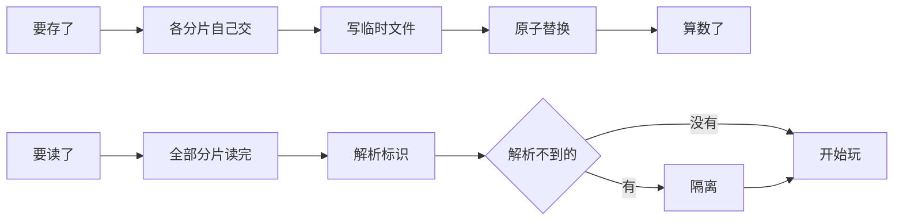

# 一份存档是若干分片的集合，而分片自己声明它进哪一侧：所以这一页不持有任何字段清单

> **正典层级**：第 5 级（系统细化）。与[玩法定位](../canon/gameplay/玩法定位.md)冲突时以正典为准；**存档位份数与续玩点份数是接口常量、家在正典，本页一个数都不定。**
>
> 返回 [总索引](../README.md)｜[系统文档与提案索引](./README.md)｜相关：[玩法定位 · 存档](../canon/gameplay/玩法定位.md) · [ADR-0015](../decisions/ADR-0015-存档的版本与缺字段口径.md) · [每日结算系统](./每日结算系统.md) · [统计事件总线系统](./统计事件总线系统.md)｜台账：[`GP-54`](../spec/issues/README.md)

## 摘要

**这一页回答一个问题：存档是怎么存的、怎么读回来的。** 读完你能判断两件事 —— 一样新东西该存进正式存档还是续玩点（判据只有一句：跨过一次睡眠还成立吗），以及「存档写一半崩了」会怎样。

**本页不持有任何字段。** 「一共存了什么」由一个读口回答，不由散文回答。

下面这张图回答一个问题：**一次写档和一次读档各自走哪几步，以及哪一步是「算数了」的那一刻。** 写的那条是「要存了 → 各分片自己交 → 写临时文件 → 原子替换 → 算数了」，提交点在最后 —— 在它之前崩掉，旧档完好无损。读的那条是「要读了 → 全部分片读完 → 解析标识」，解析不到的隔离掉，然后开始玩。



**重画条件**：写入多一步、提交点挪位置，或者悬空的处置从隔离改成删除时重画。

**这张图不新增任何事实，权威是下面「结构」那几节。** 一个分片要声明哪几格、缺字段按版本怎么补、那份不可用清单从哪来，图都放不下。

一份存档是**若干分片的集合**，而**每个分片由持有它的系统自己声明**：它叫什么、它进正式存档还是进临时续玩点、它缺字段时补什么。本页定的是**机制**，不是字段。

**它持有**：分片的声明字段表、「进哪一侧」那条判据、注册与分发的形状、载入时的标识解析与那份不可用清单、写入的事务形状、存档位与续玩点各是什么、**跨存档位的玩家级偏好归在哪一侧以及它缺字段怎么办**、体积实测的入口。

**它不持有**：**任何系统自己的字段** —— 那些各自声明在各自那份文档的「下游同步」里，本页写链接不复述；序列化格式与版本策略的**理由**（[ADR-0015](../decisions/ADR-0015-存档的版本与缺字段口径.md)）；云同步与冲突处理（`ENG-8`）；成就进度（[`统计事件总线系统`](./统计事件总线系统.md)那一页写明它不是本作存档的字段）；存档界面的排版；任何数值。

最要紧的那条承诺：**本页不持有「一共存了什么」那张清单。** 复述一遍就有两个家 —— 一处是本页，一处是那个系统自己的声明，而两处不一致时没有任何东西判得出来哪一处过期了。「一共存了什么」由一个**读口**回答（能列出全部已注册的分片），形状与[`事件系统` · 持续引导：同一条管道，两条出口](./事件系统.md)那份引导清单同源：**它是一个已有集合的读口，不是第二份存储。**

**第二条承诺：本页不新建路径常量、不新建通知渠道、不新增每日结算的步骤。** 路径已经在代码仓 `src/Platform/ModPaths.cs`，自动存档已经是[结算顺序（固定，不得改动）](../canon/gameplay/时间与经营.md)里的一步。

## 术语

只列**只有本页在用**的词。跨页共用的在[术语表](../reference/术语表.md)，本节不重复（`分片`、`正式存档`、`续玩点`、`存档位`、`原子替换`、`隔离`、`玩家级偏好`、`事务`、`读口`、`派生量` 都在那边）。

| 词 | 它在本页指什么 |
| --- | --- |
| **悬空** | 存的是标识，而载入时那个标识解析不到对应的东西（通常是 mod 被卸了）。处置是隔离，不是删除 |

## 上游约束

- [玩法定位 · 存档](../canon/gameplay/玩法定位.md)：存档位固定份数、**睡眠是唯一正式存档时机**、没有手动存档、任何时候退出都写临时续玩点且读取后即失效、关卡内恢复到关卡入口而基地或城区内恢复到退出时的当天当刻、二周目开新位、**mod 卸载后不许静默丢数据也不许崩档并要明确提示哪些角色不可用**。**这是本页全部结构的来源，也是它的范围上限。**
- [玩法定位 · 云存档](../canon/gameplay/玩法定位.md)：存档路径已定 `user://saves/`，云同步冲突归 `ENG-8`。**约束本页只保证路径与文件形状可预测，不做同步。**
- [玩法定位 · DLC 就是官方 mod](../canon/gameplay/玩法定位.md)：DLC 与 mod 共用同一套地基；**追加内容不得破坏旧存档**。**这是缺字段补默认值那条口径的正典依据，理由在 [ADR-0015](../decisions/ADR-0015-存档的版本与缺字段口径.md)。**
- [玩法定位 · mod 的扩展边界](../canon/gameplay/玩法定位.md)：内容一律数据外置、**规则不外置**。**这是「分片集合由规则决定、mod 加不了分片」的依据，也是版本号只需要一个的前提。**
- [玩法定位 · 跨系统基础设施](../canon/gameplay/玩法定位.md)：手环是全部管理界面的世界内载体、关卡内只许查看。**约束读档界面不挂手环 —— 选存档位不是世界里的事。**
- [玩法定位 · 弹界面接管输入就暂停世界，世界里的动作不暂停](../canon/gameplay/玩法定位.md)：判据落在「界面接管输入」上。**约束存档界面与那份不可用清单都暂停世界。**
- [玩法定位 · 二周目与元进度](../canon/gameplay/玩法定位.md)：通关获得星火积分、真实形态第二周目可主动开启。**约束本页不定周目相关字段 —— 那一批还没立项，见下面「理由与取舍」。**
- [时间与经营 · 结算顺序（固定，不得改动）](../canon/gameplay/时间与经营.md)：自动存档是那串里的一步。**这是本页被调用的唯一时点，驱动那一侧在[`每日结算系统`](./每日结算系统.md)。**
- [时间与经营 · 时间](../canon/gameplay/时间与经营.md)：**无全局日期上限**。**这是「存档体积随游玩时长线性长」那笔账的出处。**
- [时间与经营 · 精力](../canon/gameplay/时间与经营.md)：精力上限的几个加项各自独立存储、不先加总，否则说不出「为什么今天少了」。**这是「派生量不单独存」在经营侧的既有先例 —— 加项是基底，上限是派生量。**
- [世界观 · 多功能手环与治理](../canon/world/世界观.md)：手环会损坏、失灵或误报，**所以制度必须保留人工出口**。**这是「失败要说得出怎么办」这条呈现要求的世界内依据，不是本页另立的标准。**
- [`关卡系统` · 一个种子，加一份关卡进度](./关卡系统.md)：关卡进度进临时续玩点，拼装由种子唯一决定；只保留物品、整关重置会开出一条无限资源路径。**这是既有那几条「进哪一侧」声明里最完整的一处，本页接住它、不重定。**
- [`感知与视野系统` · 目标离开可见集之后：记忆项与残影](./感知与视野系统.md)：记忆项进临时续玩点，**可见集不进** —— 它每帧重算，存它等于存一份缓存。**这是「派生量不单独存」的既有先例，本页把它写成通用判据。**
- [`事件系统` · 那份记账只有一处，进正式存档](./事件系统.md)：「已触发过与冷却剩余」只有一份记账、进正式存档。**约束本页不给它开第二份、也不把它搬进本页。**
- [`事件系统` · 持续引导：同一条管道，两条出口](./事件系统.md)：那份可回查清单是记账的**读口**、不是第二份存储，所以不用为它加任何存档字段。**这是本页那个「已注册分片」读口的形状来源。**
- [`日记系统` · 存法：参数化的存参数，静态的只存标识](./日记系统.md)：判据是「参数化的条目要存参数，静态的条目只存标识」，解锁状态不存。**这是本页那条分片判据要收下的既有形状。**
- [`日记系统` · 不设条目保留上限，代价写明](./日记系统.md)：**要不要设上限的判据是实测存档体积、不是估算**。**本页要给那次实测提供入口，但不定那个值。**
- [`气泡对话系统` · 冷却池：按「角色 × 条目」记，跨场景保留，只进临时续玩点](./气泡对话系统.md)：**正式存档一个字段都不加**，理由是正式存档只在睡眠发生、那一刻重置正好对上「新的一天」。**本页不许把它收进正式存档。**
- [`状态效果系统` · 跨场景与存档](./状态效果系统.md)：进存档的是按天与永久那两类加它们的来源，**按帧的不进**。**又一个既有形状，本页的判据要判得出它。**
- [`人际系统` · 谁改它、谁读它](./人际系统.md)：对是按需创建的，**不存在的对一律读作最低档**。**这是「不存在」与「零」分得开的既有先例，本页的缺字段口径照它走。**
- [`统计事件总线系统` · 它给存档加零个字段](./统计事件总线系统.md)：总线没有状态。**约束本页不为它留分片。**
- [`数值模型` · 尚未给值的量，各自写明校准办法](./数值模型.md)：值的唯一来源是参数表，本页只写量纲与约束形式。**约束本页新增的量一律进那张表。**
- [ADR-0015](../decisions/ADR-0015-存档的版本与缺字段口径.md)：格式、版本号放在哪一层、缺字段与多字段各怎么办。**这是本页序列化那一节的全部依据，本页写链接不重写它的理由。**
- [ADR-0017](../decisions/ADR-0017-版本更新对旧存档的两种后果.md)：一次版本更新对旧存档只有两种后果，闸门是一个只增的**最低兼容存档版本**常量（规则常量，mod 改不了），而追加内容一律兼容。**这是载入那一节「先判兼容」那一步的全部依据，也约束本页不为它新增任何存档字段。**
- [ADR-0013](../decisions/ADR-0013-战斗片段就是一屏.md)：一个战斗片段就是恰好一屏。**约束续玩点里「玩家在哪个片段」的粒度是片段，不是一个坐标。**
- [ADR-0009](../decisions/ADR-0009-编辑器主导的开发模式.md)：参数唯一来源是场景与资源、代码不留能用的默认值。**约束分片声明缺字段时在注册那一刻报错；而它与存档缺字段的分别在 [ADR-0015](../decisions/ADR-0015-存档的版本与缺字段口径.md)。**

## 结构

### 一个分片要声明什么

| 声明项 | 说明 | 缺了怎么办 |
| --- | --- | --- |
| 分片标识 | 跨版本稳定的那个名字，存档里按它索引 | **注册时报错** |
| 持有它的系统 | 谁负责读写这一块 | **注册时报错** |
| 进哪一侧 | 正式存档，或临时续玩点 | **注册时报错**（没有「两边都进」这个取值） |
| 缺字段时补什么 | 一份**存档默认值**，它必须与「这个分片从来没存过」时的初始值同一处 | **注册时报错** |

**缺声明当场报错、不留能用的默认值**（[ADR-0009](../decisions/ADR-0009-编辑器主导的开发模式.md)）。**注册是显式的，没有自动发现** —— 自动发现看起来省事，但它把「我忘了注册」这个错变成「运行时扫不到」，而那不报错。

**「进哪一侧」只有一个取值，没有「两边都进」。** 想两边都进的东西说明它其实是两样：一样跨睡眠成立、一样只在这次退出到下次继续之间成立，各声明一个分片。

### 进哪一侧：判据一句话

> **跨过一次睡眠还成立的进正式存档；只在「这次退出到下次继续」之间成立的进临时续玩点。**

这条判据判得出既有那几处已经各自声明过的结论（[`关卡系统`](./关卡系统.md)的关卡进度、[`感知与视野系统`](./感知与视野系统.md)的记忆项、[`气泡对话系统`](./气泡对话系统.md)的冷却池、[`状态效果系统`](./状态效果系统.md)按帧那一类在续玩点一侧；[`事件系统`](./事件系统.md)那份记账、[`日记系统`](./日记系统.md)的条目在正式存档一侧）。**本页不复述那几份里的清单** —— 判据的用处是让**下一个**系统自己答得出来，不是让本页收一份副本。

**最短的一个例子是玩家位置**：正式存档只在睡眠时写，而那一刻的位置永远是床 —— 所以**位置是续玩点独有的那一小块**，正式存档里没有它。一个系统拿不准自己那一格时，照这个例子问一句「睡一觉之后它还说得通吗」。

**续玩点是一份全量快照，不是叠在存档位之上的增量。** 由此「读续玩点」与「读存档」走同一条路径 —— 一条路径就只有一处会错。增量要回答「基于哪一份」，而那一份可能已经被下一次睡眠覆盖过了。

### 存档位与续玩点

| | 是什么 | 什么时候写 | 什么时候没 |
| --- | --- | --- | --- |
| 存档位 | **一位就是一条世界线**（一个周目）。份数是接口常量、家在[玩法定位 · 存档](../canon/gameplay/玩法定位.md)，本页不复述那个数 | 睡眠时覆盖**当前那一位**，这是唯一时机 | 玩家自己删 |
| 临时续玩点 | **按存档位各一份**，不占存档位 | 退出、进出场景、片段转场、每日结算提交之后 | 读取后即失效；睡眠成功时作废当前那一份 |

- **续玩点按位各一份**，不是全局一份。全局一份的失败形态正好是正典写下这条机制的那个理由：「去看一眼另一个档」会把上一个档那一关白玩掉，而玩家做这件事时不会预期要付一关的代价。
- **睡眠成功时作废当前那一份续玩点**：它记的是睡前那一刻，而世界已经推进了。留着它等于给玩家一条「睡完再回到睡前」的路径，而那正是正典排掉手动存档要挡的东西。
- **本页不自己跑定时器。** 续玩点按上面那几个**时机**写，不按间隔写 —— 定时器会让「续玩点里那一刻」与玩家记忆里的那一刻错开，而它唯一能对上的办法就是写在他刚做完的那个动作之后。

### 玩家级偏好：第三样东西，不是分片

**音量、键位、字号这些是玩家的偏好，不是某一条世界线的状态** —— 改过之后开一个新档，它们还在。所以一份存档装不下它们，而上面那条判据也管不到它们。

**分类因此有两层，外层这一句先问：**

> **它跨不跨存档位？跨的是玩家级偏好。不跨的才轮到「进哪一侧：判据一句话」那条判据，在正式存档与临时续玩点之间分。**

**它不是分片。** 分片的定义是「一份存档的一块」，而问「这份偏好在哪一位存档里」时，答案是哪一位都不在。由此来几条：

- **它不走分片注册**，所以「进哪一侧」那两个取值一个不动。给那一格加第三个取值会让「没有『两边都进』这个取值」那条失去依据 —— 而那是本页的承重项。
- **它不进任何一份存档文件**，自己一份，与存档位那一批平级。
- **它不被存档的事务与版本判定牵着走**：一份存档载入失败不该让音量回到默认，反过来也一样。

**缺字段照 [ADR-0015](../decisions/ADR-0015-存档的版本与缺字段口径.md) 那张表走，但有半条刻意不同：**

| 情形 | 存档那一侧 | 偏好这一侧 |
| --- | --- | --- |
| 比当前旧的版本缺字段 | 补默认值 | **同样补默认值** |
| 同版本缺字段 | **报错** | **不报错**，按「从来没设过」补默认值并继续 |
| 比当前新的版本 | 显式拒绝 | **同样显式拒绝** |

**那半条不同凭的是同一张表往下多问一句：修得回来吗。** [ADR-0015](../decisions/ADR-0015-存档的版本与缺字段口径.md) 按「谁修得了」分开了作者的失误与版本演进，而偏好这一侧的分别落在**后果**上：一份存档打不开时玩家还有别的存档位与那一份续玩点，而**偏好全局只有一份，报错等于游戏进不去**；偏好丢一格的后果是一个设置回到默认，玩家当场看得见、也改得回来，而存档丢一格的后果是世界状态不对，既看不出来也改不回来。**[ADR-0015](../decisions/ADR-0015-存档的版本与缺字段口径.md) 一个字不改** —— 本节是那张表在一个新对象上的应用，不是一条新口径。

**这一处收下的是「玩家级」这个类别，不只是设置。** 将来再出现跨存档位的记录时，它有一个现成的家与一条现成的判据。**本节不列住户名单** —— 名单会随系统长，而它长的时候没人会回来改这一段；要查有哪些就按词搜「跨存档位」。

**每样玩家级记录由持有它的系统自己声明**，形状照「一个分片要声明什么」那张表**去掉「进哪一侧」那一格** —— 它已经答过了（它跨存档位）。**那张分片声明表一个字不改。**

**玩家级那一侧也可能含内容标识。** 有些跨存档位的记录存的就是标识（哪件宝物、哪只敌人），所以**缺 mod 时走「缺 mod 的内容：隔离，不删除」那条既有的路，不另写一套**。与存档那一侧只有一处差别：那份不可用清单是一次载入的产物，而玩家级这一份的隔离**跨全部存档位成立** —— 装回 mod 之后处处都回来，不是只在某一位里回来。

**本节不持有的那几样：**

- **各组设置有哪几组、每组里是什么。** 那是正典点名的清单（[玩法定位 · 跨系统基础设施](../canon/gameplay/玩法定位.md)）加界面的事，本节不复述也不展开。
- **键位的默认值。** 载体已经在（`rules/Ui/InputBindings.cs`），它自己写明「只有默认值，没有持久化」—— 本节答的正是那句话在等的那个归属。
- **文件格式、字段名与存放位置。** 与存档同域的实现选择；路径常量已经在代码仓 `src/Platform/ModPaths.cs`，**本节不新建路径常量**。
- **成就与云同步。** 成就存在平台那一侧（判据在[`统计事件总线系统` · 它给存档加零个字段](./统计事件总线系统.md)），云同步与冲突归 `ENG-8`。

### 写入是一次事务

```
收集各分片 → 写一个临时文件 → 原子替换目标文件 → 提交
```

- **中间任何一步失败就整份不生效**，目标文件一字不动。它挡的是「写一半断电留下半份存档」——**那种损坏不报错**，只在下次载入时表现成「存档读不出来」。
- **不另留一份玩家读得到的备份。** 原子替换已经挡住了写坏；而一份玩家读得到的备份会变成手动存档的替代，那与正典排掉手动存档的理由（允许试探最优解再读回来）直接冲突。
- **写入失败要报得出来，而且要说清「这一天有没有推进」** —— 那一句由[`每日结算系统`](./每日结算系统.md)那条事务口径决定，本页只保证「成功还是失败」这个结果取得到。

### 载入：先读分片，再统一解析标识

```
读最外层（版本 ＋ 存档位摘要）→ 先判兼容（ADR-0017）→ 再按 ADR-0015 处理缺字段
  → 逐个分片交给它的持有者 → 全部分片读完之后统一解析标识
  → 解析不到的收进不可用清单 → 交给玩家决定
```

- **分片之间不许有载入顺序依赖。** 每个分片只读自己那一块；跨分片的引用一律按标识解析，而解析统一发生在全部分片读完之后。**理由**：顺序依赖会长成第二张「固定不得改动」的顺序表，而那张表没有正典依据，也没人知道它什么时候被谁悄悄改了。
- **这条要有反证钉住**：**把分片按任意顺序读，结果完全一致。** 不钉的后果是实现里会长出一条隐式顺序，而它在加第二十个分片那天才被撞到。
- **判兼容排在处理缺字段之前**，因为它们问的不是同一件事：前者问「这份存档还打不打得开」，后者问「打开之后缺的那几格怎么补」。闸门是那个**「最低兼容存档版本」常量**（[ADR-0017](../decisions/ADR-0017-版本更新对旧存档的两种后果.md)）：它由游戏这一侧持有、是**规则常量而不是配置项**，而**存档里仍然只有一个版本号**。
- **被拒时不许读出半份世界。** 拒绝要在任何分片交给持有者之前发生，并给出指向游戏内更新公告的那句话（界面归 `UI-23`）。
- **序列化格式、版本号放在哪一层、缺字段与多字段怎么办，全在 [ADR-0015](../decisions/ADR-0015-存档的版本与缺字段口径.md)**，本页写链接不重写。本页只接住它的一条推论：**分片声明里那份「存档默认值」就是那条口径的落点。**

### 派生量不单独存

**分片声明里不许出现派生量。** 派生量的定义很窄也很好判：**它由别的已存字段算得出来。**

- 既有的例子各在各处（精力上限由几个加项算出、[`感知与视野系统`](./感知与视野系统.md)的可见集每帧重算、[`日记系统`](./日记系统.md)的解锁状态读关系档位、[`成长系统`](./成长系统.md)那张派生表整张都是），**本页不复述那几处**，只给它们一条共同的判据与一条共同的反证。
- **判得到的那条反证（承重项）**：**改掉存档里的基底字段、重新载入，对应的派生量必须跟着变。** 它挡的是「顺手把派生量也存进去」那种实现 —— 那种实现**不报错**，只在基底与派生量分叉的那一天表现成「这个数不对」，而那时已经查不出是哪一次写入把它们分开的。
- **代价写明**：载入之后要先算一遍派生量，所以它们不能在载入过程中被读。这不是新约束，它就是上面那条「统一解析标识」的同一个时点。

### 缺 mod 的内容：隔离，不删除

这一节是 `ENG-7` 的形状。**悬空引用不需要新概念**：存档里存的一律是**标识**（各系统本来就这么存），所以「悬空」就是这个标识在当前内容表里解析不到。

**一条不可用记录要说得出四样**：

| 格 | 说明 |
| --- | --- |
| 类别 | 角色、宝物、技能这一类 |
| 标识 | 解析不到的那个名字 |
| 出现在哪个分片 | 好让玩家知道它影响的是什么 |
| **缺哪个 mod** | 由存档里那份「写档时启用了哪些 mod」比出来 |

**所以存档里要有一份「写档时启用了哪些 mod」**（名字与版本）。理由直接来自正典的措辞：它要求提示玩家哪些角色**因缺少 mod** 而不可用，而只凭一个解析不到的标识说不出「因为缺哪个」。

**那份不可用清单不是存储。** 它是本次载入的产物，随会话存在、不进存档。**它与[`事件系统`](./事件系统.md)那份引导清单只共用「不是第二份存储」这个结论，理由不同源**：引导清单是一个已有集合的读口，而本清单连被读的集合都没有 —— 它是一次解析的结果。

**玩家选「继续」之后：隔离保留，不删除。**

- 不可用的角色留在名册里、标成不可用；他身上的装备、他那本日记、含他的关系对**原样留在存档里**，写回时一字不动。
- **写回时原样写回那些读不懂的标识**，这是 [ADR-0015](../decisions/ADR-0015-存档的版本与缺字段口径.md)那条「多出来的字段丢弃」的**唯一例外**，两处都写明了。
- **不可用的东西不参与任何结算，也不进任何计数**：编队、名册容量、仓库格数、结局判定的名册遍历，一处都不算它。**这条是隔离能成立的全部依赖** —— 少一处排除就会出现「一个不存在的角色占了一个编队位」，而**那不报错**。
- **反证（承重项）**：卸掉 mod 载入、选继续、再玩一段、再把 mod 装回来 —— 那个角色的装备、日记与关系对**一件不少**。
- **载入不许抛。** 解析不到一律走清单。一条反证：造一份含悬空标识的存档，**载入成功**并列出清单。

**清单弹不弹，读的是存档里那一格「玩家已确认过的那一批标识」**：只有出现新的不可用标识时才弹。理由是一个每次都弹、每次内容一样的提示会被训练成直接点掉，于是**真的出现新内容时它也被点掉了**。这是本页唯一一个**为界面服务的存档字段**，单独点出来是为了以后没人照它的形状往存档里加别的界面状态。

**缺 mod 与版本降级不是一件事，处置也不同源**：缺 mod 是**内容**少了（标识粒度，走本节），版本降级是**规则**少了（分片粒度，走 [ADR-0015](../decisions/ADR-0015-存档的版本与缺字段口径.md)那条显式拒绝）。

### 存档位摘要与体积实测

- **存档位摘要放在存档文件的最外层**，与版本号同侧，好让存档位列表读得出「这一位是哪条世界线」而**不用把整份存档读进内存**。
- **不另存一份索引文件。** 两份会分叉，而分叉时没有任何东西判得出来哪一份过期了 —— 与本页开头那条「不持有字段清单」是同一条理由的第二次应用。
- **写入之后要报得出按分片分摊的字节数。** 这是[`日记系统` · 不设条目保留上限，代价写明](./日记系统.md)那个等实测的量唯一能用的入口：那条判据是「实测存档体积」，而只报总数说不出是哪一块在长。**本页不定那个值**（归 `GP-7`）。
- **体积要按发行格式量。** 先定明文、量出来真的过大再压缩是加法；反过来是重做。格式的选择与理由在 [ADR-0015](../decisions/ADR-0015-存档的版本与缺字段口径.md)。

## 接口

### 谁调它、谁读它

| 方向 | 对方 | 形状 |
| --- | --- | --- |
| 入 | 各系统 | **注册一个分片**，按上面那张声明表；缺一格报错 |
| 入 | [`每日结算系统`](./每日结算系统.md) | 睡眠那一刻写一次正式存档；**它是正式存档的唯一写入时机** |
| 入 | 退出、进出场景、片段转场 | 写一次临时续玩点 |
| 入 | 主菜单 | 开新档、读一位、删一位 |
| 入 | 设置界面 | 改一项玩家级偏好并写一次；**不经存档那条事务，也不占存档位** |
| 出 | 各系统 | 载入时把它那一片交回给它 |
| 出 | 不可用清单 | 一次载入的产物；**不进存档** |
| 出 | 手环 | **不出** —— 读档界面不挂手环，见下面「边界与非目标」 |
| 出 | [`统计事件总线系统`](./统计事件总线系统.md) | 存档写入成功一条、载入成功一条、出现不可用内容一条 |
| 读口 | 已注册分片 | **「一共存了什么」这个集合的读口**；它不是第二份存储 |
| 读口 | 存档位摘要 | 存档位列表读它，不读整份存档 |
| 读口 | 按分片分摊的字节数 | 体积实测读它 |
| 读口 | 玩家级偏好 | 启动时读一次，之后谁都读得到；**切换存档位不改它** |
| 作者填 | —— | **无。** 分片是规则声明的，不是作者在编辑器里配的（[玩法定位 · mod 的扩展边界](../canon/gameplay/玩法定位.md)：规则不外置） |

**挂载点到此为止。** 将来加一样与存档有关的东西时，先问「它挂在上面哪一格」，而不是顺手插一个新钩子。

### 它不碰的那几条接缝

- **任何系统自己的字段**：各自声明在各自那份文档里，本页只提供注册这个动作。
- **序列化格式与版本策略的理由**：[ADR-0015](../decisions/ADR-0015-存档的版本与缺字段口径.md)。本页只接住它的落点。
- **那串步序怎么跑**：[`每日结算系统`](./每日结算系统.md)。**方向单向** —— 结算调本页，本页不回头调结算。
- **成就进度**：它是跨存档的东西，归 `ENG-8`；判据在[`统计事件总线系统` · 它给存档加零个字段](./统计事件总线系统.md)。
- **云同步与冲突**：`ENG-8`。本页只保证路径与文件形状可预测。

## 边界与非目标

- **不定任何数值**：存档位份数、续玩点份数、体积上限全不在本页定 —— 前两个是接口常量、家在[玩法定位 · 存档](../canon/gameplay/玩法定位.md)；体积不是一个「要给值的量」，它是[`日记系统`](./日记系统.md)那条判据的输入。**版本号也不是数值** —— 它是一个只增的序号，归属在 [ADR-0015](../decisions/ADR-0015-存档的版本与缺字段口径.md)。
- **不持有「一共存了什么」那张清单**：本页最要紧的那条边界。
- **不复述别人的「进哪一侧」声明**：本页只给判据与机制。
- **不展开各组设置的取值**：有哪几组在正典（[玩法定位 · 跨系统基础设施](../canon/gameplay/玩法定位.md)），每组里摆什么归界面侧；本页只答玩家级偏好归在哪一侧、缺字段怎么办。
- **不让玩家级偏好进任何一份存档，也不给它一个分片**：见「玩家级偏好：第三样东西，不是分片」。
- **不做手动存档**：正典明确排掉，理由是它会把一整天的规划决策变成穷举。
- **不另留玩家读得到的备份**：那是手动存档的替代。
- **不让分片之间有载入顺序依赖。**
- **不存派生量。**
- **不删缺 mod 的内容**：隔离而不是删除。
- **不做云同步与冲突处理**：`ENG-8`。
- **不做防篡改与校验和**：单机买断制，改自己的存档是玩家的事；写入的原子替换已经挡住「写一半断电」。
- **不做存档修复与迁移工具**：迁移的口径在 [ADR-0015](../decisions/ADR-0015-存档的版本与缺字段口径.md)，工具等真有旧存档才做得了。
- **不为二周目预留字段**：见下面「理由与取舍」。
- **不做界面**：存档位列表长什么样、摘要显示哪几项、不可用清单怎么排，归界面侧与作者实机定（进度见[待办台账](../spec/issues/README.md)）。**但有一条边界本页持有**：**读档界面不挂手环** —— 手环是世界内的载体，而选存档位不是世界里的事（主角不在世界里选存档位）。
- **同名不同物，两处都要写全名**：
  - **「存档」有两个意思**：本页的**正式存档**（睡眠时写、占一个存档位）与**临时续玩点**（退出时写、不占位、读取后即失效）。**说「存档」不指明哪一个时一律读作正式存档。**
  - **「默认值」有两个意思**：本页分片声明里那份**存档默认值**（旧版本缺字段时补的那个），与 [ADR-0009](../decisions/ADR-0009-编辑器主导的开发模式.md)禁止的那种**代码里能用的默认值**（场景缺配置时兜底的那个）。两者为什么可以并存在 [ADR-0015](../decisions/ADR-0015-存档的版本与缺字段口径.md)。
  - **「清单」有三个所指**：本页的**不可用清单**（一次载入的产物）、[`事件系统`](./事件系统.md)的**引导清单**（一个已有集合的读口）、[玩法定位 · 查询与图鉴](../canon/gameplay/玩法定位.md)的**图鉴**（收内容）。三者都「不是第二份存储」，但理由各不相同。
  - **「分片」有三处容易混**：本页这个**存档分片**（存档的一块）、[`关卡系统`](./关卡系统.md)的**片段**（关卡里一屏的场景），以及[世界观 · 外域](../canon/world/世界观.md)那句「外域是按遗址**分片**的」（那是动词，说的是地理分区）。前两个只差一个字，第三个连字都一样 —— 本页出现这个词时一律指存档分片。

## 理由与取舍

- **没选让本页持有一张集中的字段表。** 那是最好查的做法，代价是**每加一个系统都要回来改它** —— 于是同一件事有两个家（本页那张表与那个系统自己的声明），而两处不一致时没有任何东西判得出来哪一处过期。而它增长的速度正好等于系统数：等系统文档再翻一倍，它就是全库最容易过期的一页。**「查不到一处」这个缺口用读口补，不用表格补** —— 形状照[`事件系统`](./事件系统.md)那份引导清单。
- **没选自动发现分片。** 省一处注册，代价是「我忘了注册」这个错变成「运行时扫不到」，而那不报错。显式注册加上「存档里出现未注册的分片名时不静默丢」之后，两个方向都判得到。
- **没选给「进哪一侧」留一个「两边都进」的取值。** 想两边都进的东西其实是两样东西，而合成一格之后「它在续玩点里那一份和在正式存档里那一份不一致时听谁的」没有答案。
- **没选让续玩点做成增量。** 增量省体积，但它要回答「基于哪一份」，而那一份可能已经被下一次睡眠覆盖过 —— 于是续玩点会指向一个不存在的基底。全量快照让读续玩点与读存档走同一条路径，**一条路径就只有一处会错**。
- **没选让续玩点全局只有一份。** 省存储与逻辑，代价是「去看一眼另一个档」把上一个档那一关白玩掉 —— 而那正是正典写下续玩点这条机制的那个理由本身。它不是边角情形：玩家会做这件事，而且做的时候不会预期要付一关的代价。
- **没选留一份玩家读得到的备份。** 它防的是存档损坏，而原子替换已经防住了；留着它就等于留了一条读回旧状态的路，而正典排掉手动存档的理由正是那条路。
- **没选让分片按固定顺序载入。** 顺序看起来能省掉「统一解析标识」那一步，代价是它会长成第二张「固定不得改动」的顺序表 —— 而那张表没有正典依据，加第二十个分片那天才会撞到它。
- **没选删掉缺 mod 的内容。** 正典写的是「不能静默丢数据」，而删掉与静默丢的差别只在有没有弹一次提示 —— **提示过的数据丢失仍然是数据丢失**，而这件事十有八九是误删或临时移走了 mod。隔离的代价是实打实的（每一处计数入口都要排除它们），但它**写得成反证**（装回 mod 之后一件不少）；删掉那个代价写不成反证 —— 数据已经没了。
- **没选「保留角色本身、装备退回仓库、关系对删掉」那种半保留。** 它同时做了不可逆的改动和保留，而玩家分不出哪部分可逆 —— 那比两头任意一头都糟。
- **没选每次载入都弹那份不可用清单。** 零字段，但一个每次内容都一样的提示会被训练成直接点掉，于是真出现新的不可用内容时它也被点掉 —— 那时这条提示的全部价值就没了。记一格玩家已确认过的那一批，换来的是提示只在它真有新信息时出现。
- **没选为二周目预留字段。** [ADR-0015](../decisions/ADR-0015-存档的版本与缺字段口径.md)那条「旧版本缺字段补默认值」已经让以后加字段变便宜了；而预留一格要现在回答「它从哪来、谁写它」，那是在为一个还没立项的系统做决定。
- **没选把读档界面挂在手环上。** 手环是全部管理界面的世界内载体，而选存档位不是世界里的事 —— 挂上去就要回答「主角在世界里翻自己的存档是什么意思」。
- **没选给玩家级偏好新开一份系统文档。** 边界最干净，代价有两层：它违反拆篇判据（[`生产系统` · 什么时候拆出去单独成篇](./生产系统.md)，它没有自己的状态机），而且会让「什么东西跨存档位」与「什么东西跨睡眠」分居两份文档 —— 那正是下一个系统答不出自己那一格的原因。**这条缺口的根不是「设置没有家」，是那条分类判据只有两个出口**；补出口要补在判据旁边。
- **没选把它做成第三类分片。** 实现上最省，代价是要给「进哪一侧」加第三个取值，而本页刚用「没有『两边都进』这个取值」挡掉的正是那种形状。更根本的是分片的定义容不下它：问「这份偏好在哪一位存档里」没有答案。
- **没选只在正典点名一处、把结构留给实现。** 正典那张表答的是有哪几组，那是内容清单；而「缺字段怎么办」是系统细化 —— 放进正典等于让第 4 级持有第 5 级的东西。

## 验收

**可自动验证项**（纯规则层，与引擎无关）：

- 分片声明：四个必填项各缺一次，都**注册被拒**；「进哪一侧」**没有「两边都进」这个取值**（一条结构约束）。
- 注册：**没有自动发现**（不注册就不在集合里，一条结构约束）；**重复注册同一个标识被拒**。
- 读口：已注册分片的读口列出来的集合与真的被写过的那一组**完全相同**（承重项的反证 —— 它挡的是「读口另存一份」那种实现）。
- 往返：**每个已注册分片存进去再读出来完全一致**；正式存档一侧与续玩点一侧各一条。
- **任意顺序读出同一结果**（承重项的反证）：把分片按逆序、随机序各读一次，结果与顺序读完全一致。
- **派生量不单独存**（承重项的反证）：分片里不含派生量（一条结构约束）；**改掉存档里的基底字段、重新载入，派生量跟着变**。
- 位置：**正式存档里没有玩家位置这一格**（一条结构约束）；续玩点里有。
- 事务：中间任何一步失败时**目标文件一字不动**；**没有第二份玩家读得到的备份**（一条结构约束）。
- 续玩点：**按存档位各一份**（在一位写过之后读另一位，前一位那份还在）；**读取后即失效**；**睡眠成功时当前那一份被作废**。
- **本页不跑定时器**（只推进时间、不做任何那几个时机上的动作时，续玩点一份都不产生）。
- 标识解析：解析统一发生在全部分片读完之后（一条结构约束）；**含悬空标识的存档载入成功**并列出清单。
- 不可用清单：四格都填得出（含**缺哪个 mod**）；**清单不进存档**（一条结构约束）；只在出现**新的**不可用标识时才弹。
- 隔离（**承重项的反证**）：卸 mod → 载入 → 选继续 → 玩一段 → 装回 mod，那个角色的装备、日记与关系对**一件不少**；同一批用例里**不可用的东西不出现在任何计数里**（编队、名册容量、仓库格数、名册遍历各一条）。
- 摘要：存档位摘要**不用读整份存档就取得到**；**没有第二份索引文件**（一条结构约束）。
- 玩家级偏好：**换一个存档位之后它一格没变**（反证）；它**不在任何一份存档文件里**，也**不在已注册分片那个集合里**（两条结构约束）。
- 偏好的缺字段：比当前旧的版本缺一格**补默认值**；**同版本缺一格也载入成功并补默认值**；比当前新的版本**被显式拒绝**。中间那条与存档侧那条方向相反，**两条要放进同一批用例**，那半条刻意的不同才钉得住。
- 偏好不被存档牵连（反证）：造一份读不出来的存档，载入失败之后**偏好仍然是玩家设过的那一份**。
- 玩家级记录的声明：形状照分片那张表**去掉「进哪一侧」那一格**，每个必填项各缺一次都**被拒**（一条结构约束 ＋ 若干用例）。
- 玩家级那一侧的内容标识（反证）：让一份玩家级记录含一个解析不到的标识 → **载入成功**并进不可用清单；装回 mod 之后**在任意一个存档位里它都回来了**（这一条比存档那一侧多量一件事）。
- 兼容闸门排在最前（[ADR-0017](../decisions/ADR-0017-版本更新对旧存档的两种后果.md) 的用例落在那一份的验收里，本页只钉顺序）：版本号低于最低兼容版本时**没有任何分片被交给持有者**（一条结构约束 —— 它挡的是「先读一半再拒」那种实现）。
- 体积：写入之后**报得出按分片分摊的字节数**。
- 版本：[ADR-0015](../decisions/ADR-0015-存档的版本与缺字段口径.md)那四条各有用例，落在那一份的验收里、本页不复述。
- 暂停：**打开存档界面与那份不可用清单时世界暂停**，关上时交回。
- 统计事件：写入成功、载入成功、出现不可用内容各发一条。

**必须实机确认项**：存档位列表读不读得出「这一位是哪条世界线」、不可用清单说不说得明白「装回哪个 mod 就能恢复」与「继续之后会怎么样」、存档写入失败那句话说不说得清这一天有没有推进、体积在真实游玩若干小时之后是多少。按 [ADR-0009](../decisions/ADR-0009-编辑器主导的开发模式.md) 的分工由作者实机看，本页不判。**体积只能实测** —— 本页与[`日记系统`](./日记系统.md)写的量级都是推断。

**完成边界**：分片按声明注册且缺一格报错、「进哪一侧」有一条判得出下一个系统的判据、**玩家级偏好与那两侧分得开且缺字段口径写明**（有反证）。还要满足：往返一致且任意顺序读出同一结果（有反证）、派生量不单独存（有反证）、写入是一次事务、缺 mod 的内容被隔离而不是删除（有反证）、「一共存了什么」是读口而不是清单（有反证）。做到这些，「睡一觉 → 各系统交出自己那一片 → 写成一份文件 → 下次载入分回去 → 缺的内容说得出缺什么」这条链在文档层面就走得通了。

## 下游同步

- **代码**：分片的注册、收集、分发、版本处理与标识解析落**规则层**（它们只吃字符串与字典，不需要引擎）；**读写文件那一下落引擎层** —— 规则层不能引用 Godot（编译器强制），而 `user://` 只有 Godot 解析得了，所以把绝对路径传进规则层。相邻的既有件逐个列在下面。`src/Platform/ModPaths.cs` 已有存档根路径与「确保可写目录存在、失败不抛而是报给玩家」那个入口，**本页不新建路径常量**。`rules/Foundation/Content/ContentJson.cs` 是内容数据的 JSON 读法；它放行注释与尾逗号是给手写文件的，**存档不需要那两条**，所以两者要不要共用同一份选项是实现时的一个具体判断。`rules/Progression/CharacterDefinition.cs` 里那个 `Id` 就是跨存档稳定的标识，`ENG-7` 那条容错挂在它上面。**存档、结算与总线的代码一行都没有，这一条是按名搜过的实测，不是推断。** **玩家级偏好走同一条读写路**（同一个路径常量、同一种明文格式），键位那一半覆盖 `rules/Ui/InputBindings.cs` 的默认表 —— 那一份只有默认值、没有持久化，本页答的正是它在等的那个归属。
- **数值**：本页给参数表加的量是**零个**，而这不是漏登记：存档位与续玩点的份数是接口常量（家在正典）、版本号是一个只增的序号（归属在 [ADR-0015](../decisions/ADR-0015-存档的版本与缺字段口径.md)）、体积是[`日记系统`](./日记系统.md)那条判据的输入而不是一个待定的值。本页提供的是那次实测的入口。
- **台账**：立项在 [`GP-54`](../spec/issues/README.md)。落地顺序前半按「分片声明与注册（含缺一格报错、无自动发现）→ 已注册分片读口（含它不是第二份存储的反证）→ 往返与任意顺序读（两条反证）→ 派生量不单独存（反证）」。后半按「事务写入与原子替换 → 存档位与续玩点两侧各自的时机 → 标识解析与不可用清单 → 缺 mod 的隔离（反证）→ 存档位摘要与体积分摊 → 接 [ADR-0015](../decisions/ADR-0015-存档的版本与缺字段口径.md)那四条」。**`ENG-7` 的文档那一半由本页交付**，落地那一半跟着本条走。**玩家级偏好那一节的立项是 `ENG-23`**，它的落地排在存档那条链之后或与它同批（两者共用同一条读写文件的路）。**兼容闸门那几条用例跟着 `GP-57` 走**，更新公告那处界面归 `UI-23`。界面归界面侧那一条。
- **该上升进正典的**：只有一条 —— **「跨过一次睡眠还成立的进正式存档；只在这次退出到下次继续之间成立的进临时续玩点」那条判据**，连它外面那一层「它跨不跨存档位」一起。它现在是本页的结构选择；等第二批系统真的按它自己答出了「我那一格进哪一侧」之后，上升进[玩法定位 · 存档](../canon/gameplay/玩法定位.md)。其余字段、机制与那几条反证按定义不进正典。
