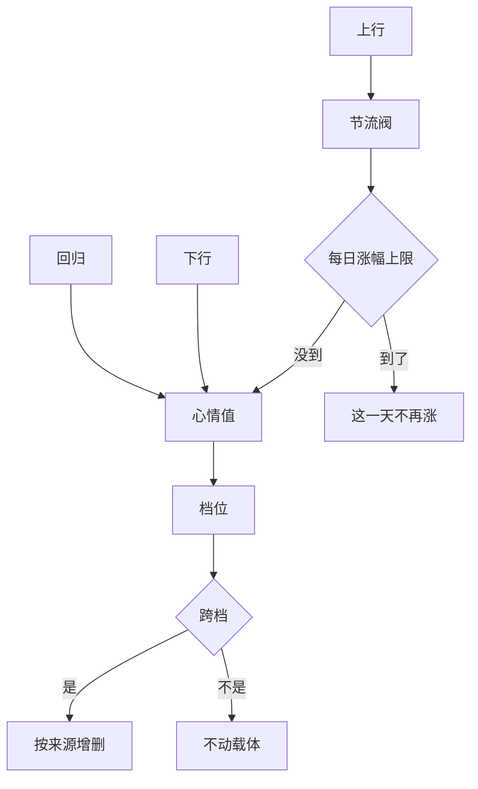

# 心情每天自己回到中间那一档：往上要花力气，往下要有原因

> **正典层级**：第 5 级（系统细化）。与[玩法正典](../canon/gameplay/玩法定位.md)冲突时以正典为准；**全部档位边界、幅度、系数与下限归[数值模型](./数值模型.md)，本页一个都不定。**
>
> 返回 [总索引](../README.md)｜[系统文档与提案索引](./README.md)｜相关：[角色与成长 · 心情](../canon/gameplay/角色与成长.md) · [状态效果系统](./状态效果系统.md) · [成长系统](./成长系统.md) · [生产系统](./生产系统.md)｜台账：[`GP-131`](../spec/issues/README.md)

## 摘要

**这一页回答一个问题：一个角色今天过得怎么样，这件事是怎么记的、怎么变的、谁读它。** 读完你能判断两件事 —— 一件新发生的事该不该动心情（以及走哪个入口），还有「为什么他的心情掉了」该去查哪里。

心情是**按角色记的一个归一化进度值**，映射成五档。本页持有它怎么被持有、怎么变、谁读它。

**它持有**：那个值、值到档位的映射、一条增减管道与它的每日涨幅上限、按天往基准档回归那一下、以及「上一次为什么变了」那份原因。

**它不持有**：任何数值（全归[数值模型](./数值模型.md)）；档位长出的修饰（那是[状态载体](./状态效果系统.md)的永久项）；有哪些事会动它、各动多少（内容）。

三条承诺，本页的形状全从它们来：

- **不新建时间单位、不新建结算通道。** 回归那一下并进[每日结算](../canon/gameplay/时间与经营.md)里学生康复与按天状态推进那一步，**步数一个不增**。
- **不新建修饰载体。** 档位长出的那两项是状态载体的永久项，跨档时按来源增删 —— 与失衡长出的增益同一条路径。
- **不碰战斗，也不碰失衡。** 修饰只落在经营侧那两个量上，而心情与活跃失衡之间**没有任何一条读写路径**。

## 术语

只列**只有本页在用**的词。跨页共用的在[术语表](../reference/术语表.md)，本节不重复（`档位`、`读口`、`永久项`、`进度值`、`来源`、`每日涨幅上限` 都在那边）。

| 词 | 它在本页指什么 |
| --- | --- |
| **基准档** | 五档里中间那一档（平静）。它是「没出什么事」的样子，也是回归的目标 —— **不是「还凑合」这个评价** |
| **回归** | 按天往基准档靠近一步。方向由当前值在基准档的哪一侧决定，**两个方向同一条规则** |
| **原因** | 心情上一次变化的来源标签加方向，供界面答「他为什么掉了」。**它不是第二份账** —— 由最后一次提交留下 |

## 上游约束

- [角色与成长 · 心情](../canon/gameplay/角色与成长.md)：五档与档名、平静是基准、按声明给、对外只给档位、越好干活越顺而只有那两样、两样都有大于零的下限、只在经营侧、没有事发生时自己回到基准、上下行各有哪几条、拒绝不掉心情、与活跃失衡互不读写、画面上不做表现。**这是本页全部规则的来源，本页只决定它们各自落成什么结构。**
- [角色与成长 · 档位与专长：练上去是在做选择，不只是数字变大](../canon/gameplay/角色与成长.md)：**不同档位阶梯的档名互不重合**。**约束本页不复述档名**，也约束加档时先问它量的是什么。
- [角色与成长 · 失衡与它长出的永久增益](../canon/gameplay/角色与成长.md)：失衡以永久增益改造角色、载体走状态载体。**这是本页那两项修饰的路径来源** —— 同形，但两个量之间没有读写。
- [时间与经营 · 结算顺序（固定，不得改动）](../canon/gameplay/时间与经营.md)：那串步序一步不许增减。**约束回归并进已有那一步，本页不为自己开一步。**
- [时间与经营 · 精力](../canon/gameplay/时间与经营.md)：精力是当日一切行动的共同预算，**上限变化必须有可见的界面反馈与原因**。**这是「原因」那一格的同形先例**；同时约束本页改的是**耗多少**，不碰那份加项清单。
- [时间与经营 · 学生与派工](../canon/gameplay/时间与经营.md)：派到擅长的工位是一件已经成立的事，高风险派工要请求同意而**拒绝不损失关系、成长或剧情资格**。**约束上行那一条接已有的派工结算，也约束拒绝一律零代价。**
- [时间与经营 · 生产](../canon/gameplay/时间与经营.md)：烹饪品质读烹饪者的生活技能，**食物增益不得成为通关前提**。**约束吃饭那条读品质，也给它的量级一个上界。**
- [人物 · 教师权力、同意与关系红线](../canon/characters/人物.md)：拒绝不带任何永久惩罚。**约束「不来上课」「拒绝指导」是零代价分支，不是低收益分支。**
- [`状态效果系统` · 它不碰的那几条接缝](./状态效果系统.md)：关系、掌握度与吸收效率这类进度值不进载体 —— 它们没有时长、不会过期、不参与叠加与解除。**约束心情值本身不进载体**，塞进去就要造一个「永不过期且每天自己改量级」的特例。
- [`状态效果系统` · 时长有三种单位，各有各的推进点](./状态效果系统.md)：永久项不推进、只能被显式移除、量级可正可负。**这是那两项修饰用的那一档。**
- [`成长系统` · 派生表：基底与来源分两栏](./成长系统.md)：派生表是下游唯一入口，**体力劳作的精力折扣**已经是其中一行。**约束精力那一侧走那一行的「其余来源」栏，不新开第二条修饰路径。**
- [`成长系统` · 角色定义上不会变的声明项](./成长系统.md)：一张表、按声明必填，而「没声明」与「漏填」必须分得出来。**这是「谁有心情」那一格的形状来源。**
- [`生产系统` · 六条渠道，差别只在那几格](./生产系统.md)：品质读生活技能，产出管道四段顺序固定。**约束本页改品质分布、不改「读哪一项」，也不碰那四段。**
- [`教育系统` · 第二个新量：知识吸收效率](./教育系统.md)：那个量用掉就降、每天夜里自己回升，而**单次下降必须大于每日回升**。**本页的回归是它的镜像**，所以不发明第二种形状 —— 那条不等式在本页反过来写。
- [`人际系统` · 压力全在每日上限，因为它是唯一的](./人际系统.md)：每条涨法各有自己的节流阀，**一条都不许缺**。**约束本页每条上行来源都要有节流阀。**
- [`活跃失衡系统` · 对外只有档位，没有精确值](./活跃失衡系统.md)：露出精确值玩家就会刷小数。**约束本页对外也只给档位。**
- [`事件系统` · 后果一律是对已有入口的调用](./事件系统.md)：后果表里不许有「本页自己算」那一格。**约束本页要给事件开一个调得到的入口。**
- [ADR-0018](../decisions/ADR-0018-内容定义按声明扩展.md)：条目自己声明有哪几项能力，「没声明」与「漏填」要分得出来。**这是那项能力声明的形状来源，本页不重写它的理由。**
- [ADR-0009](../decisions/ADR-0009-编辑器主导的开发模式.md)：参数唯一来源是场景与资源，代码不留能用的默认值。**约束本页定出的每个量落成外置数据。**

## 结构

### 一个值、五档、一份原因

| 它持有 | 形状 |
| --- | --- |
| **心情值** | 按角色记的归一化量，零到满值。**满值对所有角色一律相同** —— 它是归一化本身给的，不按角色记（与知识吸收效率刻意不同，理由在「理由与取舍」） |
| **档位** | 值到五档的映射，**单调**。档名与档数在正典，本页不复述 |
| **原因** | 上一次变化的来源标签加方向。由最后一次提交写下，**不攒成一份历史** |
| **当日已涨量** | 为那条每日涨幅上限服务的计数，**进临时续玩点** —— 不定这一格，退出再续玩就清零，上限换个入口照旧被绕过 |

**心情值进正式存档**（跨过一次睡眠还成立），而它**不进状态载体**：它没有时长、不会过期、不参与叠加与解除。

**档位不单独存。** 它是算出来的 —— 存下来就有两个家，而改了值之后档位跟着变这件事有反证钉着。

### 谁有心情：角色定义上一项能力声明

**声明本身就是那一格，没有附加格。** 与[`日记系统`](./日记系统.md)那条「有日记」同形：声明了就有，没声明就是没有这回事。

- 声明了却缺必填格 → **报错并说清缺哪一格**。
- **没声明不报错**，而读它的档位时答的是「它没有这回事」，**不是一个档位值** —— 两者分得开，否则一只史莱姆会被读成「平静」。
- 主角有心情，而**它不走显示与实际分离那条路**。手环伪装的是失衡读数（[世界观 · 多功能手环与治理](../canon/world/世界观.md)），心情不在那条设定里 —— 所以本页不用载体那两个字段，也不为他开第二套。

### 回归：按天往基准档靠近一步，两个方向同一条规则

```
每天那一步：心情值 ← 往基准档靠近一步，到基准档即停
```

**方向由当前值在基准档的哪一侧决定**，高于它往下、低于它往上，**同一条规则两边都成立**。写成两条分支的代价是它们迟早会不一致，而不一致不报错。

下面这张图回答一个问题：**一个角色的心情在一天里会被哪几件事推动，以及那条上限挡在哪一段。**



**重画条件**：多一条推动它的路、那条上限换了位置，或者跨档不再是增删修饰的唯一时机时重画。

**这张图不新增任何事实，权威是本节与下面那两节。** 下行为什么不过上限、回归为什么不写原因、哪几件事算上行，图都放不下。

- **回归在[每日结算](../canon/gameplay/时间与经营.md)里学生康复与按天状态推进那一步**，与知识吸收效率回升同一步。理由与那一条一样：一天里只该有一个按天推进的地方。**引用那一步按步名，不按步号。**
- **一条硬约束：单次上行的幅度必须大于一天的回归幅度。** 它不成立的话天天做好事也留不住心情，而那种实现**不报错**。**参数载入时校验它**，不成立当场报错（[ADR-0009](../decisions/ADR-0009-编辑器主导的开发模式.md)：不许静默兜底）。
- **两头都有界**：下降不低于零，上涨不超过满值。**靠闲置攒不出超过满值的余量** —— 回归到基准档就停，所以这条由回归自己保证。
- **回归不写原因。** 那一格答「他为什么掉了」，而「没出什么事」不是一个原因；写进去会让面板上每天都有一行废话。

### 上行走一条管道加两道闸门，下行只有一道

**上行与下行走同一条增减管道**（只有一条，所以「它为什么变了」永远答得出来），但闸门不对称：

| | 上行 | 下行 |
| --- | --- | --- |
| 那条来源自己的节流阀 | **一条都不许缺** | 不设 —— 下行的来源本身就是一次性的事件 |
| 每日涨幅上限 | **过** | **不过** |
| 写原因 | 写 | 写 |

**上行为什么要两道闸门。** 它们中间任何一道单独在都不够：只有上限时，那条零成本可重复的来源（例如反复做饭）会把上限逐个吃满；只有节流阀时，把全部来源各点一遍仍然能一天跳两档。**这条与[`人际系统`](./人际系统.md)那条「一条都不许缺」同形，而本页多一层** —— 那边压力全在上限一侧，本页还有回归在往回拉。

**到了上限之后这一天不再涨**，而那一下**不写原因** —— 没涨就没有原因可写，写进去会变成「今天他为什么没更高兴」这种没人要的解释。

**下行为什么不过上限。** 那几件事（没吃上饭、营养不良、倒下养伤、同队的人倒下、熬夜）**玩家一天里本来就撞不了几次**，而给它上限等于告诉玩家「今天已经扣满了，再糟也不会更糟」。

| 上行来源 | 它自己的节流阀 |
| --- | --- |
| 吃上饭 | **按餐**，而**涨幅读那份食物的品质** —— 所以同一道菜做得好不好涨得不一样 |
| 被教（课堂授课或单独指导） | 吃[`教育系统`](./教育系统.md)那条一天一次的额度，**本页不另设** |
| 派到他擅长的工位 | 按天，随派工结算一次 |
| 考得好 | 考试本身挂季末，**天然一季一次** |
| 收到礼物 | 按件，与[`人际系统`](./人际系统.md)那条同一个形状 |
| 节日那天在场 | 节日按日期声明，**天然一年一次** |

**「它自己的节流阀」那一列里有三条是「天然」的** —— 那件事本身一天／一季／一年只发生一次，所以不用另加一个阀。写出来是为了下次加一条来源时先问这一格，而不是看它像不像需要阀。

**吃饭那条读品质，所以烹饪那条渠道多一个读者**，而它**不改**那条渠道声明的是哪一维（[`生产系统`](./生产系统.md)）。

| 下行来源 | 它什么时候发生 |
| --- | --- |
| 今天没吃上饭 | 每日结算读当日库存那一侧时 |
| 营养不良 | 那条按天状态在场时 |
| 倒下养伤 | 倒下那一刻，以及养伤期间 |
| 同队的人这一趟倒下 | 出征结算时 |
| 熬夜那一档 | 次日醒来时，**只对主角成立** —— 学生不熬夜（正典） |

**拒绝一律不动心情。** 不来上课、拒绝单独指导、拒绝高风险派工 —— 这几条各有一条反证，兑现的是[人物](../canon/characters/人物.md)那条红线。

### 档位长出两项修饰，基准档一项都不长

**跨档那一刻按来源增删，与失衡长出的增益同一条路径。**

| 它改什么 | 落在哪 |
| --- | --- |
| 干活耗多少精力 | [`成长系统` · 派生表：基底与来源分两栏](./成长系统.md)里**体力劳作的精力折扣**那一行的「其余来源」栏 |
| 做出来的东西品质怎么样 | 产出的**品质分布**（[`生产系统`](./生产系统.md)那条管道上的量），**不改「品质读哪一项生活技能」**。**这一侧还缺一个出口**，见下面那一条 |

- **品质那一侧还缺一个出口，而这不是本页引入的缺口。** 精力那一侧有现成的家（派生表里那一行），**品质分布却不在派生表里** —— 它是[`成长系统`](./成长系统.md)专长轴表上的一个量，而那张派生表没有它。于是「谁改品质分布、怎么汇总成产出读得到的数」在全库没有答案。**专长那一轮先撞上它**，处置记在 `GP-132`。**本页按「有了出口就接那一个」写**：自己给品质分布算一份合计就等于在派生表之外开第二条修饰路径，而那正是[玩法定位 · 跨系统约定](../canon/gameplay/玩法定位.md)那条「全部修饰走同一套」要挡的。
- **没跨档的那些变化不动载体。** 修饰按档给，所以档没变就什么都不用改 —— 这也是「对外只给档位」在实现上的省处：心情值一天里动几次，载体最多动一次。
- **基准档不产生任何载体项。** 零就是零 —— 挂一个量级为零的项，撤销与叠加都要为它多一个分支，而它什么都不做。这与[`成长系统`](./成长系统.md)那条「没选的档位不给任何加成」同形。
- **两项各有大于零的下限。** 沮丧档照样干得出活、照样有产出，形状照[`地块系统`](./地块系统.md)那条「产量系数下限大于零且收成取整至少 1 件」。
- **战斗那一侧取不到心情这个来源。** 这是「只在经营侧」的执行体，不是一条纪律 —— 派生表里两份攻击、两份防御、暴击、韧性上限那几行各有一条反证。
- **跨档时按来源整批增删**，而同一角色别的来源那些永久项一条不少。按效果种类撤会撤错别人的，而那种错不报错。

## 接口

### 谁改它、谁读它

**这张表是「谁碰本页」的全集。** 每一行只写它要什么，**规则在那一行指的那份文档里，本页一个字不复述**。

| 方向 | 对方 | 形状 |
| --- | --- | --- |
| 改（上行） | [`教育系统`](./教育系统.md)的授课产出 | 一次正增量，来源标「教学」；吃那边一天一次的额度，本页不另设阀 |
| 改（上行） | 考试结算 | 一次正增量，**只在考得好那条路径上**；考差那条**一格都不动**（[`教育系统`](./教育系统.md)：考差零惩罚） |
| 改（上行） | [`生产系统`](./生产系统.md)的派工结算 | 派到擅长的工位给正增量；**付酬不给** —— 与[`人际系统`](./人际系统.md)那条同源，钱不许买人心 |
| 改（上行） | 吃饭那一侧 | 正增量，**读那份食物的品质** |
| 改（上行） | 送礼、节日在场 | 各一次正增量，来源标各不相同 |
| 改（下行） | 没吃上饭、营养不良、倒下养伤、同队的人倒下、熬夜那一档 | 各一次负增量，**不过每日涨幅上限** |
| 改（两向） | [`事件系统`](./事件系统.md)后果表里那一格 | 按那条事件声明的符号与量；**这是「加一条让心情变化的事」的唯一入口**，所以「连着下雨大家都闷」不用改代码 |
| 读（档位） | 角色面板 | 档位加那一份原因。**哪一页在[`界面系统`](./界面系统.md)**；**不上 HUD** —— 它不是动作进行中要看的东西 |
| 读（档位） | [`气泡对话系统`](./气泡对话系统.md)的选句 | 档位是气泡的一个上下文键。**本页不定他说什么**，也不碰挑句与额度 |
| 读（档位） | [`事件系统`](./事件系统.md)的前置条件 | 小事件按档解锁；**它只读，不反过来改这里** |
| 写（修饰） | [状态载体](./状态效果系统.md)的永久项 | 跨档时增删那两项，本页不自己存 |
| 存档 | [`存档系统`](./存档系统.md) | 心情值与那份原因进**正式存档**；当日已涨量进**临时续玩点** |
| **作者填** | —— | **无。** 哪些事动心情、各动多少是外置内容与参数（`ENG-5`、[ADR-0009](../decisions/ADR-0009-编辑器主导的开发模式.md)）；面板上怎么摆那一档归作者，但它不是本页持有的字段 |

**挂载点到此为止。** 下次加一样与「他今天过得怎么样」有关的东西时，先问「它挂在上面哪一个」 —— 多半是事件那一行，因为那一行本来就是为此留的。

### 它不碰的那几条接缝

上面那张表里没有的，都不是漏了。这几条是最容易被误接上的：

- **不碰失衡值。** [`活跃失衡系统`](./活跃失衡系统.md)与本页之间**没有任何一条读写路径**，两个方向都有反证。它们唯一的共同点是都按档位长出载体的永久项 —— 那是同形，不是同源。
- **不碰关系值。** [`人际系统`](./人际系统.md)有自己那条唯一的增量管道，本页不往里提交，也不读它的档位。
- **不碰派生表的战斗那几行。** 修饰只落在经营侧那两个量上，这条是结构约束、有反证。
- **不碰精力上限那份加项清单。** 本页改的是**耗多少**，不是上限。那份清单的家在[时间与经营 · 精力](../canon/gameplay/时间与经营.md)，本页一项都不加。
- **不碰生活技能等级与熟练度。** 品质那一侧改的是分布，**「读哪一项技能」一个字不动**（[`生产系统`](./生产系统.md)）。
- **不碰每日结算的步序。** 回归那一下用的是已有的一步，本页不开第二步。
- **不碰天气。** [`天气系统`](./天气系统.md)那条写明天气的修饰只许引用派生表里已有的量，而心情是进度值、不是派生量。要做「连着下雨大家都闷」走事件那一行。
- **不碰气泡语料与小事件内容。** 本页只提供那个上下文键与那个前置条件读得到的档位。

## 边界与非目标

- **不定任何数值**：档位边界、回归幅度、各条来源的涨幅、每日涨幅上限、那两个修饰的系数与下限，全归[数值模型](./数值模型.md)；要等对应系统存在才定得出来的归 `GP-7`。
- **不定内容**：有哪些事动心情、各动多少、按档的气泡语料与小事件，属内容，走[内容外置](../canon/gameplay/玩法定位.md)（`ENG-5`）。本页只定上下行各有哪几类来源与它们各要填什么。
- **不做心情的历史曲线。** 「这几天他的走势」要存一串按天的记录，而它换不来任何决策 —— 玩家要的是「现在哪一档、为什么」。那份原因因此只有最后一次，不是一份账。
- **不做低档的行为表现与画面表现。** 前者撞[人物](../canon/characters/人物.md)那条红线的另一半（拒绝必须是玩家的零代价选项，不是系统替角色做的惩罚），后者撞同一份里「状态变化要表达机制，不表达情绪」。
- **不做心情影响出征。** 精力不足不能出征是唯一允许用资源阻塞玩家的地方（[时间与经营 · 精力](../canon/gameplay/时间与经营.md)），再加一道会让「心情差」变成「今天不能玩」。
- **不给精确值，也不给「离下一档还差多少」。** 修饰按档给，所以精确进度没有读者。
- **不设计存档格式**，只定「哪几样进哪一侧」。格式与版本口径在 [ADR-0015](../decisions/ADR-0015-存档的版本与缺字段口径.md)，分片怎么声明在[`存档系统`](./存档系统.md)。
- **同名不同物，两处都要写全名**：
  - **心情档**（本页这五档）与**境况档**（[世界观 · 活跃失衡的规模](../canon/world/世界观.md)那五档）。两者都是五档、都叫「档」，但一个量的是一个人这几天，一个量的是一片人的处境。
  - **心情**（本页这个量）与**情绪**（[世界观 · 普通情绪与结构性失衡](../canon/world/世界观.md)那个设定词）。那一条说的是悲伤、恐惧、哀悼本身不污染灵；本页这个量不是它的机制化，**也不许被读成「心情差会魔化」** —— 那正好是那一节在否的东西。

## 理由与取舍

- **没选让心情按天自然下滑。** 下滑能制造「天天要哄人」的压力，代价是它罚的是出门在外的玩家 —— 而出征是本作的核心动作。这条纪律项目里已经应用过好几次（关系没有降法、熟练度不衰减、失衡不做时间漂移、家畜不死只停产），本页是它的又一次应用，不是新判断。
- **没选让心情只升不降。** 关系那一侧成立的理由在本页不成立：关系是[那条红线](../canon/characters/人物.md)的载体，一个会掉的关系值迟早会被拿来当奖惩；而心情本来就是「今天过得怎么样」，它不掉就只剩一条单调上升的曲线，几天之后全员满档，那两项修饰也就成了默认值。
- **没选用「一个计数器记上次什么时候哄过他」。** 省一份数据，代价是玩家看不见原因、它不进存档、而且边界问题一串（隔一天算不算、出征回来算不算）。连续量把这些问题一次答完：答案就是那个数现在是多少。**这与[`教育系统`](./教育系统.md)排掉计数器是同一条理由**，所以本页不重写它。
- **没选让满值按角色记。** 知识吸收效率那一侧按角色记满值，因为「这个学生学得快」是角色差异的一部分；而「这个人天生更容易高兴」要先回答它凭什么 —— 心情的个体差异该落在**哪些事让他高兴**（内容），不是落在他的上限上。满值统一之后档位边界对所有人一样，玩家读一个档名就知道处境。
- **没选把心情塞进状态载体。** 它和关系、掌握度、吸收效率同类：没有时长、不会过期、不参与叠加与解除。塞进去要造一个「永不过期而且每天自己改量级」的特例，而特例是漏洞的常见入口。
- **没选把档位也存下来。** 存一份读得更快，代价是同一个事实有两个家，而它们分叉时没有任何东西判得出来。
- **没选给下行也加一条每日上限。** 听起来对称，实际是告诉玩家「今天已经扣满了，再糟也不会更糟」—— 而下行那几件事他本来一天也撞不了几次。
- **没选让心情改战斗。** 它能让「照顾好人」的回报更大，代价有两层：战斗难度跟着经营波动，作者按某一档签收的手感在别的档上不成立；而它还要先与[失衡畸形档那条优先通则](./活跃失衡系统.md)排顺序，而那条通则的判据（会不会 vs 愿不愿）本页答不了。
- **没选让心情改产出数量。** 数量与品质一起改会让高档强得过头（两个乘数相乘），而品质那一侧已经让「照顾好人」在钱上看得见。这与[角色与成长](../canon/gameplay/角色与成长.md)排掉「一项属性既给攻又给防」是同一个形状。
- **没选让心情与失衡合成一个量。** 它们看起来都答「这个人过得怎么样」，但驱动、时间尺度与玩家的入口全不同：失衡由境况驱动、跨若干季、只有教学降得动个体值；心情由玩家每天做的事驱动。合成一个之后，正典那条「玩家能主动降学生失衡的手段只有教学」要么被绕开，要么把心情的全部入口都堵死。
- **没选让天气直接改心情。** 那是最自然的写法，代价是[`天气系统`](./天气系统.md)那条「修饰只许引用派生表里已有的量」会被破 —— 而那条正是为了挡住「往别处塞新轴的后门」。走事件那一行做得出同一件事，而且多一层好处：那条事件可以声明冷却与前置，所以「连着下雨」比「下雨」更准确。
- **没选让那份原因攒成一份历史。** 一串按天记录能画出走势图，代价是存储与一个没人用的读口 —— 玩家的决策只需要「现在哪一档、上一次为什么变」。

## 验收

**可自动验证项**（纯规则层，与引擎无关）：

- 按声明给（[ADR-0018](../decisions/ADR-0018-内容定义按声明扩展.md) 那条「分得出来」的反证，**两条放进同一批用例**）：声明了参与心情却缺必填格 → **载入被拒**并说清缺哪一格；没声明就缺那几格 → **载入成功**。
- 没声明的角色：读它的档位答的是「它没有这回事」，**不是一个档位值**（一条反证 —— 它挡的是「史莱姆被读成平静」）。
- 档位映射单调；**对外取不到精确值**，也取不到「离下一档还差多少」（两条结构约束）。
- **档位不单独存**（一条反证）：改心情值之后档位跟着变，而代码里**没有写档位的入口**。
- 回归：只推进天数不发生任何事 → 心情**单调靠近基准档**，到了**停住、不越过**；从基准档出发只推进天数 → **一格都不动**。
- 回归两个方向同一条规则（一条结构约束）：**只有一处实现**「往基准靠近一步」，改那一处两个方向的行为同时变。
- 回归的位置：它在**学生康复与按天状态推进那一步**（一条顺序测试），而**结算步数一个不增**（一条计数测试）。
- 不等式校验：把单次上行幅度配成不大于每日回归幅度时，**参数载入当场报错** —— 不许跑起来之后悄悄留不住心情。
- 两头有界：下降不低于零，上涨不超过满值。
- 每日涨幅上限：同一天把全部上行来源各点一遍，当天总增量不超过它；**下行不受它约束**（另一条测试）。
- **每条上行来源各有节流阀，缺一条都判得住**（**这一组是承重项的反证**）：把每条来源各点两次，第二次都不产生增量；而**去掉其中任意一条的阀**之后，那条来源能把当天的上限单独吃满 —— 它挡的是「少一个阀」那种实现，而那种实现**不报错**。
- 吃饭读品质：同一道菜的两个品质给出不同的增量。
- 拒绝零代价：不来上课、拒绝单独指导、拒绝高风险派工，心情**一格都不动**（各一条反证）。
- 付酬不动心情：派工付酬前后心情值一致（与[`人际系统`](./人际系统.md)那条同形）。
- 考差不动心情：考试那条只在考得好的路径上给增量。
- 事件那个入口：一条声明了改心情的事件触发后心情按它的符号与量变化，**而本页不实现任何「自己算」的逻辑**（一条结构约束）。
- 原因：每次变化之后读口答得出来源与方向；**回归那一下不写原因**（一条反证）。
- 修饰：跨档时载体增删了那两项，且它们**无时长、不参与叠加与过期**；**基准档一项都不长**（一条反证）。
- 修饰按来源整批撤：撤掉之后同一角色**别的来源那些永久项一条不少**。
- 下限：最低那一档的两个修饰**都严格大于零** —— 同一项劳作在那一档照样做得成、产出不为零。**精力那一侧现在就判得到；品质那一侧要等它的出口存在**（`GP-132`），在那之前它判的是「挂上去的那一项量级大于零」而不是「产出真的更好」。
- **战斗取不到它**（一条结构约束）：派生表里两份攻击、两份防御、暴击与韧性上限那几行**取不到心情这个来源**，而体力劳作的精力折扣那一行**取得到** —— 两边一起才钉住判的是「只在经营侧」而不是「心情没接上」。
- **与失衡互不读写**（两条反证）：改心情值失衡值不变，改失衡值心情值不变；代码里**两个方向都没有入口**。
- 时间无关的那一半：不发生任何事时**只有回归**在动它，别的一个字不改。
- 存档往返：心情值与原因存进正式存档再读出来完全一致；**当日已涨量进临时续玩点**，所以退出再续玩它不清零（一条反证 —— 它挡的是「换个入口绕过上限」）。

**必须实机确认项**：五个档名在像素字号下分不分得出哪个更差、角色面板上它与另外几个档位读数挤不挤、那一行原因读不读得完、玩家做完一件事之后看不看得出心情变了。按 [ADR-0009](../decisions/ADR-0009-编辑器主导的开发模式.md) 的分工由作者实机看，本页不判。

**完成边界**：心情值有存储与档位读口、回归接在已有那一步上且步数未增、上行两道闸门都立住、那两项修饰落在载体的永久项里且下限大于零、战斗与失衡两条反证都钉着。做到这些，「今天给他做顿好饭 → 他明天干活更省力」这条链在文档层面就走得通了；而「他心情为什么掉了」有唯一答案。

## 下游同步

- **代码**：落 `rules/Progression`（与[`人际系统`](./人际系统.md)、[`活跃失衡系统`](./活跃失衡系统.md)同域 —— 它们读写同一批世界状态）；修饰走 `rules/Combat/StatusEffects.cs` 的永久项。对代码是纯增量 —— 心情这个量在代码仓一处都没有，**这是推断，实现前先搜一遍确认**。
- **依赖**：那两项修饰要永久项那一档，而它现在还不存在（`GP-18`）。**前面三步（值与档位、回归、各条来源）不依赖它**，可以先做。
- **数值**：档位边界、回归幅度、各条来源的涨幅、每日涨幅上限、两个修饰的系数与下限进[数值模型](./数值模型.md)的尚未给值表。校准方向是**偏慢**：回归幅度要小到「连着几天照顾一个人」留得住高档，又大到「出征一周回来」心情确实回到了基准。
- **内容**：哪些事动心情、各动多少，以及按档的气泡语料与小事件，都走外置数据（`ENG-5`）。
- **界面**：档位与原因落角色面板，跟 `UI-29` 那一批走；本页只给读口。
- **台账**：立项在 [`GP-131`](../spec/issues/README.md)；载体扩容在 `GP-18`，数值在 `GP-7`，**品质那一侧缺的那个出口在 `GP-132`**。
- **该上升进正典的**：**暂无** —— 玩法那一半已经在[角色与成长 · 心情](../canon/gameplay/角色与成长.md)，字段与接口按定义不进正典。真要上升的只可能是一条：**「上行两道闸门、下行一道」这个不对称**，等实现证明它够用之后再说。
