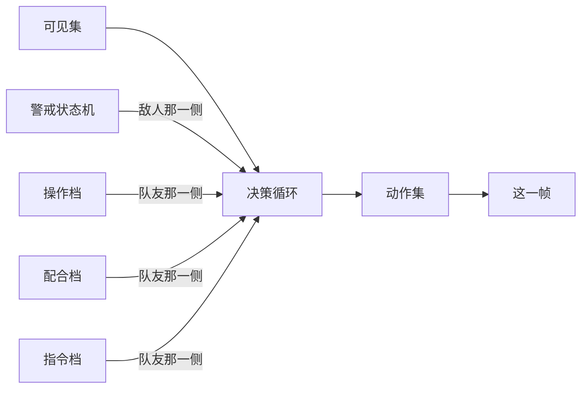

# 一套决策循环两个阵营共用：敌人挂警戒状态机，队友挂两个档号

> **正典层级**：第 5 级（系统细化）。与[战斗与关卡](../canon/gameplay/战斗与关卡.md)冲突时以正典为准；**档位阈值、警戒范围与延迟、脱战距离与时长、难度那两个量全归 `GP-7`，预警窗口与反应速度归 `GP-6`，本页一个都不定。**
>
> 返回 [总索引](../README.md)｜[系统文档与提案索引](./README.md)｜相关：[战斗与关卡 · 队友与敌人](../canon/gameplay/战斗与关卡.md) · [感知与视野系统](./感知与视野系统.md) · [角色动作状态系统](./角色动作状态系统.md) · [关卡系统](./关卡系统.md) · [ADR-0013](../decisions/ADR-0013-战斗片段就是一屏.md)｜台账：[`GP-36`](../spec/issues/README.md)

## 摘要

**这一页回答一个问题：一个不由玩家操作的角色，这一帧决定做什么。** 读完你能判断两件事 —— 一条新的 AI 行为该挂在哪个门上，以及「这个学生为什么还不会那一招」该去看哪个档号。

敌人与队友走**同一条决策循环**，差别只在挂上去的门与可用的动作 —— 敌人那一侧挂警戒状态机与警戒传播，队友那一侧挂两个行为档号与一个指令档。

下面这张图回答一个问题：**这条循环上挂着哪几个门，以及哪个门是哪一侧的。** 「敌人与队友走同一条循环」这句话的分量全在中间那个节点上 —— 它只有一个。



**重画条件**：循环上增删一个门、某个门换到另一侧，或者两侧改成走两条循环时重画。

**这张图不新增任何事实，权威是下面「结构」那几节。** 每个档号各有哪些行为、警戒怎么传播、分级面板怎么取子集，图都放不下。

**它持有**：决策循环那条链、敌人的警戒状态机与脱战、警戒传播、预警与对策的声明、分级面板怎么取子集、队友两条轴各自的行为表与分轴判据、指令档与它的默认档、难度那两个量作用在哪。

**它不持有**这些，各有自己的家：

- 可见性数据（[`感知与视野系统`](./感知与视野系统.md)）。
- 姿态与流转（[`角色动作状态系统`](./角色动作状态系统.md)）。
- 伤害与状态的结算（[`伤害系统`](./伤害系统.md)）。
- 技能的字段与冷却（[`技能系统`](./技能系统.md)）。
- 有哪些敌人 —— 那是内容（`ENG-5`）。
- 敌人预算与放置位（[`关卡系统`](./关卡系统.md)）。
- 寻路算法，以及经营侧的学生日程 AI。

**两条最要紧的承诺。** 一是**不给敌人开专用通道**：面板、状态载体、技能与道具管道、成长字段、动作机全是同一套，哪里看起来像例外，那里写明了它为什么不是。二是**队友的两条轴不合成一个档号** —— 合成之后玩家就看不出这次变强是因为练了还是因为关系好了，而那是这套分档存在的全部理由。

## 术语

只列**只有本页在用**的词。跨页共用的在[术语表](../reference/术语表.md)，本节不重复（`决策循环`、`行为档`、`操作档`、`配合档`、`分级面板`、`预警`、`对策`、`警戒`、`脱战`、`动作集`、`可见集`、`实战值`、`档位` 都在那边）。

| 词 | 它在本页指什么 |
| --- | --- |
| **地板** | 人人从第一天就有、**不占任何档位**的那些基础行为（收指令、扶倒地同伴、不挤在同一处）。清单在正典，本页不复述 |
| **指令档** | 玩家给队伍下的那个指令处在哪一档（自由作战是默认档）。它与两个行为档号是三件独立的事 |

## 上游约束

- [战斗与关卡 · 队友与敌人](../canon/gameplay/战斗与关卡.md)：队友 AI 接三条指令、自动与场景物件互动且玩家可标记优先目标；敌人分级用面板、施法可被打断且打断要有可见反馈、发现玩家后向附近同伴传播警戒、有脱战规则、同屏敌人上限、起步只做魔化生物一类靠三种行为差异撑。**这是敌人侧与指令侧全部结构的来源。**
- [战斗与关卡 · 队友 AI 分档：学生「变强」必须看得见](../canon/gameplay/战斗与关卡.md)：五档档名、**升档必须解锁一个玩家看得出来的具体行为而不是提高反应速度与命中率**、两条轴的驱动指标与理由、至少要做最低与最高两档、档名与关系档位交集为空。**这是队友分档全部结构的来源；档数与档名是接口常量，家在那里，本页不复述。**
- [战斗与关卡 · 基础 AI 不分档，人人从第一天就有](../canon/gameplay/战斗与关卡.md)：哪些行为是地板。**约束本页那张分档表里不许出现任何一条地板行为；清单在正典，本页写链接不复述。**
- [战斗与关卡 · 分档的是时机、衔接与配合](../canon/gameplay/战斗与关卡.md)：判据是「做不做是地板，什么时候做与跟谁一起做是分档」；最低那一档由「都还不会」定义；**两条轴不合成一个档号**。**这是本页那张表的判据来源与它的验收依据。**
- [战斗与关卡 · 队友的道具与技能使用](../canon/gameplay/战斗与关卡.md)：触发条件按类型分、只用自己持有的物品、使用时机受读条约束、**用不用药是地板而挑不挑时机是分档**。**约束「挑时机」落在分档那一侧，而「用不用」不落。**
- [战斗与关卡 · 读条与打断](../canon/gameplay/战斗与关卡.md)：读条画在执行者身上、受击中断且不消耗、**打断是双向机制**。**约束「打断敌方施法」与「挑时机喝药」两条都落在既有那条读条规则上，本页不另造一套。**
- [战斗与关卡 · 防御与失衡](../canon/gameplay/战斗与关卡.md)：普通与精准是同一次按下的两段、**精准防御的回报按角色一律相同且可被天赋与状态提升**、精准防御的回蓝效率不得高于进攻回蓝。**约束档位只决定掐不掐得准、不决定吃多少。**
- [战斗与关卡 · 跳跃保留，不换成「按技能自动空中打击」](../canon/gameplay/战斗与关卡.md)：跳跃有价值的前提是敌人得有「跳能躲开」的攻击，这条归后续的敌人攻击设计兑现。**本页兑现它，写成攻击定义上的对策声明与一条载入校验。**
- [战斗与关卡 · 两层难度，职责不重叠](../canon/gameplay/战斗与关卡.md)：全局难度改敌人数值与 AI 的反应速度与攻击欲望、委托档位改这一关的敌人配置，**两层都不改变资源产出与经济压力**。**这是难度那一节的唯一来源，本页不加第三层。**
- [战斗与关卡 · 失败判定](../canon/gameplay/战斗与关卡.md)：学生倒下不死亡且每人每关可被救起一次、倒地仍可被追打。**约束「扶倒地的同伴」这条行为的形状，也是它归地板的理由之一。**
- [战斗与关卡 · 战斗关卡的空间模型：带纵深的横版](../canon/gameplay/战斗与关卡.md)：纵深连续、按纵深排序。**约束 AI 的走位是三轴的，也约束「补位」这条配合行为落在纵深上。**
- [角色与成长 · 角色面板](../canon/gameplay/角色与成长.md)：**所有角色共用同一套面板**，包括敌方精英，而且这是一致性要求不是简化。**这是分级面板取子集那条的硬依据。**
- [角色与成长 · 四项属性的作用方向](../canon/gameplay/角色与成长.md)：防御与抗性的**大头不在属性上**，而在宝物、宝石、天赋与状态。**这是「精英要装宝物」那条的关键输入 —— 不装的话它只剩基底防御。**
- [角色与成长 · 书 → 学会 → 练熟](../canon/gameplay/角色与成长.md)：实战值只在命中时累积、到档位解锁技能孔。**约束操作轴读的是同一个量，也约束敌人的实战值只走技能孔那条路。**
- [角色与成长 · 战利品归属](../canon/gameplay/角色与成长.md)：学生会自动装备自己持有的宝物、玩家手动配的优先。**约束「玩家标记的优先目标优先于 AI 自己挑的」用的是同一形状，不新造规则。**
- [ADR-0013](../decisions/ADR-0013-战斗片段就是一屏.md)：战斗片段就是一屏、清干净才能往前。**约束敌人预算以一屏为单位、脱战两个条件按一屏的尺度给、队友不需要跟随半径。**
- [`感知与视野系统`](./感知与视野系统.md)：一份可见性数据，AI 只从可见集与记忆集取目标。**这是决策循环第一步的唯一输入。**
- [`角色动作状态系统` · 战斗动作层流转表](./角色动作状态系统.md)与[`角色动作状态系统` · 动作叠加层：互斥的主动动作，给运动层一个"定身/忙"标志](./角色动作状态系统.md)：姿态归动作机、时长归效果；施法分瞬发与读条，**敌人被打断的读条不退还 MP**；G1 抢占。**约束本页只产出「想做什么」，并写明动作集按角色声明这件事在那一页。**
- [`成长系统` · 技能：书给起点，实战值给战力](./成长系统.md)：实战值按「角色 × 技能」记，**队友 AI 读的汇总量是派生的**。**这是操作轴读口的唯一出处。**
- [`人际系统` · 档位是接口，爱心是刻度](./人际系统.md)：机制一律读档位，不读爱心或填充量。**这是配合轴读口的唯一出处。**
- [`技能系统` · 一个战斗技能要声明的字段](./技能系统.md)与[`技能系统` · 冷却：每个技能各有下限](./技能系统.md)：技能的字段表、三种形态、每技能各有不为零的冷却下限。**约束「技能释放时机」只挑时机、不碰冷却，也约束预警声明加在攻击那一侧而不是另造一张表。**
- [`伤害系统` · 阵营：不做友军伤害](./伤害系统.md)：同阵营不进结算。**约束目标选择不必考虑打到自己人。**
- [`装备系统` · 谁来配：玩家配主角，学生自动配而玩家可覆盖](./装备系统.md)：自动配装只对不由玩家操作的角色成立、会自动配装的角色必须声明一条偏好轴且缺了载入报错。**精英与 BOSS 走的就是这条判据，本页不把它改成三态。**
- [`背包系统` · 关卡里：翻包暂停，用道具不暂停](./背包系统.md)：用道具不暂停世界。**约束队友用药是世界里的动作。**
- [`关卡系统` · 关卡系统只持有配额，不持有敌人](./关卡系统.md)：档位喂进来的是敌人预算（放多少、能不能有精英与 BOSS、放置位），上界受同屏上限与片段结构两头夹。**这是本页的输入接口，形状已经定死，本页接住它而不改它。**
- [`状态效果系统` · 载体的字段](./状态效果系统.md)与[`状态效果系统` · 三类，判据是「它动不动动作机、改不改数值」](./状态效果系统.md)：载体六个字段含来源、三类按「动不动动作机、改不改数值」分。**约束难度那两个量与警戒状态都不许长成第二份修饰表。**
- [世界观 · 外魔与魔化](../canon/world/世界观.md)：魔化造物按来源分类，**那是来源分级不是难度分级**，它决定一处魔化能不能被根治。**约束载体类别在战斗里只管死亡终态留下什么；类数是接口常量，家在那里，本页不复述。**
- [`数值模型` · 尚未给值的量，各自写明校准办法](./数值模型.md)：值的唯一来源是参数表，本页只写量纲与约束形式。**约束本页新增的量一律进那张表。**
- [ADR-0009](../decisions/ADR-0009-编辑器主导的开发模式.md)：参数唯一来源是场景与资源、代码不留能用的默认值；动画帧与摆位由作者在 Godot 里管。**约束预警分成「我定字段、作者做动画与填窗口」两半，也约束缺声明当场报错。**

## 结构

### 决策循环：一条顺序固定的链

每一个不由玩家操作的角色，每帧走同一条链：

```
取可见集与记忆集 → 选目标 → 从自己声明的动作集里选动作 → 交给动作机
```

**四个环节顺序固定，没有第二条链。** 这一条挡住的是「每加一类角色就长出一套自己的决定方式」。

- **第一步的输入只有[`感知与视野系统`](./感知与视野系统.md)那一份。** AI **不许直接读世界里的实体表** —— 这条是那份数据的承重项，反证写在它那一页（清空可见集后 AI 找不到目标）。本页这一句是同一件事的另一半，两边都写一次是刻意的。
- **本页不出姿态。** 它只产出「想做什么」，姿态与流转全在[`角色动作状态系统`](./角色动作状态系统.md)。
- **剧情演出期间这条链不跑。** 演出接管输入 → 世界暂停（[玩法定位 · 弹界面接管输入就暂停世界，世界里的动作不暂停](../canon/gameplay/玩法定位.md)）→ 这条链跟着不推进。**本页不为演出加任何状态**：[`剧情演出系统`](./剧情演出系统.md)要摆布角色时把动作直接递给动作机，走的是与本页同一个入口、只是来源不同。加一个「被演出接管」的态就要回答「演出里敌人能不能打你」，而正典已经答了；更实的一处是那个态会让「现在能不能动」有两个判断处，而不一致时不报错。
- **动作能不能真的发出由动作机说了算。** 受击、失衡、冷却未到、正在读条 —— AI 被拒时走同一条拒绝路径，**不许绕过去**。理由是姿态的所有权在那一页；AI 自己判一遍就会出现两个答案，而不一致时玩家看到的是「他明明在硬直里却出招了」。

### 两个阵营共用这条链，差别只在挂上去的门

| 阵营 | 额外挂什么 |
| --- | --- |
| 敌人 | 警戒状态机、警戒传播、难度那两个量 |
| 队友 | 两个行为档号、一个指令档 |

**没选拆成敌我两份。** 两边共用同一份角色面板（正典的一致性要求）、同一套技能与道具使用管道、同一份可见性输入；拆开会让「这个动作现在可不可用」有两个家，而那种分叉不报错。挂上去的门是**加法**，不是两套并行的逻辑。

### 一个角色有哪些动作，是它自己声明的

**只保证基础动作，其余各自声明** —— 有些怪物没有跳跃。声明项、哪些必有、以及那几条连通性载入校验都在[`角色动作状态系统`](./角色动作状态系统.md)，**本页只用它**：

- **AI 只从这个角色声明的动作集里选。** 那是**正常筛选，不是错误** —— 没有跳跃的怪物不会尝试跳，也不需要为它写一条特例。
- **一条行为引用了这个角色没声明的动作时，载入报错**，并说清是哪条行为要哪个动作。**这条与上一条必须分开写**：混在一起会让「内容配错了」静默变成「它就是不做那件事」。
- **「对策」说的是玩家有办法应对，与敌人自己的动作集是两件事。** 主角有全套动作（那一页写死），所以下面那条对策覆盖校验不受任何怪物缺不缺跳跃影响。**这一句要显式写**，否则两处都带「跳」字会被读成同一件事。

### 敌人的警戒状态机

**它与[`角色动作状态系统`](./角色动作状态系统.md)那两层是正交的两台机器**：警戒管「打谁」，动作机管「现在能不能动」。一个被打中的敌人仍然处在追击状态。合成一台的后果是那张流转表要为每个警戒态各来一遍。

| 状态 | 进入条件 | 退出去哪 |
| --- | --- | --- |
| **未察觉** | 初始；归位恢复完成 | 目标进入自己的可见集 → 警戒 |
| **警戒** | 察觉到目标，或被同伴传播到 | 确认目标位置 → 追击；目标既不在可见集也不在记忆集且过了一段时间 → 脱战返回 |
| **追击** | 在警戒中确认了目标 | 超出追击距离或追击时长 → 脱战返回 |
| **脱战返回** | 上面任一条触发 | 回到原位 → 归位恢复 |
| **归位恢复** | 回到原位 | 恢复完成 → 未察觉 |

- **被传播到的同伴进「警戒」而不是「追击」**，因为它拿到的是一个位置而不是一个目标，见下面「警戒传播」。
- **脱战返回途中再次察觉到目标会回到警戒** —— 它没有无敌也没有失忆，只是在往回走。
- **归位恢复要恢复哪些量写明**：HP、MP、体力条与失衡值回到初始，**身上由本次交战施加的可解除状态清掉**（不可解除的按它自己的时长走完，[`状态效果系统`](./状态效果系统.md)）。不恢复的话「打掉一半退回去、再进来接着打」就是一条静默的免费路径。
- **不为片段边界写特例。** [`关卡系统` · 片段之间是转场，不是无缝滚动](./关卡系统.md)已经让敌人不跨片段追击，所以玩家离开片段等于同时满足了距离条件。

### 脱战那两个条件在一屏一清的模型下剩多少用处

[ADR-0013](../decisions/ADR-0013-战斗片段就是一屏.md) 之后片段边界替脱战兑现了大半，所以那两个条件的量级**按一屏的尺度给，不按大地图**。这一句要写出来，否则给值那一轮会照「追出半张图」的尺度给。

| 条件 | 它在这个模型下挡什么 |
| --- | --- |
| 追击距离 | **不离开自己的守卫点太远** —— 让远程与守位的敌人留在原处，而不是整屋跟着玩家跑成一串 |
| 追击时长 | **打掉一半退回去、等它站着不动再进来** —— 没有它，玩家可以靠反复进出把一屋敌人磨光 |

### 警戒传播：按范围传，只有一跳

**敌人发现玩家后向声明范围内的同伴传播警戒。** 不做传播的话「从背后摸过去」只省了几秒路程；做了才有真后果 —— 不先处理掉哨兵，接下来要面对被叫来的一群。

- **只有一跳，不做链式。** 链式在一个片段内等于全图警戒，于是「先处理掉哨兵」这个决策消失了（反正都会被叫来），而同屏敌人上限也会被撞破。
- **传播的对象是警戒状态本身，附一个最后已知位置**，不是「直接知道玩家在哪」。被叫来的同伴要自己走到那个位置**再重新感知** —— 否则传播就等于共享全知，而正典要的是「没有角色全知」。
- **最后已知位置就是[`感知与视野系统`](./感知与视野系统.md)那条记忆项持有的那个字段**，不是本页另存一份。
- 范围与延迟归 `GP-7`。

### 预警与对策：都是攻击定义上的显式声明

| 声明项 | 说明 | 缺了怎么办 |
| --- | --- | --- |
| 有没有预警 | 这一招出手前有没有一个看得出来的起手 | 缺声明**载入报错** |
| 预警窗口 | 起手持续多久 —— 队友与玩家的反应余量 | 带预警而缺窗口**载入报错**；值归 `GP-6` |
| 对策 | 这一招可以用什么躲开：跳、纵深挪步、闪避、防御（可以多条） | 缺声明**载入报错** |

- **预警不从动画前摇推。** 它是攻击定义上的一个字段，理由是 [ADR-0009](../decisions/ADR-0009-编辑器主导的开发模式.md) 要求参数唯一来源是资源 —— 从动画推等于让美术改一帧就改掉玩法。**分工**：字段与判定我写，动画与窗口值作者在检查器里填。
- **一条载入校验兑现正典挂着的账**：**全部敌人定义合起来必须覆盖到每一种对策**，少一种就报错并说清少哪一种。正典写明跳跃有价值的前提是敌人得有「跳能躲开」的攻击 —— 这条校验就是那个前提的执行体。
- **校验放在「全部定义合起来」这一层，不是每个敌人。** 要求每种敌人都带一招「跳能躲开」的横扫会逼出一批不合理的内容（远程敌人为什么要有横扫），而玩家需要的是**整套敌人里每种对策都有用**。

### 分级面板是同一套面板的两个子集

| 级别 | 取面板上的哪几栏 |
| --- | --- |
| 杂兵 | 等级、四项属性、技能 |
| 精英与 BOSS | 上面那些，另加特质、天赋、实战值 |

**缺的栏读作空或零，不是另一份数据形状。** 正典写明所有角色共用同一套面板且那是一致性要求；[`成长系统`](./成长系统.md)那条「不许给任何角色开专用成长通道」是同一条纪律的另一面。**判据：新加一级敌人时，填的是「取哪几栏」，而不是「用哪份结构」。**

- **敌人的实战值在定义上给定、不在关卡内累积。** 理由是敌人不跨关存在，累积那一份没有读者。它唯一的读者是**技能孔解锁**（[`技能系统`](./技能系统.md)）。**这不是专用通道** —— 字段与读口都是同一套，只是喂它的来源不同。
- **精英与 BOSS 装宝物，杂兵不装**（杂兵的子集里没有宝物栏这一栏）。装的那条路是[`装备系统` · 谁来配：玩家配主角，学生自动配而玩家可覆盖](./装备系统.md)那条既有判据（只对不由玩家操作的角色成立），**不把它改成三态**；**偏好轴对精英与 BOSS 必填，缺了载入报错**。
- **为什么必须装**：[角色与成长 · 四项属性的作用方向](../canon/gameplay/角色与成长.md)写明防御与抗性的大头不在属性上，所以不装宝物的精英只剩基底防御 —— 要让它硬，就得给敌人加一个「直接写死防御」的字段，而那正是一条专用通道。
- **穿着的那件不保证掉落。** 掉落表是定义上另一件事，与它穿什么无关；绑在一起的话噩梦档的随机配装就变成了一条刷宝路径。
- **敌人不用消耗道具**，恢复手段一律走技能。这样「打断」照样有对象（治疗技能要读条），而不用给敌人开一个背包、再回答「打死它掉不掉那瓶药」。

### 三种敌人的差别落在决策配置的取值上

**杂兵、远程、精英不是三套代码分支**，而是同一条决策循环的三组配置取值（偏好的交战距离、进攻欲望的基线、用不用技能、会不会守位）。理由是[玩法定位 · mod 的扩展边界](../canon/gameplay/玩法定位.md)写明内容外置、规则不外置 —— 三套分支等于把内容写进规则。

**判据：加一种敌人行为时，先问它能不能只靠调那几格取值表达出来。** 表达不出来的，说明它要的是一条新行为而不是一种新敌人。

### 载体类别只决定死亡终态留下什么

敌人定义声明它的**魔化载体类别**（取值见[世界观 · 外魔与魔化](../canon/world/世界观.md)，**本页不复述类数**）。正典写明那是**来源分级不是难度分级**，所以在战斗里它：

- **不改数值，也不改行为档。**
- **只决定死亡终态留下什么**：尸体、残骸，或者什么都不留。纯由灵构成的那一类没有实体载体，所以**不留尸体** —— 由此「搜刮」这条采集路径对它不成立（[`关卡系统` · 资源点按作业对象分类](./关卡系统.md)）。

### 队友：两条轴，两个档号，不合成

**两条轴各自成一个档号，共用同一套五档档名**（档名与档数是接口常量，家在[战斗与关卡 · 队友 AI 分档：学生「变强」必须看得见](../canon/gameplay/战斗与关卡.md)）。

| 档号 | 读什么 | 这一档在读谁 |
| --- | --- | --- |
| **操作档** | 该角色累积的技能实战值汇总量（[`成长系统` · 技能：书给起点，实战值给战力](./成长系统.md)，那是派生量） | 逐档往外推：自己的处境 → 对手的预警 → 对手正在读的那一条 → 一整套招与冷却 |
| **配合档** | 该角色与主角的关系档位（[`人际系统` · 档位是接口，爱心是刻度](./人际系统.md)，读档位不读爱心） | 读的方数逐档变多：自己 → 一个同伴 → 主角的当前动作 → 别人的出招时点 → 整场的分配 |

**每一条分档行为在定义时声明它读哪一条轴**，分轴的判据是：**它掐的是自己的手，还是跟别人的配合。**

**「这一档在读谁」是加新行为时的填表依据**，不是对现有清单的描述 —— 靠背清单的话迟早有人把一条配合类的东西塞进操作档。

### 操作档五档

| 档 | 解锁什么 |
| --- | --- |
| 生手 | **都还不会** —— 追着最近的敌人打、不闪避、被打断就乱掉、站在敌人脸上喝药 |
| 熟练 | **挑时机**（先退出攻击范围再读条，用药与用技能都算）＋ **简单衔接** |
| 老练 | **会闪避有预警的攻击** |
| 精通 | **会打断敌方施法** ＋ **优先处理远程敌人** |
| 大师 | **掐得准防御时机**（吃到精准那一段）＋ **复杂衔接** |

**简单衔接与复杂衔接各有可判定的形式**，不是一句「衔接更好」：

| | 内容 | 判据 |
| --- | --- | --- |
| **简单衔接**（熟练） | 相邻两招不互相废掉：不在自己读条期间插另一招、不在把目标打退之后接近身技、不空按冷却未到的招 | 只看上一招的收招与射程 |
| **复杂衔接**（大师） | 三招以上串成一套，顺序由**目标当前状态**与**自己全部技能的冷却**决定，不是固定顺序 | **同一组技能在两种目标状态下排出两种顺序** |

**技能衔接为什么跨两档出现**：它是这条阶梯上唯一能连续加深的东西 —— 别的行为都是「会不会」，一次就用完了；而正典要求每一档都多一件看得出来的事。

**技能衔接不是普攻连段。** [战斗与关卡 · 按键与连击](../canon/gameplay/战斗与关卡.md)那条固定连段是另一件事（同一招的分段），本页说的是不同技能之间的排序。两处都写全名。

### 配合档五档

| 档 | 解锁什么 |
| --- | --- |
| 生手 | **都还不会** —— 各打各的，只把自己面前那一只算进来 |
| 熟练 | **自发集火** —— 不用玩家下令也会跟队友打同一个目标 |
| 老练 | **会读主角的动作** —— 主角放屏障或控场时主动进入范围 |
| 精通 | **会接别人的出招** —— 接主角与同伴起手的连击 |
| 大师 | **会分战场** —— 补到主角覆盖不到的那一排或那一侧、主角被围时主动去解围、有人在扶倒地同伴时主动上前顶住 |

**「接连击」从正典的「接主角起手」扩到「接主角与同伴起手」**，理由指回正典自己那句「跟主角与同伴怎么配合」。

### 地板与分档的边界：三条切开的地方

**判据是正典那一句**（做不做是地板，什么时候做与跟谁一起做是分档）。清单在[战斗与关卡 · 基础 AI 不分档，人人从第一天就有](../canon/gameplay/战斗与关卡.md)，本页不复述；这里只写三条容易搞错的切法：

| 这件事 | 地板那一半 | 分档那一半 |
| --- | --- | --- |
| 用药与用技能 | 用不用 | 挑不挑时机 |
| 站位 | **不挤在同一处**（挤在一起看起来像坏了，而正典那笔纵深排位的账也白算了） | 主动补到主角覆盖不到的那一侧 |
| 收指令 | **收得到，而且响应多快都一样** | 无 —— 响应延迟不分档 |

**响应延迟为什么一条都不分档**：正典同一节开头写着升档要解锁一个玩家看得出来的具体行为、**而不是提高反应速度**。把延迟当分档奖励与那一句直接打架。

**「扶倒地的同伴」是地板**：按判据它是「做不做」；而放进档位会让一支新队伍完全不能互救，而正典写着每人每关可被救起一次。

**地板行为与分档行为走同一条动作管道**，差别只在触发条件里多不多一个时机判断。两条管道会让低档队友在实现上真的变成另一种角色，而玩家看到的就会是「坏了」而不是「他还嫩」。

### 指令是一个互斥的档，默认档不算一条指令

**正典那几条指令构成一个互斥的档**（哪几条见[战斗与关卡 · 队友与敌人](../canon/gameplay/战斗与关卡.md)，本页不复述），**外加一个默认档「自由作战」**。

**自由作战不是一条新指令**，它是没有指令时的样子 —— 所以正典那份清单一条不多一条不少。不写出这个默认档的话，「待命」就会被误当成默认值，而那意味着队友默认不接战。

- **指令与分档正交**：指令改「打哪个、要不要打」，分档改「掐得准不准、接不接得上」。低档队友照样收得到指令。
- **「撤退」指令与玩家撤离关卡是两件事**：前者是队友脱离交战、往主角身后退；后者是玩家返回入口点撤出关卡（[战斗与关卡 · 失败判定](../canon/gameplay/战斗与关卡.md)）。同名不同物，两处都写全名。
- **玩家标记的优先目标优先于 AI 自己挑的**，形状与[`装备系统` · 谁来配：玩家配主角，学生自动配而玩家可覆盖](./装备系统.md)那条「玩家手动的优先」同源，不新造规则。

### 队友的自动采集与走位

- **自动与场景物件互动时只挑可见集里的目标**（[`感知与视野系统`](./感知与视野系统.md)）—— 看不见的资源点不会被自动采，所以「摸黑走过去会漏采」对队友同样成立。
- **不设「不离主角太远」的跟随半径。** 一个战斗片段就是一屏（[ADR-0013](../decisions/ADR-0013-战斗片段就是一屏.md)），队友走不远 —— 加一条半径是给一个不存在的问题写规则。
- **精准防御的回报不按档位分配**：档位只决定掐不掐得准，吃到多少是同一份（正典那一节持有那份回报是什么，本页不复述）。

### 难度那一层落成两个量

| 量 | 作用在哪 | 量纲 |
| --- | --- | --- |
| **反应速度** | 从目标进入可见集到出手之间的延迟 | 时长 |
| **攻击欲望** | 决策循环里「进攻还是后退」这个选择的权重 | 无量纲系数 |

- **两个都作用在决策循环上，不作用在分档上** —— 分档是队友那一侧，而全局难度只改敌人。
- **两个都不碰资源产出与经济压力**（[战斗与关卡 · 两层难度，职责不重叠](../canon/gameplay/战斗与关卡.md)）。
- **它们以修饰的形式到场，落[`状态效果系统` · 载体的字段](./状态效果系统.md)的永久项**，不散在决策代码里 —— 否则「难度改了什么」查不出来。全局难度开局选定后锁定，所以它载入时算一次。
- 取值范围归 `GP-7`；反应速度另受 `GP-6` 管（它是手感量，只能实机调）。

### 敌人预算从关卡那一侧接住

**[`关卡系统`](./关卡系统.md)给数量、能不能有精英与 BOSS、放置位；本页给种类与行为。**

- **预算以一屏为单位**（[ADR-0013](../decisions/ADR-0013-战斗片段就是一屏.md)），上界就是正典那条同屏敌人上限 —— 那个数的家在[战斗与关卡 · 队友与敌人](../canon/gameplay/战斗与关卡.md)，本页不复述。
- **本页不反过来改配额。** 一进一出，两侧不互相写。

## 接口

### 谁喂它、谁读它

| 方向 | 对方 | 形状 |
| --- | --- | --- |
| 入 | [`感知与视野系统`](./感知与视野系统.md) | 可见集与记忆集；**目标选择的唯一来源** |
| 入 | [`关卡系统`](./关卡系统.md) | 敌人预算与放置位；**本页不改它** |
| 入 | [`成长系统`](./成长系统.md) | 实战值汇总量（派生），操作档读它 |
| 入 | [`人际系统`](./人际系统.md) | 与主角的关系档位，配合档读它 |
| 入 | [`技能系统`](./技能系统.md) | 技能的字段与冷却；本页只挑时机 |
| 入 | 全局难度 | 反应速度与攻击欲望两个修饰，经[`状态效果系统`](./状态效果系统.md)到场 |
| 入 | [`角色动作状态系统`](./角色动作状态系统.md) | 这个角色声明了哪些动作；**缺声明那一侧的报错在那一页** |
| 出 | [`角色动作状态系统`](./角色动作状态系统.md) | 「想做什么」；**被拒就是被拒，不绕过去** |
| 出 | 死亡终态 | 载体类别决定留尸体、残骸还是什么都不留；采集那一侧接[`关卡系统`](./关卡系统.md) |
| 出 | 统计事件总线 | 队友升档一条、敌人进入警戒一条 |
| 出 | [`图鉴系统`](./图鉴系统.md) | 敌人定义与它的攻击（含预警与对策声明）被它按标识读走；**收录那一位由显形那一刻置，本页不加字段** |
| 读 | [`装备系统`](./装备系统.md) | 精英与 BOSS 的自动配装走它那条判据与偏好轴 |
| 存档 | 临时续玩点 | **关卡内的警戒状态进它**；两个档号是派生量，**不单独存** |
| 作者填 | 攻击定义 | 有没有预警、预警窗口、对策；**缺了载入报错** |
| 作者填 | 敌人定义 | 级别、载体类别、三组决策配置取值、偏好轴（精英与 BOSS）；**缺了载入报错** |

**挂载点到此为止。** 将来加一样与 AI 有关的东西时，先问它挂在上面哪一格，而不是顺手插一个新钩子。

### 它不碰的五条接缝

- **可见性数据**：本页只读可见集与记忆集，怎么算在[`感知与视野系统`](./感知与视野系统.md)。
- **姿态与流转**：本页只递「想做什么」，姿态在[`角色动作状态系统`](./角色动作状态系统.md)；**动作集按角色声明这件事也在那一页**，本页只用它。
- **伤害与状态的结算**：一次命中算出什么在[`伤害系统`](./伤害系统.md)。
- **敌人预算与放置位**：[`关卡系统`](./关卡系统.md)持有，本页是它的下游。
- **精准防御那份回报是什么**：正典持有，结构在[`成长系统`](./成长系统.md)的派生表；本页只说档位决定掐不掐得准。

## 边界与非目标

- **不定任何数值**：两条轴的档位阈值、警戒范围与延迟、脱战距离与时长、难度那两个量的取值范围全归 `GP-7`；预警窗口与反应速度另受 `GP-6` 管（手感量，只能实机逐帧调）。**接口常量不是数值** —— 五档的档数与档名、两条轴的条数、三种敌人行为、指令条数、魔化载体类数，归属各写在正典或[世界观](../canon/world/世界观.md)那一节。
- **不定内容**：有哪些敌人、各带什么招、每招的预警长什么样，属内容，走[内容外置](../canon/gameplay/玩法定位.md)（`ENG-5`）。
- **不改档名与两条驱动轴**：正典已定，本页照它走。
- **不做寻路**：本页决定「往哪去」，怎么绕过障碍是实现。
- **不做可见性计算**：另一份。
- **不做姿态与流转**：另一份。
- **不做伤害结算与打击反馈**：[`伤害系统`](./伤害系统.md)与 `GP-6` 各持一侧。
- **不做技能字段与冷却**：[`技能系统`](./技能系统.md)持有。
- **不做掉落表**：掉落归谁在正典，掉什么是内容。
- **不做 BOSS 的多阶段与专属机制**：那是内容，随各 BOSS 设计走；本页只保证它用同一套面板与同一条决策链。
- **不做学生日程 AI**：那是经营侧的另一套动作机，明确后置（进度见[待办台账](../spec/issues/README.md)）。
- **不做基地防卫战**：正典明确不做，所以俯视场景没有战斗 AI。
- **不做界面**：两个档号怎么看得见、指令怎么下、打断反馈长什么样归[`界面系统`](./界面系统.md)与作者实机定（`UI-17`）。**那一份把两个档号落在角色详情页一行「战斗评级」的两格上，并写明不许合成一个总评** —— 合成在本页数据上不违反任何东西（读口仍然是两个），所以那条约束只能长在界面那一侧。
- **不做敌人的动画、碰撞区域与摆位**：作者在 Godot 里管（[ADR-0009](../decisions/ADR-0009-编辑器主导的开发模式.md)）。
- **不设计存档序列化格式**：只定「关卡内的警戒状态进临时续玩点，两个档号是派生量所以不单独存」——格式与版本口径在 [ADR-0015](../decisions/ADR-0015-存档的版本与缺字段口径.md)，分片怎么声明在[`存档系统`](./存档系统.md)。**那两个档号是派生量**这条现在有一条通用反证钉着它，见那一份。
- **同名不同物，两处都要写全名**：
  - **「撤退」指令与玩家「撤离关卡」**：前者是队友脱离交战往主角身后退，后者是玩家返回入口点结束这一趟。
  - **「技能之间的衔接」与「固定连段」**：后者是同一招的分段（[战斗与关卡 · 按键与连击](../canon/gameplay/战斗与关卡.md)），本页说的是不同技能之间的排序。
  - **「档」在本作有好几套**：本页有**操作档**与**配合档**两个，它们与关系档、生活技能的技艺档、境况档、委托档位、稀有度与品质的取值都不是一回事。**档名共用一套阶梯，但档号是两个。**
  - **「警戒状态」与动作机的姿态**：前者管「打谁」，后者管「现在能不能动」，两台正交的机器。
  - **「预警」与[`感知与视野系统`](./感知与视野系统.md)的「发现」**：预警是攻击的起手（给对方反应余量），发现是看见了；两者都不产出姿态，但不是同一件事。

## 理由与取舍

- **没选拆成敌我两份文档。** 两边共用同一份角色面板、同一套技能与道具管道、同一份可见性输入；拆开会让「这个动作现在可不可用」有两个家，而那种分叉不报错。正典那条「不许给任何角色开专用通道」正好禁止这个。
- **没选把感知收进本页。** 可见性数据有四类读者（本页、队友的「优先处理远程」、[`关卡系统`](./关卡系统.md)的资源点显形、玩家的视野表现），**多读者无主**；收进本页等于让另外三个读者去读一份讲 AI 的文档，而防重构点正是「只有一份」。
- **没选把两条轴合成一个档号。** 取较低者会让「我带他出征练了半个月他却没变强」成立（关系成了约束边），而这直接否掉正典那句「AI 变聪明和他真的练过是同一件事」；加权与分段门让玩家看不出这次变强的原因，于是「该去练还是该去处关系」这个决策消失。代价是界面要显示两格。
- **没选让响应延迟当分档奖励。** 正典同一节开头排掉了「提高反应速度」，而那条候选与它直接打架 —— 本批把候选划掉，不是给它找一档放。
- **没选把「扶倒地的同伴」放进档位。** 按判据它是「做不做」；而一支新队伍完全不能互救与正典「每人每关可被救起一次」冲突。代价是它不再是高档队友的一个亮点 —— 换来的是低档队友不像坏了。
- **没选给技能衔接只留一档。** 它是这条阶梯上唯一能连续加深的东西，只留一档会让熟练到精通之间少一件看得出来的事。代价是「简单」与「复杂」要各写一条判据，否则它会退化成一句形容词。
- **没选让警戒与动作机合成一台。** 那张流转表要为每个警戒态各来一遍，而一个被打中的敌人明明仍在追击。
- **没选链式警戒传播。** 一个片段内链式等于全图警戒，「先处理掉哨兵」就没有意义了，同屏上限也会被撞破。代价是范围外的同伴真的不知道 —— 那是刻意的。
- **没选传播时直接给出玩家位置。** 那等于共享全知，而正典要的是「没有角色全知」。走到最后已知位置再重新感知，才让残影那条机制在敌人这一侧也成立。
- **没选从动画前摇推预警窗口。** 美术改一帧就会改掉玩法，而 [ADR-0009](../decisions/ADR-0009-编辑器主导的开发模式.md) 要求参数唯一来源是资源。
- **没选要求每种敌人都带一招「跳能躲开」的攻击。** 那会逼出不合理的内容（远程敌人为什么要有横扫）；玩家需要的是整套敌人里每种对策都有用，所以校验放在「全部定义合起来」这一层。
- **没选给敌人一个「直接写死防御」的字段。** 那是专用通道。让精英装宝物换来的是「它强在哪」查得到出处，代价是每个精英定义多一个偏好轴字段。
- **没选让敌人穿着的宝物必定掉落。** 绑在一起的话噩梦档的随机配装就变成一条刷宝路径。
- **没选给敌人开背包、让它用消耗道具。** 恢复走技能就够 —— 「打断」照样有对象，而且不用回答「打死它掉不掉那瓶药」。
- **没选把三种敌人写成三套分支。** 内容外置、规则不外置；三套分支等于把内容写进规则，而 mod 加一种敌人就要改代码。
- **没选让载体类别影响数值或行为档。** 正典写明那是来源分级不是难度分级；让它影响强度就等于偷偷把它变成了难度分级。
- **没选给队友一条跟随半径。** 片段就是一屏，队友走不远。**更要紧的是**：真加了半径又按档位调的话，低档队友会看起来像跑丢了，而那正是正典说的「玩家会当成 bug 而不是『他还嫩』」。
- **没选让 AI 自己判「现在能不能动」。** 姿态的所有权在动作机；自己判一遍就会出现两个答案，而不一致时玩家看到的是「他明明在硬直里却出招了」。
- **没选把难度那两个量散在决策代码里。** 走状态载体是为了「难度改了什么」查得出来，而不是为了省事。

## 验收

**可自动验证项**（纯规则层，与引擎无关）：

- **决策循环是唯一那一条**：每个不由玩家操作的角色都走同一条链，四个环节顺序固定。
- **目标只从可见集与记忆集取**（承重项）：**把可见集清空之后 AI 找不到目标**（反证，与[`感知与视野系统`](./感知与视野系统.md)那条是同一条，两边各写一次）。
- **动作机拒绝时 AI 不绕过去**：受击、失衡、冷却未到、正在读条各一条，都走同一条拒绝路径。
- **AI 只从声明的动作集里选**：没声明跳跃的角色永不产出跳跃这个动作，且**不报错**。
- **一条行为引用了没声明的动作时载入被拒**，报错说清是哪条行为要哪个动作。**这条与上一条各一个用例，用来钉住「正常筛选」与「内容配错」是两回事。**
- 警戒状态机：每条流转各一条用例；**被传播到的同伴进「警戒」而不是「追击」**；脱战返回途中再次察觉回到警戒。
- 脱战：超出追击距离脱战、超出追击时长脱战，各一条；**归位后 HP／MP／体力条／失衡值回到初始，本次交战施加的可解除状态被清掉**；**不为片段边界写特例**（玩家离开片段时走的是距离那一条，没有第三条）。
- 警戒传播：范围内的同伴收到、范围外的收不到；**传播不越过一跳**（被叫来的同伴不会再叫第三个）；**传的是最后已知位置而不是玩家当前位置**（玩家移动后，被叫来的同伴走向的是旧位置）。
- 攻击定义：缺预警声明、带预警而缺窗口、缺对策声明，各一条**载入被拒**。
- 对策覆盖：**全部敌人定义合起来少一种对策时报错并说清少哪一种**；每种都齐时不报错。
- 分级面板：杂兵那份是完整面板的子集、缺席的栏读作空或零；**不存在第二份面板结构**（同一个类型）。
- 敌人实战值：定义上给定；**关卡内命中不让它上涨**。
- 装备：**杂兵面板里没有宝物栏**；**精英缺偏好轴时载入被拒**；**敌人穿着的宝物不出现在它的掉落表里**。
- 敌人不用消耗道具：它的恢复动作一律是技能。
- 载体类别：纯灵之物死亡后**不留可搜刮的尸体**；另外两类各留自己那样。
- 分档表：**表里出现任何一条地板行为时载入被拒**；**每条分档行为都声明了它读哪一条轴**，没声明的被拒。
- 两个档号：**操作档只读实战值汇总量、配合档只读关系档位**，互不影响（改一个另一个不动）；**两者不被合成成一个**（读口是两个）。
- 地板：正典列为地板的每一条在**最低档就成立**；「不挤在同一处」在最低档也成立。
- 指令：**收不收得到指令与响应延迟都不随档位变**；没有指令时处在自由作战档；**自由作战不计入正典那几条指令**（指令枚举与正典对得上）。
- 精准防御：**回报量不随档位变**（档位只决定掐不掐得准）。
- 自动采集：只挑可见集里的目标；**玩家标记的优先目标覆盖 AI 自己挑的**。
- 跟随半径：读口里**没有**这一项。
- 难度：反应速度与攻击欲望都改得到；**改它们不影响队友的两个档号**；**不影响资源产出**；两者以载体上的永久项到场，**没有第二份修饰表**。
- 敌人预算：本页**不写**配额（没有反向写入口）；预算上界不超过正典那条同屏敌人上限。
- 存档：关卡内的警戒状态进临时续玩点并读得回来；**两个档号不进存档**（重算得出同一个值）。

**必须实机确认项**：低档与高档队友在画面上分不分得出来（**这是本设计的核心风险，而且永远没有机器判据** —— 机器只能判「这一档比上一档多了一条行为」）。还要看：预警动作看不看得出来是预警；打断敌方施法的反馈与命中反馈分不分得开；敌人被叫来的那一下读不读得出「它是被叫来的」；队友补位看起来是配合还是乱走；指令面板看不看得出现在是哪一档。按 [ADR-0009](../decisions/ADR-0009-编辑器主导的开发模式.md) 的分工由作者实机看，本页不判。

**完成边界**：决策循环落成唯一那一条且目标只从可见集取（有反证）、敌人的警戒与脱战按表流转、传播只一跳且传的是位置、预警与对策按声明且两条载入校验都报得到、分级面板取子集且没有第二份结构、两个档号各读各的且分档表里没有地板行为、指令档加一个默认档、难度那两个量作用在决策循环上。做到这些，「一只敌人被放进一屏 → 发现玩家 → 叫人 → 打 → 被打断 → 脱战归位 → 死了留下什么」与「一个学生从生手练到大师，每升一档多出一件看得见的事」两条链在文档层面就走得通了。

## 下游同步

- **代码**：决策循环与两个档号落**规则层**（它只吃集合、面板与配置，不需要引擎）；敌人节点、动画与预警表现落引擎层。相邻的既有件是 `rules/Combat/StatusEffects.cs`（难度那两个量要落它的永久项，**而永久项那一档要等 `GP-18` 的载体扩容**）。另有 `rules/Combat/ComboStateMachine.cs` 与 `rules/Combat/MotorState.cs`（动作机那一侧，本页只往它递意图）。**敌人要作者搭，所以落地排在 `ENG-21` 之后或与它同批。**
- **数值**：两条轴的档位阈值、警戒范围与延迟、脱战距离与时长、难度那两个量的取值范围进 `GP-7` 的参数表；预警窗口与反应速度归 `GP-6`（实机逐帧调）。
- **台账**：立项在 [`GP-36`](../spec/issues/README.md)；落地顺序按「决策循环落成一条链（只从声明的动作集里选）→ 敌人警戒状态机与脱战两条件 → 警戒传播只一跳 → 预警与对策两条载入校验 → 分级面板取子集 → 两个档号各自的阈值与行为门 → 指令档加自由作战默认档 → 难度那两个量接决策循环 → 存档」。界面归 `UI-17`。
- **该上升进正典的**：两条 —— **两条轴不合成**（已随本批写进[战斗与关卡](../canon/gameplay/战斗与关卡.md)，这里只记它已经上去了），以及**「一条行为要声明它读哪一条轴」**这条填表规则，等分档行为真的加到第二批、证明这条判据够用之后上升。其余字段与接口按定义不进正典。
