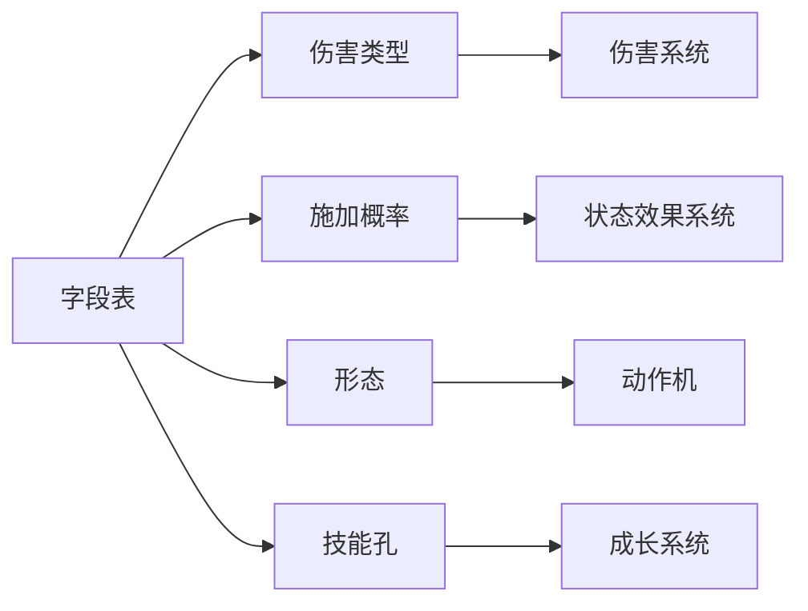

# 加一个战斗技能是填一张字段表，不是写一段代码

> **正典层级**：第 5 级（系统细化）。与[玩法正典](../canon/gameplay/玩法定位.md)冲突时以正典为准；**全部倍率、耗蓝量、冷却值与概率归 `GP-2`／`GP-6`，本页一个都不定。**
>
> 返回 [总索引](../README.md)｜[系统文档与提案索引](./README.md)｜相关：[角色与成长](../canon/gameplay/角色与成长.md) · [战斗与关卡](../canon/gameplay/战斗与关卡.md) · [伤害系统](./伤害系统.md) · [角色动作状态系统](./角色动作状态系统.md)｜台账：[`GP-31`](../spec/issues/README.md)

## 摘要

**这一页回答一个问题：加一个战斗技能要填哪些格子。** 读完你能判断两件事 —— 一个新技能的字段够不够齐（填不出来的那一格通常说明它不是技能），以及某个字段的效果该去哪一页查。

**技能不实现任何效果，它只是一张表。** 伤害交给[伤害系统](./伤害系统.md)算，状态交给[状态效果系统](./状态效果系统.md)挂，前后摇交给[动作机](./角色动作状态系统.md)。

本页持有的是**一个战斗技能要声明哪些字段**，以及那些字段各自被谁读走。技能不实现效果 —— 它打出去的伤害交给[伤害系统](./伤害系统.md)算，它附带的状态交给[状态效果系统](./状态效果系统.md)挂，它的前后摇与生根交给[动作机](./角色动作状态系统.md)。技能本身只是一张表。

**三种形态，占不占位不一样**：主动技占技能位（6 个，出征前选），**被动技与常驻光环都不占位、也不设数量上限**。光环因此需要另一套防堆叠的约束，本页给出三条，其中一条只能人工验收。

**宝石改的是机制，不只是数字。** 判据写成可检验的形式：它换掉了这个技能的某个字段或某条行为，而不是只在某个字段上乘一个系数。

**本页不持有**：生活技能（同名不同物，见边界那一节）、技能怎么学会与练熟（`GP-30`）、伤害怎么算（[伤害系统](./伤害系统.md)）、状态的时长与叠加（[状态效果系统](./状态效果系统.md)）、按哪个键放出来（键位归界面侧）。

## 术语

只列**只有本页在用**的词，本页只有这两个。跨页共用的在[术语表](../reference/术语表.md)，本节不重复（`技能位`、`主动技`、`被动技`、`光环`、`瞬发`、`读条`、`技能孔`、`宝物孔`、`实战值`、`档位` 都在那边）。

| 词 | 它在本页指什么 |
| --- | --- |
| **生根** | 出招期间原地不动，位移输入一律不生效。瞬发与读条都生根 |
| **前后摇** | 一招出手前那一小段与收手后那一小段，两头都不可打断 |

## 上游约束

只链接约束本页的正典与已接受的 ADR，并说明各约束本页的哪一部分。

- [角色与成长 · 书 → 学会 → 练熟](../canon/gameplay/角色与成长.md)：书是唯一学习途径且有前置属性要求、学会时实战值为 0、**实战值只在命中时累积**、到档位解锁技能孔与额外效果。**约束技能孔的解锁条件，也划出本页与 `成长系统` 的接缝。**
- [角色与成长 · 技能分两类：放出来的动作，与做事的熟练度](../canon/gameplay/角色与成长.md)：战斗技能占技能位、耗蓝、有读条与冷却，且**每个技能各有自己的冷却下限值**；生活技能不占位。**这是本页字段表的来源，也是「本页只装战斗技能」的依据。**
- [角色与成长 · 装备：宝物与宝石](../canon/gameplay/角色与成长.md)：宝石镶在主动技能上、每个技能 2–3 孔、**孔位不分类型**、宝石同时带正面与负面影响。**约束宝石那一节，也是光环「必带正负面」那条约束的同源依据。**
- [战斗与关卡 · 按键与连击](../canon/gameplay/战斗与关卡.md)：技能位是 6 个、**只装主动技能**；被动、天赋与常驻光环都不占位不设上限；具体键位映射归界面侧。**约束形态那一节，并把键位排出本页。**
- [战斗与关卡 · 主角的招式构成](../canon/gameplay/战斗与关卡.md)：主角的辅助技至少覆盖标记、屏障、急救、控场；光环不设数量上限，防堆叠靠约束。**约束本页必须给出那三条约束的可检验形式。**
- [战斗与关卡 · 读条与打断](../canon/gameplay/战斗与关卡.md)：读条受击中断、中断不消耗物品；打断是双向机制。**约束读条形态那一格。**
- [伤害系统](./伤害系统.md)：结算顺序固定，技能只声明伤害类型、倍率、元素、施加概率与两种穿透。**那些字段的含义在那一页，本页只规定技能必须声明它们。**
- [角色动作状态系统 · 动作叠加层：互斥的主动动作，给运动层一个"定身/忙"标志](./角色动作状态系统.md)：施放分瞬发与读条，都生根；**读条被打断时我方退还一部分 MP、敌人不退还**（退还多少在参数表，见[`数值模型`](./数值模型.md)）。**约束本页不定义前后摇与生根，只声明技能属于哪种形态。**
- [ADR-0009](../decisions/ADR-0009-编辑器主导的开发模式.md)：参数唯一来源是场景与资源，代码不留能用的默认值。**约束本页定出的每个字段将来落成外置数据，缺字段当场报错。**

## 结构

### 一个战斗技能要声明的字段

| 字段 | 取值形状 | 谁读它 |
| --- | --- | --- |
| 标识 | 稳定字符串，跨存档与 mod 唯一 | 全体；存档只存标识 |
| 名称与描述 | 文本键，真文本外置（`ENG-5`） | 界面 |
| 形态 | 主动 / 被动 / 常驻光环 | 本页的槽位规则 |
| 施放方式 | 瞬发 / 读条（仅主动技有） | [动作机](./角色动作状态系统.md) |
| 伤害类型 | 物理 / 魔法 / 无（纯辅助技） | [伤害系统](./伤害系统.md) |
| 招式倍率 | 乘在攻方对应那份攻击上的系数 | 同上 |
| 物理穿透、法术穿透 | 各一个减防御的值，可为 0 | 同上 |
| 元素 | 火 / 冰 / 灵能 / 无 | 同上（它只决定附带哪种状态） |
| 附带状态与施加概率 | 状态标识 ＋ 概率，**概率必须小于 100** | 同上，上下限在那一页 |
| 效果量 | 治疗量、屏障量这类非伤害产出的系数 | 结算侧；**不暴击** |
| 耗蓝量 | MP 消耗 | 资源侧 |
| 冷却 | 一个时长，**并各自带一个不为零的下限** | 本页的冷却规则 |
| 技能孔数 | 接口常量，家在正典（仅主动技有） | 本页的宝石规则。**宝物那一侧另有宝物孔**，见[`装备系统`](./装备系统.md) |

下面这张图回答一个问题：**填进这张表的字段最后被谁读走。** 「技能不实现任何效果」这句话的分量全在图的右半边 —— 箭头只往外走，没有一条回到本页。

**重画条件**：字段表多一类字段、某类字段改由别的系统读，或者本页开始自己算某个字段时重画。

**这张图不新增任何事实，权威是上面那张字段表。** 每个字段的取值形状、必填与否、以及「谁读它」那一栏的完整答案都在表里。

**字段表就是加技能的清单。** 填不出「伤害类型」说明它是纯辅助技（填「无」），填不出「元素」说明它不附带状态 —— 两者都合法，但**必须显式填**，不许缺字段靠默认值兜底（`ADR-0009`）。

**本页不定义这些字段怎么被算。** 倍率怎么进结算、穿透在哪一步扣、概率的上下限卡在哪，全在[伤害系统](./伤害系统.md)。本页只保证技能把它们说清楚了。

### 三种形态，占不占位不一样

| 形态 | 占技能位吗 | 有数量上限吗 | 能镶宝石吗 |
| --- | --- | --- | --- |
| 主动技 | **占**（共 6 个位，出征前选） | 受技能位限制 | 能，技能孔按档位开 |
| 被动技 | 不占 | **无** | 不能 |
| 常驻光环 | 不占 | **无**，改用下面那组约束 | 不能 |

- **只有主动技占位**，所以「技能位不够」这个取舍只发生在你要主动放出来的那些招之间。学会的被动与点到的天赋全部生效，不需要玩家再挑一遍。
- **这与天赋点总量上限不冲突**：那条管「你能点几个节点」，本条管「点到的要不要挑着装」。
- **宝石只镶主动技**，因为宝石改的是「这一招放出来是什么样」，而被动与光环没有「放出来」这个动作。

### 光环不设数量上限，防堆叠靠三条约束

删掉数量上限之后，「后期全开就回到数值堆叠」这个风险要有别的东西顶住。三条一起成立：

1. **同类只取最大，不叠加。** 同时开着两个改同一个量的光环时，只有量级更大那一个生效，另一个不产出任何修正。
   - **「同类」的判据是它修饰哪个量** —— 改物理攻击的算一类、改减伤的算一类、改移动速度的算一类。**不按技能名，也不按元素。** 不写这条判据的话，每加一个光环都要重新争一次它算不算同类。
2. **每个光环必须同时带正面与负面影响。** 与正典对宝物宝石那条同理同因：否则堆叠数值就是唯一答案。这一条是顶替数量上限的主力 —— 取舍从「装哪几个」变成「愿意吃哪些代价」，而全开等于把全部负面也一起开。
3. **负面必须可感。** 不得是「对任何构筑都无所谓」的那一种，判据是它落在这个角色真的会用到的量上。

**第 3 条只能人工验收。** 机器判得了的只有第 2 条的一半 —— 「有没有负面项」；「这个负面疼不疼」判不了。写下来是为了不假装它被守住了：它是内容审查的事，与像素规范那条透明度约束同类。

**为什么选约束而不选数量上限**：玩家看得见原因。吃到负面他知道自己换了什么；而「第五个光环没生效」他只会以为是 bug。代价就是上面那条没有守卫的人工项。

### 冷却：每个技能各有下限

- **冷却是技能自己的字段**，不是一个全局值。
- **每个技能各带一个不为零的冷却下限。** 减冷却的来源（宝石、天赋、状态）叠起来只能压到这个下限，压不到零。没有下限的话，减冷却堆满就等于「这一招常驻」，而那会把技能位从取舍变成摆设。
- **下限是按技能各给一个，不是一个统一值。** 一个短促的标记与一个大范围控场招，它们「最快多久能再放一次」本来就不该一样。
- 冷却值与各自的下限归 `GP-2`；闪避那条冷却不在本页，它是运动动作（[战斗与关卡 · 按键与连击](../canon/gameplay/战斗与关卡.md)），下限归 `GP-6`。

### 宝石：改机制，不只是改数字

**本节只装技能这一侧。** 宝石有两个镶嵌目标（[ADR-0012](../decisions/ADR-0012-宝石的两个镶嵌目标.md)）：镶进**宝物孔**提高属性，镶进**技能孔**改变技能机制。宝石自己是什么、宝物孔怎么开，都在[`装备系统`](./装备系统.md)；本页持有的是技能孔。

- **技能孔在主动技能上**，每个技能几个孔是接口常量（家在[角色与成长 · 装备：宝物与宝石](../canon/gameplay/角色与成长.md)，本页不复述那个数），**技能孔之间不分类型** —— 任何声明了机制侧的宝石能进任何技能孔。分类型是在已有的正负面词条之上再加一层约束，收益不抵复杂度。
- **技能孔按实战值档位解锁。** 实战值只在命中时累积（[角色与成长 · 书 → 学会 → 练熟](../canon/gameplay/角色与成长.md)），所以「把一个技能练精」的回报不只是数字变大，还是构筑空间变大。档位阈值归 `GP-2`。
- **哪一档开第几个孔：一档一个，按顺序。** 第一档开第一个孔，此后每升一档再开一个。**孔数与档数各是一个接口常量、各有各的家** —— 孔数在[角色与成长 · 装备：宝物与宝石](../canon/gameplay/角色与成长.md)，档数就是参数表里那串阈值的长度（`growth.skill_use_value_tiers`）；**本页只定它们之间的对应，一个数都不复述。** 按档位一档一个是唯一不用另存一张对应表的做法 —— 写成表就要在加一档或改一次孔数时回来改它，而漏改不报错。
- **孔数取下界的技能，最后那一档给的是额外效果而不是孔。** 正典写的是「到达档位时解锁技能孔**与额外效果**」（[角色与成长 · 书 → 学会 → 练熟](../canon/gameplay/角色与成长.md)），所以那一档不是空的 —— 它兑现的正是那半句。**额外效果由技能自己声明**，用上面字段表里已有的那几格（附带状态与施加概率、效果量）就写得出来，**不为它加新字段**；具体给什么是内容。
- **一条载入校验**：技能声明的孔数**大于**档数时被拒，并说清是哪个技能。那样最上面那几个孔永远开不了，**而它不报错**。
- **宝石同时带正面与负面影响**，与光环那条同源；**它声明的每一侧都要各自带负面**，理由在[`装备系统`](./装备系统.md)。
- **只有声明了机制侧的宝石进得了技能孔**，缺那一侧的被拒。这不是一条分类规则，而是声明推出来的（[ADR-0012](../decisions/ADR-0012-宝石的两个镶嵌目标.md)）。
- **「改机制」的判据**：它**换掉了这个技能的某个字段，或加了一条这个技能本来没有的行为**。只在某个字段上乘一个系数的不算改机制。
  - 算改机制的例子：把伤害类型从物理换成魔法；给一个本来无元素的技能加上元素与施加概率；把瞬发改成读条（换来更高倍率）。
  - 不算的例子：倍率乘 1.2。
  - **这条判据可检验**，所以它能当成内容审查的入口：一颗宝石如果只动了一个系数，它该改成词条而不是宝石。

## 接口

| 挂载点 | 位置 |
| --- | --- |
| 伤害与状态怎么算 | [伤害系统](./伤害系统.md)，本页只声明字段 |
| 状态挂上去之后 | [状态效果系统](./状态效果系统.md)，本页不实现效果 |
| 前后摇、生根、读条打断与退蓝 | [角色动作状态系统](./角色动作状态系统.md)的动作叠加层 |
| 攻击力、效果量的来源 | 属性派生，归 `成长系统`（`GP-30`） |
| 实战值与档位 | 同上；本页只读「解锁到第几档」 |
| 技能怎么学会（书、前置属性、读完消耗） | 同上 |
| 技能位有几个、按哪个键放 | 位数在[战斗与关卡 · 按键与连击](../canon/gameplay/战斗与关卡.md)，键位归界面侧 |
| 技能与宝石的内容 | 内容外置（`ENG-5`），本页只定字段形状 |
| 「这个技能见过没有」 | [`图鉴系统`](./图鉴系统.md)，它按定义收录、在学会那一刻置位；**本页不加字段** —— 敌人的招不进那一类（它们是攻击定义，家在[`战斗AI系统`](./战斗AI系统.md)） |
| 全部数值 | [数值模型](./数值模型.md)与 `GP-2`；帧级的归 `GP-6` |

**挂载点到此为止。** 下次加一样与「技能能做什么」有关的东西时，先问「它是一个新字段，还是上面某个挂载点那边的事」。

## 边界与非目标

- **不定任何数值**：倍率、耗蓝量、冷却与各自的下限、施加概率、效果量、宝石档位阈值全归 `GP-2`；前后摇与读条帧数归 `GP-6`。
- **不定内容**：有哪些技能、哪些宝石属内容，走内容外置（`ENG-5`）。量级基准见[玩法定位 · 内容规模基准](../canon/gameplay/玩法定位.md)。
- **同名不同物，本页只装一半**：「技能」在正典里同时指**战斗技能**与**生活技能**。生活技能是一个熟练度等级，不占技能位、没有冷却与耗蓝，它的曲线与等级效果归 `成长系统`（`GP-30`）。两者同时出现时写全名。
- **不做技能等级。** 技能不另设一条等级线，强度只靠实战值档位与宝石。再加一条等级就有两个「这招多强」的来源，而其中一个查不到出处。
- **不做技能树。** 构筑分支由天赋承载（[角色与成长 · 特质与天赋](../canon/gameplay/角色与成长.md)），技能靠书获得。两套分支会互相稀释。
- **不做主动技之间的连携与派生**：取消与派生是附加项（`GP-4`）。
- **不碰键位**：按哪个键放出来归界面侧。
- **不做宝石合成与洗练**：宝石的获取走掉落与购买，不做「三颗合一颗」。
- **不做技能的资源类型扩展**：主动技只耗 MP。让某个技能改耗 HP 或体力条会让资源的职责说不清 —— 三条资源各管什么在正典已经定死。

## 理由与取舍

- **没选让被动与光环也占技能位。** 那样玩家要在「多一个能放的招」和「多一份常驻加成」之间选，而这两件事的手感完全不同 —— 结果是他每次都会按纸面数值选，构筑退化成算术。分开之后，技能位那 6 个格只回答一个问题：**你要能主动打出什么。**
- **没选给光环留数量上限。** 那是一道玩家看不出原因的墙：他只会发现「第五个光环没生效」。换成「必带可感负面」之后，取舍变成他看得懂的东西 —— 代价写在词条上。代价是「疼不疼」判不了，只能人工审内容，这条已写明。
- **没选按技能名或元素划分「同类光环」。** 那两种分法都要维护一张对照表，而表会漏。按「它修饰哪个量」分不需要表 —— 加一个光环时，它改哪个量本来就得填。
- **没选一个全局冷却下限。** 一个标记和一个控场大招的最短间隔本来就不该一样；全局下限要么把短招卡死，要么对大招形同不存在。
- **没选让技能孔里的宝石只改数字。** 那样它与宝物词条就是同一种东西的两个入口，玩家分不清该去哪找加成。**分工按孔的种类划**：宝物孔回答「强多少」，技能孔回答「变成什么样」（[ADR-0012](../decisions/ADR-0012-宝石的两个镶嵌目标.md)）。原来这条分工写的是「词条 vs 宝石」，那个说法在宝石只有一个镶嵌目标时才成立；**判据本身一个字没改** —— 换掉一个字段或加一条行为，不是乘一个系数。
- **没选给技能加等级线。** 实战值已经是那条线（命中才涨，堵掉刷子路线）。再加一条等级就有两个来源，而升级那条会把「你真的用过」这个意思冲掉。
- **没选让技能自己实现效果。** 每个技能自带一段逻辑短期最快，但那样结算顺序会有一百个版本，「为什么这招无视防御」就没人答得上来。字段表加固定结算线，是同一个防重构判据的另一次应用。

## 验收

**可自动验证项**（纯规则层，与引擎无关）：

- 字段完整性：缺任一必填字段的技能定义**载入时被拒**，报错说清缺哪个 —— 不许用默认值兜底。
- 形态与槽位：主动技占位、被动与光环不占位；技能位放满 6 个后再放第 7 个主动技**被拒**；被动与光环各加 20 个都不被拒。
- 施加概率上界：声明概率 ≥100 的技能定义**载入时被拒**。
- 冷却下限：每个技能的下限必须存在且不为零，缺失或为零的定义**载入时被拒**；把减冷却来源叠到极端，实际冷却也不会低于该技能自己的下限。
- 同类光环不叠加：构造两个修饰同一个量的光环同时在场，生效的只有量级更大那一个，另一个产出零修正；修饰不同量的两个光环则都生效。
- 光环必带负面：没有负面项的光环定义**载入时被拒**（与[`生产系统`](./生产系统.md)那条「净产出自己燃料的设备载入时被拒」同一形状）。
- 技能孔解锁：实战值未到档位时镶嵌**被拒**；到档位后孔位数按档位增加，**一档一个、按顺序**（第一档开第一个孔）。
- 孔数取下界的技能：走完全部档位之后它**仍然少一个孔**，而最后那一档给出的是它声明的额外效果（一条用例钉住那一档不是空的）。
- 孔数不得多于档数：声明的孔数大于档数的技能定义**载入被拒**，并说清是哪个技能。
- 只有声明了机制侧的宝石进得了技能孔：只声明属性侧的宝石镶进技能孔**被拒**（另一侧那条反证在[`装备系统`](./装备系统.md)）。
- 宝石只进主动技：往被动技或光环上镶宝石**被拒**。
- 交出去而不是自己实现：技能施放时调的是[伤害系统](./伤害系统.md)的结算入口与[状态效果系统](./状态效果系统.md)的施加入口（可用替身验证被调用），本页不自己改 HP、不自己改姿态。

**必须实机确认项**：6 个主动技够不够用、宝石换掉一个字段之后「这招变了」看不看得出来、光环的负面吃起来疼不疼。前两项归作者实机看（[ADR-0009](../decisions/ADR-0009-编辑器主导的开发模式.md) 的分工），第三项是内容审查、**永远没有机器判据**。

**完成边界**：字段表落成外置数据的结构、三种形态的槽位规则各有测试、光环三条约束里能判的两条都有测试、技能孔按档位解锁。做到这些，后面加技能就只是填表。

## 下游同步

- **代码**：字段表落成技能定义的外置数据（`ENG-5` 那条既有路径）；槽位与冷却规则落规则层；施放接[动作机](./角色动作状态系统.md)。
- **数值**：倍率、耗蓝、冷却与下限、施加概率、效果量、宝石档位阈值进 `GP-2` 的参数表；前后摇与读条帧数归 `GP-6`。
- **台账**：立项在 [`GP-31`](../spec/issues/README.md)；伤害结算在 `GP-32`，属性派生与实战值在 `GP-30`，载体在 `GP-18`，键位在 `UI-14`，取消派生在 `GP-4`。
- **该上升进正典的**：只有一条 —— **「宝石改机制」的那条判据**（换掉一个字段或加一条行为，不是乘一个系数）。等真有几颗宝石、证明这条分得清之后，上升进[角色与成长 · 装备：宝物与宝石](../canon/gameplay/角色与成长.md)。字段表与槽位规则按定义不进正典。
