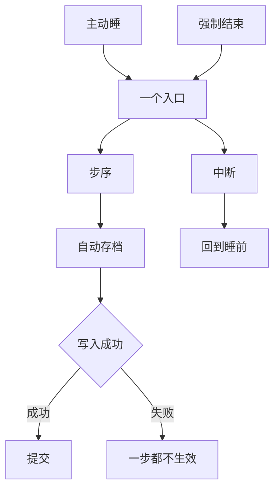

# 那串步序不在本页，本页只驱动它：一个入口、一次事务，跑一半就一步都不生效

> **正典层级**：第 5 级（系统细化）。与[时间与经营](../canon/gameplay/时间与经营.md)冲突时以正典为准；**那串步序是正典的承重项，本页一个字不改、一步不增、一句不复述。**
>
> 返回 [总索引](../README.md)｜[系统文档与提案索引](./README.md)｜相关：[时间与经营 · 结算顺序（固定，不得改动）](../canon/gameplay/时间与经营.md) · [存档系统](./存档系统.md) · [事件系统](./事件系统.md) · [统计事件总线系统](./统计事件总线系统.md)｜台账：[`GP-56`](../spec/issues/README.md)

## 摘要

**这一页回答一个问题：一天是怎么结束的。** 读完你能判断两件事 —— 一件跨日要做的事该不该在结算里做（它得先在正典那串步序里有位置），以及「结算跑一半崩了会怎样」（答案是这一天等于没过）。

**那串步序不在本页**，本页只管怎么驱动它。抄一遍就有两份顺序表，而它们不一致时没有任何东西判得出来。

下面这张图回答一个问题：**一天结束这件事从哪里开始、在哪一刻算数、出问题落到哪。** 「整串是一次事务」这句话的分量全在那个判断节点上 —— 它左右两边只有「全生效」和「一步都不生效」。被中断则回到睡前。



**重画条件**：入口多一个来源、提交点挪到别处，或者出错处置改了时重画。

**这张图不新增任何事实，权威是下面「结构」那几节。** 结算期间为什么没有输入入口、那两个不在步序里的调用点各在哪，图都放不下。

跨日要结的那一串步序已经在正典写死了。本页定的是**它怎么被驱动**：谁触发、整串的提交点在哪、中途出错与被中断各落在哪、玩家在那期间能不能操作。

**它持有**：入口（一个）与它的两个来源、整串是一次事务这条口径与它的提交点、出错与中断的处置、结算期间的输入边界、摘要的形状、那串之外那两个调用点（事件钩子与自动存档）。

**它不持有**这些，各有自己的家：

- **那串步序本身** —— 家在[时间与经营 · 结算顺序（固定，不得改动）](../canon/gameplay/时间与经营.md)，本页写链接不复述。
- 每一步的业务规则，各归各家：作物在[`生产系统`](./生产系统.md)、委托板那两步在[`任务系统`](./任务系统.md)、计息在[`经济系统`](./经济系统.md)、按天状态在[`状态效果系统`](./状态效果系统.md)、**书籍阅读推进**与考试在[`教育系统`](./教育系统.md)、施工在[`建造系统`](./建造系统.md)、**精力上限计算**在[`成长系统`](./成长系统.md)。
- 摘要弹窗的排版，以及任何数值。

最要紧的那条承诺：**本页不复述那串步序，也不增减其中任何一步。** 抄一遍就有两份顺序表，而它们不一致时**没有任何东西判得出来哪一份是真的**；而那串的每一条解释都是依赖（换季在作物生长之前、精力上限在入库与康复之后、超期作废在补满之前），所以增减一步就是让那些依赖里的一条静默失效。

**第二条承诺：整串加自动存档是一次事务。** 跑一半留下的状态没有一个是合法的 —— 而那正是那张表的全部约束在说的事。

## 术语

只列**只有本页在用**的词。跨页共用的在[术语表](../reference/术语表.md)，本节不重复（`步序`、`事务`、`结算摘要`、`正式存档`、`钩子`、`读口` 都在那边）。

| 词 | 它在本页指什么 |
| --- | --- |
| **提交点** | 整串事务算「成功了」的那一刻，落在**存档写入成功**上。在它之前崩掉，这一天一步都不生效 |
| **强制结束** | 到点了玩家还没睡，系统替他结束这一天。它与「主动睡」是同一个入口的两个来源 |

## 上游约束

- [时间与经营 · 结算顺序（固定，不得改动）](../canon/gameplay/时间与经营.md)：那串步序，以及解释它为什么必须是这个顺序的那几条约束（季节更替在作物生长之前、康复与按天状态合成一步、考试在阅读与状态推进之后、精力上限在入库与康复之后、委托超期作废在委托板补满之前）。**这是本页全部结构的来源，也是它最硬的一条边界 —— 本页只驱动它。**
- [时间与经营 · 每日结算](../canon/gameplay/时间与经营.md)：**结算在睡后展示不在睡前**、不做单页报表、简版弹窗只列有变化的重要项、完整明细进手环随时可查。**这是摘要那一节的全部来源。**
- [时间与经营 · 作息与熬夜](../canon/gameplay/时间与经营.md)：每天固定时刻醒来、到点**强制结束当天**、**强制结束的表现由主角自己收场**而不是系统夺走控制权、预警要提前给、出征结算跨过硬边界时照常出征并按最晚档扣上限。**这是「一个入口、两个来源」的依据。**
- [时间与经营 · 时间](../canon/gameplay/时间与经营.md)：时间单位只有天、季、年三级，**不引入「月」**；进入关卡时游戏时钟暂停。**约束本页不新建时间单位，也约束「推进一天」是本页唯一的时间跨度。**
- [时间与经营 · 精力](../canon/gameplay/时间与经营.md)：精力上限的几个加项各自独立存储、不先加总，**上限变化必须有可见的原因**。**这是摘要里那一项为什么要带原因的依据，也是「上限是派生量」这条的出处。**
- [时间与经营 · 治疗与照护](../canon/gameplay/时间与经营.md)：**倒下的学生次日已排的派工自动取消并提示玩家**，静默取消会让玩家以为工位在跑。**这是摘要必须报出来的一项，不是本页新加的要求。**
- [时间与经营 · 通知](../canon/gameplay/时间与经营.md)：**手环是唯一的事件通知渠道**，至少覆盖那几项跨日的账。**约束本页不新开渠道 —— 完整明细就挂在它上面。**
- [玩法定位 · 存档](../canon/gameplay/玩法定位.md)：**睡眠是唯一正式存档时机**、没有手动存档。**这是「自动存档是本页那次事务的提交点」的依据。**
- [玩法定位 · 弹界面接管输入就暂停世界，世界里的动作不暂停](../canon/gameplay/玩法定位.md)：判据落在「界面接管输入」上，而硬直与被击倒虽然让玩家操作不了却绝不暂停。**这条划出本页的位置 —— 结算不是这条判据的适用对象，见下面「结算期间没有输入入口」。**
- [玩法定位 · 核心循环](../canon/gameplay/玩法定位.md)：睡眠是那条闭环的收束点，精力回到上限。**约束本页的入口就是那个动作。**
- [`存档系统` · 写入是一次事务](./存档系统.md)：写临时文件 → 原子替换 → 提交，中间失败则目标文件一字不动。**这是本页那次事务的提交点，本页写链接不重写它的形状。**
- [`存档系统` · 进哪一侧：判据一句话](./存档系统.md)：跨过一次睡眠还成立的进正式存档。**本页那次写入就是那条判据里的「一次睡眠」。**
- [`事件系统` · 每日结算那个钩子落在固定步序之外](./事件系统.md)：事件的询问排在整串之后，理由是它要读结算的结果，而它的后果会去调那串里已经跑过的东西。**这是本页必须留的那个调用点，理由在那一份、本页不重写。**
- [`活跃失衡系统` · 它在每日结算里不占一步](./活跃失衡系统.md)：它不加步的理由是**它没有按天到期的项，也没有自然漂移**。**与本页那条不加步不同源，见下面「本页不为自己加一步」。**
- [`统计事件总线系统` · 它不占每日结算任何一步](./统计事件总线系统.md)：它不加步的理由是**那串里每一步各自会发自己那一条**。**又一条理由，同样不同源。**
- [`任务系统` · 谁改它、谁读它](./任务系统.md)：委托板的超期作废与补满各占一步，**先作废后补满**，补满要补到固定条数并保底一条无门槛委托。**这是那串里最容易被插步弄坏的一处，本页那条「不增减一步」首先是为它立的。**
- [`教育系统`](./教育系统.md)：考试挂季末与年末，知识吸收效率每天回升。**它们各占那串里的一步，本页只调。**
- [`状态效果系统` · 时长有三种单位，各有各的推进点](./状态效果系统.md)：按天那一类有自己的推进点。**那个推进点就是那串里的一步，本页不另设。**
- [`数值模型` · 尚未给值的量，各自写明校准办法](./数值模型.md)：值的唯一来源是参数表。**本页给那张表加零个量，理由写在「下游同步」。**
- [ADR-0009](../decisions/ADR-0009-编辑器主导的开发模式.md)：参数唯一来源是场景与资源、代码不留能用的默认值。**约束本页不给任何一步留「跳过它」的开关。**

## 结构

### 那串步序在正典，本页只按名调它

**步序本身见[时间与经营 · 结算顺序（固定，不得改动）](../canon/gameplay/时间与经营.md)，本页一句不复述。** 不抄的理由有两层：

- **抄一遍就有两份顺序表**，而它们不一致时没有任何东西判得出来哪一份是真的 —— 这正是本库那条「事实只许有一个家」在这里的具体样子。
- **那串的每一条解释都是依赖**，所以「顺序」不是一个可以在两处各写一遍的清单，它是一组约束。约束的家只能有一个。

由此本页有一条硬纪律：**引用那串里的某一步时按**步名**引，不写「第 N 步」。** 插一步会让全部序号静默平移，而按步名引永远不会。

**步数一个不增一个不减**，写成一条结构约束：**本页落地前后那张表的步数完全一致。** 形状照[`事件系统`](./事件系统.md)那条既有的结构约束走。

**那份点名的判据是「那一步改的是谁的量」。** 两处最容易归错的：**书籍阅读推进**改的是掌握度，而掌握度按「角色 × 书」记在[`教育系统`](./教育系统.md)（它同时持有两类书共用的那条阅读管道）；**精力上限计算**算的是一条派生量，而派生表是[`成长系统`](./成长系统.md)的 —— 那一步做的事就是「按加项重算一次」，**不另外存一个上限**，而加项清单本身的家是正典（[时间与经营 · 精力](../canon/gameplay/时间与经营.md)），两侧都不复述它。

### 一个入口，两个来源

| 来源 | 谁触发 | 差别 |
| --- | --- | --- |
| 玩家主动睡 | 玩家在床前的那个交互 | 无 |
| 到点强制结束当天 | 时间走到正典写的那个硬边界 | **表现上由主角自己收场**（[时间与经营 · 作息与熬夜](../canon/gameplay/时间与经营.md)），机制上走的是同一条 |

- **两个来源之后是同一个入口。** 它们的差别只在触发那一下的表现与随之算出的熬夜档位，**整串一模一样**。
- **不给它第二个入口。** 调试要推一天也走这一条 —— 另开一条的后果是「调试推的那天没走完整串」，而那种不一致在排缺陷时会把人带到完全错的方向。
- **出征结算跨过硬边界时照常出征**（正典），所以本页的入口可能紧接在一次出征结算之后被触到。**本页不为这种情形加分支** —— 它仍然是「到点了」这一个来源。

### 整串加自动存档是一次事务

```
拿一份世界状态的副本 → 在副本上按正典那串逐步推进
  → 推到「生成结算摘要」那一步：摘要在这里产出，落在副本上
  → 推到「自动存档」那一步：写一次正式存档（原子替换）
       写入成功那一刻 ＝ 提交点，副本换成当前世界状态
  → 推到「次日 6:30 醒来」那一步：把那份摘要弹出来
  → 整串跑完之后问一次事件（钩子在那串之外）
```

- **那串的末尾几步仍然在那串里。** 生成结算摘要、自动存档、次日醒来弹摘要都是正典那张表上的步，不是本页加在整串之外的东西；**「整串加自动存档」这句里的「加」说的是提交点落在自动存档那一步上**，不是说那一步在整串之外。**整串之外只有一样东西 —— 事件那一次询问。**
- **提交点是存档文件替换成功那一刻**（[`存档系统` · 写入是一次事务](./存档系统.md)）。在那之前的任何失败都让**整天不生效**：世界状态一字不动，玩家仍在睡前那一刻。
- **摘要的产出与弹出是两件事。** 产出在**生成结算摘要**那一步（正典把它排在**自动存档**之前），弹出在**次日 6:30 醒来**那一步（在提交点之后）。所以写入失败时那份已经产出的摘要随整天一起作废、**一次都不会被弹出来**。
- **为什么不许部分生效**：那串的每一条解释都是依赖，所以跑一半留下的状态**没有一个是合法的** —— 正典自己举的例子就是「今天的产出被算进昨天的税」。而这种错**不报错**，它只在几天之后表现成一个说不清来历的数字。
- **写入失败等于整天不生效**（盘满、无权限）。玩家看到的是「存档没写上，这一天没有推进」，然后可以处理完再睡一次。**这一句是本页那条事务口径唯一会被玩家看到的地方**，所以它必须说清「这一天有没有推进」。
- **结算期间被中断**（进程被杀、断电）**不产生续玩点**，所以「最后一个能读的点」仍是睡前那一刻，玩家重按一次睡觉。**这不是给正典那条「任何时候退出都写临时续玩点」开例外** —— 那条说的是玩家主动退出这个动作，而结算期间没有那个动作（见下一节）。
- **睡眠成功时作废当前那一份续玩点**（[`存档系统` · 存档位与续玩点](./存档系统.md)）：它记的是睡前那一刻，而世界已经推进了。
- **代价写明**：世界状态必须复制得出来。对一天一次的结算来说这不贵，但它是一条实打实的结构要求 —— 它约束的是世界状态怎么被持有，而不只是本页怎么跑。

### 结算期间没有输入入口

- **玩家在结算期间不能操作**，而且**没有输入入口**：没有界面、不收输入、不给「跳过」、不给退出。
- **这不是「弹界面接管输入就暂停世界」那条判据的适用对象。** 那条判据管的是**有一层界面接过了玩家的输入**的情形，而结算是一次**转场** —— 世界本来就不在跑，没有什么可暂停的。**不写这句，它会被读成本页给那条判据开了一个例外**，而那条判据最要紧的性质就是它没有例外。
- **由此本页不碰那个暂停闸门。** 它是顿帧那个「当帧不推进」的闸门，服务的是世界在跑的时候；本页用不到它。

### 本页不为自己加一步

那串步序**不为本页加步**。理由自己写，不抄别处：

- **本页不加步的理由是「它不是那串里的一项，它是跑那一串的那个东西」。** 一个驱动器给自己在被驱动的序列里加一步，等于让那串里出现一步「现在开始跑这一串」—— 而那一步的位置无论排在哪都说不通。
- **每一处「不加步」都要写自己的理由，不许互抄。** 别处已经有好几份各写过一条，依据各不相同；抄了之后改动其中一侧时另一侧会静默失去依据。
- **本页刻意不列那份名单。** 名单会随系统长，而它长的时候没有人会回来改这一段 —— 于是「一共有几处」会变成一句静默过期的话。要查有哪些就按词搜「不占一步」，**那样查出来的永远是当下的实情**。
- **推进侧也不加步**（[`主线推进系统` · 本页不为自己加一步](./主线推进系统.md)），理由在那一份、**与本页这条不同源**，本页不复述它。**留记账不留步**：预留一个空步等于现在就动那张不得改动的表，而记账只是一句「到时候要答这个问题」—— 而那个问题的答案是「不加」。

### 两个调用点：事件在那串之外，自动存档是那串里的一步

| 调用点 | 什么时候 | 谁的 |
| --- | --- | --- |
| 事件的询问 | **整串跑完之后**，不占其中任何一步 | [`事件系统` · 每日结算那个钩子落在固定步序之外](./事件系统.md)的，理由在那一份 |
| 自动存档 | **那串里的一步**，本页按步名调它 | [`存档系统`](./存档系统.md)的，**方向单向** —— 本页调它，它不回头调本页 |

**这两个都不是本页加的东西**：前者是正典写的「每日结算之后」，后者是那串里本来就有的一步。写在这里是为了让「本页与谁接」列得全，**也是为了把那两者分清** —— 只有前者在整串之外。

### 摘要：简版是弹窗，完整明细是一个读口

- **简版只列有变化的重要项**（正典点名了哪几项，**本页不复述那份清单**）。
- **完整明细是一个读口，不是第二份账** —— 它从当天各步的结果算出来，挂在手环上（[时间与经营 · 通知](../canon/gameplay/时间与经营.md)那条唯一渠道）。**这条挡的是「为了做摘要另存一份账」**：另存一份之后它与各系统的真实状态迟早分叉，而分叉时玩家看到的是明细里有、面板里没有。
- **产出在提交之前，弹出在提交之后。** 它在**生成结算摘要**那一步产出（正典把那一步排在**自动存档**之前），而**摘要在睡后展示**（正典），所以弹出落在**次日 6:30 醒来**那一步。玩家看到摘要就意味着这一天真的推进了 —— **这是那条事务口径的一个额外好处**，不是另一条规则。
- **精力上限那一项要带原因**（[时间与经营 · 精力](../canon/gameplay/时间与经营.md)），而原因来自那几个各自独立存储的加项，**本页只负责把它们照原样报出来、不加总**。
- **倒下学生次日派工被取消**那一项必须出现在摘要里（[时间与经营 · 治疗与照护](../canon/gameplay/时间与经营.md)：静默取消会让玩家以为工位在跑）。

## 接口

### 谁触到它、它调谁

| 方向 | 对方 | 形状 |
| --- | --- | --- |
| 入 | 玩家在床前的那个交互 | 触发一次；**唯一入口的第一个来源** |
| 入 | 时间走到正典写的那个硬边界 | 触发一次；**同一个入口的第二个来源** |
| 出 | 那串里每一步各自的持有者 | **按步名调**（[`生产系统`](./生产系统.md)、[`任务系统`](./任务系统.md)、[`经济系统`](./经济系统.md)、[`建造系统`](./建造系统.md)、[`教育系统`](./教育系统.md)、[`状态效果系统`](./状态效果系统.md)、[`成长系统`](./成长系统.md)各接自己那几步）；**不写「第 N 步」** |
| 出 | [`事件系统`](./事件系统.md) | 整串跑完之后询问一次；**不占那张顺序表里的任何一步** |
| 出 | [`存档系统`](./存档系统.md) | 写一次正式存档；**它是正式存档的唯一写入时机**，也是本页那次事务的提交点 |
| 出 | 手环 | 完整明细挂在它上面；**不新开渠道** |
| 出 | [`统计事件总线系统`](./统计事件总线系统.md) | 一天推进完成发一条 |
| 读口 | 当天摘要 | **简版弹窗与完整明细读同一份**；它是读口，不是第二份账 |
| 读 | 世界状态 | 拿一份副本；**提交时换回去** |
| 作者填 | —— | **无。** 那串步序是正典的，每一步的规则是各系统的 |

**挂载点到此为止。** 将来加一样跨日要结的东西时，先问「它属于那串里已有的哪一步」，而不是顺手加一步 —— 真的加不进去时改的是正典那张表，而那要走[待办台账](../spec/issues/README.md)记一条、不在本页改。

### 它不碰的那几条接缝

- **那串步序本身**：家在正典。本页按名调它，一句不复述、一步不增减。
- **每一步的业务规则**：各有各的家。本页只负责调用顺序与那次事务的边界。
- **事件要不要触发、触发什么**：[`事件系统`](./事件系统.md)。本页只提供那个调用点。
- **存档怎么写**：[`存档系统`](./存档系统.md)。**方向单向** —— 本页调它，它不回头调本页。
- **推进**：[`主线推进系统`](./主线推进系统.md)。它也不占那串里的任何一步，理由在那一份、与本页不同源。

## 边界与非目标

- **不定任何数值**：本页给参数表加零个量。**这不是漏登记** —— 每一步各自的量（生长周期、报酬比例、利率、精力上限的加项、成绩区间）都归各自那份文档与[数值模型](./数值模型.md)、`GP-7`；而**步数是接口常量、家在正典那张表**。
- **不复述那串步序，也不增减一步。**
- **不写「第 N 步」**：按步名引。
- **不给任何一步留「跳过它」的开关。**
- **不给自己加一步。**
- **不为推进侧预留一步**：它自己也不加步（[`主线推进系统`](./主线推进系统.md)）。
- **不新建时间单位**：只有「推进一天」这一个跨度。
- **不新开通知渠道**：完整明细挂已有的手环。
- **不另存一份摘要账**：它是读口。
- **不碰那个暂停闸门**：结算期间世界不在跑。
- **不做界面**：简版弹窗弹在哪、列几行、完整明细怎么翻，归[`界面系统`](./界面系统.md)与作者实机定（进度见[待办台账](../spec/issues/README.md)）。
- **同名不同物，两处都要写全名**：
  - **「结算」在本作有好几处**：本页这个**每日结算**（跨日那一串）、[`任务系统`](./任务系统.md)的**任务结算**（一次出征回来那一次）、[`伤害系统`](./伤害系统.md)的**一次命中的结算**。三者的时间尺度完全不同。
  - **「事务」与[`存档系统`](./存档系统.md)的「写入事务」**：本页那次事务**包住**那一次写入 —— 后者的提交点就是前者的提交点。它们是同一次提交的两层说法，不是两次提交。
  - **「摘要」有两个所指**：本页当天那份**结算摘要**，与[`存档系统`](./存档系统.md)存档文件最外层那份**存档位摘要**。前者是一天的账，后者是「这一位是哪条世界线」。
  - **「强制结束当天」不是失败**：[玩法定位 · 推进与胜负](../canon/gameplay/玩法定位.md)写明没有全局失败，而它的代价只是次日精力上限按档下降。

## 理由与取舍

- **没选在本页复述那串步序。** 复述一遍最方便读，代价是两份顺序表 —— 而它们不一致时没有任何东西判得出来哪一份是真的。**按名引用的代价是读者要跳一次**，那个代价可以接受。
- **没选让每一步各自生效、出错就停在那一步。** 不需要世界状态的副本，代价是留下的状态没有一个是合法的（那串的每一条解释都是依赖），而**那种错不报错**。
- **没选让每一步各带一条逆操作、出错就回滚。** 比事务更精细，代价是十几条只在出错时才跑的代码路径 —— 没人测得到，而**一条写错的逆操作比不回滚更糟**（它会留下一个看起来正常的错状态）。
- **没选让提交点落在「整串跑完」而不是「存档写成功」。** 那样写入失败时世界已经推进了，而存档里没有 —— 玩家下次进来会回到前一天，却发现今天的事已经发生过一次。**把提交点推到写入成功之后，两边永远一致。**
- **没选允许结算期间退出。** 允许它就等于允许一个跑了一半的世界状态被持久化，而那正是事务口径要挡的东西。代价是玩家在那期间关窗口要重按一次睡觉 —— 那是一次点击。
- **没选给结算期间加一个「暂停世界」的态。** 世界本来就不在跑，加一个态要回答「它与顿帧那个闸门是不是同一个」，而答案只会是「不是，但长得一样」。
- **没选给它第二个入口。** 调试推一天另开一条最省事，代价是「调试推的那天没走完整串」，而那种不一致在排缺陷时把人带到完全错的方向。
- **没选给自己在那串里加一步。** 一个驱动器给自己在被驱动的序列里加一步，那一步排在哪都说不通。
- **没选为推进侧预留一个空步。** 预留等于现在就动那张不得改动的表，还要先回答「它排在哪、它读什么」—— 那是替另一个系统做决定；而那一侧自己的结论是它一步都不占（[`主线推进系统`](./主线推进系统.md)）。
- **没选另存一份完整明细。** 存一份最容易做（各步顺手往里写），代价是它与各系统的真实状态迟早分叉，而分叉时玩家看到的是「明细里有、面板里没有」。
- **没选把摘要弹在提交之前。** 早一点让玩家看到，代价是写入失败时他已经看过一份没发生的账。
- **没选把本页并进[`存档系统`](./存档系统.md)。** 它们在同一时刻发生，但方向是单向的：结算调存档，存档只是它的一步。并进去之后那一份要同时回答「一天怎么推进」与「一份存档长什么样」，而写它的人与读它的人本来是两拨。
- **没选把本页做成正典那张表的一节。** 结构不写进正典（[ADR-0010](../decisions/ADR-0010-文档体裁与系统文档归位.md)），而且正典那一节的位置正好是那张表的家 —— 在它下面加事务与入口，会让「顺序」与「怎么跑」看起来是同一层的东西。

## 验收

**可自动验证项**（纯规则层，与引擎无关）：

- **步数不变**（一条结构约束）：本页落地前后那张表的步数完全一致。
- **每一步都被调到一次**，顺序与正典那串完全一致；**按步名匹配，不按序号**（一条结构约束）。
- 入口：两个来源各触发一次，**之后走的是同一条**（除熬夜档位之外的结果完全一致）；**没有第二个入口**（一条结构约束 —— 没有别的推进一天的路径）。
- 事务（**承重项的反证**）：让中间某一步抛出 —— **世界状态一字不动**，玩家仍在睡前那一刻；存档文件也一字不动。逐步各一条用例。
- 提交点：**让存档写入失败** —— 整天不生效（世界状态与存档都不动），且结果里说得出「这一天没有推进」。
- 续玩点：**睡眠成功时当前那一份被作废**；**结算期间不产生续玩点**（一条结构约束）。
- 输入：**结算期间没有输入入口**（一条结构约束）；**本页不触那个暂停闸门**（一条反证 —— 它挡的是「给结算也套一层暂停」那种实现）。
- 事件钩子：**询问排在整串之后** —— 一条测试钉住：构造一条「往委托板加一条」的事件，**委托板补满之后的条数仍然是满的**，且板上那条无门槛委托仍在。（这条与[`事件系统`](./事件系统.md)那边是同一件事，两边各写一次。）
- 摘要：**简版与完整明细读同一份**（一条结构约束 —— 没有第二份账）；精力上限那一项**报得出各个加项而不是一个加总值**；倒下学生次日派工被取消**出现在摘要里**。
- 摘要时点：**产出在提交之前、弹出在提交之后**，各一条用例 —— 产出排在**自动存档**那一步之前（与正典那串一致），弹出排在**次日 6:30 醒来**那一步。让写入失败的那条用例里**弹出零次**，那份已经产出的摘要随整天一起作废。
- 统计事件：一天推进完成发一条。
- 不加步：本页**没有给自己、也没有给推进那一侧留任何一步**（一条结构约束）。

**必须实机确认项**：结算那一下要多久才不显得卡住、强制结束那句主角自语接不接得上、简版摘要列几行才既有仪式感又不像报表、存档写入失败那句话说不说得清这一天有没有推进。按 [ADR-0009](../decisions/ADR-0009-编辑器主导的开发模式.md) 的分工由作者实机看，本页不判。

**完成边界**：那串步序被按名逐步调到且步数一个不变（有结构约束）、入口只有一个而来源有两个、整串加自动存档是一次事务且提交点在写入成功之后（有反证）、结算期间没有输入入口、事件钩子在整串之外（有反证）、摘要是读口而不是第二份账。做到这些，「按下睡觉 → 一天在副本上推完 → 写成一份存档 → 醒来看到一份摘要」这条链在文档层面就走得通了；而「跑一半」这个问题有唯一答案。

## 下游同步

- **代码**：落**规则层**（它只吃世界状态与一串调用，不需要引擎）；床前那个交互与摘要弹窗落引擎层。**相邻的既有件一个都没有** —— 按名搜过 `Daily` 与 `Settle`，代码仓里只有界面侧那条精力条的命名（`rules/Ui/HudViewModel.cs` 里那一项），与本页无关。所以本页对代码是纯新增，**这一条是实测，不是推断**。**世界状态要复制得出来**是本页对代码提的唯一一条结构要求，它比本页自己大 —— 实现时先答它。
- **数值**：**零个量进参数表**，理由见上面「边界与非目标」第一条。
- **台账**：立项在 [`GP-56`](../spec/issues/README.md)；落地顺序按「一个入口两个来源 → 按步名逐步调到（含步数不变那条结构约束）→ 整串事务与提交点（含逐步抛出与写入失败两条反证）→ 结算期间没有输入入口 → 事件钩子在整串之外（含委托板补满仍然满那条反证）→ 摘要读口（含没有第二份账那条结构约束）→ 统计事件」。**排在各步持有者自己落地之后或与它们同批**：本页调的每一步都得先存在。界面归界面侧那一条。
- **该上升进正典的**：只有一条 —— **「整串加自动存档是一次事务，提交点是存档写入成功」**。它现在是本页的结构选择，但它决定了玩家看到的东西（写入失败时这一天到底有没有过去）；等它被一次真实实现验证过之后，上升进[时间与经营 · 每日结算](../canon/gameplay/时间与经营.md)。其余入口、调用点与摘要形状按定义不进正典。
