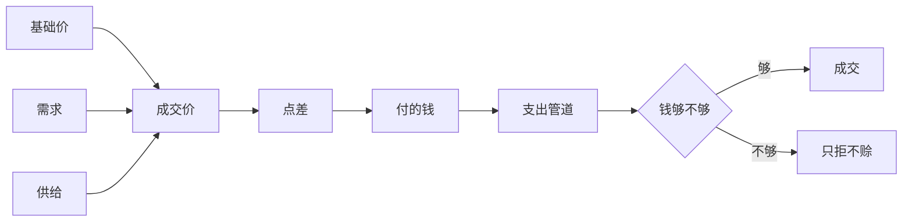

# 一件货的成交价只有三层，点差不是第四层：钱包、债务与定价的结构

> **正典层级**：第 5 级（系统细化）。与[玩法正典](../canon/gameplay/玩法定位.md)冲突时以正典为准；**全部系数、幅度、代价与天数归[数值模型](./数值模型.md)，本页一个都不定。**
>
> 返回 [总索引](../README.md)｜[系统文档与提案索引](./README.md)｜相关：[时间与经营 · 定价：三层模型](../canon/gameplay/时间与经营.md) · [世界观 · 货币、信贷与私产](../canon/world/世界观.md) · [物品系统](./物品系统.md) · [任务系统](./任务系统.md) · [建造系统](./建造系统.md) · [数值模型](./数值模型.md)｜台账：[`GP-43`](../spec/issues/README.md)

## 摘要

**这一页回答一个问题：钱从哪来、往哪去，以及一件货这一刻值多少。** 读完你能判断两件事 —— 一个新的价格因素该不该进那条乘法链（基本都不该），以及「这个价怎么算出来的」能不能逐层报出原因（必须能）。

**不加第四个乘数、不加一种欠款。** 成交价永远是三层，现金不够一律只拒不赊。

本页持有钱从哪来、往哪去，以及一件货这一刻值多少。

**它持有**：钱包与货币的表示；**成交价的三层各读什么**；交易技能的**点差**怎么作用而又不进那三层；债务的记法与计息；**报酬引用怎么解析成一笔钱**；生产队收购与商店两条路径；商店库存的刷新挂在哪。

**它不持有**这些，各有自己的家：

- 物品定义与品质取值（[`物品系统`](./物品系统.md)）。
- 上架清单与刷新幅度（内容与[数值模型](./数值模型.md)）。
- 失衡的总量与档位边界（[`活跃失衡系统`](./活跃失衡系统.md)）。
- 委托模板与报酬数额（[`任务系统`](./任务系统.md)存引用、内容填值）。
- 生活技能的档位与专长（[`成长系统`](./成长系统.md)）。
- 抵押与放贷的剧情侧（正典）。

下面这张图回答一个问题：**一个成交价是怎么算出来的，以及哪些东西刻意不在那条乘法链上。** 点差与「只拒不赊」都画在链子外面，那正是它们的位置。最后一道是钱够不够。



**重画条件**：乘法链增删一层、点差改成进链子里，或者出现第二条支出路径时重画。

**这张图不新增任何事实，权威是下面「结构」那几节。** 每一层各读什么、原因怎么报、债务怎么计息，图都放不下。

最要紧的那条承诺：**不加第四个乘数、不加一条结算步、不加一种欠款。** 三层还是三层，点差落在三层之外的另一侧；债务计息用[每日结算](../canon/gameplay/时间与经营.md)里已有的那一步；现金不够时一律只拒不赊。

## 术语

**无 —— 本页没有只有自己在用的词。** 它定义的那几样（`基础价`、`成交价`、`需求`、`供给`、`点差`、`支出管道`、`上架`、`订货`、`报酬引用`）都被三份以上文档引用，所以连同一句白话都在[术语表](../reference/术语表.md)里，各带一条指回本页的链接。

## 上游约束

- [时间与经营 · 定价：三层模型](../canon/gameplay/时间与经营.md)：`成交价 = 基础价 × 需求系数 × 供给系数`、基础价对一个实例固定不变、**每个因子都要能在手环里查到当前值与原因**、**三层之外不许再加乘数**、留给后续的两层扩展结构上现在就要容得下。**这是本页定价那几节的全部来源。**
- [时间与经营 · 货币、钱包与债务](../canon/gameplay/时间与经营.md)：每个角色都有独立钱包、委托报酬结算给主角且分成由玩家决定、学生收入是战利品加报酬、**还款只从主角钱包出**、债务无硬期限且逾期只加息、按季计息且第一季免息、委托板必须始终保留一条无门槛委托。**约束钱包与债务的结构，也约束「破产」不是一个状态。**
- [时间与经营 · 生产队收购与商店](../canon/gameplay/时间与经营.md)：收购队每天固定时段来、错过不罚、玩家不在基地时指定区域的货物自动被收走并结算、不讨价还价、**成交不受对方钱包余额限制**。**约束收购那条路径的时点与拒绝路径。**
- [时间与经营 · 商店卖什么，读它所在那一区的失衡档位](../canon/gameplay/时间与经营.md)：高级一律不卖、中级与品质由所在区的档位决定、数量与补货频率同样读档位。**约束上架读哪一层，也约束本页不自己定上架清单。**
- [时间与经营 · 学生与派工](../canon/gameplay/时间与经营.md)：派工按产出物品基础价的比例付酬、付酬与入库同时发生、现金不足派不了工并显示差多少、**不做欠薪**、付酬不改关系。**这是「只拒不赊」这条形状的来源，本页把它推广成支出管道的总规则。**
- [时间与经营 · 治疗与照护](../canon/gameplay/时间与经营.md)：建造与加工下单检查材料，不够就不能下单并显示缺什么、缺多少。**约束材料检查与现金检查是同一条拒绝形状。**
- [时间与经营 · 结算顺序（固定，不得改动）](../canon/gameplay/时间与经营.md)：跨日各项按固定顺序走，其中**债务计息**占一步。**约束本页不新增结算步，只用那一步。**
- [角色与成长 · 技能分两类：放出来的动作，与做事的熟练度](../canon/gameplay/角色与成长.md)：**交易技能只影响买卖点差**，不给定价三层加第四个乘数。**这是点差那一节的来源。**
- [角色与成长 · 物品所属权](../canon/gameplay/角色与成长.md)：所属权限制转移与处置。**约束还款只能从主角钱包出这条不是一条便利规则，而是所属权的结果。**
- [世界观 · 货币、信贷与私产](../canon/world/世界观.md)：三级硬通货且**总量固定**、配给凭证与货币并行、商会由学院授权但不属学院、抵押物由放贷商会自己估值（一处已知的制度缺陷）、不动产可抵押而居所不可。**约束货币怎么表示，也约束抵押不是玩家可反复使用的机制。**
- [`物品系统` · 品质并进基础价，不当第四个乘数](../design/物品系统.md)与[`物品系统` · 两条轴，判据是「它变的是获取难度还是制作水准」](../design/物品系统.md)：基础价含品质、类别只回答「它是什么」且定价里的货物分组是同一条轴更粗的一层。**约束基础价读什么，也约束替代品那一层不新建字段。**
- [`任务系统` · 任务实例的字段](./任务系统.md)与[`任务系统` · 时间与精力的消耗按「类型 × 档位」查表](./任务系统.md)：委托实例只持有报酬的引用、消耗按「类型 × 档位」查表而模板不各自声明。**约束报酬表的形状与那张消耗表同源，也约束解析发生在本页。**
- [`活跃失衡系统` · 对外只有档位，没有精确值](./活跃失衡系统.md)与[`活跃失衡系统` · 三个新读口带来一个正反馈，刹车必须先在](./活跃失衡系统.md)：对外只给档位、就近读那一层、新读口的推力必须小于递减造成的阻力。**约束商店上架读所在区那一层，也约束本页新增的读口要算进那个正反馈。**
- [玩法定位 · 随机事件：事件可以晚做，扩展点现在就留](../canon/gameplay/玩法定位.md)：事件不实现效果，改价格走定价层。**约束定价层必须提供一个「事件能调它」的入口。**
- [玩法定位 · 手环的管理功能在关卡内不可用](../canon/gameplay/玩法定位.md)：订货与下单是经营侧操作。**约束商店订货与建造下单在关卡里不可用。**
- [`数值模型` · 经济：起始资金正好买下第一批种子](./数值模型.md)：定价、债务与治疗的参数键已在，值的唯一来源是参数表。**约束本页只写量纲与约束形式，也约束不得改动既有参数键的含义。**
- [ADR-0009](../decisions/ADR-0009-编辑器主导的开发模式.md)：参数唯一来源是场景与资源，代码不留能用的默认值。**约束本页定出的每个量纲将来落成外置数据，缺配置当场报错。**

## 结构

### 钱包：内部一个量纲，分级只在显示层

- **每个角色各一个钱包**，与[物品所属权](../canon/gameplay/角色与成长.md)是同一条线：物品有归属，钱也有。城区 NPC 同样各有一个。
- **内部只存一个量纲**（最小面额的计数），金银铜三级**只在显示时换算**。理由是那套换算固定不变 —— 铸造工艺已失传、总量固定（[世界观 · 货币、信贷与私产](../canon/world/世界观.md)），所以它不是一个会变的规则，而是一个显示格式。存三个字段就会出现「该进位没进位」这类查不出来的错。
- **配给凭证不是钱，不进钱包。** 它换的是保障份额，货币换的是保障之外的东西（正典）。两者并行、互不换算 —— 能换算就等于最低保障可以被买卖，而那条底线不许有漏洞。

### 支出只有一条管道

```
发起支出（谁的钱包、多少、为什么）
  → 余额检查
  → 够：扣款并记一条来源标签
  → 不够：拒绝，给出缺口，不留任何记录
```

**全部花钱的地方都走它**：派工报酬、任务报酬的分成、建造下单、治疗费、还款、在商店或向生产队采购。

- **现金不足一律只拒不赊。** 正典对派工写的是「现金不足时派不了工，并显示差多少……不做欠薪」，本页把它推广成管道的总规则：**任何支出都不产生欠款记录**。理由是欠款会长出第二套债务（本金、利息、催收都要再定一遍），而本作只有商会那一笔债。
- **拒绝必须给出缺口**，不是一句「钱不够」。缺多少决定玩家下一步做什么（卖货、接委托、还是改小规模）。
- **来源标签是给玩家看的**，不是给系统对账的：手环里那份收支明细按标签分组，所以「这个月钱去哪了」答得出来。标签取值属内容。

**收入不共用这条管道**，因为收入没有「不够」这一支：卖货、委托报酬、自动上交都是直接入账。**唯一要判的是归属**，而那条在[角色与成长 · 战利品归属](../canon/gameplay/角色与成长.md)，本页只调用。

### 成交价：三层，一层都不多

```
基础价   = 稀有度与制作成本给的量级 × 品质系数        （物品自带，对一个实例固定不变）
成交价   = 基础价 × 需求系数 × 供给系数
玩家到手 = 成交价 ± 点差                              （点差不在上面那条乘法链里）
```

| 层 | 读什么 | 什么时候变 | 谁能动它 |
| --- | --- | --- | --- |
| **基础价** | 物品的稀有度、制作成本与**品质**（[`物品系统`](./物品系统.md)） | **对一个具体实例永不变** | 没有人。它是玩家的价格锚点 |
| **需求系数** | 避难所当下真实需要什么，按**货物分组**给 | 每季公布一次；事件可以调它 | 生产队的季度偏好、随机事件 |
| **供给系数** | **玩家自己在这一次结算里出了多少同种货** | 每次交易各自算 | 玩家的出货量 |

- **需求系数买卖双向，供给系数只在卖出侧。** 供给系数量的是玩家自己的出货量，而买入不构成出货，所以它在买入侧没有对象；需求系数则两侧都读同一个值 —— 需求高时只涨卖价不涨买价，那不是一个市场，而且玩家会发现「趁药材涨价时囤药材」是一条没有代价的套利。
- **需求偏好按货物分组公布，不按具体物品。** 分组就是[`物品系统`](./物品系统.md)那条类别轴**更粗的一层**，**不新建字段** —— 正典举的食物类、药材类、金属类是那一层的名字。按具体物品公布的话，玩家要记一串，而内容作者要为每季各配一份。
- **供给系数的「同一批次」指一次结算里的同种货物**，超过阈值后单价按档递减到下限。**跨季的市场存量记忆不在这一层**（见下面「两层扩展」）。
- **一件东西的基础价含品质，所以同种物品的两个实例可以有两个基础价**。这不破坏锚点：锚点是「这一件值多少」，而品质在物品上看得见（[`物品系统`](./物品系统.md)那条硬约束）。

### 每个因子都要查得到，否则它就是随机数

正典那条硬约束落成一个读口：**每一层都能报出「当前值」加「一条原因引用」。**

| 因子 | 原因长什么样 |
| --- | --- |
| 基础价 | 指回稀有度、制作成本与品质三样，各自可读 |
| 需求系数 | 一条引用：这一季的偏好，或某个事件 |
| 供给系数 | 一条引用：这一次已经出了多少件、踩到了第几档 |
| 点差 | 一条引用：交易技能的当前档位与已选的专长 |

- **原因是一条引用，不是写死的中文串。** 文本走外置那条既有路径，所以本地化与改写都不用动经济侧的代码。
- **没有原因的因子不许存在。** 加一个影响价格的东西时，先问它的原因引用是什么；答不出就说明它是一个随机数，而正典写明「查不到原因的波动等于随机数」。

### 两层扩展各挂在哪个已有输入上

正典把这两层留着，本页只保证结构容得下 —— **不新建层**：

| 扩展 | 挂在哪 | 换掉的是什么 |
| --- | --- | --- |
| 需求变成世界状态的函数 | **需求系数那个输入** | 输入从「这一季公布的偏好」换成「读世界状态算出来的偏好」，公式与读口不动 |
| 替代品分组 ＋ 市场存量记忆 | **需求系数那个输入**（分组已经是类别轴的一层）与**供给系数的阈值那一侧** | 组内互为替代是需求那一侧的加法；连续几季只卖一种就持续贬值是供给那一侧把「一次结算」放宽成「跨季累计」 |

**两层都不改成交价的形状。** 这是「结构上现在就要容得下」的具体意思：改的是输入怎么算出来，不是乘法链里多一项。

### 点差：它回答的是另一个问题

**交易技能改的是玩家这一侧成交时买与卖各偏离多少**，买价降、卖价升，**偏离量同一个数**。

- **它不进三层。** 三层回答「这件货在市场上值多少」，点差回答「你和对方谈成了什么」。混成一个数，玩家就查不出价格为什么是这个数了 —— 而那正是正典那条总约束要挡的。
- **双向对称**，因为「点差」说的就是买卖两个价之间的差；做成单向的话这个名字不成立，而且买书、买材料、买种子这些前期主要支出会完全吃不到这项技能。
- **点差有上限**，而且上限受一条约束形式管着：**点差不得大到让「原地买进再卖出」本身有利可图**。否则套利是最优解，整套定价就只剩一个刷钱按钮。形式与值都登记在[`数值模型`](./数值模型.md)。
- **只有玩家这一侧有点差。** NPC 之间不交易，所以不给 NPC 配交易技能 —— 那会是一份没有读者的数据。
- **点差读交易技能的档位与已选的专长**（[`成长系统`](./成长系统.md)），本页只读、不持有那条技能。

### 债务：一笔本金加一笔累计利息，不计复利

| 字段 | 是什么 |
| --- | --- |
| 本金 | 还剩多少没还 |
| 累计利息 | 已经产生但还没还的那部分 |
| 季利率 | 每季按**本金**算一次，第一季免息 |
| 上次计息在哪一季 | 免得同一季算两次 |

**应付总额 = 本金 ＋ 累计利息。还款先冲抵利息，再冲抵本金。**

- **利息单独累计、不并进本金，所以不计复利。** 正典把债务写成「无硬还款期限、逾期只加息、不没收基地、不进败局」—— 那是一条长期目标，不是一个会失控的计时器。复利会让还债线在某个点之后变成死路，而那比输更难受；单利还让玩家算得清「一共要还多少」，与定价那条「可预测、可解释、可规划」是同一条口味。**[`数值模型`](./数值模型.md)里还债天数与「利息折到每天不足一条低难度委托报酬的一半」本来就是按单利算的**，所以这条不引起重算。
- **计息按季，用[每日结算](../canon/gameplay/时间与经营.md)里已有的**债务计息**那一步**（按步名引用，不按步号）。那一步每天都跑，但只在跨季那一天真的产生利息 —— **本页不新增结算步**。
- **还款只能从主角钱包出。** 学生的钱按[所属权](../canon/gameplay/角色与成长.md)不能直接拿。学生愿不愿意帮忙是关系线的内容，走赠与 —— 那是一次入账，不是一条还款路径。
- **还款金额任意、随时可还。** 没有硬期限就没有理由设最小还款额，而任意金额让玩家自己决定节奏（这一季先还一点，还是攒着买设备）。
- **「破产」不是一个状态。** 现金归零、无货可卖、学生全躺时的出路是委托板上那条无门槛委托（正典），经济侧不为它另做判定 —— 加一个「破产」状态就等于加了一个全局失败。
- **抵押不是玩家可用的机制。** 主角那笔债的来历是抵押了一件遗物，而抵押物由放贷商会自己估值 —— 正典把那写成一处**制度缺陷与人物来历**，不是一条可以反复走的路径。所以本页没有「再抵押一件东西换钱」这个动作。

### 报酬引用怎么变成一笔钱

[`任务系统`](./任务系统.md)的委托实例只存一个**报酬引用**，解析发生在本页：

```
报酬引用 →（按任务类型 × 委托档位查报酬表）→ 一笔钱 ＋ 可能的物品引用
```

- **报酬表与[`任务系统` · 时间与精力的消耗按「类型 × 档位」查表](./任务系统.md)那张消耗表同一形状，但是两张表。** 不合成一张，因为它们**改动的理由不同**：消耗表调的是「一天装得下几次出征」，报酬表调的是「出征值不值得」。合成一张之后，想让委托更赚就会顺手把耗时也改了。
- **报酬可以带物品。** 正典把委托奖励列进宝物的获取途径，所以解析结果是钱加一份可选的物品引用；物品本身走内容外置。
- **委托模板不各自声明报酬数额。** 那是量纲不是内容 —— 写进每条模板等于同一件事有几十个家，而且内容作者无从判断一条委托「该给多少」。
- **分成是玩家的动作，不在解析里。** 报酬结算给主角（正典），分多少给学生由玩家决定，走支出管道。

### 生产队收购：一支会出现的队伍，不是一个抽象钱袋

- **每天固定时段到基地**，特殊事件可能推迟 —— 那正是把它做成一支队伍的价值（被袭、道路被封、灵场异常都能长成剧情与委托）。
- **错过时段时货物保留至次日，不施加惩罚。** 玩家不在基地时，**指定区域**里的货物自动被收走并按当时的三层结算。
- **不讨价还价**：只有 NPC 出现加一个交易界面。
- **成交不受对方钱包余额限制**（正典）—— 让玩家攒了一季的货卖不掉不是有趣的困难，只是卡住。
- **不限品类。** 高级稀有度的东西也收。理由同上一条：给收购加品类限制就是那种「卡住」。这不与「商店不卖高级」冲突 —— 那一条管的是**买**，这一条管的是**卖**，方向相反。

### 商店：卖什么读所在区的档位，什么时候换货读它自己的种类

**上架**（卖什么）与**刷新**（什么时候换一批）是两件事，各读各的：

| | 读什么 | 家在哪 |
| --- | --- | --- |
| 上架的稀有度与品质 | **所在那一区**的[失衡档位](./活跃失衡系统.md) | [时间与经营 · 商店卖什么，读它所在那一区的失衡档位](../canon/gameplay/时间与经营.md) |
| 上架的数量与补货量 | 同上 | 同上，幅度归[数值模型](./数值模型.md) |
| **刷新间隔** | **这家店的种类**各声明一个天数 | 本页 |

- **读的是所在区那一层，不是全城总量**（[`活跃失衡系统`](./活跃失衡系统.md)的就近读那条纪律）。
- **高级一律不卖**，这条不动 —— 钱能买到一切的话，还债与战斗就脱钩了。
- **刷新等进店时才按天数补算，不占每日结算的任何一步。** 每家店存一个「上次刷新在哪天」，进店时按过了几天补算。理由：**结算里没有任何一步读商店库存**，所以它不需要一个固定时点；而那张表标着「固定，不得改动」，每加一步都是破坏性改动。这个做法还顺带处理了「玩家十天没进城」—— 那不是十次刷新，是一次补算。
- **间隔按店的种类给，不按区给。** 一家杂货铺和一家书店换货的节奏本来就不同，而它们可能在同一区；所在区的档位管的是**货有多好、有多少**，不是**多久换一批**。
- **上架清单与刷新幅度不在本页** —— 它们要等真有物品之后才定得出来（[`物品系统`](./物品系统.md)已经把这条排出去了）。
- **手环订货与到店读同一份上架结果、同一个价格**，差别只有一样：**订货延迟一天送到，到店当场拿**。延迟是玩家算得清的代价，而且它不碰价格模型 —— 手续费那种做法会多一个查不出出处的数，而「三层之外不许再加乘数」刚刚写下来。
- **订货是下单即付**，不是送达时付。否则会出现「货送到了、钱不够了」这种要回退的状态，而支出管道整条都是只拒不赊的。付不出就当场拒绝，订单不成立。
- **送达的货落在一个送达点，不自动入仓库。** [`背包系统`](./背包系统.md)写死了**仓库只有一个自动写入点**（每日结算里学生派工产出入库那一步），订货若直接进仓库就是第二个 —— 而且仓库满时它要么替玩家丢东西、要么静默失败。所以送达与「产出留在工位」同一条形状：**东西在送达点等着，玩家自己去取**，取不进去就还在那儿。
- **在途单按日期判定送达，不占结算步。** 与库存刷新同一条做法：存一个「下的哪天」，日期到了就在送达点出现。**在途单进存档**，否则跨存档会吞掉一笔已付的钱。
- **订货与下单在关卡里不可用**（[玩法定位 · 手环的管理功能在关卡内不可用](../canon/gameplay/玩法定位.md)）。

### 事件调价从哪进来

**事件不实现效果，它调的是需求系数那个输入**（[玩法定位 · 随机事件：事件可以晚做，扩展点现在就留](../canon/gameplay/玩法定位.md)）。

- 入口只有一个：**给某个货物分组加一条带原因引用的需求偏移**，带起止时间。
- **不给事件开「直接改成交价」的口子。** 那样价格就有两个来源，其中一个查不到出处 —— 而可解释性是这套模型的承重件。

## 接口

### 谁改它、谁读它

| 方向 | 对方 | 形状 |
| --- | --- | --- |
| 出 | 派工报酬（[`生产系统` · 一条管道，四个环节，顺序固定](./生产系统.md)） | 按产出物品**基础价**的比例算一笔支出，与入库同时发生 |
| 出 | [`建造系统`](./建造系统.md) | 下单时检查材料与现金，两条都不足就拒绝并给出缺什么、缺多少 |
| 出 | 治疗（[时间与经营 · 治疗与照护](../canon/gameplay/时间与经营.md)） | 快治是一笔支出，免费慢养不走本页 |
| 出 | 债务 | 还款是一笔支出，**只从主角钱包出** |
| 入 | [`任务系统`](./任务系统.md) | 给一个报酬引用，换回一笔钱加可能的物品引用 |
| 入 | 生产队收购与商店 | 卖货入账、买货出账，都按三层算价再加点差 |
| 入 | [`物品系统`](./物品系统.md) | 读基础价量级、品质系数与类别（货物分组是类别轴更粗的一层） |
| 入 | [`活跃失衡系统`](./活跃失衡系统.md) | 读**商店所在那一区**的档位，决定上架的稀有度、品质与数量 |
| 入 | [`成长系统`](./成长系统.md) | 读交易技能的档位与已选专长，算点差 |
| 入 | [`事件系统`](./事件系统.md)里的随机事件 | 给某个货物分组加一条带原因引用的需求偏移 |
| 读 | [每日结算](../canon/gameplay/时间与经营.md)的**债务计息**那一步 | 跨季那天产生一笔利息；**本页不新增结算步** |
| 出 | 手环 | 收支明细按来源标签分组、价格明细每层一行带原因、债务一屏（本金、累计利息、应付总额） |
| 出 | 统计事件总线 | 还清一笔款、第一次卖出某类货物各发一条 |
| 出 | 送达点 | 订货送达的货放在那里等玩家取，**不自动进仓库**（[`背包系统`](./背包系统.md)那条「仓库只有一个自动写入点」） |
| 存档 | [`存档系统`](./存档系统.md) | 各钱包余额、债务三个字段与上次计息的季、每家店的「上次刷新在哪天」、**订货在途单与送达点里的东西** |

**挂载点到此为止。** 下次加一条与钱有关的东西时，先问「它挂在上面哪一个」，而不是顺手插一个新钩子。

### 它不碰的四条接缝

- **物品自己是什么**：稀有度、品质取值与类别都在[`物品系统`](./物品系统.md)，本页只读。
- **失衡怎么变**：本页只读所在区的档位，一个字都不写回去。
- **任务的目标与结算**：本页只解析报酬引用，结算在[`任务系统`](./任务系统.md)。
- **建造怎么摆**：本页只负责那笔钱，摆位与施工在[`建造系统`](./建造系统.md)。

## 边界与非目标

- **不定任何数值**：品质系数、需求与供给的幅度与阈值、点差的幅度与上限、报酬表、库存量与补货间隔的偏移、债务本金与利率全归[数值模型](./数值模型.md)与 `GP-7`。**接口常量不是数值** —— 定价的层数与货币的级数是接口常量，家在本页与正典。
- **不定内容**：有哪些商店、每家卖什么、有哪些货物分组、有哪些事件，属内容，走[内容外置](../canon/gameplay/玩法定位.md)（`ENG-5`）。
- **不做上架清单与刷新幅度**：等真有物品了才定得出来，那条边界在[`物品系统`](./物品系统.md)。
- **不做定价那两层扩展**：只留接缝并写明各挂在哪个输入上。
- **不做讨价还价**：正典明确不做。
- **不做抵押与放贷的玩法**：债务只有本金、利息与还款。
- **不做欠款、赊账与分期**：现金不足一律只拒不赊。商会那笔债是唯一的一笔债。
- **不做偷窃与销赃**：`GP-3` 排出范围。黑市若做是它的载体。
- **不做税收与工资固定支出**：正典写明不做固定工资（那会变成一笔玩家必须记着的固定支出，管理感强、戏剧性弱）。
- **不做「破产」状态**：出路是那条无门槛委托。
- **不往每日结算加任何一步**。
- **不做公共建设的出资**：那是[活跃失衡](../canon/world/世界观.md)那一侧的境况事件，虽然它花的也是主角的钱 —— **它走支出管道，但要做成什么由那一侧定。**
- **不做界面排版**：价格明细怎么排、收支怎么分页归界面侧（`UI-15`）。
- **同名不同物，三处容易混**：
  - **基础价**（物品自带、对一个实例固定）与**成交价**（乘完三层的那个数）不是一回事，付酬读的是前者。
  - **需求系数**（市场想要什么）与**供给系数**（玩家出了多少）都是市场层的，而**点差**（谈成了什么）不是 —— 前两者进乘法链，后者不进。
  - **「档位」在本作有好几套**：本页读的是**商店所在区的境况档**，而委托档位、关系档、生活技能的熟练度档、稀有度与品质都是另一套。

## 理由与取舍

- **没选让点差当第四个乘数。** 那是实现上最省的做法（一次乘法），代价是玩家再也答不出价格为什么是这个数 —— 而正典那条总约束（可预测、可解释、可规划）的全部重量就在这里。点差落在三层之外，手环里就能把「市场价」和「你谈成的价」分两行写。
- **没选让点差单向。** 只改卖价看着更好平衡，但「点差」这个词本身就是买卖两个价之间的差；而且前期主要支出是买种子、买书、买材料，单向等于让这项技能在一半场合无效。收益翻倍的问题用上限压住，而那个上限还带一条「不许原地套利」的约束。
- **没选让利息并进本金。** 复利更有压迫感，但正典把债务定成「无硬期限、逾期只加息、不进败局」—— 那是一条长期目标。复利会让它在某个点之后变成死路，而且要重算[`数值模型`](./数值模型.md)那一整段已经校准过的账。
- **没选给「欠薪」「赊账」留口子。** 允许欠一笔看着更宽容，代价是长出第二套债务：本金、利息、催收都要再定一遍，而正典只给了商会那一笔。**只拒不赊还让「差多少」变成一条有用的信息**，而欠账把它变成了以后才知道的坏消息。
- **没选把货物分组做成物品身上的一个字段。** 同一个事实抄两遍，而两份副本对不上时没有任何东西判得出来（[`物品系统`](./物品系统.md)已经为同一件事裁过一次）。分组是类别轴更粗的一层，读的是同一条轴。
- **没选给商店库存加一步每日结算。** 加一步最直观，代价有两个：那张表标着「固定，不得改动」，而且城区若真有多家店，每天要把它们全算一遍、算完绝大多数玩家当天根本不去。进店才补算的代价是要存一个时间戳，以及刷新那一刻不进结算摘要 —— 若真需要「上新通知」，那是手环通知那一侧的加法。
- **没选让刷新间隔按区给。** 那会让「区」同时管两件事（货有多好、多久换一批），于是改一个区的档位会连带改节奏 —— 而[正典](../canon/gameplay/时间与经营.md)把档位绑在「货有多好、有多少」上，明写补货间隔不读它。
- **没选让订货加手续费。** 手续费不是乘数，但它是同一类「查不出价格为什么是这个数」的东西。延迟一天既不碰价格模型，又让「进城」成为一个有理由的选择。
- **没选让订货只能买基础材料。** 清单会变成一处内容，加一种材料就要回来改它。
- **没选让订货直接送进仓库。** 那是玩家最省事的路径，代价有两个：它会成为仓库的**第二个自动写入点**（而[`背包系统`](./背包系统.md)整页都建立在「只有一个」上），而且仓库满时它要么替玩家丢东西、要么静默失败 —— 后者是查不出来的那种损失。落在送达点之后，「满了怎么办」的答案与「产出留在工位」是同一个，不用再写一条。
- **没选让订货送达时才扣钱。** 那样会出现「货到了、钱不够」，于是要么回退订单、要么赊账，而这两样本页都不做。下单即付把那个状态整个消掉了。
- **没选给收购加品类限制。** 「高级的东西生产队不收」听着合理，实际是正典点名要避免的那种「卖不掉只是卡住」。买卖两个方向本来就不对称：不卖高级是为了让钱买不到战力，收高级只是让玩家能把打回来的东西变成钱。
- **没选把货币做成三个字段。** 三级硬通货存三个数看着直观，代价是每次收支都要处理进位与借位，而那套换算是固定的 —— 它是显示格式，不是规则。
- **没选让配给凭证与货币可换算。** 能换算就等于最低保障可以被买卖，而正典把那条底线写成「不可因能力强弱取消」。
- **没选给 NPC 配交易技能。** NPC 之间不交易，那会是一份没有读者的数据。
- **没选让事件直接改成交价。** 省一层间接，代价是价格有两个来源、其中一个查不到出处。

## 验收

**可自动验证项**（纯规则层，与引擎无关）：

- 三层只有三层：成交价等于基础价乘需求系数乘供给系数；**构造一个第四个乘数的定义时无处可填**（一条反证）。
- 点差不进三层：改点差之后，**基础价与两个系数一个字都不变**，只有玩家到手的数变（承重项的反证）。
- 点差双向：同一件货、同一个点差，买价下降与卖价上升的偏离量相等。
- 点差上限：超过上限的配置**被拒**；并且在上限处「原地买进再卖出」的净收益**不为正**。
- 基础价固定：同一个实例在需求与供给变化前后基础价不变；同种不同品质的两个实例基础价不同。
- 需求双向、供给单向：需求系数上调后买价与卖价都涨；**供给系数在买入路径上取不到值**（一条反证）。
- 供给递减有下限：出货量一直加大，单价降到下限就不再降。
- 货物分组不另存字段：分组由类别推出；**构造一份「分组与类别对不上」的数据时无处可填**。
- 每个因子都有原因：任一因子取值时都能同时取到一条原因引用；**原因为空的因子被拒**。
- 原因是文本键：把中文串直接写进原因的**被拒**。
- 支出管道唯一：报酬、建造、治疗、还款、采购五条路径都经过同一个入口（可用替身计数验证）。
- 现金不足只拒不赊：余额不足时支出失败、给出缺口、**不产生任何欠款记录**（一条反证）。
- 还款来源：从学生钱包发起还款的调用**被拒**。
- 利息不复利：连续几季不还，累计利息按本金线性增长，**本金一分不涨**。
- 还款次序：一笔还款先冲抵累计利息，剩余部分才冲本金；只够付利息时本金不减。
- 第一季免息：第一季结束时累计利息为 0。
- 不加结算步：结算步序表的步数与本页落地前后**一致**（可由一条测试钉住步名清单）。
- 报酬解析：同一个报酬引用在「类型 × 档位」表上查得到一笔钱；缺表项时**报错而不是给 0**。
- 报酬表与消耗表是两张：改报酬表不改变时间与精力消耗，反之亦然（各一条）。
- 收购不限品类：高级稀有度的物品卖得出去；而**商店上架里取不到高级**（两条方向相反的测试）。
- 收购不受余额限制：把对方钱包置为 0 仍然成交。
- 错过收购时段：货物留到次日、数量一件不差、不产生任何惩罚项。
- 商店上架读所在区：改全城总量而不改所在区档位时，上架结果**不变**（就近读那条的反证）。
- 刷新进店才补算：隔 N 天进店与连续进店 N 次得到同一个刷新次数；刷新**不出现在结算步里**。
- 刷新间隔按店的种类：两家不同种类、同一区的店刷新间隔不同；同种类不同区的店间隔相同。
- 订货与到店同价同货：两条路径读同一份上架结果与同一个成交价；订货**延迟一天**到手。
- 订货下单即付：余额不足时订单不成立、**不产生在途单**；下单成功后钱已扣，送达时**不再扣一次**。
- 订货不自动入库：送达之后仓库内容**一件不变**，东西在送达点等着（一条反证 —— 它钉住「仓库只有一个自动写入点」那条没被本页破掉）。
- 送达点满不了也不丢：玩家没去取时东西一直在，跨日不消失。
- 关卡内不可用：订货与建造下单在关卡里被拒（与手环其余管理功能同一条闸门）。
- 事件调价只走需求：事件加的偏移落在需求系数上；**直接写成交价的入口不存在**（一条反证）。
- 货币单量纲：钱包里没有三个面额字段；显示换算是纯函数，不参与存储。
- 配给凭证不进钱包：把凭证当货币支出的调用**被拒**。
- 参数缺失当场报错：三层的系数、点差幅度、报酬表、利率都没有能用的默认值（[ADR-0009](../decisions/ADR-0009-编辑器主导的开发模式.md)）。

**必须实机确认项**：价格明细每层一行读不读得懂、「为什么这么贵」在手环里找不找得到、收支明细按来源标签分组够不够用、债务那一屏（本金、累计利息、应付总额）读起来会不会让人以为是复利。按 [ADR-0009](../decisions/ADR-0009-编辑器主导的开发模式.md) 的分工由作者实机看，本页不判。

**完成边界**：三层落成三个可分别取值、各带原因的因子；点差落在三层之外且有反证钉住；支出只有一条管道且不产生欠款；债务的三个字段与单利算法立住；报酬引用解析得出一笔钱；商店的上架与刷新各读各的。做到这些，[`任务系统`](./任务系统.md)那个报酬引用与[`物品系统`](./物品系统.md)那个品质系数就都有了落点，后面加货物与商店就只是加数据。

## 下游同步

- **代码**：钱包、支出管道、三层定价与债务都是纯规则层的东西，落在经营侧；商店、货物分组与事件内容走内容外置那条既有路径（`ENG-5`）。**实现前先搜一遍代码仓确认这些逻辑真的一处都没有** —— 本页写这句是因为那还是推断。
- **数值**：品质系数、需求与供给的幅度与阈值、点差幅度与上限、报酬表、库存与补货偏移进[`数值模型`](./数值模型.md)的参数表；新量的登记与校准办法在 [`DOC-29`](../spec/issues/README.md)。
- **界面**：价格明细、收支明细与债务那一屏归 `UI-15`，本页只给读口与「每个因子都要带一条原因」这条约束。
- **台账**：立项在 [`GP-43`](../spec/issues/README.md)；商店按档位上架的落地仍归 `GP-22`，仓库扩容那一侧在 `GP-23`，偷窃与销赃在 `GP-3`。
- **该上升进正典的**：只有一条 —— **「点差落在三层之外，不是第四个乘数」这条结构**。正典已经写了「点差不是第四个乘数」这句话，等实现证明两侧真的分得开（改点差时三层一个字不变）之后，把「它落在哪」也写上去。系数、表与字段按定义不进正典。
