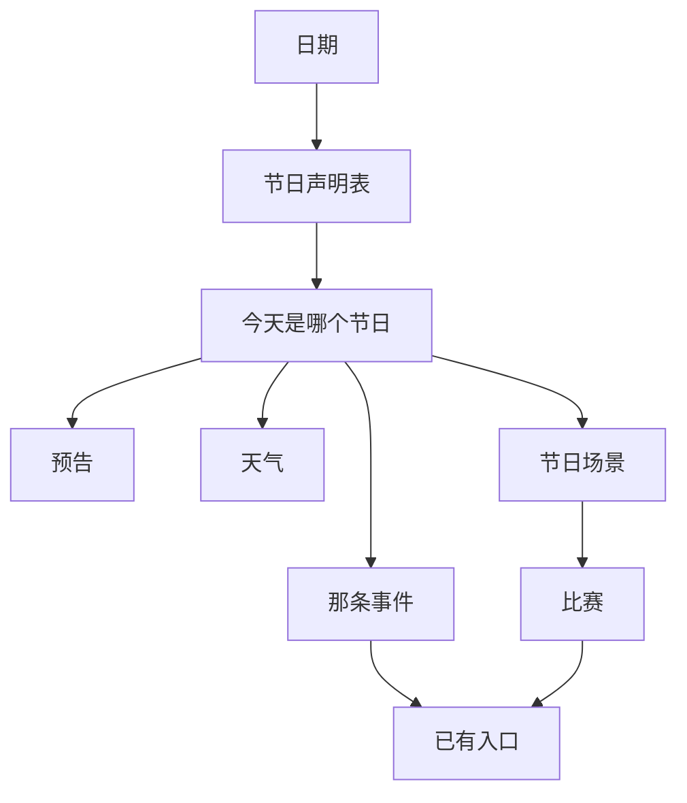

# 节日是日历上算出来的一天：它自己不存东西，那天的事全走别人的入口

> **正典层级**：第 5 级（系统细化）。与[时间与经营](../canon/gameplay/时间与经营.md)冲突时以正典为准；**预告提前几天、比赛限时、那几处涨幅与奖品量级全归[数值模型](./数值模型.md)，本页一个都不定。散场时刻那个值的家在正典**，本页只写它的约束形式。
>
> 返回 [总索引](../README.md)｜[系统文档与提案索引](./README.md)｜相关：[时间与经营 · 时间](../canon/gameplay/时间与经营.md) · [时间与经营 · 作息与熬夜](../canon/gameplay/时间与经营.md) · [`天气系统`](./天气系统.md) · [`事件系统`](./事件系统.md) · [`生产系统`](./生产系统.md) · [`人际系统`](./人际系统.md)｜台账：[`GP-97`](../spec/issues/README.md)

## 摘要

**节日是日历上的一天，而那一天是算出来的。** 给定今天的日期和一张声明表，就知道今天是不是节日、是哪一个 —— 所以它不需要存任何东西。读完这一页你该能判断两件事：加一个节日要填哪几格，以及那天发生的事该接到谁身上。

本页持有：一个节日的声明表、「今天是哪个节日」与「下一个节日还差几天」两个读口、节日场景那段停住的时钟、一场比赛要声明什么与名次怎么出，以及节日与天气、事件、派工三处的接缝。

**它不持有**这些，各有自己的家：

- 有哪几个节日、各在哪一天、各办哪几场比赛 —— 内容，走[内容外置](../canon/gameplay/玩法定位.md)。
- 任何数值 —— [数值模型](./数值模型.md)。
- **散场时刻那个值** —— 正典[时间与经营 · 作息与熬夜](../canon/gameplay/时间与经营.md)，它与醒来、熬夜起点、强制结束同处一节。
- 一季有多少天 —— 正典[时间与经营 · 时间](../canon/gameplay/时间与经营.md)。
- 那天各种后果的实现 —— [`事件系统`](./事件系统.md)那张后果表上的格子。
- 节日场景怎么摆、旗子与摊位长什么样 —— 作者在编辑器里做。
- 报名与名次怎么排版 —— [`界面系统`](./界面系统.md)与作者。

**最要紧的那几条承诺**：节日这一半给正式存档加零个字段、不新开事件钩子、不往固定步序里加一步、不新造任何动作、不改任何战斗量、不碰活跃失衡。**比赛只多一格后果**，它落在事件那张表上。

## 术语

只列**只有本页在用**的词。跨页共用的在[术语表](../reference/术语表.md)，本节不重复。

| 词 | 它在本页指什么 |
| --- | --- |
| **节日声明表** | 一个节日占一行的那张外置表：它叫什么、在哪一天、那天办哪几场比赛 |
| **节日场景** | 那天才存在的一处场景。进去时钟停，出来推到散场时刻 |
| **散场时刻** | 玩家离开节日场景之后，当天被推到的那个时刻。它是一个全局的值 |
| **比赛** | 节日那天开的一场限时评分活动。比的一律是一样已经存在的动作 |
| **目标成绩** | 对手那份由声明给出的成绩。名次是玩家的成绩与它们比出来的 |
| **站位点** | 作者在节日场景里摆的空位。谁站上去由规则层填 |

## 上游约束

- [时间与经营 · 时间](../canon/gameplay/时间与经营.md)：季节影响的那几处含「剧情节点与节日」；时间单位只有天、季、年三级。**这是本页的接入点，也是那条日期坐标的形状** —— 那条约束的对象是时间单位，而「第几季 · 季内第几天」用的是已有的两级。
- [时间与经营 · 时间](../canon/gameplay/时间与经营.md)那条**进入关卡时游戏时钟暂停、结算时按预设扣时间**：**这是节日场景那段停住的时钟的既有形状**，本页复用它、不发明第二种。
- [时间与经营 · 作息与熬夜](../canon/gameplay/时间与经营.md)：熬夜起点、次日精力上限按档下降、强制结束由主角自己收场。**约束散场时刻必须早于熬夜起点** —— 让一年一次的节日把玩家推进熬夜档，等于让「最优解是不去过节」。
- [时间与经营 · 精力](../canon/gameplay/时间与经营.md)：精力是当日一切行动的共同预算。**这是节日那份代价的来源**，所以时钟停住不等于免费；也由此不必给「一个节日能参加几场比赛」另设上限。
- [时间与经营 · 生产](../canon/gameplay/时间与经营.md)：钓鱼是玩家亲手玩的一小段互动、不暂停世界；加工与烹饪读条完成，品质读做事那人的生活技能等级。**这是比赛能套壳的那几样动作，也是计分能读的那几个量。**
- [时间与经营 · 生产队收购与商店](../canon/gameplay/时间与经营.md)：错过收购时段时货物留到次日，人不在基地则自动收走结算。**这是「时钟跳过一段」唯一要答的问题，而它已经答过了** —— 所以本页不为跳过新加规则。
- [时间与经营 · 结算顺序（固定，不得改动）](../canon/gameplay/时间与经营.md)：那串步序一步不许增减。**约束本页不为自己开一步。** 它比天气更省：天气要在日期推进那一步写下次日那一种，节日连写都不用写。
- [时间与经营 · 通知](../canon/gameplay/时间与经营.md)：手环是唯一的事件通知渠道。**约束预告走那一条，不新开渠道。**
- [时间与经营 · 考试挂在已有的时间边界上](../canon/gameplay/时间与经营.md)：考试不需要自己的周期，它挂在季末与年末那两个本来就在的边界上。**这是「需要周期的东西挂到已有边界」那条正典的既有实例**，而节日按日期声明是另一种填法 —— 两者不冲突，因为节日也没有引入新的时间单位。
- [玩法定位 · 视角规则](../canon/gameplay/玩法定位.md)：基地与城区一律俯视，无例外。**约束节日场景是俯视的**，所以比武那一类不在本页。
- [玩法定位 · 场景规模](../canon/gameplay/玩法定位.md)：城区那几张图的张数与那份枚举必须一直对得上。**约束节日场景不算城区图** —— 它是进去再出来的一处，所以那份枚举不用改。
- [玩法定位 · 弹界面接管输入就暂停世界，世界里的动作不暂停](../canon/gameplay/玩法定位.md)：判据落在「界面接管输入」上。**约束比赛不暂停世界**，而报名那一下是界面、所以它暂停。
- [玩法定位 · 随机事件：事件可以晚做，扩展点现在就留](../canon/gameplay/玩法定位.md)：钩子位置定死；事件不实现效果，只调已有系统的接口。**约束本页不新开钩子，那天的事写成一条事件。**
- [玩法定位 · 叙事与推进系统](../canon/gameplay/玩法定位.md)：主线节点的解锁条件只许有下限、不许有截止。**约束节日不得成为任何节点的解锁条件** —— 那等于给解锁加一个日期。
- [玩法定位 · 内容规模基准](../canon/gameplay/玩法定位.md)：那张表是全部平衡判据的算账基准。**约束节日与比赛各要在那里有一行起步量。**
- [`事件系统` · 一条事件要声明什么](./事件系统.md)：一条事件带**一组**后果调用，而一个钩子一次触发的条数有上限。**约束一个节日写成一条事件**，不是一批 —— 写成一批会被那条上限截断，而截断不报错。
- [`事件系统` · 后果一律是对已有入口的调用](./事件系统.md)：那张表里不许有「自己算」那一格。**约束本页没有自己的后果表**；比赛是那张表上新增的一格。
- [`事件系统` · 钩子在正典点名的那几处，只被询问、不轮询](./事件系统.md)：事件只在钩子被触到时被询问。**约束本页不推送、不报事件** —— 它只提供读口，由前置条件去读。
- [`天气系统` · 一天只有一种天气，而且必须有一个默认态](./天气系统.md)：一天一种、全局唯一，默认态是一个取值。**约束「节日那天不抽」落成一条前置判断**，而不是给权重开例外。
- [`生产系统`](./生产系统.md)：六条渠道共用一条产出管道，钓鱼那一段互动的形状在那一份。**约束比赛的产出照走那条管道**，本页不开第二条入库路。
- [`生产系统` · 今天谁在哪个工位：一张按天的指派表，进正式存档](./生产系统.md)：那张表持有「今天谁被派到哪」。**这是本页判断学生在不在场的唯一输入。**
- [`人际系统` · 涨是一条管道，降没有](./人际系统.md)与[`人际系统` · 压力全在每日上限，因为它是唯一的](./人际系统.md)：增量只收正值、必须带来源标签、受那一对的每日上限约束。**约束节日的关系涨幅不为「一年一次」开例外。**
- [`物品系统` · 品质五级，顶上那一级有两个名字](./物品系统.md)：品质是实例属性、必须在物品上看得见。**这是计分能读的那个量**，所以本页不新造一个只有比赛看得懂的分数。
- [`背包系统` · 满了怎么办：不自动丢弃，四个入口各有一条明确的拒绝路径](./背包系统.md)：满了只拒不丢。**约束奖品走那个既有入口**，本页不为它开例外。
- [`活跃失衡系统` · 境况事件声明它动哪几组，可正可负](./活跃失衡系统.md)：判据是代价付在哪。**约束本页不碰失衡** —— 一个按日期必来的量去推一条不按时间推进的长期线，是结构冲突。
- [`存档系统` · 进哪一侧：判据一句话](./存档系统.md)：跨过一次睡眠还成立的进正式存档。**约束本页答「进不进存档」**，而答案是零字段：算得出来的东西不存。
- [ADR-0009](../decisions/ADR-0009-编辑器主导的开发模式.md)：参数唯一来源是场景与资源，代码不留能用的默认值。**约束声明缺格时当场报错**，也约束场景由作者搭、脚本缺子节点就报错。
- [ADR-0016](../decisions/ADR-0016-推进挂在曾经发生过的事上.md)：推进挂在曾经发生过的事上。**约束节日与推进那一侧的方向是单向的** —— 节日可以被读，它不读也不推推进。
- [ADR-0022](../decisions/ADR-0022-内容清单的家是数据文件.md)：内容清单的家是数据文件。**约束节日与比赛的清单都落数据文件**，不落文档。

## 结构

下面这张图回答一个问题：**节日这一格算出来之后，被谁读走。** 图上每一条箭头都是「谁读它」，而最右边那一格全是别人的入口 —— 那正是本页能不实现任何后果的结构前提。

**重画条件**：节日多出一个读者、比赛开始比一样不是已有动作的东西，或者节日本身开始持有状态时重画。

**这张图不新增任何事实**，权威是下面各节。每一格具体声明什么、比赛的名次怎么出、时钟在哪一刻被推走，图都放不下。

### 一个节日就是日历上的一个坐标

| 声明项 | 说明 | 缺了怎么办 |
| --- | --- | --- |
| 标识 | 跨存档稳定的那个名字，别处引它按这个引 | **载入报错** |
| 显示名的文本键 | 玩家看到的那几个字走文本表 | **载入报错** |
| 第几季 | 四季之一 | **载入报错** |
| 季内第几天 | 落在一季之内；**一季有多少天在正典，本页不复述** | **载入报错**（越界同样被拒） |
| 那天办哪几场比赛 | 一组比赛标识，**可以是空组** | **载入报错**（空是显式的空，不是没写） |
| 散场那句自语的文本键 | 走文本表，按节日各一句 | **载入报错** |

- **一个节日只占一天。** 占多天就要回答「第二天与第一天有什么不同」，而那是内容量乘上天数；一天一个标识也让读口返回一个取值，不是一个区间。
- **同一季同一天最多一个节日。** 声明了两个时载入被拒并报出是哪两个 —— 两个节日撞在同一天是内容错误，而让读口返回两个取值会让每一个读者都要各答一次「那按哪个算」。
- **每年同一天重来，而这件事不靠任何记账。** 没有全局日期上限（正典），所以只发生一次的节日在第二年就消失了；而「今年过没过」不用存 —— 那一天本来就一年只来一次。
- **缺一格就报错，不兜底**（`ADR-0009`）。一个节日悄悄按「没有比赛」跑起来，表现是「这节日好像什么都没有」，而玩家与作者都分不清那是设计还是漏配。

### 两个读口，而且没有默认取值

- **「今天是哪个节日」**：不是节日的日子返回「没有」。
- **「下一个节日是哪一个、还差几天」**：预告读它。
- **两个读口而不是一个读口两档**，因为它们答的是两个不同的问题（今天、与下一个）。判据与[`界面系统`](./界面系统.md)那条「答得出两个问题就是两页」同形。**这与天气那个预报不同源** —— 那边是同一个问题的两种粒度。
- **刻意没有默认取值。** 不设一个叫「平日」的节日：绝大多数日子不是节日，而「不是节日」不需要一个名字 —— 没有任何东西要显示它、也没有任何东西要画它。
- **两个读口都是求值，不存结果。**

### 它与天气逐项不同

**两者唯一的共同点是都挂在时间上。** 这张表在这里写一次，别处引它不复述：

| | 天气 | 节日 |
| --- | --- | --- |
| 挂什么 | 概率：按季节权重抽 | 日期：声明「第几季 · 第几天」 |
| 多久一次 | 每天都有 | 一年里少数几天 |
| 默认态 | **必须有**（「没事」也要有名字） | **刻意没有** |
| 未来看得见吗 | 只到明天，细档还要一台设备 | 提前若干天，而且永远准 |
| 进存档吗 | 当天与次日两种都进 | **零个字段** |
| 改战斗量吗 | 有修饰组 | **一个量都不碰** |
| 拒绝玩家动作吗 | 不拒绝 | 不拒绝 |

### 预告：提前若干天，而且永远准

- **预告走手环通知**（正典那条唯一渠道），形状与「考试临近」同一条。
- **它永远是准的**，因为日期是声明出来的、不是抽出来的。天气那个预报要分粗细两档，节日不需要 —— 藏起一个写在数据里的日期换不到任何东西。
- **提前几天是一个全局的值，不按节日各给一个。** 按节日各给，玩家就要记「哪个节日提前几天通知」，而那条记忆不带来任何决策。值归[数值模型](./数值模型.md)。
- **通知里要说得出是哪一个、还差几天。** 只说「有节日要来了」与不说没有区别 —— 玩家留不出那一天。

### 那天的事写成一条事件，不是一批

- **一个节日对应一条事件**，它的前置条件读「今天是哪个节日」，后果是一组调用。
- **为什么不是一批**：一个钩子一次触发的条数有上限（[`事件系统`](./事件系统.md)），写成一批会被那条上限截断，而**截断不报错** —— 表现是「节日那天有一半的事没发生」。而且节日那天的几件事本来就是一件事的几个面。
- **方向是事件指节日**，节日不指事件。由此只要一条校验：**事件的前置条件引用一个不存在的节日标识时载入被拒**。反过来互相声明的话，「节日指的事件不存在」与「事件指的节日不存在」要各写一条校验。
- **后果一格都不在本页实现。** 关系涨幅走那条只收正值的增量管道并带来源标签，价格走需求系数那个输入，演出走点播，物品走背包 —— 都是[`事件系统` · 后果一律是对已有入口的调用](./事件系统.md)那张表上已经有的格子。
- **关系那一格受那一对的每日上限管，不开例外。** 所以「节日当天再上一课」不叠加 —— 那条上限存在的理由正是这个。

### 节日那天不抽天气

- **节日那天天气取默认态**，那一天不抽。
- **方向是天气读节日**那个已有读口，**节日不写天气的账**。天气那条抽法一个字不改：它只是在抽之前多一道判断。
- **一律成立，不按节日各给一位。** 按节日各给，玩家就要记「哪个节日会下雨」，而那条记忆不带来任何决策。
- **两处连带后果写明**：节日那天永远不算降雨类，所以那天的地要自己浇；而默认态的侵袭档是最低那一档，所以那天不会冒出天气那一类坏事。
- **代价写明**：这是本页对天气唯一的一处干涉。它买到的是「一年一次的那一天不会被一场雨盖掉」，而玩家看到的规则只有一条 —— 过节那天是好天。

### 节日场景：进去时钟停，出来推到散场时刻

- **进去时钟停**，走的是关卡那条既有形状（进入关卡时游戏时钟暂停）。本页不发明第二种「时间怎么过去」的写法。
- **出来时当天被推到散场时刻**，与玩家在里面待了多久无关。待多久都不罚，那正是时钟停住要买的东西。
- **散场时刻必须早于熬夜起点。** 值落在熬夜起点之后时**载入被拒** —— 让一年一次的节日把玩家推进熬夜档，等于让「最优解是不去过节」。那个值与熬夜起点都在正典，本页不复述它们。
- **散场时给一句主角的自语**，按节日各一句。形状与强制结束那句同源：**当天是他自己收的场，不是系统替他收的。**
- **那一天没有结束。** 散场之后玩家照常可以做事，只是精力大概也见底了 —— 于是他自己回去睡。
- **场景里的动作照扣精力。** 时钟停住，代价从时间换成精力：报名、逛、说话都照扣。**精力见底时报名被拒**，走与「精力不足不能出征」同一条形状。
- **由此不给「一个节日能参加几场比赛」另设上限** —— 精力那个当日预算已经在管它，再加一条就是两套限制。
- **它不算城区图。** 进出是一次明确的动作，不是走边界，所以城区那份枚举不用改。
- **时钟跳过的那一段不用特殊处理**：那一段里唯一按时刻发生的事是生产队收购，而正典已经答过（错过留到次日，人不在则自动收走结算）。
- **在节日场景里退出游戏时，续玩点恢复到场景入口**，与关卡同形。正式存档那一侧不加字段。

### 谁在场：作者摆站位点，规则层填人

- **作者在场景里摆的是站位点**，谁站上去由规则层填。脚本缺站位点时报错说清缺谁，不自己补建（`ADR-0009`）。
- **常驻 NPC 一律在场。**
- **学生只有今天没被派工的才在场**，读[`生产系统` · 今天谁在哪个工位：一张按天的指派表，进正式存档](./生产系统.md)那张表。**零新结构。**
- **由此「今天要不要派工」多一层意思**：派出去的人赶不上节日。这不是额外加的惩罚，它是同一份预算在两处露头。
- **这不是学生日程。** 谁按日程走到哪里仍然后置，进度见[待办台账](../spec/issues/README.md)。

### 一场比赛是给已有动作套一个限时与计分的壳

| 声明项 | 说明 | 缺了怎么办 |
| --- | --- | --- |
| 标识 | 节日声明表那一格引它 | **载入报错** |
| 显示名的文本键 | 走文本表 | **载入报错** |
| 比哪一样动作 | **必须是一样已经存在的动作**（钓鱼、加工这一类） | **载入报错**；声明一样不存在的动作同样被拒 |
| 限时多久 | 量纲是游戏小时，值归[数值模型](./数值模型.md) | **载入报错** |
| 读哪个量计分 | 必须是一个已有的量（品质、件数这一类）。**合法的那几个在册，那张册是结构型** —— 见紧跟本表那一段 | **载入报错**；声明一个不在册的量同样被拒，而且报的是「它不在册」 |
| 报名要多少精力 | 量纲是精力，值归[数值模型](./数值模型.md) | **载入报错** |
| 对手的目标成绩 | 一组声明出来的成绩 | **载入报错** |
| 各名次给什么奖 | 一组后果调用，走已有入口 | **载入报错** |

- **比赛不新造动作。** 它比的一律是已经存在的那几样，所以加一种比赛是填一行、不是写一套玩法。**这条是本页最要紧的一处边界** —— 允许比赛自带一个小玩法，每加一个节日就可能再写一套，而那几套之间迟早各有各的手感与各自的缺陷。
- **计分读已有的量。** 不新造一个只有比赛看得懂的分数：玩家看得见品质，所以他看得懂自己为什么输。
- **「读哪个量计分」那张册是结构型**（[ADR-0025](../decisions/ADR-0025-取值集的家由加一个的代价决定.md)）：计分要有一段「从那个量取数、排出名次」的实现，所以**加一个可计分的量只有我能加、而且要先立项记账**。起步在册的是**品质**与**件数**，两者各对应产出管道上一个现成的量（[`生产系统`](./生产系统.md)）。**而「比哪一样动作」那一格不是取值集** —— 它指的是一个已经存在的动作，合法性由那个动作存不存在判、不由一张册判；两格形状不同，所以归类也不同。
- **对手的成绩是声明的目标成绩，不模拟 NPC 走一遍渠道。** 模拟要给每个对手跑一遍生产管道，而玩家一眼都看不到；而声明出来的那一组同时就是「这场比赛难不难」那个可调的格子。
- **比赛期间世界不暂停**（比的是世界里的动作），而**报名那一下是界面、所以它暂停**。判据是正典那条，本页不开例外。
- **产出照走生产那条既有管道**（产出 → 归属 → 付酬 → 入库）。比赛里钓上来的鱼就是鱼，不是一件比赛道具。
- **奖品走背包那个既有入口**，满了只拒不丢。
- **只在节日当天的节日场景里报得上名。** 不在那一天、或者不在那个场景里时，报名入口取不到 —— 它不是一处常设玩法。
- **名次要说得出玩家的成绩与赢他的那一个是多少。** 只给一个名次，玩家学不到下次怎么做得更好。
- **不做比武那一类。** 一场战斗要侧视与关卡那一整套，而节日场景是俯视；要做的话它是另一件事。

### 节日这一半不进存档

- **正式存档零字段。** 今天是哪个节日由日期与声明表算得出来，存一份就有两份可能对不上的事实。
- **「参加过没有」不在本页。** 它是事件那份记账的事（已触发过与冷却剩余），而那份记账已经进正式存档。
- **名次不存。** 它是那一场当时的结果；要让它留下痕迹，走统计事件总线那条既有的埋点。
- **唯一多出来的是续玩点里那个位置**：玩家在节日场景里退出时恢复到场景入口，与关卡同形。

## 接口

### 它从哪来、谁读它

| 方向 | 接谁 | 接什么 |
| --- | --- | --- |
| 入 | 日期 | 今天是第几季第几天；**本页只读它，不推进它** |
| 入 | 内容数据 | 节日声明表与比赛那张表，**缺格载入报错** |
| 读 | [`天气系统`](./天气系统.md) | 它读「今天是哪个节日」，是节日就不抽、取默认态 |
| 读 | [`事件系统`](./事件系统.md) | 那条事件的前置条件读「今天是哪个节日」 |
| 读 | [`界面系统`](./界面系统.md) | 预告读「下一个节日还差几天」；报名与名次读比赛那一侧 |
| 读 | [`生产系统`](./生产系统.md) | 本页读那张按天的指派表，定学生在不在场 |
| 出 | [`状态效果系统`](./状态效果系统.md) | 比赛与节日给的增益落已有载体，走事件那张表里「给增益」那一格 |
| 出 | [`背包系统`](./背包系统.md) | 奖品；满了只拒不丢 |
| 出 | [`生产系统`](./生产系统.md) | 比赛产出照走那条入库管道 |
| 出 | [`人际系统`](./人际系统.md) | 关系涨幅走那条只收正值的管道，带来源标签 |
| 出 | 手环通知 | 预告一条 |
| 出 | 统计事件总线 | 比赛结束一条埋点 |
| 出 | 时钟 | 进场景时停住，离场时推到散场时刻 |
| 出 | 精力 | 场景里的动作照扣；不足时报名被拒 |
| 存档 | [`存档系统`](./存档系统.md) | **正式存档零字段**；续玩点多一个「在节日场景里」的位置 |
| 作者填 | 内容数据 | 上面那两张声明表 |
| 作者做 | 编辑器 | 节日场景、站位点、旗子与摊位 |

**挂载点到此为止。** 下次加一样与节日有关的东西时，先问「它挂在上面哪一格」，而不是顺手加一个读口或者开一步结算。

### 它不碰的那几条接缝

- **不碰日期本身**：它只读，推进日期是结算那一侧的事。
- **不碰天气的抽法**：只在抽之前多一道判断，权重与那张声明表一个字不动。
- **不碰事件的钩子、记账、一次性与冷却**：本页只提供一个前置条件读得到的读口。
- **不碰活跃失衡**：改它只能作为境况事件的一条后果，走那个既有入口。
- **不碰学生的个体失衡值**：那一份只有教学能降。
- **不碰派工那张表**：本页只读它，不改它。
- **不碰主线推进**：节日可以被那条事件的前置条件连着读，但推进不读节日。

## 边界与非目标

- **不定内容**：有哪几个节日、各在哪一天、各办哪几场比赛、奖品是什么，走[内容外置](../canon/gameplay/玩法定位.md)。
- **不定数值**：预告提前几天、比赛限时、报名要多少精力、关系涨幅、奖品量级全归[数值模型](./数值模型.md)。**接口常量不是数值** —— 读口有几个、声明表有哪几格在本页。
- **不持有散场时刻那个值**：它与醒来、熬夜起点、强制结束同处正典那一节，本页只写「必须早于熬夜起点」。
- **不引入新的时间单位**：不做「月」，也不做「星期」。
- **不做一个节日占多天**：理由在结构那一节。
- **不设默认取值**：「不是节日」就是没有，不给它一个名字。
- **不新增每日结算的步骤**：那一天是不是节日是算出来的，没有一步要跑。
- **不新开事件钩子**：位置由正典定死。
- **不实现任何后果**：那张表在[`事件系统`](./事件系统.md)。
- **不新增正式存档字段。**
- **不改任何战斗量**：本页没有修饰组这样的东西。
- **不碰活跃失衡**：理由在理由与取舍那一节。
- **不做比武那一类比赛**：视角不对，而且它要的是关卡那一整套。
- **不新造任何动作**：比赛只给已有动作套壳。
- **不做界面**：预告落通知那一页，报名与名次的排版归[`界面系统`](./界面系统.md)与作者，进度见[待办台账](../spec/issues/README.md)。
- **不做学生日程**：本页只答「今天没被派工的人在场」。
- **不做玩家自定义节日**：mod 可以加声明，玩家在游戏里不能。
- **不做纪念日**：[世界观](../canon/world/世界观.md)写明魔源没有周期、开篇也不落在任何纪念日上，本页不为它造一个。
- **同名不同物，两处都要写全名**：
  - **「比赛」只指本页这一种**（节日那天的限时评分活动），与战斗、与关卡里的任何较量不是一回事。
  - **「散场」只指玩家离开节日场景这一下**，与演出结束、与关卡撤离不是一回事。
  - **「一次性」**：[`事件系统`](./事件系统.md)那个声明项与本页无关 —— 节日那条事件是可重复的，隔开它的是日期本身。

## 理由与取舍

- **没选让节日持有状态。** 存一个「今天是哪个节日」最直接，代价是它与日期两份事实迟早对不上（改了声明表之后旧存档里那一天还是老样子）。算出来之后存档字段是零，而抽法改了也不影响任何旧档。
- **没选给节日一个默认取值。** 天气必须有，因为「今天没事」也要进预报、进事件前置、还要画出来；节日反过来 —— 绝大多数日子不是节日，而没有任何东西要显示或绘制「平日」。给它一个名字只会多一个到处要被判断掉的取值。
- **没选把那天的事写成一批事件。** 一批看起来更灵活，代价是那条「一个钩子一次触发几条有上限」会静默截断其中几条，而表现是「节日那天有一半的事没发生」。一条事件带一组后果之后，这个风险不存在。
- **没选让本页实现任何后果。** 每加一个节日就多一处效果实现，而它与被调用那一侧迟早分叉 —— 那是事件那一份立下的防重构纪律，本页只是照它走。
- **没选让节日拦住玩家的动作。** 「今天全城放假，别的都别干了」节日味最足，代价是它在规则上就是一次拒绝，而正典在天气与出征两条上都排掉过同形的做法。
- **没选让节日碰活跃失衡。** 「全城一起过个节，日子好过一点」很顺，但那条线的入口正典点死在教学与改善居民境况两处，而出资那条已经由公共建设占着。更硬的一条：一个按日期必来的量去推一条刻意不按时间推进的长期线，天气那一轮已经排掉过同形的做法。
- **没选让节日那天照抽天气。** 抽了更「真」，代价是一年一次的那一天可能整个被一场雨盖掉，而玩家会记很久。改成不抽之后天气那条抽法一个字没动 —— 它只是在抽之前多一道判断，而玩家要记的规则只有一条。
- **没选按节日各给一位「要不要好天」。** 更灵活，代价是玩家要记「哪个节日会下雨」，而那条记忆不带来任何决策。同一条理由也用在预告提前几天上。
- **没选让退出节日就直接进次日。** 那是最干净的「节日占掉一天」，代价是它又开一条「一天怎么结束」的路径，而正典给强制结束配了预警与「主角自己收场」那套表现 —— 新路径要各答一遍算不算熬夜、要不要预警。推到散场时刻之后，收场的仍然是玩家自己。
- **没选允许散场时刻晚到强制结束那一刻。** 那样夜里的节日散场就等于当天结束、规则零例外，代价是它照常按熬夜档扣次日上限，于是「最优解是不去过节」。
- **没选让节日场景里的动作不耗精力。** 时钟已经停了，再免精力就等于那一天完全免费，而「参加哪一场比赛」也就不再是选择。扣精力之后代价从时间换成精力，而那个预算本来就是当日一切行动共用的。
- **没选让比赛自带小玩法。** 自带最好玩，代价是每个节日可能再写一套，而那几套的手感与缺陷各自独立。套在已有动作上之后，加一种比赛是填一行。
- **没选模拟对手真的去比一遍。** 更自洽，代价是要给每个对手跑一遍生产管道，而玩家一眼都看不到；声明出来的目标成绩同时就是难度那个可调的格子。
- **没选让节日场景算城区那几张图之一。** 算进去就要动那份枚举与张数，而且城区图之间是走边界切换、时钟照常走 —— 而节日要的恰恰是时钟停住。
- **没选让学生一律在场。** 一律在场最热闹，代价是被派到工位的人会同时出现在两处，而那种矛盾不报错。读那张按天的指派表之后，它反而给派工添了一层意思。

## 验收

**可自动验证项**（纯规则层，与引擎无关）：

- 日期坐标：给定任意一天，读口返回的节日与声明表逐日对得上；不是节日的日子返回「没有」。
- 每年重来：跑过一整年之后同一个节日再次成立，而**没有任何字段记过它**（一条结构约束）。
- 声明缺格：每一格各缺一次，都**载入被拒**；比赛那一组「空」与「没写」分得开（前者合法）。
- 日期越界：声明的那一天落在一季之外时**载入被拒**。
- 撞天：同一季同一天声明两个节日时**载入被拒**，并报得出是哪两个。
- 预告：读口答得出「下一个是哪一个、还差几天」，且它与实际到来的那一天**始终一致**。
- 事件：那条事件的前置条件引用不存在的节日标识时**载入被拒**；节日那天它被抽到一次，而它带的是**一组**后果。
- 零新增：钩子那几处的数目与那张结算顺序表的步数，在本页落地前后**各自不变**（两条结构约束）。
- 关系：节日那一笔涨幅带来源标签，并且**撞得到那一对的每日上限**（反证：同一天既上课又过节，总增量仍不超上限）。
- 天气：节日那天取到的天气恒为默认态；而**非节日那天的权重算出来与本页落地之前一致**（反证，钉住抽法没改）。
- 时钟：进场景后时钟不走；在里面待任意久，退出后当天的时刻**只由散场时刻决定**。
- 散场那条校验：把散场时刻设到熬夜起点之后，**载入被拒**。
- 精力：场景里的动作照扣精力；精力见底时报名**被拒**。
- 在场的人：把一个学生派到工位，他**不出现在**节日场景的站位点上；不派工的那个出现。
- 比赛：声明一样不存在的动作时**载入被拒**；计分读的是一个已有的量（读一个自造分数的声明被拒）。
- 比赛的产出：钓上来的东西走那条既有入库管道（**没有第二条入库路**，一条结构约束）；奖品在背包满时**只拒不丢**。
- 报名的边界：不在节日那天、或者不在节日场景里时，报名入口**取不到**。
- 不改失衡：走完一整年各种节日，活跃失衡总量**不因节日本身变动**；学生的个体值同样不动。
- 存档：往返之后读口的答案不变，而**节日在正式存档里没有任何字段**（一条结构约束）。

**必须实机确认项**：节日场景看不看得出「今天不一样」、时钟停住玩家看不看得出来、限时那一段紧不紧张、名次出来那一下读不读得懂、预告那条通知说不说得清、散场那句自语落得自不自然。按 [ADR-0009](../decisions/ADR-0009-编辑器主导的开发模式.md) 的分工由作者实机看，本页不判。

**完成边界**：日期坐标与两个读口成立且没有默认取值、那天的事写成一条事件、节日那天不抽天气、进场景时钟停而出来推到散场、场景里照常扣精力、比赛只给已有动作套壳且产出与奖品走已有入口、正式存档零字段。做到这些，「填一行声明 → 提前几天收到通知 → 那天是好天 → 进场景慢慢逛 → 比一场、拿了奖 → 出来天黑了」这条链在文档层面就走得通了。

## 下游同步

- **代码**：落**规则层**（它只吃日期与两张声明表）；节日场景与摆设落引擎层、归作者。**相邻的既有件一个都没有** —— 按名搜过代码仓，`Festival`、`Contest`、`Fishing` 与中文的「节日」「比赛」全部零命中。**这一条是实测，不是推断。** 它要的坐标只有一半在：季那一半是 `rules/Economy/Season.cs`，**「季内第几天」还没有持有者**。
- **数值**：预告提前几天、比赛限时、报名要多少精力、关系涨幅、奖品量级进[数值模型](./数值模型.md)的尚未给值表，各写量纲与校准办法。**散场时刻不进那张表** —— 它已经有值，家在正典。
- **内容**：节日与比赛各要在[玩法定位 · 内容规模基准](../canon/gameplay/玩法定位.md)有一行起步量；节日场景在[玩法定位 · 场景规模](../canon/gameplay/玩法定位.md)有一行，并写明它不算城区图。
- **台账**：立项在 [`GP-97`](../spec/issues/README.md)，比赛的落地另记 `GP-98`（卡点不同），界面归 `UI-28`。**落地顺序**：声明表与缺格报错 → 两个读口（含「没有默认取值」）→ 预告接手环通知 → 那条事件与「引用不存在的标识被拒」→ 天气那道判断（含权重未变那条反证）→ 节日场景与时钟（含散场校验）→ 精力与报名闸门 → 在场的人读派工表 → 比赛的声明、计分与名次 → 产出与奖品接已有入口 → 续玩点。
- **该上升进正典的**：两条 —— **节日不拒绝任何玩家动作**、**节日那天不抽天气**。它们决定玩家看到的东西，而且理由与时间无关，所以该进[时间与经营](../canon/gameplay/时间与经营.md)；其余声明项、读口与那张对照表按定义不进正典。
