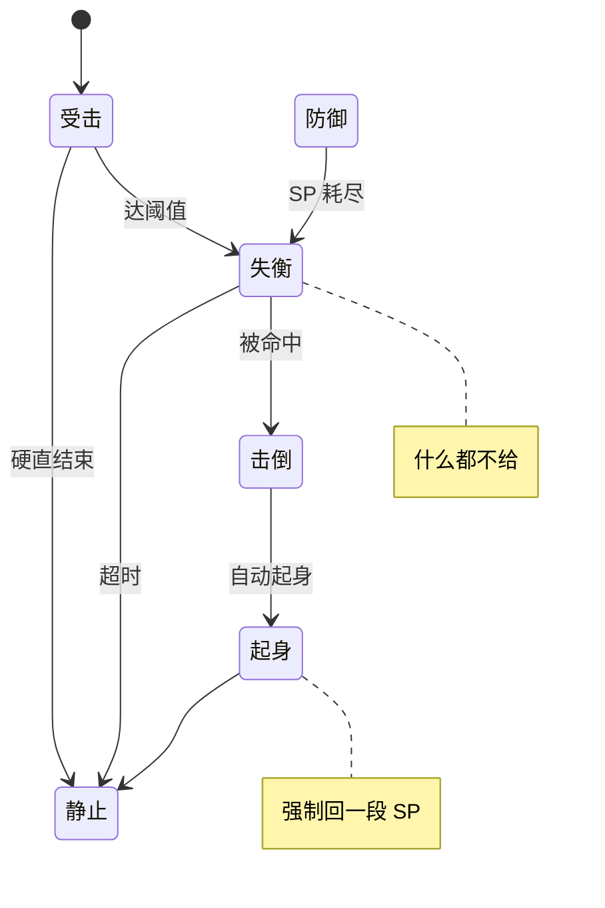
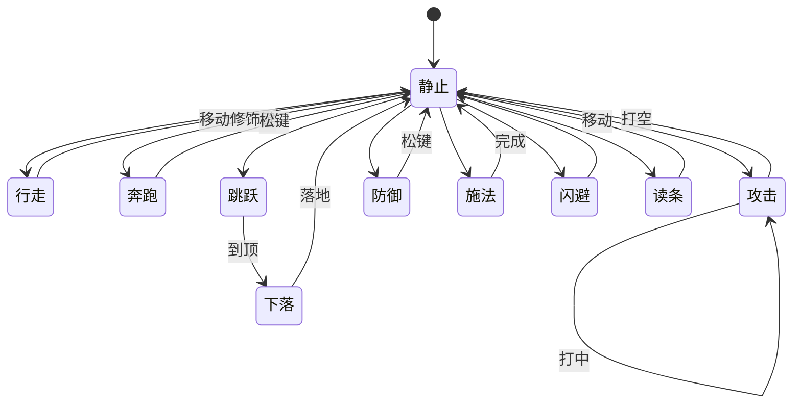

# 动作机持有互斥的姿态与流转：一次只能一个的归这里，能并存的归状态效果系统

> **正典层级**：第 5 级（系统细化）。与[玩法正典](../canon/gameplay/玩法定位.md)冲突时以正典为准；**全部帧数与数值归[数值模型](./数值模型.md)与 `GP-6`，本页一个都不定。**
>
> 返回 [总索引](../README.md)｜[系统文档与提案索引](./README.md)｜相关：[状态效果系统](./状态效果系统.md) · [玩法定位](../canon/gameplay/玩法定位.md) · [战斗与关卡](../canon/gameplay/战斗与关卡.md)｜台账：[`GP-18`](../spec/issues/README.md)

## 摘要

**这一页回答一个问题：一个角色这一帧在做什么，以及下一帧能不能改做别的。** 读完你能判断两件事 —— 一样新东西该加进这一页还是加进[状态效果系统](./状态效果系统.md)，以及一条「他为什么这时候动不了」的疑问该去问谁。

**分界只有一句话：一次只能有一个的归这一页，能同时好几个的归那一页。** 站着和跑着不能同时，所以它们在这里；中毒和带一层光环可以同时，所以它们在那里。

我们把角色的战斗状态拆成**两层互斥的机器**，外加一个生命周期终态：**运动层**是移动相位（站/走/冲/跳、闪避位移），**动作叠加层**是主动动作（攻击/防御/施法/采集）。两层各自在同一时刻至多处在一个状态里。

**判据只有一条：一次只能有一个的归本页，能同时好几个的归[状态效果系统](./状态效果系统.md)。** 这条把一个长期含混的问题切开了 —— 硬直、失衡、无敌这些既有时长又有样子的东西算什么：**它们的时长与豁免规则是效果，它们的样子是状态。** 受击姿态、失衡姿态、倒地姿态在本页；硬直几帧、无敌几帧、失衡值累积多少在那一页。

这不是新发明：代码里 `MotorState`／`ComboStateMachine` 持姿态、`StatusEffects` 持时长，本来就是这么分的（`MotorPhase.Hurt` 与 `StatusKind.Hitstun` 正是同一件事的两半）。本页把它写成显式契约，并给出完整流转表，好让**以后每个战斗切片知道新东西该加进哪一边**。

**那张流转表是全集，不是每个角色都有全部姿态。** 一个角色有哪些动作是它自己声明的 —— 只保证基础动作，**有些怪物没有跳跃**；缺一个动作只是那几条流转不存在，表上不为它开例外。

**经营侧那一台动作机也在本页**，它与战斗侧那台是**两台机器**（运动模型与可用动作都不同），但**共用同一条判据、同一份状态载体、同一条接缝与同一对连通性校验** —— 所以它是本页的一节，不是另一篇。它自己的那张表见下面「经营场景：另一套动作机，共用同一份状态效果」。

## 术语

只列**只有本页在用**的词。跨页共用的在[术语表](../reference/术语表.md)，本节不重复（`动作机`、`姿态`、`运动层`、`动作叠加层`、`定身`、`动作集`、`连通性`、`全集`、`读条`、`失衡值`、`后摇` 都在那边）。

| 词 | 它在本页指什么 |
| --- | --- |
| **被控姿态** | 不由玩家输入决定、由一条锁操作的效果驱动的姿态（受击、失衡、倒地、冻结、眩晕）。它的样子在本页，时长在[状态效果系统](./状态效果系统.md) |
| **受击链** | 受击 → 失衡 → 击倒 → 起身这一串被控姿态。它是**流转**，所以在本页；每一环的时长不在 |
| **抢占** | 一条控制类效果到场时，直接把当前动作顶掉、不等它走完 |
| **续段** | 轻击某一段**打中了**才开的那个窗口，按同键接下一段。打空不开窗 |
| **空中相位** | 运动层在离地期间的那一段（上升与下落）。俯视那台机器上**没有**这一段 |
| **逃生窗** | 被击倒后自动站起来那一下，同时强制回一段 SP 并给短暂无敌。它只挂在「被击倒后」，不挂在「失衡超时」 |
| **养伤** | 伤病期间不能派工。**它不是姿态**，是一条按天状态加一道派工闸门 |

## 上游约束

只链接约束本设计的正典与已定条目，不复制正文。

- [玩法定位 · 跨系统约定](../canon/gameplay/玩法定位.md)：全部临时与持续效果走同一套状态系统，每条带"可否被解除"属性。**它约束的是[状态效果系统](./状态效果系统.md)的形状，本页只承接「有锁操作的效果在场」这一个事实。**
- [战斗与关卡 · 异常状态](../canon/gameplay/战斗与关卡.md)：异常状态与硬直、无敌、失衡、光环、词条同套。**约束冻结/眩晕复用同一个被控姿态，不各建一个节点。**
- [战斗与关卡 · 防御与失衡](../canon/gameplay/战斗与关卡.md)：防御两档；SP 耗尽禁防御、进失衡；**被击倒后起身**回 SP + 短暂无敌，失衡超时自然站起什么都不给。**约束防御、失衡、击倒三个节点与其流转，也约束逃生窗只挂在一处。**
- [战斗与关卡 · 跳跃保留](../canon/gameplay/战斗与关卡.md)：跳跃是应对横扫地面攻击的手段。**约束保留运动层的跳跃与空中分支，不删竖轴。**
- [战斗与关卡 · 按键与连击](../canon/gameplay/战斗与关卡.md)：固定连段 + 空中连击 + 倒地追打；采集/用道具/交互读条、受击中断且不消耗。**约束动作叠加层的攻击与读条子类。**
- [玩法定位 · 视角规则](../canon/gameplay/玩法定位.md)：战斗侧视、基地俯视、不做基地防卫战。**约束"战斗与经营各一套动作机、共用同一份状态效果"。**
- 台账 [`GP-9`](../spec/issues/README.md)（闪避取按下瞬间方向）、[`GP-4`](../spec/issues/README.md)（第一版不做取消与派生）。**约束流转表里的闪避与"攻击段内不可取消"两条。**

## 结构

**枚举的当前取值不在本页复述**，它会变；要看就看代码（落点见下表）。

### 两层互斥的机器，外加一个终态

| 层 | 互斥性 | 管什么 | 代码落点 |
| --- | --- | --- | --- |
| 运动层 | 同一时刻恰好一个 | 角色在怎么移动：站/走/冲/跳、闪避位移、被控时的受击与倒地姿态 | `MotorState` |
| 动作叠加层 | 同一时刻至多一个 | 角色在主动做什么：攻击/防御/施法/采集 | `ComboStateMachine`（现仅攻击），待扩 |
| 生命周期 | 终态 | 战斗倒下（可救起）/ 真正死亡（可采集尸体） | 待建 |

通用姿态按此归位：静止/行走/奔跑/跳跃/闪避→运动层；攻击/防御/施法/采集→动作叠加层；死亡→生命周期；**受击、失衡、冻结、眩晕各拆成两半** —— 姿态在运动层，时长与豁免在[状态效果系统](./状态效果系统.md)；**无敌只有效果没有姿态**，整条在那一页。**制作不在战斗，只在经营场景。**

### 一个角色有哪些动作，是它自己声明的

**下面那张流转表是全集，不是每个角色都有全部姿态。** 只保证基础动作，其余各自声明 —— **有些怪物没有跳跃**。这条与敌人的分级面板是同一个形状（[战斗与关卡 · 队友与敌人](../canon/gameplay/战斗与关卡.md)）：面板是同一套、栏可以空；动作机是同一套、动作可以缺。

- **动作集是角色定义上的一个声明项**，与恋爱资格、偏好轴那些字段同一侧；那张表在[`成长系统` · 角色定义上不会变的声明项](./成长系统.md)。**缺声明时载入报错，不给默认全集**（[ADR-0009](../decisions/ADR-0009-编辑器主导的开发模式.md)：代码不留能用的默认值）。
- **一个角色的实际动作机是它声明的那些动作在全集上导出的子图。** 缺一个动作只是那几条流转不存在 —— **不为缺席的动作在流转表上开例外**。表里一条「明确不可」也不因为某个角色缺某个动作而变。

**哪些必有，判据是「别人要不要读它」：**

| 动作 | 为什么必有 |
| --- | --- |
| 站立与行走 | AI 走位、纵深排序与实体阻挡都要它在世界里有个位置 |
| 受击 | [`伤害系统`](./伤害系统.md)算出来的结果要有落点，而「受击打断攻击」是那条接缝的自然结果 |
| 生命周期终态 | 不然它打不死 |

**其余一律可选**，包括**攻击** —— 而那不是为怪物开的例外：训练木桩只挨打不还手，它本来就只该声明必有那几样。**主角是唯一必须有全集的角色**，理由是玩家操作他，缺一个动作就是一个按键没反应。

**免疫失衡靠「不声明失衡与击倒」表达，不靠一个开关。** 两种说法会让同一件事有两个家，而其中一个迟早和另一个对不上。代价写明：对这样的敌人「打出失衡再补重击」这条循环不成立，所以内容上不能让全部精英都这样。**失衡值照旧累积**（[`伤害系统`](./伤害系统.md)只产出量），只是没有对应的姿态可切。

**两条载入校验**，各报清是哪个动作：

- **进得去**：声明的每个动作都要有一条从站立可达的路。
- **出得来**：声明的每个动作都要有一条回站立的路。

它抓的是这种配错：**声明了击倒却没声明失衡** —— 击倒只从失衡进（见下面「受击链」），于是它永远进不去，**而那不报错**。

**引用方那一侧还有一条同形的校验，它盖住两类引用者**：[`战斗AI系统`](./战斗AI系统.md)的一条分档行为、[`剧情演出系统`](./剧情演出系统.md)脚本里的一条角色动作指令 —— **引用了这个角色没声明的动作时载入报错**，并说清是哪一条要哪个动作。**它与「AI 只从声明的动作集里选」是两回事**：那边是运行时的正常筛选（没有跳跃的怪物不尝试跳，不报错），这边是内容配错了。混在一起会让配错静默变成「那个角色就是不做那个动作」。

### 运动层：三轴移动，已实现

- **静止/行走**：`Grounded` 相位按横速区分，不是两个独立状态。
- **奔跑就是冲刺**：`MotorPhase.Run`（代码叫 `Run` 不叫 `dash` —— 按住键持续加速就是奔跑，dash 指一次性突进），沿横向轴的高速位移、无无敌帧、耗 SP，由移动修饰键触发；不并入一档独立的"免费奔跑"。
- **跳跃**：`Airborne`，上升/下落按竖速区分；离地锁纵深（`IsDepthAirLocked`），落地解锁。**保留**，理由见正典与下面「理由与取舍」。

### 动作叠加层：互斥的主动动作，给运动层一个"定身/忙"标志

- **攻击**：地面**轻击三段连段 + 重击单招**（`ComboStateMachine`）。**轻击三段各有独立动画与各自判定框**（`fist_light_attack`/`_2`/`_3` ＝第 1/2/3 段；踢腿第 3 段伸展更远，判定框**按段分开、不共用**）。**续段靠命中确认**（方案 b，轻重都适用）：某段**打中了**才开续段窗、按同键续下一段；**打空则不能续**、走完后摇——空刷连段被这条挡住。**重击当前是单招**（不连段，`HeavyChainLength=1`），命中确认对它现在无效果、后续加重击连段时即生效。**轻击不产生击退**（`LightKnockbackWorldPx=0`，保连段在射程里），重击照旧击退。**空中攻击是单一招式**——不分轻重、不连段，独立动画（`jump_attack`），落地打断（接线时要把"空中照搬地面连段"改成单招）。
- **防御**：普通（持续耗 SP）/ 精准（成功免 SP + 回少量 HP 与 MP）。
- **施放技能**：分**瞬发**（像攻击一样短前后摇、生根、不可取消，太短不至被有意义打断）与**读条**（生根、可被打断、移动即取消）。**读条被打断时：我方退还一部分 MP、敌人不退还** —— 本页只持有这个形状，**退还多少是玩法数值，家在参数表**（路径与当前值在[`数值模型`](./数值模型.md)）。道具（用道具）中断按正典不消耗、敌我都不丢。
- **闪避**：普通 / 精准。精准是"按下时机命中来袭判定"的判定条件。**回报的内容、以及它与精准防御的高低关系都在[战斗与关卡 · 防御与失衡](../canon/gameplay/战斗与关卡.md)一处，本页不复述** —— 本页只持有它的归属：它是运动层的一个姿态，与普通闪避同一条流转。
- **采集 / 用道具**：读条子类，`受击中断、不消耗`（正典）。战斗内不做制作。

这一层同一时刻至多一个，并给运动层一个"忙/定身"标志——出招时地面三轴定身（已实现），防御/施法/读条同理锁住或限制移动。

### 受击链：受击 → 失衡 → 击倒 → 起身

受击、失衡、击倒是三个**被控姿态**，由锁操作的效果驱动，串成一条链。**这条链是流转，所以写在本页；链上每一环的时长与失衡值的累积衰减是效果，在[状态效果系统](./状态效果系统.md)。**

下面这张图回答一个问题：**被打之后角色会依次落到哪几个姿态上，以及从哪两处能回到站立。** 逃生窗只挂在一条路上，看图比读四段话快。

**重画条件**：受击链上增删任何一个姿态、改任何一条进出路径，或者改逃生窗挂在哪一处时重画。

**这张图不新增任何事实，权威是下面那张流转表** —— 表里还有「明确不可」那一列与「倒地可被追打」这类条件，图放不下。

1. **受击**（轻/重）：被打中的短暂硬直，播 `light_hit`／`heavy_hit`。受击本身累积一个**失衡值**（削韧）。
2. **失衡值累积达阈值 → 失衡**。另有一条正典路径：**SP 耗尽也进失衡**。两条进同一个失衡状态：完全锁死（不能动、不能防御）、易吃重击。
3. **失衡中再被任何攻击（轻/重/技能）击中或被击退 → 击倒**：水平摔到地上（就是"打飞出去"，**是水平击退到地面、不是浮空**——浮空仍预留不做）。
4. **击倒后自动从地上起身 → 强制回复一段 SP + 短暂无敌**，这就是正典的逃生窗口。倒地期间仍可被追打（正典"倒地追打"）。

**失衡有两条退出**：时间窗内没被命中 → **超时自然站起、回静止，什么都不给**（不回 SP、不给无敌）——失衡是站立的萎缩姿态（手臂下垂，对应 `imbalance` 帧）、**不是倒地**，没被压制就没有要逃的东西；失衡中被命中或被击退 → 走上面第 3–4 步的击倒链。**失衡值会随时间衰减**，不被打就回落，速率归[数值模型](./数值模型.md)。**所以逃生窗（回 SP + 短暂无敌）只挂在"击倒 → 起身"上，不挂在"失衡结束"上。** 理由与正典一致——逃生窗是给被连续压制的场景兜底，而超时恢复本就没被压制。**[战斗与关卡 · 防御与失衡](../canon/gameplay/战斗与关卡.md)已按这条改过**，两侧现在说的是同一件事。

**注意区分**：这里的"击倒/起身"是受击链里的短暂倒地、自动起身给逃生窗；它**不是**生命周期里的"战斗倒下"（HP 清零、要队友救起、每关一次）。参考图画的是前者。

### 生命周期：倒下可救、死亡是终态

- **战斗倒下**（HP 清零触发，区别于受击链的击倒/起身）：友方（学生）倒下不死亡，每关可被救起一次、低血量复活；主角倒下即任务失败。倒地角色仍可被追打（正典"倒地追打"）。
- **真正死亡**：敌人的终态。玩家与学生常规流程不到此。**它留下什么由敌人定义上的魔化载体类别决定** —— 尸体、残骸，或者什么都不留；纯由灵构成的那一类没有实体载体，所以**不留尸体**，「搜刮」这条采集路径对它不成立（[`关卡系统` · 资源点按作业对象分类](./关卡系统.md)）。类别的取值见[世界观 · 外魔与魔化](../canon/world/世界观.md)，它在战斗里只管这一件事，不改数值也不改行为（[`战斗AI系统`](./战斗AI系统.md)）。

### 战斗动作层流转表

下面这张图回答另一个问题：**玩家主动操作时，从站着能进到哪几个动作，以及各自怎么回来。** 被控的那半在上面那张图里，两张刻意分开 —— 一张混着画会有十八个节点，而那正是现在这张表读不动的原因。

**重画条件**：动作叠加层增删一个主动动作、运动层增删一个相位，或者某条流转的方向变了时重画。

**这张图不新增任何事实，权威是紧跟它的那张流转表。** 图上那条 `攻击 --> 攻击: 打中` 只表示「命中才能续段」这件事存在；三段各自的判定框、打空走后摇、以及「攻击段内按闪避无效」这类条件全在表里。

先立五条全局规则，避免每行重复：

- **G1 抢占**：控制类状态（硬直/失衡/击倒/冻结/眩晕）与倒下/死亡可抢占几乎任何动作层状态；唯一例外是闪避无敌窗内不进受击。
- **G2 无取消**（`GP-4` 未做）：攻击段内不能主动取消到闪避/防御/跳/冲，只能连段续接或走完后摇。
- **G3 闪避排他**：闪避一旦起手走完全程、忽略输入，无敌只在窗口内（已实现）。
- **G4 落地打断**：空中动作（空中连击、空中受击）落地即打断。
- **G5 读条即走即断**：采集/用道具一旦移动就取消，受击中断且不消耗。

| 状态 | 可流转到 | 明确不可 |
| --- | --- | --- |
| 静止/行走 | 行走/静止、奔跑、跳跃、攻击、防御、施法、闪避、采集、用道具；走下台沿→下落 | 直接进除"下落"外的空中动作 |
| 奔跑(冲刺) | 静止/行走(松键)、跳跃、攻击(地面攻击、定身) | 冲刺中直接起闪避 |
| 跳跃上升 | 下落(到顶)、空中攻击、空中施法(仅瞬发且带空放标记) | 闪避/冲刺/防御/采集(均限地面) |
| 下落 | 静止/行走(落地)、空中攻击、空中施法(同上) | 同上 |
| 攻击·地面 | 轻击某段命中→续段窗内按轻续下一段(共三段)、打空不续；重击单招无续段；后摇结束回静止/行走 | 取消到闪避/防御/跳/冲(G2)；未命中续段(方案b) |
| 攻击·空中 | 落地即打断回静止/行走 | 同上 |
| 防御 | 静止/行走(松防御)；SP 耗尽或破防→失衡；精准防御成功→保持+回 HP/MP | 直接转攻击(需先松)；防御→闪避取消不做 |
| 施法·瞬发 | 前后摇走完→静止/行走 | 过程中取消或移动(生根) |
| 施法·读条 | 完成→静止/行走；受击→受击(打断，我方退 MP、敌人不退) | 过程中移动/取消/接他招(生根) |
| 闪避(普通/精准) | 走完→静止/行走(或落地)；无敌窗内不进受击 | 途中被任何输入打断(G3) |
| 采集/用道具 | 完成或移动→取消回静止/行走；受击→受击(不消耗) | 读条中起攻击/闪避(需先取消，G5) |
| 受击(轻/重) | 硬直结束→静止/行走；失衡值累积达阈值→失衡 | 硬直中主动出任何招 |
| 失衡 | 时间窗内未被命中→超时站起回静止(什么都不给)；被命中/被击退→击倒 | 失衡中移动、防御(完全锁死) |
| 击倒(倒地) | 自动起身→静止 + 强制回一段 SP + 短暂无敌(逃生窗)；倒地可被追打 | 倒地中主动出招 |
| 冻结/眩晕(被控) | 状态到期或被解除(可解除者)→静止 | 期间任何主动输入 |
| 战斗倒下 | 被救起→静止(低血, 每关一次)；敌方超时→真正死亡；倒地可被追打 | 主动起身出招(除被救起) |
| 真正死亡 | 终态；敌人转可采集尸体 | 无出口 |

### 经营场景：另一套动作机，共用同一份状态效果

经营场景（基地与城区俯视）与战斗场景（侧视）**动作机分两套，[状态效果](./状态效果系统.md)与角色数据共用一份**：

- **分两套动作机**：运动模型根本不同 —— 俯视是平面两轴（无重力、无跳跃、无纵深带），侧视是带纵深与跳跃的三轴；可用动作也不同 —— 经营无战斗（正典不做基地防卫战），战斗无劳作。硬塞一台机等于一台全是「if 场景」分支的机。
- **共用一份状态效果**：角色是同一个实体，伤病、负面词条、增益跨场景延续（正典「伤病」跨日累积）。载体必须只有一份，否则两处各算一套叠加。这也是「按互斥性分、不按场景分」那条判据的直接后果。
- **判据仍然只有那一条**：一次只能一个的归动作机、能并存的归[状态效果系统](./状态效果系统.md)。**经营侧不新立判据**，所以它分在本页而不是另起一篇。

**两台机器的分别：**

| | 战斗侧 | 经营侧 |
| --- | --- | --- |
| 运动层 | 三轴：横向、竖轴（跳跃与空中相位）、纵深带 | **平面两轴，没有竖轴也没有纵深带** |
| 动作叠加层 | 攻击／防御／施法／闪避／采集与用道具 | **定位与行走之外一律是劳作读条** |
| 受击链 | 受击 → 失衡 → 击倒 → 起身 | **没有** —— 经营侧不产生命中 |
| 生命周期终态 | 战斗倒下、真正死亡 | **没有** —— 见下面「养伤不是姿态」 |
| 被控姿态 | 有（由锁操作的效果驱动） | **不声明任何**，但那条接缝照旧存在，见下 |
| 状态载体 | **同一份** | **同一份** |

**经营侧的运动层没有竖轴，不是「删掉了功能」** —— 那台机器本来就没有。俯视场景里没有跳跃、没有离地锁纵深、没有影子随高度缩放，所以那几条流转在它上面不存在，而不是存在但被禁掉。

**经营侧的动作叠加层：劳作一律是读条动作。** 一个劳作动作的形状是**带读条、可打断、移动即取消**，与战斗侧的采集与用道具**是同一个形状**（那条 G5 全局规则两处都成立），但**两台机器分开** —— 复用的是形状，不是机器。

- **具体有哪些劳作按工位清单走**，清单的家在[时间与经营 · 学生与派工](../canon/gameplay/时间与经营.md)，**本页不复述** —— 复述一遍，加工位时就要改两处。
- **授课也是这一层的一个劳作读条**（主角一天一次那个额度是闸门，不是姿态）。
- **钓鱼是这一层的一个姿态，不是一个界面**（[`生产系统` · 钓鱼是世界里的动作，不是一个界面](./生产系统.md)）：它是读条动作的一个变体 —— 读条加一次时机判定，**不为它开一层新结构**。它不暂停世界、受击中断且不消耗饵料，而「受击」在经营侧没有对象，所以中断它的是移动与交互取消。
- **设备添料不占姿态**（[时间与经营 · 学生与派工](../canon/gameplay/时间与经营.md)：一次交互、不占时间与精力）—— 它是一次交互，不是一个带读条的持续动作。

**经营侧不声明任何被控姿态，但那条接缝照旧存在。** 动作机每帧仍然问一次「有没有锁操作的效果在场」（见下面「与状态效果系统的唯一接缝」），有就丢弃本帧输入并停在当前姿态。

- **理由是接缝只有一份。** 经营侧现在没有会锁操作的效果，那是**内容上还没有**（伤病与营养不良都不锁操作），不是结构上不支持 —— 将来有一条事件给的眩晕跨到经营场景时，它不需要改任何接缝。
- **代价写明**：那种效果真出现时，经营侧要声明一个被控姿态；现在不声明是因为**不给一个没有对象的姿态占位**。

**养伤不是姿态。** 它是一条按天状态（[`状态效果系统` · 时长有三种单位，各有各的推进点](./状态效果系统.md)）加一道派工闸门（[时间与经营 · 治疗与照护](../canon/gameplay/时间与经营.md)：养伤期间不能派工）。写明这一条，否则「躺在治疗床上」会被做成一个生命周期终态 —— 而经营侧没有终态，做出来之后「他什么时候起来」就有了两个答案（那条状态的剩余天数，与那个姿态自己的退出条件）。

**那两条连通性载入校验照用，不新写一条**：声明的每个经营侧动作都要有一条从静止可达的路、一条回静止的路。它抓的是同形的配错 —— 声明了一个进不去或出不来的劳作，**而那不报错**。

## 接口

### 与状态效果系统的唯一接缝

本页**不定义任何效果**，效果的分类、时长、可否解除、叠加与显示全在[状态效果系统](./状态效果系统.md)。两者之间只有一条接缝，而且只朝一个方向：

> **动作机每帧先问一次「有没有锁操作的效果在场」。** 有就切到对应的被控姿态、丢弃本帧的主动输入；**它不拥有这段时长**，何时结束由那条效果的剩余时间决定。不锁操作的效果一律不切姿态。

这条接缝的三个后果值得写明：

- **动作机不计时。** 硬直该持续几帧是打中他的那一击决定的，动作机只负责在这期间摆出受击的样子。多个锁操作效果同时在场时按优先级选姿态（更重／更晚者优先），优先级规则在那一页。
- **无敌不切姿态。** 它从不单独存在，总伴随闪避窗、起身逃生窗或复活保护，所以它只让命中忽略，不在本页出现为一个节点。
- **「受击打断攻击」「倒地仍可被打」不是特例。** 它们是这条接缝的自然结果：一次命中施加锁操作效果，动作机下一帧让位。

## 边界与非目标

- **不定任何数值**：帧数、时长、判定窗、CC/失衡时长、失衡值阈值与衰减、回蓝量、叠加规则全归[数值模型](./数值模型.md)与 `GP-6`。涉及这些的说法一律是结构而非数值。
- **不实现**：本页只定结构与流转，代码按切片走各自 issue（落地顺序记在 [`GP-18`](../spec/issues/README.md)）。
- **不做**：战斗内制作、空中受击/浮空（预留）、取消与派生（`GP-4`）。
- **经营侧不铺劳作清单**：有哪些工位在[时间与经营 · 学生与派工](../canon/gameplay/时间与经营.md)，本页只定它们共用的那个「读条动作」形状。**每一项劳作自己的产出与代价也不在本页**，那些在[`生产系统`](./生产系统.md)与[`教育系统`](./教育系统.md)。
- **经营侧不声明被控姿态**：接缝照旧存在，但现在没有对象。**不给一个没有对象的姿态占位。**
- **养伤不是姿态**：它是一条按天状态加一道派工闸门。
- **不定义任何效果**：分类、时长、可否解除、叠加、显示全在[状态效果系统](./状态效果系统.md)。本页只在需要姿态时引用「有锁操作的效果在场」这一个事实。
- **角色特定状态走同一框架**：各角色/敌人的专属动作进动作叠加层（多为技能），专属修饰进状态效果系统；本页只定通用姿态与流转，专属状态随各角色设计时按此归位，不在此铺开。

## 理由与取舍

- **没选「单台平铺状态机」。** 通用状态是这些：静止、行走、奔跑、轻重攻击、普通与精准防御、跳跃、施放技能、受击三档、死亡两档、普通与精准闪避、无敌、采集、制作。把可并存的（增益、控制）与互斥的（攻击、闪避）混进一层会组合爆炸 —— 一个角色可以同时「被冻结 ＋ 中毒 ＋ 带一层光环 ＋ 处在无敌帧里」，而「正在攻击」与「正在闪避」不能同时。正典也明确要求效果统一走一套。拆成两边之后，「一次一个」和「可以好几个」就被物理隔开。
- **没选让被打者的动作机拥有硬直时长。** 硬直几帧由**打中他的那一击**决定，不由他自己决定。这正是行业两套口径的分界：格斗游戏的帧数表把无敌与硬直当作角色所处的状态，而 Unreal GAS 把它们当作效果授予的标签、用标签门控能力能不能发动。两边都对，因为那是同一件事的两半 —— 分开写，问题就消失了。**最难归位的受击因此有三个家**：时序与豁免归状态效果，姿态与输入归动作机，位移归运动层。
- **没选"把控制类整条做成动作状态"**：那样动作机就要自己管时长、自己判无敌豁免、自己写叠加与优先级 —— 等于在动作机里重造半个状态系统。**但也没选"整条做成效果"** —— 那样受击的姿态与动画就没有家。取的是**按判据切成两半**：一次只能一个的（姿态）留在动作机，能并存的（时长、豁免、量级）交给效果。判据本身可检验，不靠语感分类。
- **没选按"战斗内/战斗外"分文档**：那条线会把硬直与伤病分开、却把硬直的时长与无敌的时长也分开，而它们是同一套载体。按互斥性分才切得干净。
- **没选删除跳跃**：正典已裁定保留，跳跃是横扫地面攻击的对策，删掉它一种威胁就只剩纵深一种解法；且删跳跃等于拆掉整条竖轴——空中连击、离地锁纵深、影子随高度，全是[已实现并验过的那几条](../spec/issues/README.md)，还反转一条已经做过的裁定。它当前"看着没用"是因为敌人横扫攻击还没设计，价值是前瞻的，该在 A2 有真敌人时再评估，不在木桩阶段拆。
- **没选精准闪避与精准防御同回报。** 那条结论与它的理由（闪避天生多了位移与穿多段的无敌）现在是正典的，家在[战斗与关卡 · 防御与失衡](../canon/gameplay/战斗与关卡.md)，本页不复述两侧各拿什么；「两份精准回报都压在进攻回蓝之下」那条判据在[`数值模型`](./数值模型.md)。留在本页的只有归属那一半：它是运动层的一个姿态，不为它另开一层。
- **没选战斗内制作**：制作只在经营，避免给战斗动作层加一个没有需求的读条子类。
- **没选把经营侧那一台单独成篇。** 它确实有自己的状态机（按拆篇判据读该拆），但它**有宿主页** —— 判据、接缝与那两条连通性校验都在本页。分出去之后「一次只能一个的归动作机」会在两份文档里各写一遍，而两处迟早不一致；而读者也没有分家：加一个劳作动作的人与加一个战斗姿态的人问的是同一个问题（它归哪一层）。**代价是本页变长**，而那比让一条判据有两个家便宜。
- **没选给经营侧预先声明一个被控姿态。** 现在没有会锁操作的效果跨到经营场景，所以那个姿态没有对象；占位的代价是要立刻回答「它长什么样、什么时候退出」，而那两个问题的答案会被一个真实需求推翻。接缝留着、姿态不占位，将来加它是加法。
- **没选把养伤做成经营侧的生命周期终态。** 它看起来像（人躺在床上、不能动），但那样「他什么时候起来」就有两个答案：那条按天状态的剩余天数，与那个终态自己的退出条件。留成「状态 ＋ 派工闸门」之后只有一个答案。
- **没选现在做空中受击/浮空**：预留。现在没有把受击方打飞上天的敌人攻击，A1 只有地面受击；将来要做时受击才长出空中变体，本页先占好"这是由效果驱动的姿态"这个位置。

## 验收

- **可自动验证项**：锁操作的效果在场 → 动作机报被控并封输入；无敌在场 → **不切姿态**；**动作机自己不计时** —— 把效果的剩余时间清零后，姿态必须在下一帧退出，而不是等动作机自己数完。流转表每条"明确不可"各有一条反证测试（如攻击段内按闪避无效、离地按闪避无效）。载体侧的判据在[状态效果系统](./状态效果系统.md)。
- **动作集那一侧另有这些**：
  - 角色定义缺动作集声明时**载入被拒**，且不补默认全集。
  - 没声明跳跃的角色永不进入空中相位，**且不报错**。
  - 声明了击倒却没声明失衡时**载入被拒**，并说清是哪个动作进不去。
  - 声明了一个回不到站立的动作时**载入被拒**。
  - **主角的动作集不是全集时载入被拒。**
  - 没声明失衡的角色照旧累积失衡值，只是不切姿态。
- **死亡终态各一条**：三类载体各留自己那样，**纯灵之物死后没有可搜刮的对象**。
- **经营侧那一台另有这些**：
  - **它的运动层没有空中相位**（一条结构约束 —— 在它上面找不到跳跃这条流转，而不是找得到但被禁掉）。
  - **它没有受击链，也没有生命周期终态**（各一条结构约束）。
  - **它没声明任何被控姿态，但那条接缝仍然被问到**：造一条锁操作的效果放进经营场景，本帧输入要被丢弃。
  - 劳作读条**移动即取消**，且取消不消耗。
  - **养伤期间那个角色仍然处在正常姿态上。** 这是一条反证 —— 它挡的是「把养伤做成一个终态」那种实现。
  - 那两条连通性载入校验在经营侧同样生效：声明一个进不去或出不来的劳作时**载入被拒**，并说清是哪一个。
- **两台机器共用同一份载体**：同一个角色在两个场景里读到的按天与永久项完全一致（一条反证 —— 它挡的是「两处各算一套叠加」那种实现）。
- **必须实机确认项**：被控姿态与受击/失衡动画的切换观感、精准闪避与精准防御的手感窗口——归 `GP-6` 实机逐帧，本页不判。**经营侧那一台另有两样**：俯视移动的手感（速度归 `GP-6`）、劳作读条被取消那一下看不看得出来。
- **完成边界**：本设计"落地"= 那条判据与流转表被后续每个战斗切片当作归属依据；当全部战斗姿态（防御/失衡/异常/技能/采集/死亡）都按此接入且回归绿、稳定部分上升进正典后，本页可从 `design/` 收缩。

## 下游同步

- **代码**：本页这条分界与代码现状一致（`MotorPhase.Hurt` 持姿态、`StatusKind.Hitstun` 持时长），所以对动作机是纯增量 —— 未来防御/施法/读条/失衡/被控/倒下各切片按层加姿态即可。**破坏性的那一半在载体上**，见[状态效果系统](./状态效果系统.md)。
- **正典**：稳定后把「一次只能一个的归动作机、能并存的归效果」这条判据上升进[玩法定位 · 跨系统约定](../canon/gameplay/玩法定位.md)与[战斗与关卡](../canon/gameplay/战斗与关卡.md)。**逃生窗那句已经在正典了**：[战斗与关卡 · 防御与失衡](../canon/gameplay/战斗与关卡.md)现在写的是「被击倒后起身才给、失衡超时什么都不给」，与本页一致。本页留活跃部分。
- **台账**：立项在 [`GP-18`](../spec/issues/README.md)，以本页为依据；关联 `GP-4`（取消派生将来叠在动作层）与 `GP-6`（手感窗口，含**俯视移动速度**）；全部数值归[数值模型](./数值模型.md)。**经营侧那一台并进同一个编号**，落地顺序在那一条的条目文件里 —— 它与战斗侧共用判据、共用接缝、共用那两条连通性校验，分两个编号会让同一条判据有两处进度。
- **美术**：`ART-6` 补空中攻击帧。

## 附录：两个常问的归属

- **闪避为什么在运动层不在动作层？** 它的本体是一段带无敌窗的位移，代码就落在 `MotorState.Dodge`；它与"攻击/防御"这类动作叠加互斥，但归位在持位移的运动层更贴实现。它在流转表里按动作看待，不矛盾——分层是实现归属，流转是行为约束。
- **无敌为什么不是一个状态节点？** 因为它从不单独存在，总是伴随闪避窗、起身逃生窗或复活保护。做成"无敌 + 当前动作"两件并存的事（效果 + 动作机），比做成一个要从里面再决定"我还能不能动"的动作节点干净，代码也已经是前者。
